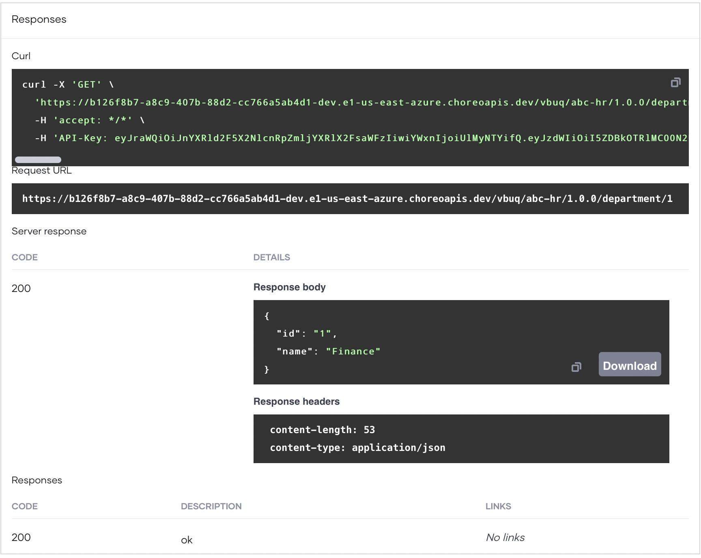

# Develop a REST API Proxy

A REST API proxy acts as an intermediary between an existing API and Choreo, intercepting all requests made to the API. It also functions as a managed API, which allows you to apply essential API management features such as security policies and rate limiting.

In this guide, you will:

 - Create a REST API proxy component to expose an existing API.
 - Deploy the REST API proxy.
 - Test the REST API proxy to verify its functionality.
 - Manage the REST API.
 - Consume the REST API.
 

## Prerequisites

Before you try out this guide, complete the following:

- If you are signing in to the Choreo Console for the first time, create an organization as follows:

    1. Go to [https://console.choreo.dev/](https://console.choreo.dev/), and sign in using your Google, GitHub, or Microsoft account.
    2. Enter a unique organization name. For example, `Stark Industries`.
    3. Read and accept the privacy policy and terms of use.
    4. Click **Create**.

    This creates the organization and opens the **Project Home** page of the default project created for you.

## Step 1: Create a REST API proxy

To create a REST API proxy, you can either upload an OpenAPI specification or provide an OpenAPI specification URL. In this guide, you will specify a URL to an OpenAPI definition of a sample API.
 
Follow the steps given below:

1. Go to [https://console.choreo.dev/apim](https://console.choreo.dev/apim) and sign in. This opens the **Project Home** page.
2. If you already have one or more components in your project, click **+ Create**. Otherwise, proceed to the next step.
3. Go to the **REST API Proxy** card and click **Create**.
   This opens the **Create API Proxy** pane, where you can upload an OpenAPI definition or provide the URL of an OpenAPI. In this guide, you will define resources manually. Therefore, click **Skip Source** to proceed.
4. Specify the values given in the following table as API proxy details: 

    |  **Field**    | **Value**                                   |
    |---------------|---------------------------------------------|
    | **Name**      | `HR API`                                    |
    | **Base Path** | `abc-hr`                                    |
    | **Version**   | `1.0.0`                                     |
    | **Target**    | `https://samples.choreoapps.dev/company/hr` |
    |**Access Mode**| **External**                                |

5.  Click **Create**.
   
   This takes you to the **Develop** view, where you can define resources for the API proxy.

## Step 2: Define resources for the REST API proxy

To define resources for the REST API proxy, follow the steps given below:

1. In the left navigation menu, click **Develop** and then click **Resources**.
2. To add a new resource that can retrieve the department ID, follow the steps given below:
   1. Select **GET** as the **HTTP Verb**.
   2. Enter `/department/{departmentId}` as the URI pattern and click **+** to add the resource.
   3. Click to expand the added resource and specify appropriate values for the **Operation ID** and **Description** fields. You can specify the values given in the following table:

    | **Field**        | **Value**                            |
    |------------------|--------------------------------------|
    | **Operation ID** | `findDepartment`                     |
    | **Description**  | `Find a department by Department ID` |

   4. To remove the five default resources that start with `/*`, click the delete icon corresponding to each resource. This marks the resources for deletion.
   5. Click **Save**.

## Step 3: Deploy the REST API proxy

To deploy the REST API proxy to the development environment, follow the steps given below:

1. In the left navigation menu, click **Deploy**.

2. In the **Build Area** card, click **Configure & Deploy**. This opens the **Configure & Deploy** pane, where you can provide endpoint details depending on your requirement for specific environments. In this guide, you will proceed with the populated endpoint details.

3. Click **Save and Deploy**. The **Development** card indicates the **Deployment Status** as **Active** when the API proxy is successfully deployed.

Now you are ready to test the REST API proxy.

## Step 3: Test the REST API proxy

Choreo allows you to test your REST API proxy using either the integrated OpenAPI Console, [cURL](../testing/test-apis-with-curl.md), or [Postman](../testing/test-apis-using-postman.md).

In this guide, you will use the OpenAPI Console to test the API proxy. 

Follow the steps given below:

1. In the left navigation menu, click **Test**.

    !!! tip
          By default, Choreo ensures the security of API operations. When you go to the **Test** view, Choreo automatically generates a key to test the API. To view the key, click the show key icon in the **Security Header** field.

2. In the **OpenAPI Console** pane, select **Development** from the environment drop-down list.
   
3. Expand the `GET /department/{departmentId}` resource and click **Try it Out** to test it.

4. Enter `1` as the **departmentId** and click **Execute**. You will see a response similar to the following:

    {.cInlineImage-full}

   This indicates that your REST API proxy is working as expected.

## Step 4: Manage the REST API proxy

Now that you have a tested REST API proxy, you can publish it and make it available for application developers to consume. Depending on your requirement, you can apply security, throttling, and other settings to the REST API before you publish it.

In this guide, you will apply rate limiting to the REST API and publish it.

### Step 4.1: Apply a rate limiting level to the REST API proxy

To apply a rate limiting level to the API, follow the steps given below:
 
1. In the left navigation menu, click **Manage** and then click **Settings**.
2. In the **Settings** pane, go to the **API Settings** section and click **Edit**.
3. Click the **Resources** tab and select **API Level** as the **Rate Limiting Level**. This applies a rate-limiting policy to the entire API. If necessary, you can also apply rate limits at the operation level. For more information, see [API Rate Limiting](../api-management/api-rate-limiting.md). 
4. Click **Save**.
5. In the **Apply to Development** pane that opens, enter a meaningful message and click **Apply**.

### Step 4.2: Publish the REST API proxy
   
To publish the REST API proxy to the Choreo Developer Portal, follow the steps given below:

1. In the left navigation menu, click **Manage** and then click **Lifecycle**. 
   This opens the **Lifecycle Management** pane, where you can see the different lifecycle stages that an API can be in. You can see that the current lifecycle stage is **Created**.
2. In the **Lifecycle Management** pane, click **Publish**. 
   A message appears where you can specify whether you want to publish a connector for this REST API proxy. Creating a connector for this REST API proxy makes it available in the Marketplace. In this guide, you will not publish a connector for the API.
3. Click **No, Thanks**. 
   You can observe that the API lifecycle state has changed to **Published**. 

## Step 5: Invoke the REST API 

To generate credentials for the published API and to invoke it via the Developer Portal, follow the steps below:

1. To open the published API in the Choreo Developer Portal via the **Lifecycle Management** pane, click **Go to Devportal**. This takes you to the `HR API` in the Choreo Developer Portal.

2. To generate credentials to test the API, follow the steps given below:

    1. In the Developer Portal left navigation menu, click **Production** under **Credentials**.
    2. Click **Generate Credentials**. Choreo generates new tokens and populates the **Consumer Key** and **Consumer Secret** fields.

    !!! tip
          - If you want to test the REST API via an API test tool or through code, click **Generate Access Token** and copy the test token that is displayed. Alternatively, click **cURL** and copy the generated cURL command to use via a cURL client. You do not need to generate an access token if you are testing the API via the **Try Out** capability in the Choreo Developer Portal.
 

3. To invoke a resource via the **Try Out** capability in the Choreo Developer Portal, follow the steps given below:

    1. In the Developer Portal left navigation menu, click **Try Out**.
    2. In the **Endpoint** list, select **Development** as the environment to try out the API.
    3. To generate an access token to try out the API, click **Get Test Key**. This populates the **Access Token** field with a test key.
    4. Expand the `GET /department/{departmentId}` resource and click **Try it out**.
    5. Enter `1` as the **departmentId** and click **Execute**.

Now, you have gained hands-on experience creating, deploying, testing, and publishing a REST API proxy using Choreo API Manager.

To learn more about the API management capabilities supported by Choreo API Manager, see [API Management](../api-management/lifecycle-management.md).
