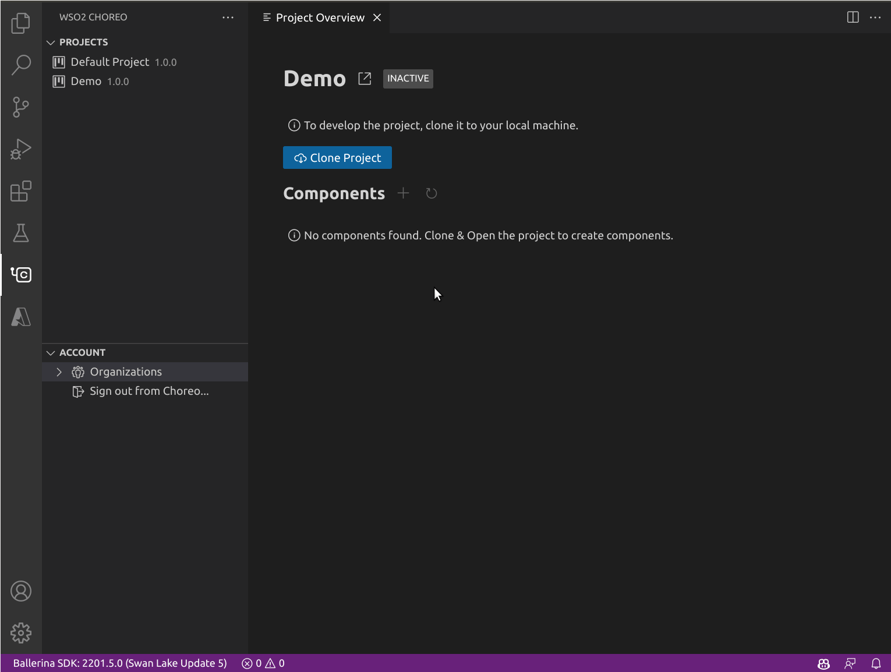

# Develop Components Using VS Code

The [Choreo VS Code extension](https://marketplace.visualstudio.com/items?itemName=WSO2.choreo) provides a wide range of project and component management capabilities to enhance the local development of projects and components in Choreo.

## Prerequisites

For a seamless development experience with the Choreo extension, ensure you configure the following in your local environment:

1. [Visual Studio Code](https://code.visualstudio.com/download) with the Choreo extension installed.
2. [Ballerina distribution](https://ballerina.io) Update 4 or later.
3. [Ballerina extension](https://marketplace.visualstudio.com/items?itemName=WSO2.ballerina) for VS Code, version 4.0.0 or later

## Get started

You need an active Choreo account to utilize the capabilities of the Choreo extension in the VS Code editor. If you already have a Choreo account, follow the steps given below to set up the extension:

1. Install the [Choreo VS Code extension](https://marketplace.visualstudio.com/items?itemName=WSO2.choreo) and wait for activation.
2. Sign in to Choreo using one of the following methods:
    - Click **Sign In** on successful activation of the extension.
    - Click the Choreo icon on the left navigation menu on the VS Code editor and then click **Sign In**.
       
        

    This redirects you to an external URI to complete the authentication process. On successful sign-in, the Choreo activity pane displays all the projects and organizations linked to your Choreo account.

    

## Create a project

!!! tip 
      If you already have a Choreo project, you can skip this section and move to the [Clone a project](#clone-a-project) section.

To create a new Choreo project directly via VS Code, follow the steps below:

1. Click **+** next to the **PROJECTS** in the Choreo activity pane. Alternatively, execute the `Create new project` command.
2. In the **New Choreo Project** pane, specify appropriate values for the required fields.

    !!! tip
         If you want to use a monorepo where you can have all components of the project stored, select **Initialize a monorepo**. This will take you to GitHub to authorize a repository to link to the project.

    

## Clone a project

You can clone a project to easily create a copy of a project in your local machine. 

To clone a project, follow the steps given below:

1. In the Choreo activity pane, click on the project you want to clone. This opens the project overview displaying the list of components of the project.
2. Click **Clone Project**.
3. Select a directory in your local machine to store the project. Once the project is cloned, it opens as a workspace in VS Code.

    !!! tip
         Each component in the project will be available as a workspace item.

    

## Design and develop your application

To design and develop your application, follow the steps given below:

1. In the Choreo activity pane, click on a project. 
2. In the **Project Overview** page, click **Architecture View**.
3. To create a new component, click **+ COMPONENT** and specify appropriate values for the required fields.

    

This creates a source for the component locally in the given repository and displays the component as a workspace item in VS Code.

## Push changes to Choreo

When you create a component, you must follow the steps given below to push the changes to Choreo.

1. In the **Project Overview** page, click **Push to Choreo**. This pushes changes related to a component to the GitHub repository.

    !!! tip
        The **Project Overview** page indicates if a change related to a component has not been pushed to the GitHub repository.

2. Click **Open Source Control**, enter an appropriate commit message, and click **Commit**. and commit the changes
3. To upload the local component changes to the Choreo platform, click **Sync Changes**.

    

