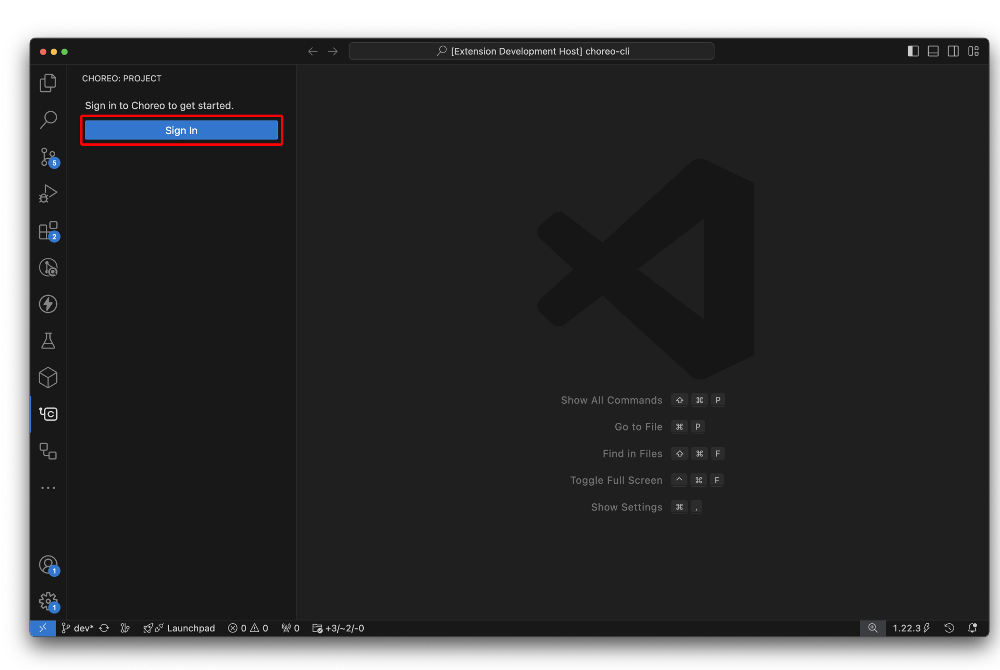
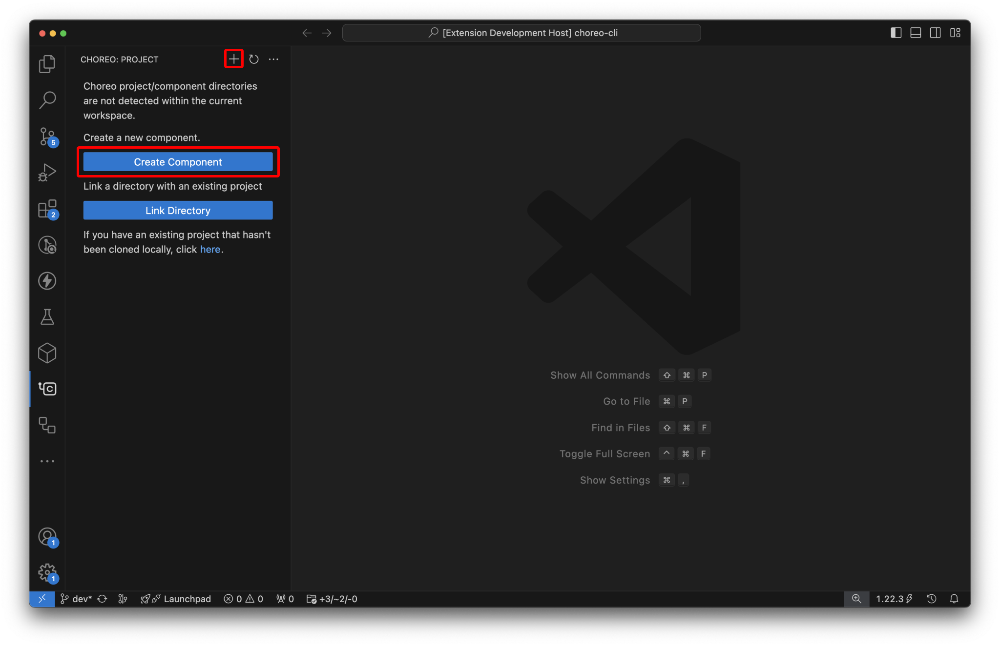
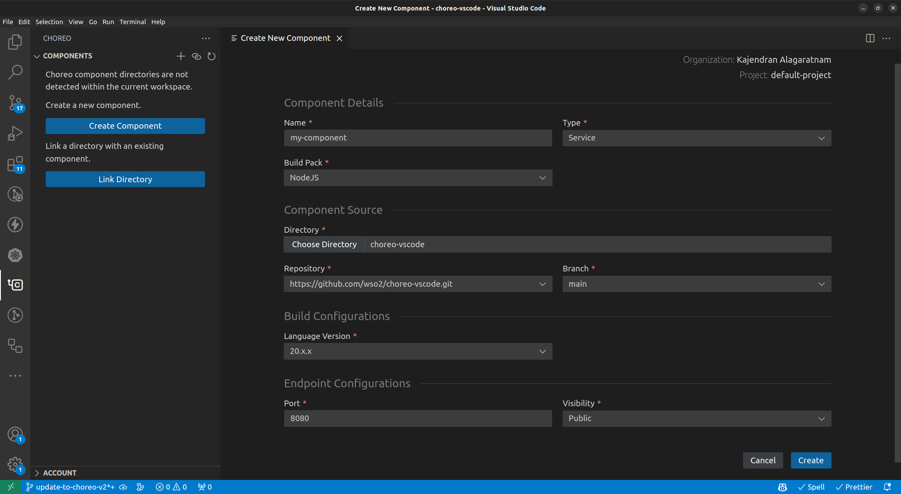
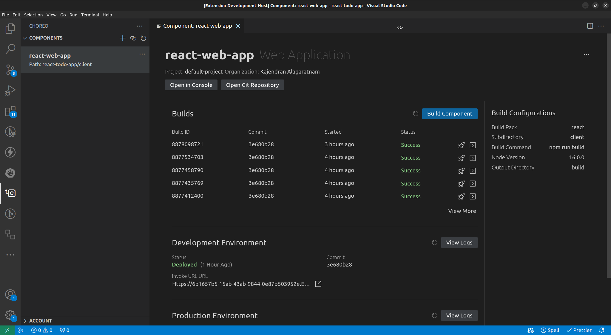
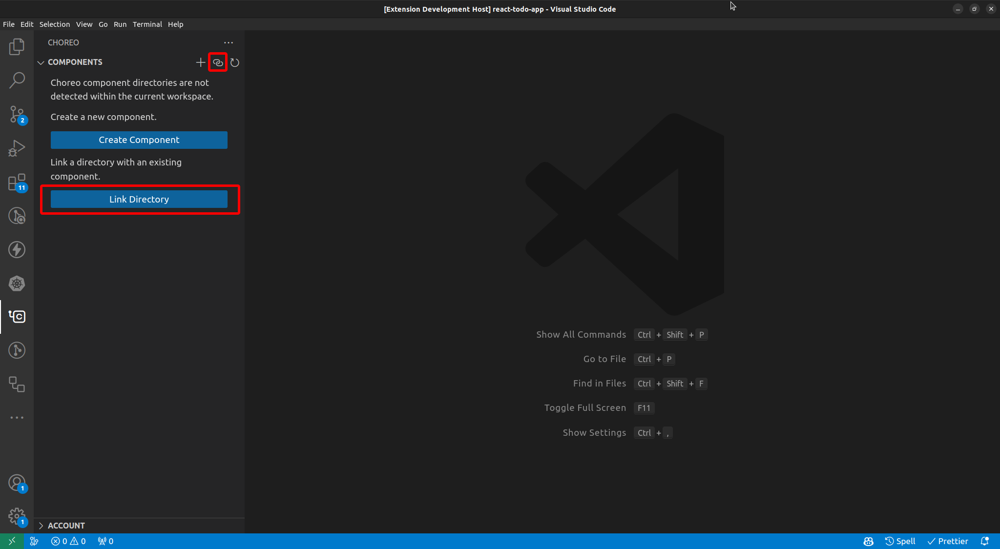

# Develop Components Using VS Code

The [Choreo VS Code extension](https://marketplace.visualstudio.com/items?itemName=WSO2.choreo) provides comprehensive component management capabilities to streamline local development within Choreo.

## Prerequisites

To ensure a smooth development experience with the Choreo extension, make sure you have the following:

1. [Visual Studio Code](https://code.visualstudio.com/download) installed with the [Choreo extension](https://marketplace.visualstudio.com/items?itemName=WSO2.choreo) version **2.0.0** or later.

2. A locally cloned GitHub repository to create new components or link to existing Choreo components.

3. [Git](https://git-scm.com) version 2.0.0 or later.

## Get started

To use the capabilities of the Choreo extension in the VS Code editor, you need an active [Choreo account](https://wso2.com/choreo/pricing/). If you already have an account, follow these steps to set up the extension:

1. Install the [Choreo VS Code extension](https://marketplace.visualstudio.com/items?itemName=WSO2.choreo) and wait for activation. On successful activation, the Choreo extension opens in the VS Code editor. 
2. Sign in to Choreo using one of the following methods:
    - In the Choreo activity pane, click **Sign In**.
       
    - Use the `Sign In` command provided by the Choreo extension.

    This redirects you to an external URI to complete the authentication process. On successful sign-in, the Choreo activity pane displays your account details along with any components detected within the VS Code workspace.

## Create a new component

1. Open the source code directory where you want to build, deploy, and manage components using Choreo.
2. Create a new component using one of the following methods:
    - In the Choreo activity pane, click **Create Component**.
       
    - Use the `Create New Component` command provided by the Choreo extension.

3. If the Choreo extension cannot determine the project context of the opened workspace, it prompts you to select the organization and the project to which the new component belongs.
4. Specify component details such as the name, type, buildpack, etc.

    
            
    On successful creation, the component details view opens, and the Choreo activity pane displays the new component.

    
     
    !!! tip
        Once the component is created, a `.choreo/context.yaml` file is generated in the root of the Git repository. For more details, see [Understand the project context](#understand-the-project-context).

The component details view allows you to manage your component by performing various actions such as the following:

 - Triggering builds for selected commits.
 - Viewing lists of builds and statuses.
 - Diagnosing build failures with build logs.
 - Deploying builds in available environments.
 - Accessing runtime logs and deployed component URLs.
 - Invoking deployed service endpoints.

## Understand the project context

Context files contain metadata related to the project, allowing the extension to establish an association between local directories and Choreo projects. These files, such as the `context.yaml`file, resides in the `/.choreo` directory within the root of the Git repository.

The Choreo extension scans the root of the opened Git repository to find the `context.yaml` file and lists the components of the associated project. This allows you to easily open and manage the components they are developing within the VS Code workspace.

A `context.yaml` file can contain multiple projects, whereas, a workspace opened via VS Code can have multiple `context.yaml` files with different project associations. In such cases, VS Code allows you to switch between these projects, add new project associations, or remove existing ones, allowing you as a developer to focus on components of a particular project at a time.

You can decide whether to commit the `context.yaml` file to the Git repository. Committing this file enables other team members working on the same repository to have a seamless developer experience with Choreo.

If the `context.yaml` file for a particular project is not committed to the Git repository or is unavailable for other reasons, you can easily regenerate it using one of the following methods:

 - In the Choreo activity pane, click **Link Directory**.
    
 - Use the `Link Directory` command provided by the Choreo extension.

## Discover additional features

To access a range of functionalities provided by the Choreo extension, open the VS Code command palette and type `Choreo`.

## Troubleshoot issues

To troubleshoot Choreo extension issues, follow these steps:

1. To open the **OUTPUT** pane, go to the VS Code editor main menu, click **View**, and then click **Output**.

2. Select **Choreo** from the drop-down menu on the right-hand side to view the Choreo output for troubleshooting.

## Get help

For assistance with the Choreo VS Code extension, create [GitHub issues](https://github.com/wso2/choreo-vscode/issues).
