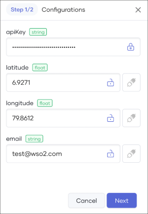
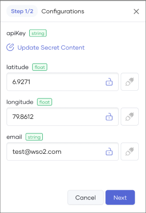

# Develop a Manual Task

This guide walks you through the steps to develop, deploy, test, and observe a manual task using Choreo.  

In this guide, you will:

  - Develop a manual task to fetch the weather forecast for a specified location for the next 24 hours from the  [OpenWeatherMap](https://openweathermap.org) API.
  - Process the weather data to a specific format.
  - Send the formatted data to a specified email address.

## Prerequisites

Before you try out the steps in this guide, complete the following:

 - If you are signing in to the Choreo Console for the first time, create an organization as follows:
    1. Go to [https://console.choreo.dev/](https://console.choreo.dev/), and sign in.
    2. Enter a unique organization name. For example, `Stark Industries`.
    3. Read and accept the privacy policy and terms of use.
    4. Click **Create**.
       This creates the organization and opens the **Project Home** page of the default project created for you.

 - Fork the [Choreo samples repository](https://github.com/wso2/choreo-samples), which contains the sample integration for this guide.
    
    !!! info "Repository file structure"
         
         To work with the sample repository, it is important to familiarize yourself with the repository file structure. The sample code for this guide is in the `<sample-repository-dir>/weather-to-email-integration` directory. To understand how the functionality is implemented, you must read the code comments. The following table describes what you will find in each file in the repository:

          | **File path**         | **File content**                                                     |
          | --------------------- | -------------------------------------------------------------------- |
          | **Ballerina.toml**    | Contains metadata about the project                                  |
          | **Dependencies.toml** | Lists the dependencies required for the project                      |
          | **main.bal**          | Contains the entry point of the project, including the main function |
          | **types.bal**         | Contains custom data types used in the project                       |
          | **utils.bal**         | Contains utility functions and helper functions used in the project  |
          
 - Go to [OpenWeatherMap](https://openweathermap.org/) and sign up to obtain an API key. For details on how to obtain an API key, see the [OpenWeatherMap documentation](https://openweathermap.org/appid#signup).

## Step 1: Create a manual task component

1. Go to [https://console.choreo.dev/](https://console.choreo.dev/) and sign in. This opens the project home page. 
2. If you already have one or more components in your project, click **+ Create**. Otherwise, proceed to the next step.
3. Click the **Manual Task** card.
4. Enter a unique name and a description for the component. You can use the name and description given below:

    | **Field**          | **Value**                        |
    | ------------------ | -------------------------------- |
    | **Component Name** | `WeatherToEmail`                 |
    | **Description**    | `My first manual task`           |

5. Go to the **GitHub** tab.
6. To allow Choreo to connect to your GitHub account, click **Authorize with GitHub**. If you have not already connected your GitHub repository to Choreo, enter your GitHub credentials and select the repository you created in the prerequisites section to install the [Choreo GitHub App](https://github.com/marketplace/choreo-apps).

    Alternatively, you can paste the [Choreo samples repository](https://github.com/wso2/choreo-samples) URL in the **Provide Repository URL** field to connect to it without requiring authorization from the [Choreo Apps](https://github.com/marketplace/choreo-apps) GitHub application. However, authorizing the repository with the [Choreo GitHub App](https://github.com/marketplace/choreo-apps) is necessary if you want to enable [**Auto Deploy**](https://wso2.com/choreo/docs/choreo-concepts/ci-cd/#deploy) for the component.

    !!! note
           The **Choreo GitHub App** requires the following permissions:

           - Read and write access to code and pull requests.
           - Read access to issues and metadata.
             
           You can [revoke access](https://docs.github.com/en/authentication/keeping-your-account-and-data-secure/reviewing-your-authorized-integrations#reviewing-your-authorized-github-apps) if you do not want Choreo to have access to your GitHub account. However, write access is exclusively utilized for sending pull requests to a user repository. Choreo will not directly push any changes to a repository.

7. Enter the following information:

    | **Field**             | **Description**                                      |
    | ----------------------| -----------------------------------------------------|
    | **Organization**      | Your GitHub account                                  |
    | **Repository**        | `choreo-samples`                                    |
    | **Branch**            | **`main`**                                           |
    | **Buildpack**         | **Ballerina**                                        |
    | **Project Directory** | `weather-to-email-integration`|

	!!! tip
    	  - **Buildpack** specifies the type of build to run depending on the implementation of the component. It converts the integration code into a Docker image that can run on Choreo cloud. If an integration is developed using [WSO2 Integration Studio](https://wso2.com/integration/integration-studio/), select **Micro Integrator** as the buildpack. If an integration is developed using the [Ballerina language](https://ballerina.io), select **Ballerina** as the buildpack. 

          - **Project Directory** specifies the location of the project to build the component.

8. Click **Create**. Choreo initializes the component with the sample implementation and opens the **Overview** page of the component.

## Step 2: Build the manual task

To build the manual task, follow the steps given below:

1. In the left navigation menu, click **Build**.
2. In the **Builds** pane, click **Build**. This opens the **Commits** pane where you can see all the commits related to the component.
3. Select the latest commit and click **Build**. This triggers the build process and displays the build progress in the **Build Logs** pane.

    !!! info
         The build process can take a while to complete. When the build process is complete, the build will be listed in the **Builds** pane along with the build status. 

   Here, you will see the build status as **Success**.

## Step 3: Deploy the manual task

To deploy the manual task, follow the steps given below:

1. In the left navigation menu, click **Deploy**.
2. In the **Set Up** card, click **Configure & Deploy**.
3. In the **Configurations** pane, specify values as follows for the configurable variables:

    !!! tip
        The configurable variables populated here are defined in the sample Ballerina project used in this guide. To learn how to declare configurable variables in Ballerina, see the [Ballerina documentation on declaring configurable variables](https://ballerina.io/learn/by-example/configurable-variables/). If configurable variables are detected in a connected Ballerina project, Choreo prompts for the respective values during component deployment.

    | **Field**     | **Value**                                                               |
    | ------------- | ----------------------------------------------------------------------- |
    | **apiKey**    | The API key you obtained in the prerequisites section                   |
    | **latitude**  | Latitude of the location to get the weather forecast                    |
    | **longitude** | Longitude of the location to get the weather forecast                   |
    | **email**     | The email address to receive the formatted weather forecast information |

    !!! note
        If you use **Ballerina** as the buildpack and you want to set a configurable variable as a secret, click the lock icon corresponding to the configurable variable. This marks it as a secret and conceals the input value.

        For example, if you consider the configurable variables in this guide and set the **apiKey** as a secret, its input value will be concealed as follows:

          

        If you want to update the input value at a later time, you can click **Update Secret Content** and specify a new value.

          

4.  Click **Deploy**.

## Step 4: Execute the manual task

To execute the manual task, follow the steps given below:

1. In the left navigation menu, click **Execute**.
2. Click **Run Now**. This triggers the task.

    !!! info "Inject dynamic values into your application as command-line arguments"
         If you want to inject dynamic values into your application as command-line arguments when you run a manual task, follow the steps given below:

           1. Click the drop-down icon next to **Run Now** and then click **Run with Arguments**. 
           2. In the **Runtime Arguments** pane that opens, enter the arguments you want to pass to your application. 
           3. Click **Execute**. This triggers the task with the specified arguments.

         The capability to run a manual task with arguments is supported for the following buildpacks:

        === "Dockerfile"

            To explore a Dockerfile-based manual task with arguments, try out the [Hello World Task](https://github.com/wso2/choreo-samples/tree/main/docker-hello-world-manual-task) sample. For instructions, see the `readme.md` file in the sample repository.

            !!! info
                 When you work on Docker projects, the **Run with Arguments** capability is not supported if the Dockerfile contains `CMD`. In such scenarios, you must use `ENTRYPOINT` to define your default commands. 

        === "Go"

            To explore a Go-based manual task with arguments, try out the [Hello World Go Task](https://github.com/wso2/choreo-samples/tree/main/hello-world-go-task) sample. For instructions, see the `readme.md` file in the sample repository.

        === "Java"

            To explore a Java-based manual task with arguments, try out the [Hello World Java Task](https://github.com/wso2/choreo-samples/tree/main/hello-world-java-task) sample. For instructions, see the `readme.md` file in the sample repository.

            !!! info
                 When you work on Java projects:

                   - The **Run with Arguments** capability is not supported if `Procfile` is available in the project.
                   - The `Main` class should be defined in the `manifest` file.
                   - If Maven files such as `mvn.cmd` exist in the project without the `.mvn` directory, the build will fail. To ensure a successful build, you must either commit the `.mvn` directory along with any Maven files or not include any Maven files in the project if you choose not to commit the `.mvn` directory.

        === "NodeJS"

            To explore a NodeJS-based manual task with arguments, try out the [Hello World NodeJS Task](https://github.com/wso2/choreo-samples/tree/main/hello-world-nodejs-task) sample. For instructions, see the `readme.md` file in the sample repository.

            !!! info
                When you work on NodeJS projects:

                  - The **Run with Arguments** capability is not supported if `Procfile` is available in the project.
                  - The project root must contain the `package.json` file with the `main` attribute defined.

        === "WSO2 MI"

            To explore a WSO2 MI-based manual task with arguments, try out the [Weather to Logs Task](https://github.com/wso2/choreo-samples/tree/main/weather-to-logs-mi-manual-task) sample. For instructions, see the `readme.md` file in the sample repository.

            !!! info
                When you work on WSO2 MI projects and you want to deploy a WSO2 MI integration as a manual task in Choroeo, you must use the WSO2 MI automation mode. For details, see [Running the Micro Integrator in Automation Mode](https://apim.docs.wso2.com/en/latest/install-and-setup/install/running-the-mi-in-automation-mode/).

        === "Ballerina"

            To explore a Ballerina manual task with arguments, try out the [Weather to Email Task](https://github.com/wso2/choreo-samples/tree/main/weather-to-email-integration) sample. For instructions, see the README.md file in the sample repository.

            !!! info
                If you want to pass arguments to Ballerina main functions, you can use the **Run with Arguments** capability. For details on the arguments you can pass, see the [Ballerina documentation](https://ballerina.io/learn/by-example/main-function/). You can also override configurable values in the same manner. For more information, see [Provide values to configurable variables](https://ballerina.io/learn/provide-values-to-configurable-variables/#provide-via-command-line-arguments).

## Step 5: Test the manual task

Once the task is triggered, an email with the subject `[WSO2 Choreo Demo] Next 24H Weather Forecast` is sent from `choreo.demo@gmail.com` to the email address specified as the **email** configurable variable value in [Step 3](#step-3-deploy-the-manual-task). 

If the manual task ran successfully, you should receive an email similar to the following to the email address you specified:

## Step 6: Observe the manual task 

The observability view in Choreo displays graphs that depict details such as throughput, latency, diagnostic data, and logs to identify and troubleshoot anomalies in components you deploy.

To visualize and monitor the performance of the manual task you deployed, click **Observability** in the left navigation menu. You can observe the following:

 - The throughput and latencies of requests served over a given period.
 - The logs that are generated over a given period.
 - The flame graph (Diagnostics View) that is generated over a given period.
 - The low-code diagram.
  
To learn more about the observability details you can view via Choreo observability, see [Observability Overview](../../monitoring-and-insights/observability-overview.md).

## Step 7: Monitor executions

To track and monitor executions associated with the deployed scheduled task, go to the left navigation menu and click **Execute**. 

!!! tip
     The **Execute** view is applicable to both scheduled and manual tasks.

You can view the following information:

- The total number of executions within the past 30 days.

    

- The currently active executions and those that are already complete.
  
    Here, you can view information such as the execution ID, the revision of the execution, and the time it was triggered.

    

- Detailed execution logs for a specific execution.

    You can click on an execution to view detailed logs related to it.
    
    !!! info
         
         It may take a few minutes for the logs to appear. You may need to manually refresh to view the latest logs.

     
