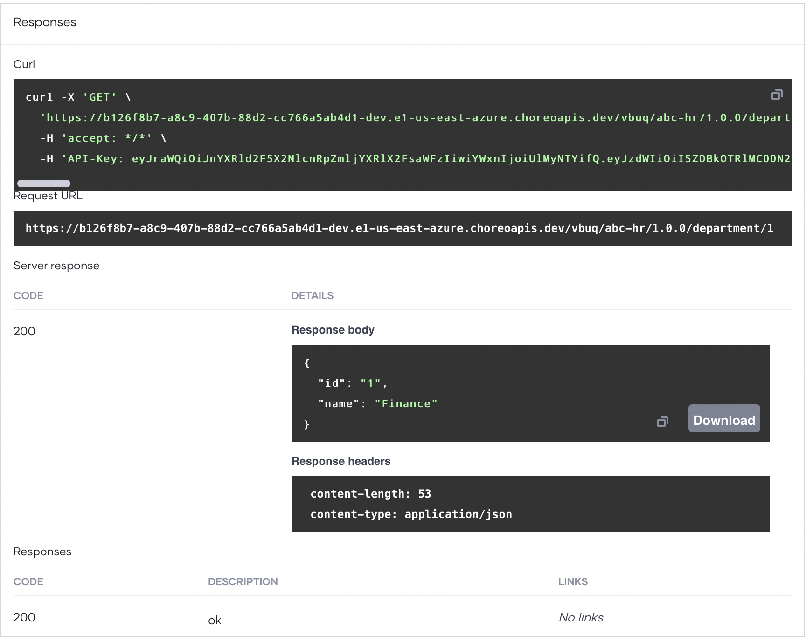
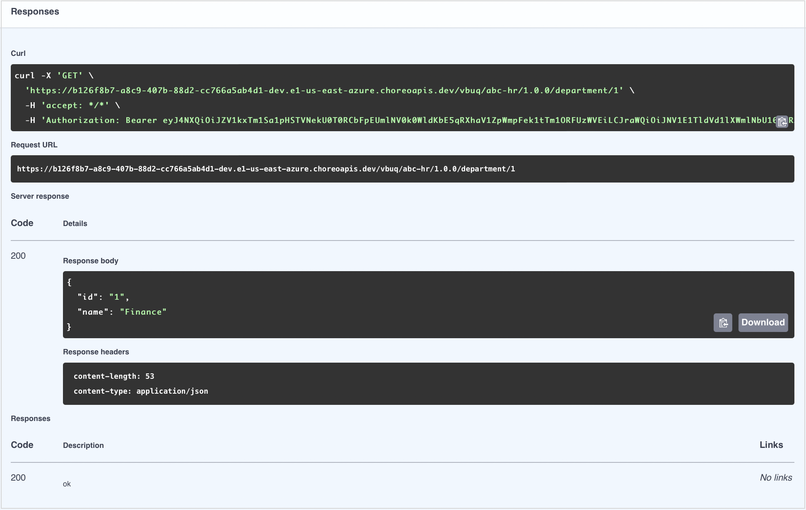

# Develop an API Proxy from a GitHub Repository Source

An API proxy acts as an intermediary between an existing API and Choreo, intercepting all requests made to the API. It also functions as a managed API, allowing you to apply essential API management features such as security policies and rate limiting.

In this guide, you will:

- Create an API proxy component to expose an existing API.
- Deploy the API proxy.
- Test the API proxy to verify its functionality.
- Manage the API.
- Consume the API.

## Prerequisites

- If you're signing in to the Choreo Console for the first time, create an organization:
    1. Go to [https://console.choreo.dev/](https://console.choreo.dev/) and sign in using your preferred method.
    2. Enter a unique organization name. For example, `Stark Industries`.
    3. Read and accept the privacy policy and terms of use.
    4. Click **Create**.

    This creates the organization and opens the **Project Home** page of the default project created for you.

## Step 1: Create an API proxy

You can create an API proxy either by selecting the source from a GitHub repository, uploading an OpenAPI specification file, or providing an OpenAPI specification URL. This guide demonstrates how to create an API proxy using a GitHub repository as the source.

1. Go to [https://console.choreo.dev/](https://console.choreo.dev/) and sign in. This opens the project home page.
2. If you already have one or more components in your project, click **+ Create**. Otherwise, proceed to the next step.
3. Click the **API Proxy** card. This opens the **Create an API Proxy** pane.
4. You will see the three options to create a proxy component and here we select GitHub option (selected by default).
5. Specify the following values as component details:

    !!! info
        The **Component Name** field must be unique and cannot be changed after creation. This value is automatically generated, but you can edit it if necessary.
        **Component Display Name** is a required field.

    | **Field**       | **Value**                                  |
    |-----------------|--------------------------------------------|
    | **Component Display Name**| `Department Service`                    |
    | **Component Name**        | `departmentService`                    |
    | **Description**           | `This is a sample proxy for department service`     |
   
6. Go to the **GitHub** tab.
    - Click **Authorize with GitHub** to connect your GitHub account. If you haven’t connected your GitHub repository to Choreo, enter your GitHub credentials and select the repository you forked in the prerequisites section to install the [Choreo GitHub App](https://github.com/marketplace/choreo-apps).

    !!! note
        The **Choreo GitHub App** requires the following permissions:
         - Read and write access to code and pull requests.
         - Read access to issues and metadata.
        
        You can [revoke access](https://docs.github.com/en/authentication/keeping-your-account-and-data-secure/reviewing-your-authorized-integrations#reviewing-your-authorized-github-apps) if needed. Write access is only used for sending pull requests; Choreo will not push changes directly to your repository.    

6. Enter the following repository details:

    | **Field**              | **Value**          |
    |------------------------|--------------------|
    | **Organization**       | Your GitHub account|
    | **Repository**         | choreo-samples     |
    | **Branch**             | **`main`**         |
    | **API Directory**      | /choreo-samples/proxy-from-github/department-service |

7. Specify the following values as API proxy details:

    !!! info
        The **Context** field must be unique and cannot be changed after creation.**Version** and **Target** are mandatory fields. **Target** can be changed at any time after the creation.

    | **Field**       | **Value**                                  |
    |-----------------|--------------------------------------------|
    | **Context**     | `department-service/v1`                                   |
    | **Version**     | `V1.0`                                      |
    | **Target**      | `https://samples.choreoapps.dev/company/hr/department`|

6. Click **Create**. This creates the API proxy component and takes you to the **Build** page.

!!! note
    When you create an API proxy from a GitHub repository source, the GitHub source serves as the single source of truth. Therefore, any modifications, such as adding or deleting resources, must be made through the GitHub repository.

## Step 2: Build

!!! info
    An initial build starts automatically as soon as you create the API proxy.

1. On the project home page, click on the `Department Service` component you created. This takes you to the component overview page.
2. In the left navigation menu, click **Build**.
3. On the **Build** page, click **Build Latest**.

!!! note
    The build process may take some time. You can track progress in the **Build Details** pane. Once complete, the build status changes to **Success**.

## Step 3: Deploy the API proxy

1. In the left navigation menu, click **Deploy**.
2. In the **Build Area** card, click **Configure & Deploy**. This opens the **Configure & Deploy** pane.
3. Select **External** as the **API Access Mode** and click **Deploy**. The **Development** card indicates the **Deployment Status** as **Active** when the API proxy is successfully deployed.

Now you are ready to test the API proxy.

## Step 4: Test the API proxy

Choreo allows you to test your API proxy using either the [integrated OpenAPI Console](../../testing/test-rest-endpoints-via-the-openapi-console.md) or [cURL](../../testing/test-apis-with-curl.md). In this guide, you will use the OpenAPI Console.

!!! tip
    Choreo enables OAuth 2.0 to secure APIs by default. Therefore, you need an access token to invoke an API.

    - Choreo automatically generates a key to test the API via the OpenAPI Console. To view the key, click the show key icon in the **Security Header** field.
    - To disable security for the entire API or a specific resource:
        1. In the left navigation menu, click **Deploy**.
        2. Go to the **Build Area** card and click **Security Settings**.
        3. In the **Security Settings** pane:
            - To disable security for the entire API, clear the **OAuth2** checkbox.
            - To disable security for a specific resource, expand the relevant resource and turn off the **Security** toggle.
        4. Click **Apply**.

1. In the left navigation menu, click **Test** and then click **OpenAPI Console**.
2. Select **Development** from the environment drop-down list.
3. Expand the `GET /{departmentId}` resource and click **Try it Out**.
4. Enter `1` as the **departmentId** and click **Execute**. You will see a response similar to the following:

    {.cInlineImage-full}

    This indicates that your API proxy is working as expected.

## Step 5: Manage the API proxy

Now that you have a tested API proxy, you can publish it and make it available for application developers to consume. In this guide, you will apply rate limiting to the API and publish it.

### Step 5.1: Apply rate limiting to the API proxy

1. In the left navigation menu, click **Deploy**.
2. Go to the required environment card and click the settings icon corresponding to **API Configuration**.
3. In the **API Configuration** pane, click **Rate Limiting** to expand the section.
4. Select **API Level** as the **Rate Limiting Level**.
5. Specify appropriate values for the **Request Limit** and **Time Unit** fields. You can proceed with the default values.
6. Click **Apply**. This applies the rate limiting level to the API proxy and redeploys it.

### Step 5.2: Publish the API proxy

1. In the left navigation menu, click **Lifecycle** under **Manage**. This takes you to the **Lifecycle** page.
2. Click **Publish**.
3. In the **Publish API** dialog, click **Confirm** to proceed with publishing the API. If you want to change the display name, make the necessary changes and then click **Confirm**. This changes the API lifecycle state to **Published**.

## Step 6: Invoke the API

To generate credentials for the published API and invoke it via the Choreo Developer Portal, follow these steps:

1. In the **Lifecycle** page, click **Go to Devportal**. This takes you to the `HR API` in the Choreo Developer Portal.

2. **Generate Credentials**:
    1. In the Developer Portal left navigation menu, click **Production** under **Credentials**.
    2. Click **Generate Credentials**. Choreo generates new tokens and populates the **Consumer Key** and **Consumer Secret** fields.

    !!! tip
        To test the API via an API test tool or through code, click **Generate Access Token** and copy the test token. Alternatively, click **cURL** and copy the generated cURL command to use via a cURL client. You do not need to generate an access token if you are testing the API via the **Try Out** capability in the Choreo Developer Portal.

3. **Invoke the API**:
    1. In the Developer Portal left navigation menu, click **Try Out**.
    2. In the **Endpoint** list, select **Development** as the environment to try out the API.
    3. Click **Get Test Key** to generate an access token.
    4. Expand the `GET /{departmentId}` resource and click **Try it out**.
    5. Enter `1` as the **departmentId** and click **Execute**. You will see a response similar to the following:

        {.cInlineImage-full}

Now, you have gained hands-on experience creating, deploying, testing, and publishing an API proxy using Choreo.
