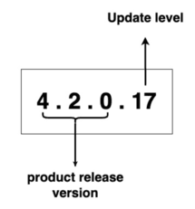
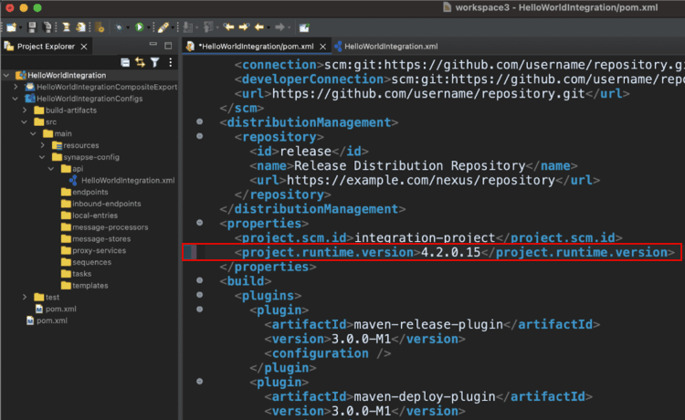
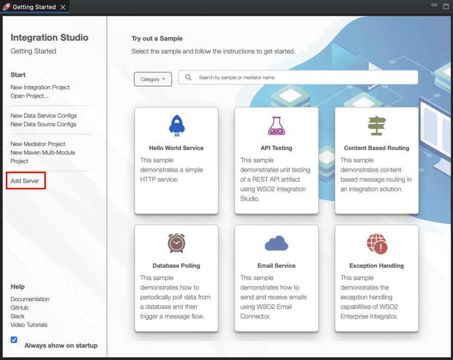
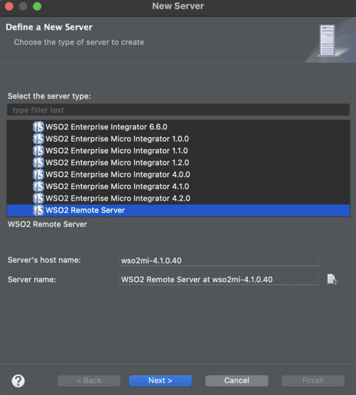
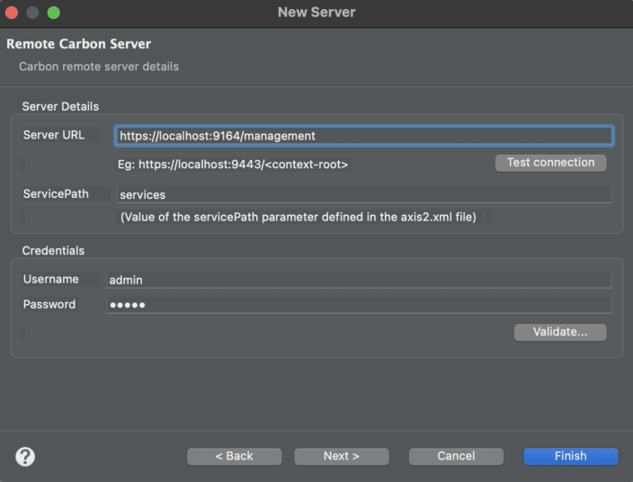
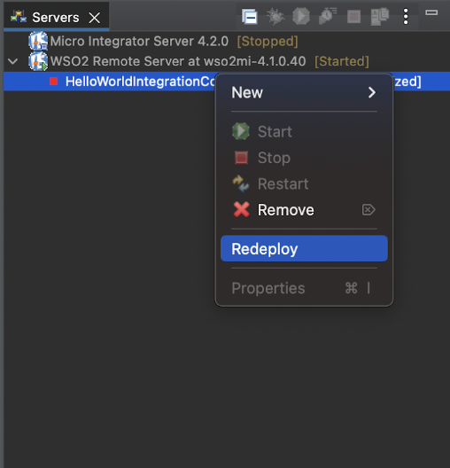
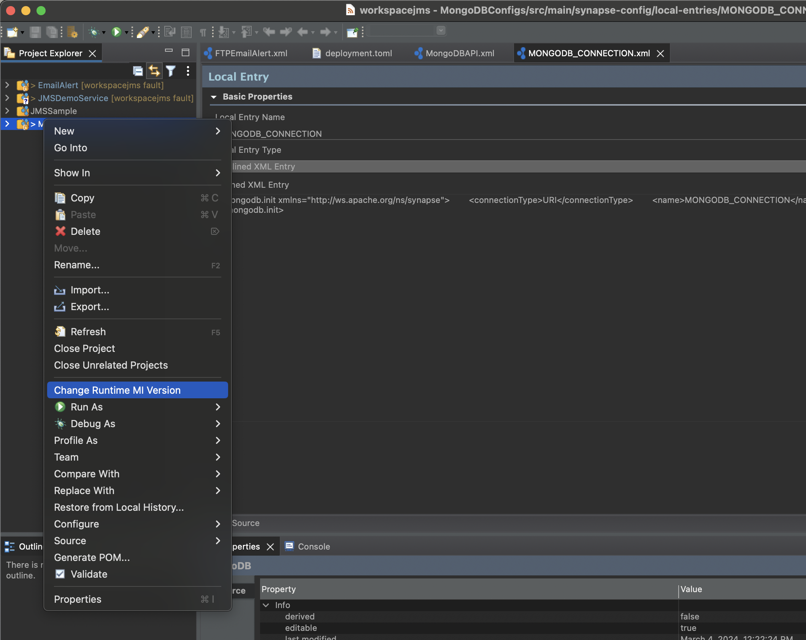
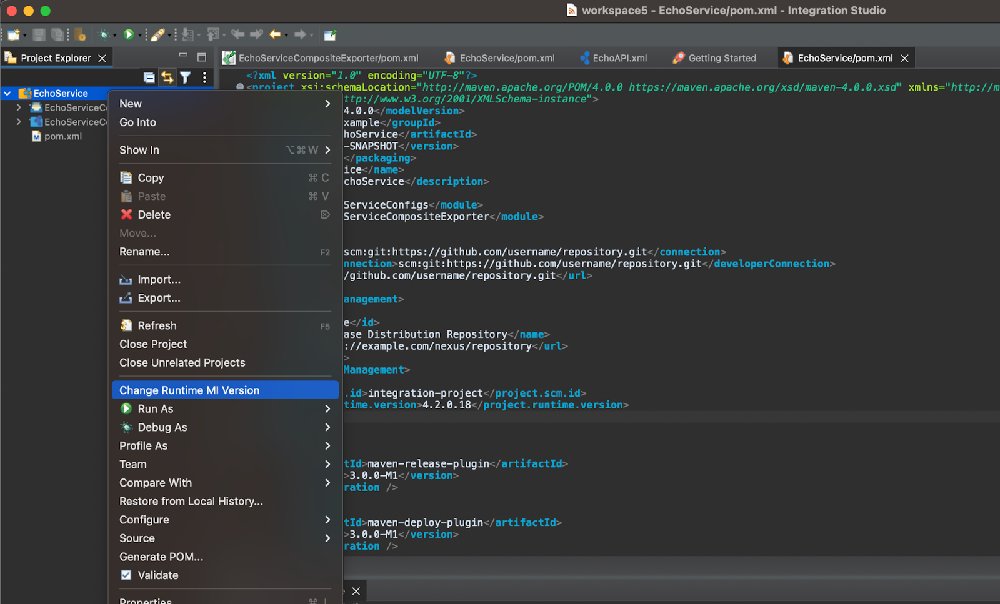

# Manage the Micro Integrator Runtime Version in Your Integration Project

Choreo allows you to use a preferred WSO2 Micro Integrator (MI) runtime version in your integration project. Currently, Choreo supports MI product versions 4.1.0 and 4.2.0. You have the flexibility to deploy WSO2 updates within these specified versions. 

When you create an integration project, you can specify a required runtime version to gain control over the environment in which your integration runs. This version management capability empowers you to tailor your projects depending on your runtime requirements, enhancing the customization and adaptability of your integration workflows.

## Understand the version string

WSO2 Micro Integrator (MI) utilizes a versioning system consisting of three-digit numbers, such as `4.1.0` and `4.2.0`, following semantic versioning principles. The product remains committed to receiving updates from WSO2, including security fixes, bug resolutions, and enhancements. Within the Choreo platform, the MI runtime version is constructed by combining the product release version with its corresponding update level.

In Choreo, the MI runtime version is structured as a four-digit number, for example, `4.1.0.14` or `4.2.0.17`. The first three digits represent the product release version, while the last digit signifies the update level of the product. The fourth digit is optional and can be omitted.

## Version management in WSO2 Integration Studio

If you are using [WSO2 Integration Studio](https://wso2.com/integration/integration-studio/) to build and deploy integration artifacts in WSO2 Micro Integrator, you can create multiple runtime environments and execute projects on any selected environment. WSO2 Integration Studio also allows you to configure multiple Micro Integrator runtime environments, offering flexibility and customization in the execution of integration processes.

You can specify the Runtime version when you create an integration project in WSO2 Integration Studio. In the project creation wizard, specify the runtime version in the **Runtime version** field, as shown below.

An integration project is structured as a Maven project with multiple sub-modules. The root `pom.xml` file holds crucial information about the target runtime. The runtime version you configure when you create a new project is saved within the root `pom.xml` file. The version information is stored in the <project.runtime.version> element under the <properties> in the `pom.xml` file. If there is a need to update the runtime version, you have the flexibility to modify the value to a valid runtime version and ensure that the project runs in the required runtime environment.

You can establish multiple runtime environments by utilizing updated MI instances. With a valid WSO2 subscription, you can also access and download updates to set up an updated MI server locally. This update process allows you to select a preferred update level as the runtime version. Consequently, you can run your integration on a runtime with the latest updates, ensuring optimal performance and access to new features.

### Configure a Micro Integrator runtime environment in Integration Studio

If you are using [WSO2 Integration Studio](https://wso2.com/integration/integration-studio/), follow these steps to set up a remote server instance with a Micro Integrator runtime environment to execute your integration project:

!!! info "Note"
    If you have not downloaded and installed WSO2 Integration Studio, you can follow the [installation instructions](https://apim.docs.wso2.com/en/latest/integrate/develop/installing-wso2-integration-studio/) in the WSO2 API Manager documentation.

1. Launch WSO2 Integration Studio and click **Add Server** in the **Getting Started** view.
   
2. In the **Define a New Server** dialog, click to expand the `WSO2` directory and select **WSO2 Remote Server**.
   
3. Enter the WSO2 Micro Integrator Management API URL in the **Server URL** field and click **Test Connection**.

    !!! info "Note"
        The Management API of WSO2 Micro Integrator is an internal REST API introduced to substitute MI admin services. The default HTTPS port of the Management API of WSO2 Micro Integrator is `9164`. If you have not manually changed the default port, you must set the Management API URL as `https://localhost:9164/management`.  If you have changed the default HTTPS port, you must set the port number appropriately when specifying the **Server URL**. For more information on the default ports of WSO2 Micro Integrator, see [WSO2 Micro Integrator default ports](https://apim.docs.wso2.com/en/latest/install-and-setup/setup/reference/default-product-ports/#micro-integrator-ports) in the WSO2 API Manager documentation.

    
    
4. Click **Finish**.
5. In the **Add and Remove** dialog, select the integration components to move from the left side to the right side.
6. Click **Add >**.
7. Click **Finish**. 

Your integration project is now running in a remote server instance with the Micro Integrator runtime environment you require.
If you need to make changes to the integration project, expand the remote server instance, right-click on the deployed exporter project, and select **Redeploy** to apply the changes.

## Convention for version interpretation in Choreo deployments

You can use the following convention to indicate the required MI runtime version in your integration project:

| **Version format**           | **Example**       | **Description**   |
|------------------------------|-------------------|-------------------|
| Product version              | `4.1.0`, `4.2.0`  | Deploy on the latest update level of the mentioned product version.                 |
| Product version with update level  | `4.1.0.15`, `4.2.0.17` |  Deploy on the exact update level of the mentioned product version.    |
| GA version                   | `4.1.0.0`, `4.2.0.0` | Deploy on the exact GA version without any update.                  |
| Default version            | Empty value         | Deploy on the latest update level of the default product version.                  |

Choreo utilizes Alpine images for configuring and deploying the Micro Integrator runtime. This includes automated configuration of the JRE/JDK, customized to the compatibility of the chosen runtime version, simplifying the setup procedure.

## Migrate between runtime versions

Changing the runtime version in an integration project may become necessary during product version upgrades or when you want to apply updates. 

To change the runtime version of a MI Integration, follow the below steps.

### Update the runtime version in the integration project
    
To change the runtime version in the integration project, follow the steps below:
1. Open the project in Integration Studio.
2. Right-click on the project and select **Change Runtime MI Version**.
    
3.  Specify the new runtime version as shown below:
    
4. Alternatively, you can manually update the version by opening the root `pom.xml` file.  Open pom.xml and change the required runtime version in `<project.runtime.version>` element under `<properties>` section.

To test the changes locally, you must download and set up the runtime environment locally. Then, you must [configure the Integration Studio runtime environment](#configure-a-micro-integrator-runtime-environment-in-integration-studio) by directing it to the locally installed MI runtime. Once the setup is complete, you can deploy your integrations on the MI runtime environment and proceed to the testing phase.

After completing the tests to ensure everything works as expected, you can follow below steps to deploy the project in Choreo:

1. Commit and push the changes to your repository.
2. Go to [https://console.choreo.dev/](https://console.choreo.dev/) and sign in.
3. Select your project from the **Project** list in the header.
4. Select your MI integration component from the **Component** list in the header.
5. In the left navigation menu, click **Build**.
6. Select the latest commit and click **Build**.
7. In the left navigation menu, click **Deploy**.
8. Click on the **Configure and Deploy** and deploy the component.
9. Verify the Runtime version by checking the logs by selecting the **Runtime Logs** under the **Observability** section.

  You will see the runtime version in the logs as shown below:
  

Next, you must conduct additional testing in the development environment on Choreo before you promote the integration to production environments.

## Troubleshoot errors

The following error codes can help you troubleshoot errors that occur during the integration component build:

| **Error code** | **Description**            |
|----------------|----------------------------|
| 110 - 119      | Internal server error.     |
| 121            | Malformed runtime version. |
| 122            | The specified runtime version is not available. Either the product or update level is not available.    |
| 123            | Trivy security vulnerabilities found in the `libs` directory. |
| 124            | Trivy security vulnerabilities found in the `dropins` directory. |
| 125            | Trivy security vulnerabilities found in the `libs` or `dropins` directory. |
| 126            | Error building integration project. |
