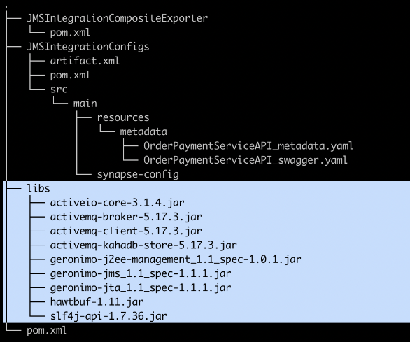
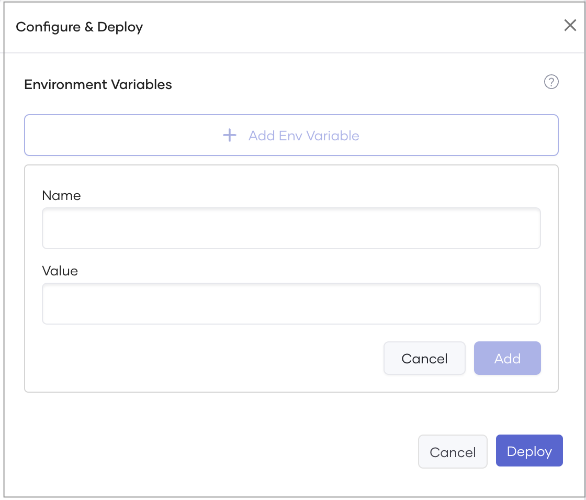

# Work with the Micro Integrator Runtime in Choreo

WSO2 Micro Integrator (WSO2 MI) is a lightweight, high-performance integration runtime. It allows you to run integrations developed using WSO2 Integration Studio within Choreo. 

The topics on this page walk you through the key aspects you need to understand to use the WSO2 MI runtime effectively in Choreo.

## Integration types

Choreo supports the following WSO2 MI integrations that cater to different use cases and requirements. Each integration type serves a specific purpose. Therefore, it is essential to understand their differences to easily choose the most appropriate integration for your use case.

- **Service**: Exposes an integration as an API via HTTP, making it possible to create a RESTful interface for your integration services. This type is ideal for scenarios where you need to provide an API for external systems or clients to interact with your integration.
- **Event Handler**: Triggers an integration based on external events such as messages arriving on a queue or updates in a database. This type is well-suited for implementing event-driven architectures or responding to changes in your system's environment.
- **Scheduled Task**: Runs an integration automatically at predefined time intervals, ensuring that specific integration tasks occur at regular intervals. This type is ideal for batch processing, data synchronization, or periodic maintenance tasks.
- **Manual Task**: Initiates an integration via user action, giving you full control over when the integration executes. This type is useful for on-demand tasks, testing, or debugging purposes.

## Develop integrations with WSO2 Integration Studio

[WSO2 Integration Studio](https://wso2.com/integration/integration-studio/) is a powerful, Eclipse-based graphical development environment that enables you to build and deploy integration artifacts in WSO2 Micro Integrator. This comprehensive IDE offers a robust set of tools for designing and testing integration flows and crafting integration artifacts. By utilizing the visual, drag-and-drop capabilities of WSO2 Integration Studio, developers can significantly reduce the time and effort needed to construct and deploy integration flows.

In addition to streamlining the development process, Integration Studio offers features such as debugging, testing, and version control to ensure the quality and reliability of integration flows. By creating an Integration project and Composite Exporter project in WSO2 Integration Studio, developers can export their integration projects as a single deployment artifact, known as a composite application. This composite application encompasses all the components and configurations necessary for deploying the integration project to WSO2 Micro Integrator.

The Composite Exporter project simplifies the deployment process by allowing developers to package their integration projects as a single, self-contained artifact that can be easily deployed and managed. This approach enhances the consistency and reliability of integration projects while streamlining the overall deployment process.

To start developing integrations with WSO2 Micro Integrator, see [WSO2 Micro Integrator documentation - Developing Integration Solutions](https://mi.docs.wso2.com/en/latest/develop/intro-integration-development/).

## Integration project directory structure

An Integration Project in WSO2 Integration Studio is a multi-module Maven project that can contain multiple modules with WSO2 Synapse configurations and a composite application module to export all the configurations as a single deployable artifact.

An integration project directory structure includes the following key components:

 - WSO2 Synapse configurations: These modules contain the essential configurations for the integration project.
 - Composite Application module: This module is responsible for exporting all the Synapse configurations as a single deployable artifact.

Optionally, you can include the following components in your integration project:

 - OpenAPI definition file: You can add the OpenAPI definition file to any location within the project. When creating a component, you'll need to define the path to this file. Choreo will automatically generate an OpenAPI definition for you based on your integration project, if you don't provide one.
 - Java libraries: If your integration project requires additional Java libraries, you can add them to the libs directory located in the project root.
 - deployment.toml file: This optional configuration file allows you to customize the preconfigured settings of WSO2 MI instances running on Choreo. By including this file, you can tailor the behavior of your WSO2 MI instances to better suit your project's specific requirements.

Understanding the Integration Project directory structure is crucial for organizing your project and ensuring that all necessary components are included in the final deployable artifact.

## OpenAPI support

OpenAPI Support plays a crucial role in enhancing the functionality of integrations exposed as APIs. By providing an OpenAPI definition for your exposed integration, you can streamline testing and management processes, ensuring a more efficient and user-friendly experience. Choreo will automatically generate an OpenAPI definition for you based on your integration project, if you don't provide one, saving you time and effort.

To incorporate OpenAPI support, store the OpenAPI definition file within the repository hosting your Integration Studio project. When creating the project, simply point to the file's location in the repository. If needed, you can change the location of the OpenAPI definition file later via the deploy page.


By leveraging OpenAPI Support, you can optimize the way you test and manage your integrations, resulting in a more efficient development process and a smoother user experience.

## Work with third-party libraries

The use of third-party libraries in your Micro Integrator project can offer several advantages, such as enhanced functionality, improved integration capabilities, optimized performance, and reduced development time.

Here are some of the benefits of adding third-party JARs to the Micro Integrator:

 - Increased functionality: Third-party libraries can extend the core Micro Integrator distribution, allowing for greater flexibility and customization of integration solutions.
 - Enhanced integration capabilities: Third-party libraries enable the Micro Integrator to interact with existing systems such as databases or other APIs, improving overall integration capabilities.
 - Optimized performance: By offering optimized implementations of common functions, third-party libraries can improve the performance of the Micro Integrator.
 - Efficient development: Developers can avoid re-implementing commonly used functions, reducing development time and increasing efficiency.

To incorporate third-party libraries into your Micro Integrator project, create a new directory called `libs` at the
root of your project. If your project root and GitHub repository root are not the same, place the `libs` directory in
the project root. After adding the required JAR files to the `libs` directory, the Micro Integrator runtime will
automatically include them when deploying the component. This process ensures that any dependencies needed by your
integration flow are available at runtime.

In addition to `jar` libraries, you may also need to incorporate OSGi bundle JARs into your project. To do this,
create another directory called `dropins` at the root of your project. Similarly, if the project root and GitHub
repository root differ, place the `dropins` directory in the project root. Within the `dropins` directory, add the OSGi
bundle JAR files. The OSGI runtime will pick up these bundles during deployment, enabling you to utilize their
functionality within your Micro Integrator project.



## Importing custom certificates to MI

The feature enables Choreo MI users to import certificates into the MI `client-truststore.jks` file. This functionality
proves valuable when users need to establish connections with servers or services utilizing SSL/TLS encryption and
possessing self-signed certificates or certificates issued by private certificate authorities (CAs) that are not
automatically trusted. Importing the certificate to the MI `client-truststore.jks` file enables MI clients to establish secure connections with
the server or service seamlessly, eliminating SSL/TLS errors or warnings.

Before importing the certificate, it is necessary to obtain the certificate file, which can be in PEM or DER format. You
can get the certificate from the server or service provider or export it from a web browser. Certificates should be
added to the `/wso2mi/certs/` folder. Users need to verify that the mount path for the certificate file aligns with this
specific path.

1. In the Choreo console, select the component you wish to add a certificate to.
2. From the left navigation click **Deploy**.
3. Click on the **Configs and Secrets** tab.
4. Click **Create**.
5. Select **ConfigMap** as the **Config Type** and **File Mount** as the **Mount Type**.
6. Click **Next**.
7. Specify the following values as mount configurations:

    | **Field**       | **Value**                                              |                                    
    |-----------------|--------------------------------------------------------|
    | **Config Name** | An appropriate name for the certificate.             |
    | **Mount path**  | `/wso2mi/certs/<filename>`. For example, `/wso2mi/certs/certificate.crt` |

8. Click **Upload File** and attach the certificate.
9. Click **Create**.

## Working with sensitive data using MI Secure Vault

MI Secure Vault is a feature that allows users to securely store sensitive data, such as passwords and tokens, and
provide access to that data to MI Integrations. This feature provides an added layer of security to your integrations by
reducing the risk of accidental exposure of sensitive data.

To use MI Secure Vault to work with sensitive data, follow these steps:

1. Select the component from the Choreo Console.
2. From the left navigation, click Deploy.
3. Click on the **Configure and Deploy**.
4. Click on the **Add Environment Configurations**
5. Specify the following values as configurations:

    | **Field**       | **Value**                                 |                                    
    |-------------------------------------------|--------------------------------------------------------|
    | **Name** | An appropriate name for the secret/alias. |
    | **Value**       | Value for the secret                      |

6. Select **Mark as a Secret**.
7. Click **Add**.
8. Click **Deploy**.
9. Once the secret has been created, you can access it in your integration code using the following syntax:

```xml
<property name="secret_value_1" expression="wso2:vault-lookup('user_pass')" scope="default" type="STRING"/>
```
This code retrieves the secret named "user_pass" from the MI Secure Vault and stores it in the property named "
secret_value_1". You can then use this property in your integration code to access the secret value.

For more information on these features, see the [Accessing secrets](https://mi.docs.wso2.com/en/latest/install-and-setup/setup/security/encrypting-plain-text/#step-3-accessing-secrets) section of the MI Secure Vault documentation. By using MI
Secure Vault to store and access sensitive data in your integrations, you can ensure that your integrations
remain secure and protect sensitive data from unauthorized access.


## Scan third-party libraries to identify security vulnerabilities

Scanning third-party libraries for security vulnerabilities is essential for identifying potential weaknesses in an application that could be exploited by attackers. Taking a proactive approach to security helps organizations detect and mitigate risks before they can be exploited, preventing data breaches, system compromises, and other security incidents.

Choreo incorporates a security vulnerability scanning process during deployment. It uses Trivy to scan and detect critical vulnerabilities in third-party libraries added to the integration component. If the scan uncovers any critical vulnerabilities, the deployment process is halted. The deployment pane displays the Trivy scan status and any security failures in the Library (Trivy) vulnerable scan step, which can be accessed by clicking on it. Once the vulnerability has been addressed, you can redeploy the component.

## Customize WSO2 Micro Integrator preconfigured settings

Customizing WSO2 Micro Integrator Preconfigured Settings is essential for ensuring that the integration solution works optimally within the specific context of your organization. While WSO2 MI comes with preconfigured settings designed for general use, these settings may not be suitable for every organization's unique requirements. Customizing these settings can help optimize performance and ensure compatibility with your organization's systems and applications.

To customize the preconfigured settings of WSO2 MI instances running on Choreo, define a `deployment.toml` file in the GitHub repository subpath of your Micro Integrator project:


!!! note
    If you change critical configuration parameters such as port offset and hostname, it can break internal communication.
    Therefore, the recommended approach is to update only the necessary configuration parameters.

Given below is a sample `deployment.toml` file that can be used to configure the JMS transport. For more information on WSO2 MI
configuration parameters, see the [MI Configuration Catalog](https://mi.docs.wso2.com/en/latest/reference/config-catalog-mi/).

```
[[transport.jms.sender]]
name = "myQueueSender"
parameter.initial_naming_factory = "org.apache.activemq.jndi.ActiveMQInitialContextFactory"
parameter.provider_url = "$env{JMS_PROVIDER_URL}"
parameter.connection_factory_name = "QueueConnectionFactory"
parameter.connection_factory_type = "queue"
parameter.cache_level = "producer"

[[transport.jms.listener]]
name = "myQueueListener"
parameter.initial_naming_factory = "org.apache.activemq.jndi.ActiveMQInitialContextFactory"
parameter.provider_url = "$env{JMS_PROVIDER_URL}"
parameter.connection_factory_name = "QueueConnectionFactory"
parameter.connection_factory_type = "queue"
parameter.cache_level = "consumer"
```

## Environment variables

Using environment variables is a recommended practice when developing integration artifacts with WSO2 Integration Studio, as it improves configuration management, security, portability, and manageability. By leveraging environment variables, organizations can streamline the management and maintenance of their integrations, ensuring that updates can be implemented quickly and efficiently.

The component's Deploy page provides a user-friendly interface to manage environment variables across different environments. For information on managing environment variables for complex use cases, see [Configurations and secrets](../devops-and-ci-cd/manage-configurations-and-secrets.md).



Environment variables offer several benefits:

 - Configuration management: They simplify the process of managing and updating configuration settings, making it easier to maintain consistency across different environments.
 - Security: Environment variables help protect sensitive information by storing it securely and separating it from the main codebase.
 - Portability: By using environment variables, you can ensure that your integration artifacts can be easily migrated and deployed across various environments with minimal changes.
 - Manageability: Environment variables offer a centralized way to manage configuration settings, making it easier to update and maintain your integrations over time.

For a comprehensive list of parameters that can be configured as environment variables, see [WSO2 Micro Integrator documentation - Injecting Parameters - Supported parameters](https://mi.docs.wso2.com/en/latest/develop/injecting-parameters/#supported-parameters).

## Configure logging

Configuring logging is crucial when developing and maintaining a software system, as it can significantly improve efficiency during the development, testing, and maintenance phases of the software development process. Logging captures events and messages that occur during an application's execution, providing valuable insights for troubleshooting and debugging issues.

With Micro Integrator instances, you can configure and customize logging according to your requirements. Logging configurations can be added to each MI instance's environment, allowing you to fine-tune logging depending on the specific environment or deployment scenario.

To configure logging in MI instances, follow the steps given below: 

!!! tip
     You can use environment variables with specific naming conventions.

1. Start the variable name with `logging_level_` followed by the package or class name.
2. Replace the dot character in the package name with an underscore.
3. Set the variable value to the required logging level for the corresponding package or class.

    For example, to enable wire logs, change the logging level of the `org.apache.synapse.transport.http.wire` package to `debug`. 

To configure logging, set the environment variable as follows:

1. In the left navigation menu, click **Deploy** and then click **Configs & Secrets**. 
2. Click **+ Create**. 
3. Select **ConfigMap** as the **Config Type** and **Environment Variables** as the **Mount Type**. 
4. Click **Next**. 
5. Specify the following values as mount configurations:

    | **Field**       | **Value**                                              |                                    
    |-----------------|--------------------------------------------------------|
    | **Config Name** | An appropriate name for the configuration.             |
    | **Name**        | `logging_level_org_apache_synapse_transport_http_wire` |
    | **Value**       | `debug`                                                |

6. Click **Create**.

## Connectors

WSO2 Micro Integrator (MI) Connectors are prebuilt connectors designed to simplify integration between WSO2 MI and various other systems. They enable seamless connections to databases, message brokers, REST APIs, and more, allowing you to perform actions such as sending messages, executing queries, or retrieving data. These connectors are easy to use, making it straightforward to incorporate them into your WSO2 MI integration flows. Micro Integrator connectors are versatile and can be utilized in various integration scenarios, including data integration, service-oriented architecture (SOA) integration, and event-driven architecture (EDA) integration.

WSO2 Integration Studio is a comprehensive development environment that facilitates the creation of integration flows using WSO2 Micro Integrator Connectors. With Integration Studio, you can design and implement integration flows that connect diverse systems and execute various actions, such as sending messages, executing queries, or retrieving data. You can build integration flows using either prebuilt connectors provided by WSO2 MI or custom connectors developed using the Connector Development Toolkit. Integration Studio offers a graphical user interface that simplifies the process of building and testing integration flows while also providing a set of tools for managing and deploying these flows in a WSO2 MI runtime environment.

For more information, see the following topics in the WSO2 Micro Integrator documentation.

- [Connectors Overview](https://mi.docs.wso2.com/en/latest/reference/connectors/connectors-overview/)
- [Adding Connectors](https://mi.docs.wso2.com/en/latest/develop/creating-artifacts/adding-connectors/)

## Deploying integrations in Choreo 

WSO2 MI buildpack is where you can deploy integrations developed with WSO2 Micro Integrator as an API. In this preset, you have three different ways to define endpoints. Choreo gives priory to the definition of endpoints in the below-mentioned order. 

1. **Using component.yaml file**
This is the most flexible method to define endpoints. You can configure the endpoint details with the `component.yaml` configuration file. Place this file in the `.choreo` directory in the project path of the component. 
If the Micro Integrator project has inbound endpoints, you can expose them via different endpoints using the `component.yaml`file.

    To learn about the `component.yaml` file, see [Overview of the component.yaml file](../develop-components/manage-component-source-configurations.md#overview-of-the-componentyaml-file).

3. **Auto generating endpoints**
If `component.yaml` is not provided and if the source Micro Integrator project has APIs, Choreo scans the project and generates the API endpoints. If the project has few APIs, an endpoint will be generated for each API. The visibility of this auto-generated endpoint is set to `Public` by default. You can change the visibility in the deployment flow.

4. **Provide default endpoints**
If `component.yaml` is not provided and if the source Micro Integrator project doesn't have APIs, Choreo generates a default endpoint which will expose the default micro integrator port (8290) with `Public` visibility and wildcard context.

!!! note
    If you are currently using `component-config.yaml` or `endpoints.yaml` configuration files, see the respective [migration guide](../develop-components/manage-component-source-configurations.md#migration-guide) for instructions on migrating to the recommended `component.yaml` configuration file.

## Explore Choreo examples on GitHub

For a hands-on experience with MI-based integrations in Choreo, we recommend exploring our samples in Choreo Console. You can filter out the samples based on the buildpack `WSO2 MI`. This will point you to the samples in the [Choreo samples GitHub repository](https://github.com/wso2/choreo-samples)

### [Choreo samples - GitHub Repository](https://github.com/wso2/choreo-samples)

- **Fork the Repository**: Start by forking the repository to your account.

- **Explore & run**: Navigate through the different integration scenarios. Each example has a README.md with setup and execution instructions.

