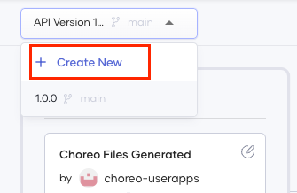

# Manage Connectors 

A connector in Choreo is a component you or another party have:

1. Designed and developed in Choreo.
2. Exposed as an API in Choreo. 
3. Published as a connector in the Choreo [Marketplace](../../marketplace.md)

A connector lets you share your APIs privately or publicly, promoting the reuse of APIs. Developers can use them when they design their components in the low-code view. A connector lets you share your APIs privately or publicly, promoting the reuse of APIs. Developers can use them when they design their components in the low-code view. Choreo allows you to create new connectors and maintain them easily.

## Use a connector in your component design
When you design your components in the low-code view, you can search and add the connectors displayed in the Marketplace as follows:

1. Open the component you are designing in the Web Editor and add a connector.
    
    {.cInlineImage-small}

2. Search for the connector you need to add (e.g., World Bank), and click on it to add it.

    {.cInlineImage-small}

If the connector is not available by default, you need to visit the vendor portal, make a payment or provide your Freemium account details if required, and access the required authorization tokens beforehand.

e.g., If you need to use the Azure SQL DB connector, create an Azure account and obtain an authorization token.


## Update a connector

If you want to introduce a change to your component and update the connector you published for it, you need to explicitly republish the connector.

### Update a private connector

To update a private connector, you can republish the same connector version as follows:

1. Sign in to the Choreo Console at [https://console.choreo.dev](https://console.choreo.dev).
2. Navigate to your component and click  **Manage**.
3. Click **Lifecycle** from the left pane.
4. Click **Republish Connector**.


### Update a public connector 

Public connectors are immutable. Therefore, we cannot modify and republish the already published connector version. You have to create a new component version to be able to publish a new connector version from it as follows:

1. Create a new GitHub branch for the new connector patch version in your GitHub repository. If you are using a Choreo-managed repo, follow the steps below:
    1.  Sign in to the Choreo Console at https://console.choreo.dev. 
    2. Navigate to your component and click **Overview** from the left pane. 
    3. Click the **Edit Code** button and navigate to the Web Editor to create a new branch through the terminal using the following commands: 
        ```
            git checkout -b <branch-name>
            git push origin <branch-name>
        ```
2. On the Choreo console, click **Deploy** on the left pane. 
3. Expand the **API version** dropdown and click **+ Create New**. 
4. Select the branch you created in step 1 as the **Associated Branch** and provide a new version, for example, 1.0.x. Click **Create** to create a new patch version of the component.
4. Continue to deploy the component by clicking **Deploy** on the **Build Area** pane.
5. Click **Manage** on the left pane.
6. Click **Lifecycle** on the left pane. 
7. Select the new version from the **API Version** drop-down.
       
    {.cInlineImage-small}

8. Publish the API as a new connector.
9. Select the old API version from the **API Version** drop-down.
10. Click **Deprecate** and deprecate the previous API version.