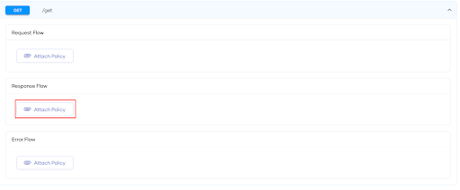
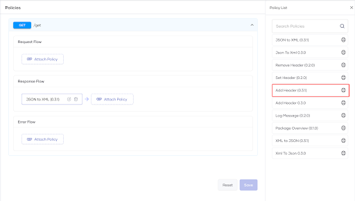
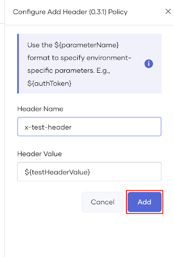

# Attach a Policy

You can attach a policy to the `Request`, `Response`, or `Error` flow of the  REST API Proxy as follows:

1. Sign in to the Choreo Console at [https://console.choreo.dev](https://console.choreo.dev).
2. From the component list, select and click on the REST API Proxy component to which you want to attach the policy(s).
3. In the left navigation menu, click **Develop**  and then click **Policies**.
4. From the list of resources, expand the resource to which you want to attach the policy(s). 
5. Click **Attach Policy** for the relevant flow (i.e., `Request`, `Response`, or `Error`) to which you want to attach the policy.

    {.cInlineImage-small}

6. From the **Policy List** panel on the right-hand side, select the policy you want to apply and click **Add**.

    {.cInlineImage-xsmall}

7. Click **Save**.

## Configuring the policy to accept environment-specific parameters

You can use policies that enable users to enter custom parameters and values. For example, the `Add Header` policy requires the user to enter a header name and value when deploying the REST API Proxy. These parameters can be static values or environment-specific values. 

To add environment-specific values and policy parameters, follow the steps given below::

1. Sign in to the Choreo Console at [https://console.choreo.dev](https://console.choreo.dev).
2. From the component list, select and click on the REST API Proxy component to which you want to attach policies.
3. In the left navigation menu, click **Develop**  and then click **Policies**.
4. From the list of resources, expand the resource to which you want to attach the policy(s).
5. Click **Attach Policy** for the relevant flow (i.e., `Request`, `Response`, or `Error`) to which you want to attach the policy.
6. Add a policy that enables you to accept custom parameters and values from users. For example, the **Add Header** policy. 

       {.cInlineImage-threeQuarter}

8. Enter values for the required policy parameters when prompted. If you want to make a parameter a configurable variable, enter the value in `${<variableName>}` format. For example, `${name}`.

       

9. Click **Add** and then click **Save**.
10. To deploy the component, from the left navigation menu, click **Deploy** and then click **Config & Deploy**. When the interceptor application generation step is complete, you can provide the configurations. 
11. When prompted, provide the value and click **Save & Deploy**.

     {.cInlineImage-full}
