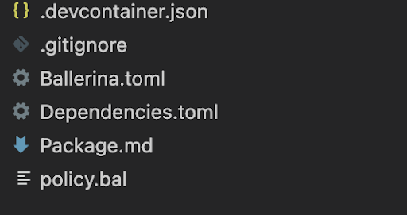

# Create a Policy

You can use policies to enforce some business logic on the Request, Response, or Fault flow of an API invocation. Using policies, you can make API invocations undergo slight behavioral modifications before reaching the backend. Similarly, you can modify the API response that a client receives. In Choreo, you can add an API Policy only to an API Proxy. 

A policy can be implemented as a Ballerina project and attached to an API Proxy. To create a policy, follow the steps given below: 

## Prerequisites

1. Set up [Ballerina 2201.2.0 or later](https://ballerina.io/learn/install-ballerina/set-up-ballerina/).
2. Open the ~/.ballerina/Settings.toml file and check if you have configured an access token to the Ballerina Central. If an access token is not configured in the file, follow the steps below: 
    1. Generate a token from [https://central.ballerina.io/dashboard?tab=token](https://central.ballerina.io/dashboard?tab=token).
    2. Download the generated Settings.toml file and copy it to your local ~/.ballerina directory.
    
Alternatively, you can set the access token through the **BALLERINA_CENTRAL_ACCESS_TOKEN** environmental variable.

``` 
export BALLERINA_CENTRAL_ACCESS_TOKEN=<access-token> 
```

##  Step 1: Initializing a Ballerina project

A mediation policy is a Ballerina project. You can use the template provided by Choreo to initialize a mediation policy project with all the required configurations.

Let's create a Ballerina project for the mediation policy using the **mediation.template** as the project template by issuing the following command:  
   
**Format:**

    ```
       bal new -t choreo/mediation.template:1.0.0 <policy-name> 
    ```
    
**Example:**

    ```
       bal new -t choreo/mediation.template:1.0.0 validateHeader 
    ```
 The Ballerina project you generated above has the following content: 

{.cInlineImage-small}

You can modify the `Ballerina.toml` and the `Package.md` files of the generated project as required. For example, you can update the **org**, the **package**, the package **version**, API documentation content, **keywords**, etc.

{.cInlineImage-small}

## Step 2: Implement the policy

Let's implement a policy to validate an incoming header in the request and the response as follows:

- **Request path**: If the request header is not present or if the validation fails, let's log an error and return a 403 Bad Request response to the client.
- **Response path**: Let's log a message to indicate whether the request is valid or not.

To implement the policy, open the the `Policy.bal` file in the Ballerina project and fill in/modify the generated policy stubs(i.e., request, response, or fault). The following are sample implementations for the **Request** and **Response** stubs:

### Request Flow

The following is a sample implementation for the request flow:
 
```
@mediation:RequestFlow
public function validateRequestHeader(mediation:Context ctx, http:Request req, string headerName, string headerValue) returns http:Response|false|error|() {
   string|http:HeaderNotFoundError header = req.getHeader(headerName);
   if (header is http:HeaderNotFoundError) {
    string message = string `Header ${headerName} is not found`;
    log:printError(message);
    return generateResponse(message, http:STATUS_BAD_REQUEST);
   }
   if (header != headerValue) {
    string validationFailedMessage = string `Header validation failed. Expected ${headerValue} but found ${header}`;
    log:printError(validationFailedMessage);
    return generateResponse(validationFailedMessage, http:STATUS_BAD_REQUEST);
    }
    log:printInfo("Header validation successful");
    return ();
}
function generateResponse(string message, int statusCode) returns http:Response {
    http:Response response = new();
    response.setTextPayload(message); 
    response.statusCode = statusCode;
    return response;
}

```

### Response Flow

The following is a sample implementation for the response flow:

```
@mediation:ResponseFlow
public function validateResponseHeader(mediation:Context ctx, http:Request req, http:Response res, string headerName, string headerValue) returns http:Response|false|error|() { 
   string|http:HeaderNotFoundError header = res.getHeader(headerName);
   if (header is http:HeaderNotFoundError) {
       string message = string `Header ${headerName} is not found`;
    log:printError(message);
    return ();
   }
   if (header != headerValue) {
    string validationFailedMessage = string `Header validation failed. Expected ${headerValue} but found ${header}`;
    log:printError(validationFailedMessage);
    return ();
   }
   return ();
}

```

### Fault flow

In this policy, you are not be making any changes to the `Fault` flow stub. Therefore, you can remove the `Fault` flow stub from the `Policy.bal` file.

!!! note 
    The  **@mediation:RequestFlow** **@mediation:ResponseFlow** and **@mediation:FaultFlow** annotations are bound with the keywords in the `Ballerina.toml`. Therefore, the changes you make to the policy stubs should reflect in the `Ballerina.toml` file. For example, if the policy is applicable only on the request and response paths, you can remove the  **@mediation:FaultFlow** annotation from the policy. Then, you **MUST** remove the **choreo-apim-mediation-fault-flow** keyword from the generated `Ballerina.toml` file. If you omit doing so, the Ballerina compiler will show an error at compile time.

### Best Practices 

The following are some best practices and additional information you can refer to when implementing your policy:

    - Organize the source within the default module of the package. Do not add any additional modules.
    - A policy implementation can contain any combination of flows. A generated project contains stubs for all three flows: `Request`, `Response`, and `Fault`. You can remove any stub which you do not require. For example, when you create a policy that re-writes the resource paths, you can remove the `Response` and `fault` stubs. 
    - The HTTP request/response objects and the context record that gets passed as parameters to the policy functions are passed as references. Therefore, the changes you make to these values are persisted and are passed through all other policies. The request and the response accumulate all the transformations done to them via the attached policies.
    - The following return types of the policy functions(flows) is unmodifiable:
        - **http:Response** - Returns an HTTP response when you terminate the mediation flow prematurely. For example,  in the in-flow sequence, the mediation sequence terminates before calling the backend. The mediation policy then sends an HTTP response to the client.
        - **false** - Returns `false` if you want to terminate the mediation sequence with a pre-defined response(on the Choreo side).
        - **error** - Returns an error if you want to terminate the mediation flow and transfer control to the fault flow. The fault flow would then construct an error response and send it to the client.
        - **()** - Returns () to signal the successful completion of the policy. Once the proxy has completed executing the policy, it starts to execute the next policy in the sequence.

## Step 3: Publish the policy

You can publish mediation policies to Ballerina Central. When you deploy the API after attaching policies, Choreo pulls these packages from Ballerina Central and bundles them into the interceptor application under the hood. "For more details on building and deploying an interceptor application, see [Policies](https://wso2.com/choreo/docs/develop/components/api-proxies/policies/). To use policies in your APIs, publish them as public packages following the steps given below:

1. Package the policy before publishing it to Ballerina Central by issuing the following command:
    ``` 
        bal pack 
    ```
2. Publish the package to Ballerina Central by issuing the following command:

    ``` 
        bal push 
    ```

Once you publish the package, it will be listed in the policy list in the Choreo Console as below:

{.cInlineImage-small}

## Write unit tests

Writing unit tests to test policy functions is similar to writing unit tests for a regular [Ballerina function](https://ballerina.io/learn/test-ballerina-code/test-a-simple-function/). 

Let’s write a unit test for the `validateRequestHeader` function.

```
import ballerina/http;
import choreo/mediation;
import ballerina/test;


@test:Config {}
public function testRequestHeaderValidationFailure() {
  http:Request req = new;
  http:Response|false|error|() result = validateRequestHeader(createContext("get", "/test"), req, "testHeader", "test");


  if !(result is http:Response) {
    test:assertFail("Expected http:Response, found " + (typeof result).toString());
  }


  test:assertEquals(result.statusCode, http:STATUS_BAD_REQUEST, "Status code mismatch");
}


function createContext(string httpMethod, string resPath) returns mediation:Context {
   mediation:ResourcePath originalPath = checkpanic mediation:createImmutableResourcePath(resPath);
   mediation:Context originalCtx =
               mediation:createImmutableMediationContext(httpMethod, originalPath.pathSegments(), {}, {});
   mediation:ResourcePath mutableResPath = checkpanic mediation:createMutableResourcePath(resPath);
   return mediation:createMutableMediationContext(originalCtx, mutableResPath.pathSegments(), {}, {});
}

```

The policy function modifies the same request/response/context instance that you pass to it. Check the request/response/context instance after calling the policy function to verify these changes.

## Glossary

Following are some of the commonly used terms when discussing policies in Choreo:

### mediation:Context

The mediation context is used to pass parameters between policies. It is created per request and you can access it in any of the flows. For example, if a correlation ID needs to be set to the request, you can set it in the context of the request flow and access it in the response or fault flow. The context has the following functions:

```
# Retrieves the value for the specified key.   
public function get(string name) returns anydata;


# Stores the provided key-value pair. If a mapping exists for the key, the value is overwritten.
public function put(string name, anydata value);


# Removes the entry mapped by the specified key and returns the removed value.
public function remove(string name) returns anydata;


# Retrieves the value for the specified key. If there is no mapping for the key, return the specified
public function getOrDefault(string name, anydata default) returns anydata;


# Checks whether a mapping exists for the specified key.
public function hasKey(string name) returns boolean;


# Returns the `mediation:Context` instance which captured the initial contextual information of the resource,
# before the mediation flow was invoked. Calling this on an original `mediation:Context` object will return itself.
public function originalContext() returns Context;


# The HTTP method of the resource method
public function httpMethod() returns string;


# Retrieves an instance of `mediation:ResourcePath` which is an API for contextual information on the resource path
# of this resource. It also contains methods for modifying the resource path as the user sees fit. This resource
# path is the same path used by the mediation service for deriving the backend endpoint's resource to invoke.
# Therefore, the default behavior of the mediation service is to invoke a resource in the backend endpoint which
# has the same relative resource path as the corresponding mediation service resource.
public function resourcePath() returns ResourcePath;


# Sets the given `mediation:ResourcePath` instance as the resource path of this context.
public function setResourcePath(ResourcePath path);


# Adds a mapping between a path param name and a resolved value for it. There need not be a path parameter in the
# resource path by the name specified in `name` for one to use this method. On its own, the path param values have
# no bearing on the resource path.
public function addPathParamValue(string name, PathParamValue value);


# Returns the collection of resolved values for the path parameters in this particular context, mapped
# by the parameter name.
public function resolvedPathParams() returns map<PathParamValue> & readonly;


# Removes the resolved path parameter value which maps to the specified name.
public function removePathParamValue(string name);


# Adds a query parameter to the request to be sent to the backend. If there is already a query parameter by
# with the same name, the new value will be appended to it, making it an array.
public function addQueryParam(string name, string value);


# Removes the specified query parameter from the request. If the value of the parameter is an array, the whole
# array will be removed.
public function removeQueryParam(string name);


# Retrieves a map of all the query params in the current request context. The returned map is a read only snapshot
# of the map of query parameters in the context at the time this method was called.
public function queryParams() returns map<string[]> & readonly;
```

### Keywords

The `Ballerina.toml` file needs to include the following keywords for the mediation policies to work:

- **choreo-apim-mediation-policy**: This keyword is a mandatory keyword that is required to identify that the package is a mediation policy type.
- **choreo-apim-mediation-request-flow**: Specifies whether the policy applies to the request flow.
- **choreo-apim-mediation-response-flow**: Specifies whether the policy applies to the response flow.
- **choreo-apim-mediation-fault-flow**: Specifies whether the policy is applicable for the fault flow.

### Policy name and description

The `Package.md` file contains information about the policy. Choreo uses this information to render the policy configuring UI. This file is written in Markdown format and should be structured as follows.

**Format:**

```
# <policy-name>


## Overview


<policy description>

```

**Example:**

```
# ValidateHeader


## Overview


This policy validates the request and response headers with the configured values.

```

### Policy versioning

Choreo or mediation dependencies bump their major version when switching to a major update in the language (For example, from update 1 to update 2). There can be significant incompatibilities in these major versions. Therefore, we recommended versioning the policy package in a manner that the major version gets bumped when upgrading the Choreo/mediation dependency version to a major version.  
