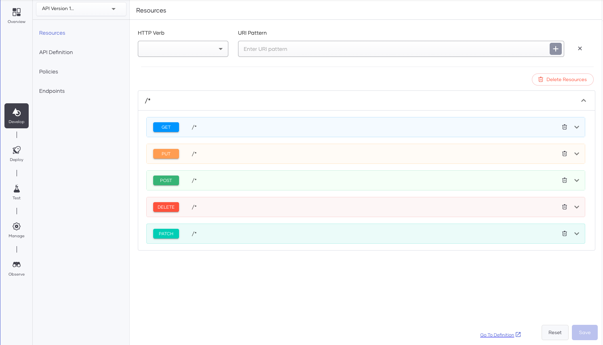
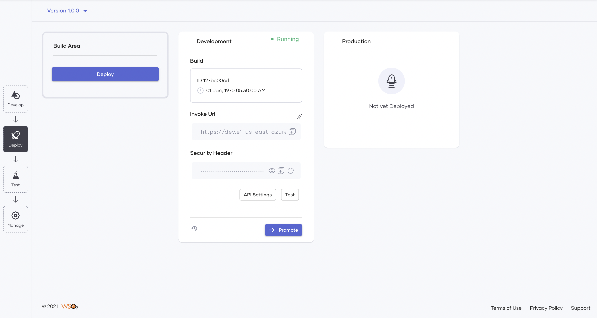
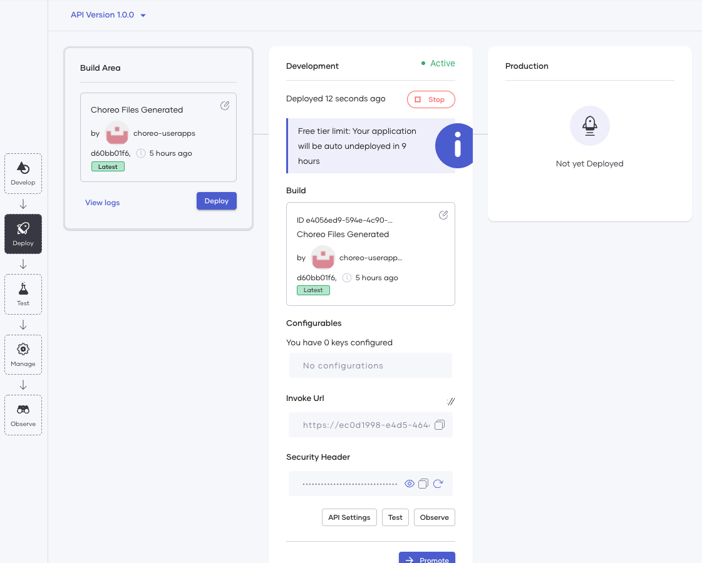
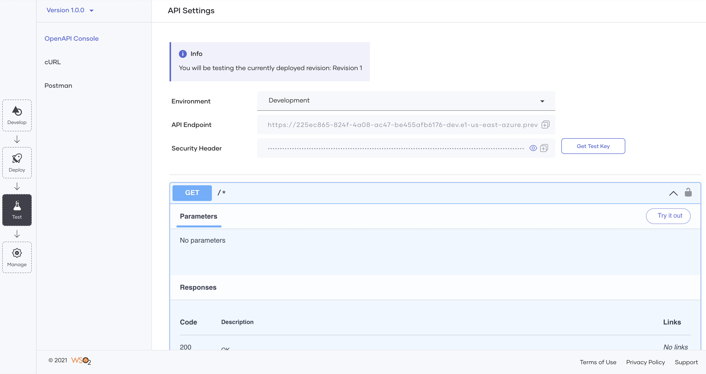
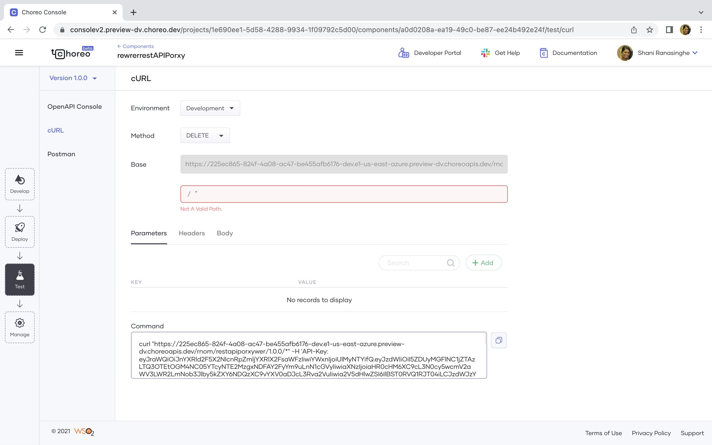
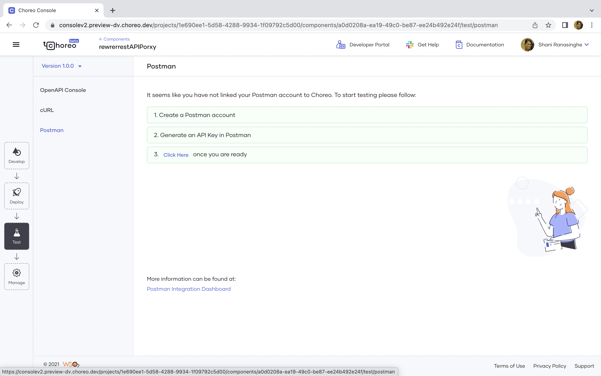
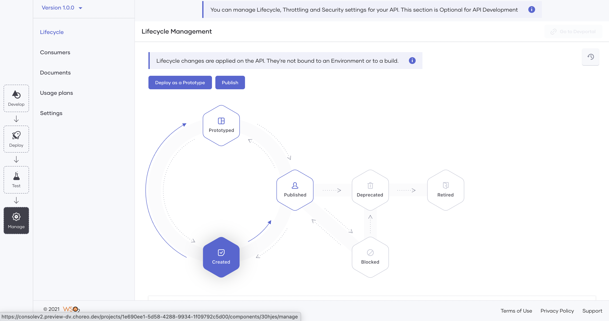
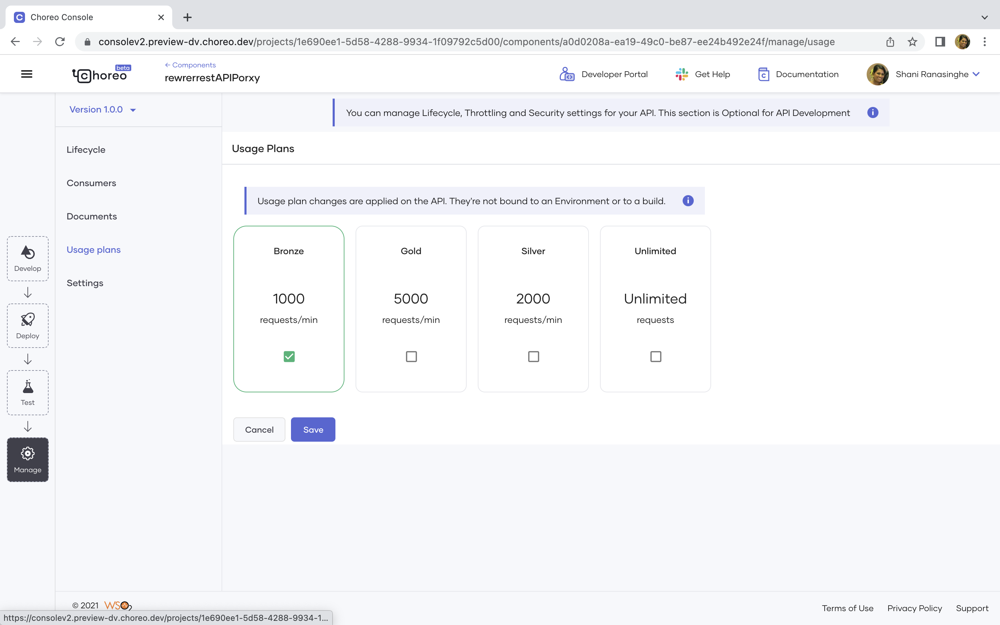

# REST API Proxy

Learn how you can expose an existing API through a REST API Proxy in Choreo and go on to manage it leveraging the full API Management capabilities of Choreo.

## What is a REST API Proxy?

A REST API Proxy is an API proxy that complies with the Representational State Transfer(REST) standards. The REST API proxy fronts the API and is the contact point for applications that want to consume the API. Although APIs decouples the backend and the application, an API alone cannot ensure security for the backend and the application by applying policies such as security, rate-limiting, etc. This is where a REST API Proxy comes into play. A REST API Proxy helps you manage the API by applying necessary security policies, access-control policies, and even collecting analytics. Fronting your unmanaged API by a REST API proxy gives your application the flexibility to make changes to the backend API without affecting the applications that consume them. 

A REST API Proxy exposes an endpoint that applications use to consume the API.

## Develop a REST API Proxy

Designing your REST API proxy from scratch involves declaring the resources and the methods the end-user applications will use to access the API. Choreo supports spec-driven API Proxy development. Therefore, it guides you visually via a Swagger editor to create REST API Proxies that comply with The Open API Specification (https://github.com/OAI/OpenAPI-Specification). It is the most widely used standard for declaring HTTP/REST APIs. Choreo also allows you to generate your OpenAPI specification through this editor.

Choreo allows you to easily expose your existing APIs via a REST API proxy and convert it to a managed API. You can create a REST API Proxy in Choreo in two ways:

- From scratch by using an existing endpoint 
- By importing an OpenAPI specification

### Designing a new REST API Proxy using an existing endpoint 

You can front your existing API with a REST API Proxy easily using Choreo. To design a new REST API Proxy, you need to create a REST API Proxy component and specify the API name, the base path, and the endpoint to create the basic API definition. Once Choreo creates the API definition, you can then define the resources by specifying the URI pattern, the HTTP methods, and optionally, any parameters:

{.cInlineImage-threeQuarter}

### Designing a new REST API Proxy by importing an OpenAPI specification

Choreo allows you to create a REST API Proxy by importing an Open API Specification or providing an URL to the Open API specification. Choreo will then extract the API name, base path, and endpoint. Choreo gives you the flexibility to change this information as required. Once you create the API Proxy, you can modify it by defining the resources, URI pattern, HTTP methods, and any parameters (optional).

Once you create an API proxy in Choreo, you can access the API definition of that API. Choreo also exposes the endpoints for the API where it maintains two gateway environments, production, and sandbox.

## Deploying a REST API Proxy

The following diagram illustrates the process of deploying an API in Choreo to the default development environment. 

{.cInlineImage-threeQuarter}

Choreo runs a professional, enterprise-grade CI/CD process to deploy APIs to its runtime(data plane) clusters. Under the hood, Choreo's data plane runs on a Kubernetes stack, hence benefits from all its features such as auto-scaling, auto-healing, secret management, liveness, readiness checks, and so on.

Once you deploy the REST API to the development environment, it is then exposed by an API Gateway with API security turned on. Developers get a testable URL for their API which they can use to verify the functionality of the API they implemented.

## Choreo environments

Choreo by default provides a development environment and a production environment in two separate Kubernetes clusters. Once you have deployed the API to the development environment and its functionality has been verified, developers can then promote their APIs to the production environment:

{.cInlineImage-threeQuarter}

Once you have promoted the API to production, Choreo then shows a second URL that developers can use in production applications to invoke the API.

## Test the REST API Proxy

Once you deploy your API, it is ready to be tested. Testing your REST API Proxy is an integral part of the spec-driven API development approach. Testing your API Proxy in Choreo can be done in 3 ways:

- Via the inbuilt OpenAPI Console
- Via cURL
- With a Postman integration

### In-built OpenAPI console

The in-built OpenAPI console is an interactive UI where you can test your API Proxy easily. You can test your APIs in the environments you deploy them in by selecting the environment. Choreo by default uses OAuth2.0 authentication. Therefore the OpenAPI console provides you the option to generate your test keys to test the APIs. Once you meet the pre-requisites, you can test the different resources you defined by specifying any parameters if needed. 

{.cInlineImage-threeQuarter}

### cURL

Choreo provides you with a cURL command based on the resource, method, and environment you want to test your REST API Proxy. You need to select the environment, the methods, specify the base path of the resource, and any parameters. Once you provide the information to Choreo, it will generate a cURL command with an API key in place for you to test. 

{.cInlineImage-threeQuarter}

### Postman

Choreo also allows you to integrate Postman. To integrate Postman, you need to create a postman account, generate an API Key from Postman, and include them in the Choreo UI. Once you integrate Postman successfully, you can import Postman workspaces, or create new workspaces and continue to test it on Choreo.

{.cInlineImage-threeQuarter}

## Manage the REST API Proxy

API Management is automatically turned on in REST API Proxies (and other APIs) on Choreo. Converting an unmanaged API to a managed API is a key advantage of exposing REST API Proxies. Developers can use its capabilities to manage the exposure of APIs to their consumers. Developers can configure the API’s security settings, set rate limits, associate usage plans, provide other documentation, and perform other related functions to govern the API. 

### Lifecycle of a REST API Proxy

Once you implement a REST API Proxy, it needs to be built, tested, and eventually put into production. Choreo executes a CI/CD pipeline that manages the API’s Lifecycle. Choreo stores the source code of APIs in a private Github repository for the user account. It also provides the capability for developers to hook in their own Github repositories containing the source code of their APIs(coming soon). The CI/CD pipeline in Choreo takes an API through the whole process, starting with code checkout, to compile, build, test, and finally to deployment.

{.cInlineImage-threeQuarter}

### Add documentation to the REST API Proxy

A well-designed API or API Proxy needs to be well-documented as well. The usability of the API/API Proxy is a deciding factor of its value. Many API developers find documenting an API a tedious task. Choreo makes documentation an easy task for developers by allowing different sources of documentation. Choreo allows you to add documentation to the REST API by specifying a URL, in Markdown format, importing a file, or by simply including inline documentation. 

### Usage Plans

The usage plan determines the number of requests allowed for the API per minute. Therefore, this is also the rate limit that applies to an API.

{.cInlineImage-threeQuarter}

### Settings

A well-managed API needs to have security policies and access-control policies in place. Setting rate-limiting policies will ensure:
- Your API is protected from common types of security attacks such as certain types of Denial Of Service (DOS) attacks
- Traffic is regulated and the resources are not exhausted

In addition to providing different usage plans, Choreo also allows you to set different rate-limiting policies against the API or each resource. While the API level rate-limiting will impact the whole API, resource-level rate-limiting gives you the flexibility to change the rate-limiting policy per operation based on the anticipated or analyzed usage.

{.cInlineImage-threeQuarter}

Choreo uses OAuth2.0 authentication.

{.cInlineImage-threeQuarter}

### Consumers

Consuming the published APIs is made easy with the inbuilt Choreo Developer Portal. Application developers can discover and invoke published APIs using the Choreo Developer Portal.

To learn more about the Choreo Developer Portal, see [Developer Portal](../../../consume/developer-portal.md).
