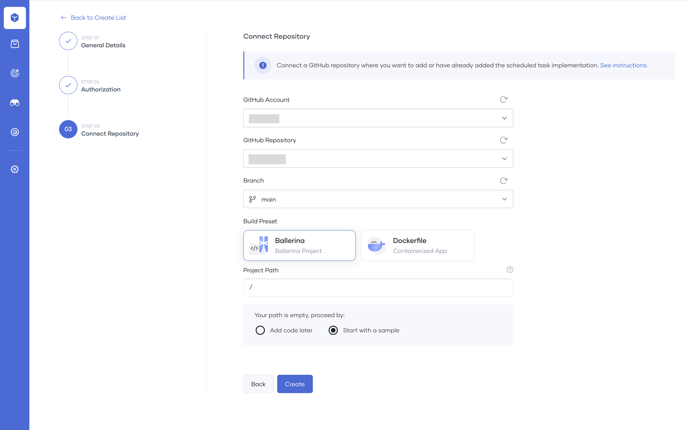
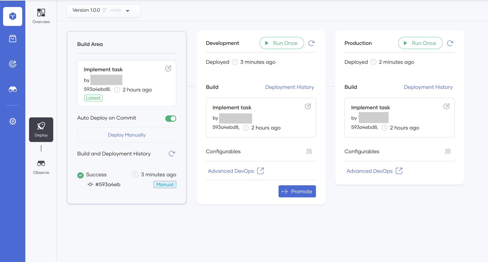

# Manual Trigger

Explore how to deploy and manage a Manual Trigger component in Choreo. 

## What is a manual trigger?

Manual triggers enable developers to initiate precise actions whenever required rather than relying on automated processes or scheduled events. This guarantees that important tasks are executed precisely when necessary and facilitates effective application testing and validation. Manual triggers empower developers to ensure their applications run as expected while providing more control and flexibility over code execution and enabling efficient debugging and optimization.

## Develop a manual trigger

To develop a manual trigger, a user must configure an action to perform upon request.

For example, if you require a health check log for an application, you would need to configure the following in the Manual Trigger component:
How to obtain the application's heartbeat. 
The criteria upon which the Manual Trigger component can assess whether the application is functioning correctly or not
A log that reports to the end-user whether the application is healthy or not.

There are two potential approaches to developing a manual trigger with the above configurations, as shown in the image below:

{.cInlineImage-half}

### Ballerina

If you have a manual trigger written in the [Ballerina Programming Language](https://ballerina.io), you can deploy it in Choreo. To do this, you must save it in a GitHub repository and connect that repository to Choreo.

#### Start with a sample

Developers using Choreo have the option to commence with a sample manual trigger. In case the connected repository lacks a manual trigger developed in the [Ballerina Programming Language](https://ballerina.io), and you have opted for the Ballerina preset, you may either add the code later to the repository or begin with a sample as shown in the image below:

{.cInlineImage-full}

Selecting the option to start with a sample triggers the creation of a pull request in your repository, which contains the implementation of the sample manual trigger. To proceed, you can merge the pull request.

### Dockerfile

If you have an existing manual trigger written in any programming language, you can deploy it in Choreo. To do this, you must generate a Docker image for the manual trigger and save the Dockerfile in a GitHub repository. When you connect this GitHub repository to Choreo, you can build the Dockerfile to pull the manual trigger implementation from the Docker image.

## Deploy a manual trigger

The following diagram illustrates the procedure to deploy a manual trigger in Choreo to the default development environment.

{.cInlineImage-small}

Choreo deploys APIs to its runtime (data plane) clusters using a professional, enterprise-grade CI/CD process. The data plane of Choreo runs on a Kubernetes stack, leveraging its capabilities such as auto-scaling, auto-healing, secret-management, liveness checks, readiness checks, and other features.

When you deploy the manual trigger, Choreo checks out your latest code, builds it, creates a Docker image, and starts it in a Kubernetes cluster managed by Choreo.

Once you deploy the manual trigger to the development environment, you can run the manual trigger by clicking **Run Once**. When you are ready to take the code to production, you can promote the deployment and enable the functionality for your consumers.

Through the **Deploy** view in Choreo, you can access the deployment logs and check the status of builds and deployments, enabling you to troubleshoot as needed.

## Choreo environments

Choreo provides a development environment and a production environment in two separate Kubernetes clusters by default. Once you have deployed the manual trigger to the development environment and verified whether it functions as expected, you can promote it to the production environment.

{.cInlineImage-full}

## Observe a manual trigger

Observing the success and failure rates of the requests sent to your manual trigger enables you to evaluate its performance. The observability view provides interactive graphs for visualizing performance statistics.

To learn more about how you can observe your manual trigger, see [Observability Overview](../../observe-and-analyze/observe/observability-overview.md).
