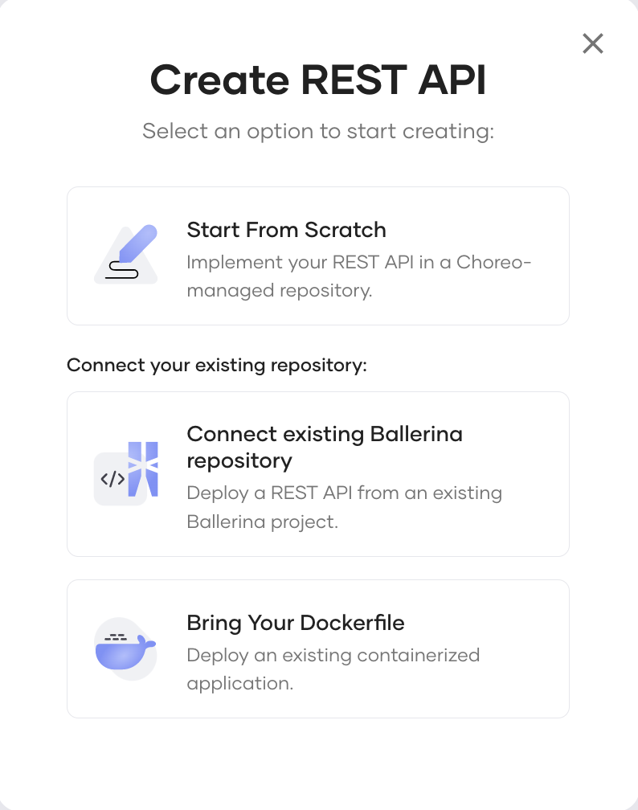

# REST APIs
Explore how you can easily design, develop, and manage REST APIs in Choreo to implement your business API strategy.

## What is a REST API?

A Representational State Transfer(REST) API is an Application Programming Interface(API) that complies with the constraints of REST architectural styles and principles. [REST is an architectural style](https://www.ics.uci.edu/~fielding/pubs/dissertation/rest_arch_style.htm) introduced by Dr. Roy Fielding in his doctoral dissertation in the year 2000. Dr.Roy initially designed it as a guide for the development of modern web architecture. Today, REST is widely adopted to create high-performance, stateless, and reliable APIs that various applications use.

## Designing a REST API

Designing a REST API is the process of declaring the resources, the appropriate HTTP verbs, paths, and input (request) and output (response) data formats to showcase the capabilities of the API. Designing an API based on a standard helps to do the design well and provide a consistent experience to the users of your API. [The OpenAPI Specification](https://github.com/OAI/OpenAPI-Specification) is the most widely used standard for declaring HTTP/REST APIs. The design of an API is a crucial factor that determines the usability and the value of the API. A well-designed API is profitable due to the ease of adoption. 

Choreo’s low-code editor allows developers to design (and develop) high-quality REST APIs with ease. To design a REST API in Choreo, you must create a REST API component. You can design a REST API from scratch by manually specifying the resources, the HTTP verbs, paths, and other required elements. The Choreo roadmap also includes the capability to design a REST API by importing an OpenAPI document, which will be available soon.

Choreo allows you to design your REST API in three possible ways as shown in the image below:

{.cInlineImage-small}

- **Start from scratch**

    You can design a REST API via Choreo’s low-code editor that allows developers to design (and develop) high-quality REST APIs with ease. This method involves designing the REST API from scratch by manually specifying the resources, the HTTP verbs, paths, and other required elements.
  
    {.cInlineImage-threeQuarter}

    Choreo allows developers to easily specify input and output data formats for each API resource:

    {.cInlineImage-threeQuarter}

    {.cInlineImage-threeQuarter}

- **Connect existing Ballerina repository**

    If you have a REST API written in the [Ballerina Programming Language](https://ballerina.io), you can deploy it in Choreo. To do this, you must save it in a private GitHub repository and connect that repository to Choreo.

- **Bring your Dockerfile**

  If you have an existing REST API written in any programming language, you can deploy it in Choreo. To do this, you must generate a Docker image for the REST API and save the Dockerfile in a private GitHub repository. When you connect this GitHub repository to Choreo, you can build the Dockerfile to pull the REST API implementation from the Docker image.

## Developing a REST API

Choreo supports spec-driven API development. Once you have carefully designed and defined your API, you can start implementing the functionality of your API. Choreo allows you to link a GitHub project when creating the REST API. You can implement your API as a [Ballerina](https://ballerina.io/) project or as in any language as a Docker container and store in the GitHub repo. Alternatively, if you are selecting the Ballerina preset when creating the REST API, you can link an empty GitHub repository, and then proceed to implement it before deploying the REST API. 

WSO2 provides a [Ballerina extension for Visual Studio Code](https://marketplace.visualstudio.com/items?itemName=WSO2.ballerina) which you can use to eaasily develop your REST API as a Ballerina project.

## Lifecycle of a REST API

Once you implement a REST API, it needs to be built, tested, and eventually put into production. You can apply any of the six API lifecycles states (i.e., created, pre-released, published, blocked, deprecated, and retired) while adhering to their respective lifecycle flows.

When you publish an API, you can also publish a connector for that API to make it available on the Choreo Marketplace.

## Deploying a REST API

The following diagram illustrates the procedure to deploy an API in Choreo to the default development environment.

{.cInlineImage-small}

Choreo runs a professional, enterprise-grade CI/CD process to deploy APIs to their runtime(data plane) clusters. The data plane of Choreo runs on a Kubernetes stack under the hood. Therefore, you can benefit from its features such as auto-scaling, auto-healing, secret-management, liveness and readiness checks, etc.

Choreo provides the capability for developers to connect their own GitHub repositories containing the source code of their APIs. The CI/CD pipeline in Choreo takes an API through the complete process, starting from code checkout to compile, build, test, and finally deploy.

Once you deploy a REST API to the development environment, it gets exposed through an API Gateway with API security enabled. At this time, Choreo provides a test URL for the API, which you can use to verify the functionality of the API.

## Choreo environments

Choreo provides a development environment by default and a production environment in two separate Kubernetes clusters. Once you deploy an API to the development environment and verify its functionality, you can promote the API to the production environment.

{.cInlineImage-threeQuarter}

Once you promote an API to production, Choreo provides a second URL that you can use in a production application to invoke the API.

## API management

Choreo provides API management capabilities by default for REST APIs (and other APIs) so that you can manage the exposure of APIs to consumers. Choreo API management capabilities also allow you to configure API security settings, set rate limits, associate usage plans, provide other documentation, and perform other related functions to govern the API. The following image shows how you can execute the consumer-facing lifecycle of an API.

{.cInlineImage-threeQuarter}

The inbuilt Choreo Developer Portal makes it easy for consumers to consume published APIs. Application developers can discover and invoke published APIs via the Choreo Developer Portal. To learn more about the Choreo Developer portal, see [Developer Portal](../../consume/developer-portal.md)).

## Observability

Choreo allows you to visualize and monitor the performance of REST APIs deployed on Choreo. Choreo has in-built support for viewing the overall status, latencies, throughput data, diagnostic data, and logs. Developers can efficiently detect and troubleshoot anomalies in REST APIs using  Choreo Observability.

For more information about the observability capabilities of Choreo, see [Observability](../../observe-and-analyze/observe/observability-overview.md).

## Business insights

Once you take your APIs to production, you need to constantly analyze the APIs to get a good understanding of their usage.

