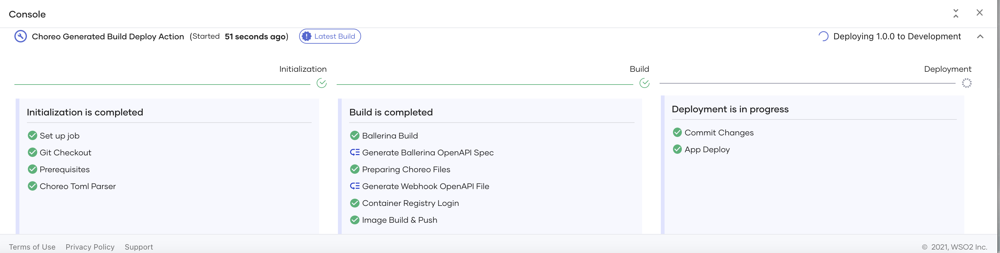

# Scheduled Tasks

Learn how to use scheduled tasks to execute routine tasks at specified time intervals.

## What is a scheduled task?

A scheduled task performs a routine action at scheduled time intervals. Following are examples of scenarios where you can schedule tasks:

- Logging a session time-out message for a user at a specific time interval

- Publishing a summary of GitHub issues (i.e., with details such as the number of GitHub issues in each status) as a message in a group chat window of a team every day at a specific time

- Periodically checking whether an application is active or not

## Develop a scheduled task

Developing a scheduled task refers to configuring an action to be executed.

!!! tip
    The development stage does not require you to specify the time interval at which the system needs to execute the action of the scheduled task. You need to provide it only when you deploy the Scheduled Task component.

e.g., If you need to schedule a health check log for an application, you may need to configure the following:

- How the Scheduled Task component gets the heartbeat of the application that it is monitoring

- The conditions based on which the Scheduled Task component can determine whether the application is healthy or not

- A log that indicates whether the application is healthy or not to the end-user

You can develop a scheduled task with such configurations in three possible ways as shown in the image below:

{.cInlineImage-half}

### Start from scratch

You can design a scheduled task via Choreo’s low-code editor that allows developers to design scheduled tasks with ease. This method involves designing the scheduled tasks from scratch by manually specifying the resources, the HTTP verbs, paths, and other required elements. You can do so in the low-code view or the pro-code view.

#### Low-code view

{.cInlineImage-full}

The scheduled task in the image above checks for the heartbeat of an application via the `HealthCheckAPI` connector. It logs `Healthy` if the application responds with a heartbeat or `Unhealthy` if the application does not respond.

The low-code programming model allows developers to use commonly known programming constructs such as loops, conditions(if/else, variable declarations and assignments), logs, data transformations(visual data mapping), etc., in a graphical editor. It also allows developers to connect to any built-in or custom-developed connectors.

The main advantage of the low-code programming view is that it increases developer productivity by multiple folds by eliminating the need to write complex code. As developers use constructs on the low-code editor to implement the integration logic for the scheduled task, the IDE automatically writes the corresponding [Ballerina](https://ballerina.io) source code of the scheduled task, speeding up the developer's learning process significantly and boosting overall productivity.

#### Pro-code view

In addition to the low-code view, Choreo provides a pro-code view for implementing the functionality of a scheduled task. You can switch between the two flows at any time. Choreo's online IDE allows viewing the low-code and pro-code editors side-by-side as shown below:

{.cInlineImage-full}

Choreo gives the developers the flexibility to implement the complete scheduled task using the pro-code view or to use the pro-code view for only some parts of the implementation and then use the low-code view for the rest, based on their preference. Choreo treats the source code of the scheduled task as the single source of truth irrespective of whether it is auto-generated from the low-code implementation or written manually by the developer. Therefore, there are no limitations or restrictions on which view developers may choose to implement the functionality of the scheduled task.

### Connect existing Ballerina repository

If you have a scheduled task written in the [Ballerina Programming Language](https://ballerina.io), you can deploy it in Choreo. To do this, you must save it in a private GitHub repository and connect that repository to Choreo.

### Bring your Dockerfile

If you have an existing scheduled task written in any programming language, you can deploy it in Choreo. To do this, you must generate a Docker image for the scheduled task and save the Dockerfile in a private GitHub repository. When you connect this GitHub repository to Choreo, you can build the Dockerfile to pull the scheduled task implementation from the Docker image.

## Deploy a scheduled task

At the deployment stage, Choreo prompts you to specify the time interval at which it should run the scheduled task to execute the configured action.

{.cInlineImage-full}

Once you specify the time interval and proceed to deploy, Choreo starts the process of deploying an API to the default development environment as shown below:

{.cInlineImage-full}

Choreo runs a professional, enterprise-grade CI/CD process to deploy APIs to its runtime(data plane) clusters. Under the hood, the data plane of Choreo runs on a Kubernetes stack, benefitting from all its features such as auto-scaling, auto-healing, secret management, liveness, readiness checks, etc.

Once you deploy the scheduled task to the development environment, the system exposes it through an API Gateway with API security turned on.

When you deploy the scheduled task to the development environment, it is active in the developer environment. When you are ready to take the code to production, you can promote the deployment and enable the functionality for your consumers.

Choreo allows you to view the deployment logs through the **Deploy** view. Therefore you can troubleshoot and view the status of the builds and deployment.

## Choreo environments

Choreo provides a development environment and a production environment in two separate Kubernetes clusters by default. Once you have deployed the scheduled task to the development environment and verified whether it functions as expected, you can promote it to the production environment.

{.cInlineImage-full}

If required, you can change the time interval of the scheduled task before you promote it to the production environment.

## Observe a scheduled task

You can assess the performance of your scheduled task by observing the success and failure rates of the requests sent to it. The observability view allows you to visualize the performance statistics via interactive graphs.

To learn more about how you can observe your scheduled task, see [Observability Overview](../../observe-and-analyze/observe/observability-overview.md).
