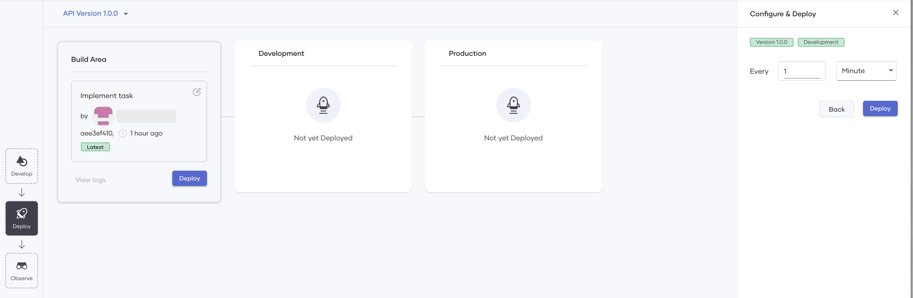
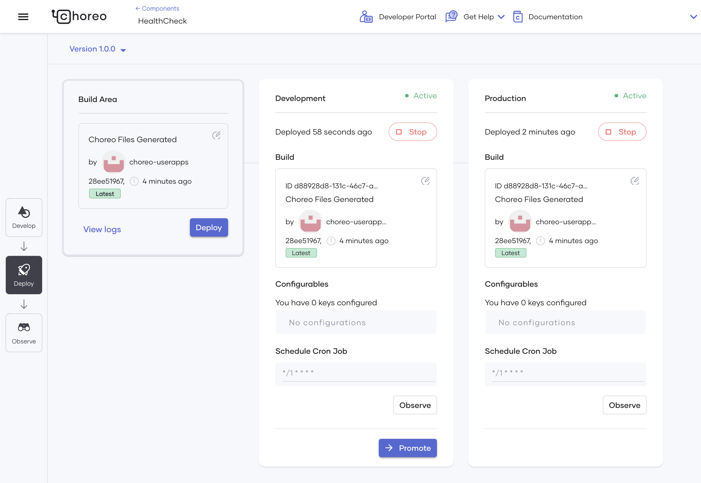

# Scheduled Trigger

Explore how to deploy and manage a Scheduled Trigger component in Choreo. 

## What is a scheduled trigger?

Scheduled triggers in Choreo allow developers to automate tasks such as data backups, system maintenance, or updates by invoking a predefined function or set of functions at a specified time.

Developers can configure scheduled triggers to run regularly, such as daily, weekly, or monthly, or they can set them to execute at a specific date and time. This flexibility makes them a vital tool for managing complex applications by synchronizing multiple components.

Automating repetitive tasks through scheduled triggers reduces workload and provides more time for strategic projects. They also ensure the timely and efficient execution of critical tasks, minimize the risk of human error, and reduce downtime in fast-paced business environments.

Following are some sample scenarios where you can use scheduled triggers:

Automatically logging a message for a user when their session times out at a specific interval.
Publishing a summary of GitHub issues (including details such as the number of issues in each status) as a message in a team's group chat window at a specific time each day.
Periodically checking an application's health to ensure it is functioning as expected.

## Develop a scheduled trigger

To develop a scheduled trigger, you must configure an action to execute at a specific time or interval.

!!! tip
    In the development stage, it is not necessary to specify the time interval for executing the action of the scheduled trigger. It only needs to be provided when deploying the Scheduled Trigger component.

For example, if you require a health check log for an application, you would need to configure the following:

How the Scheduled Trigger component receives the heartbeat of the monitored application.
The criteria the Scheduled Trigger component uses to determine the application's health status.
An end-user log indicating whether the application is healthy or not.

There are two potential approaches to developing a manual trigger with the above configurations, as shown in the image below:

{.cInlineImage-small}

### Ballerina

If you have a scheduled trigger written in the [Ballerina Programming Language](https://ballerina.io), you can deploy it in Choreo. To do this, you must save it in a GitHub repository and connect that repository to Choreo.

#### Start with a sample

Choreo gives the developers the flexibility to start with a sample scheduled trigger. In case the connected repository lacks a manual trigger developed in the [Ballerina Programming Language](https://ballerina.io), and you have opted for the Ballerina preset, you may either add the code later to the repository or begin with a sample as shown in the image below:

{.cInlineImage-full}

Selecting the option to start with a sample triggers the creation of a pull request in your repository, which contains the implementation of the sample manual trigger. To proceed, you can merge the pull request.

### Dockerfile

To deploy an existing scheduled trigger written in any programming language to Choreo, you must generate a Docker image for the scheduled trigger and save the Dockerfile in a GitHub repository. Once you connect this repository to Choreo, you can build the Dockerfile to pull the scheduled trigger implementation from the Docker image.

## Deploy a scheduled trigger

During the deployment stage, Choreo prompts you to specify the time interval for the scheduled trigger to run and execute the configured action. You can define the time interval by specifying values for the respective fields or write a custom cron expression to configure an advanced scheduling setting.

{.cInlineImage-full}

Once you specify the time interval and proceed to deploy, Choreo starts the process of deploying an API to the default development environment as shown below:

{.cInlineImage-small}

Choreo runs a professional, enterprise-grade CI/CD process to deploy APIs to its runtime(data plane) clusters. Under the hood, the data plane of Choreo runs on a Kubernetes stack, benefitting from all its features such as auto-scaling, auto-healing, secret management, liveness, readiness checks, etc.

Once you deploy the scheduled trigger, Choreo checks out your latest code, builds it, creates a Docker image, and starts it in a Kubernetes cluster managed by Choreo.

When you deploy the scheduled trigger to the development environment, it is active in the developer environment. When you are ready to take the code to production, you can promote the deployment and enable the functionality for your consumers.

Through the **Deploy** view in Choreo, you can access the deployment logs and check the status of builds and deployments, enabling you to troubleshoot as needed.

## Choreo environments

Choreo provides a development environment and a production environment in two separate Kubernetes clusters by default. Once you have deployed the scheduled trigger to the development environment and verified whether it functions as expected, you can promote it to the production environment.

{.cInlineImage-threeQuarter}

If required, you can change the time interval of the scheduled trigger before you promote it to the production environment.

## Observe a scheduled trigger

Observing the success and failure rates of the requests sent to your scheduled trigger enables you to evaluate its performance. The observability view provides interactive graphs for visualizing performance statistics.

To learn more about how you can observe your scheduled trigger, see [Observability Overview](../../observe-and-analyze/observe/observability-overview.md).
