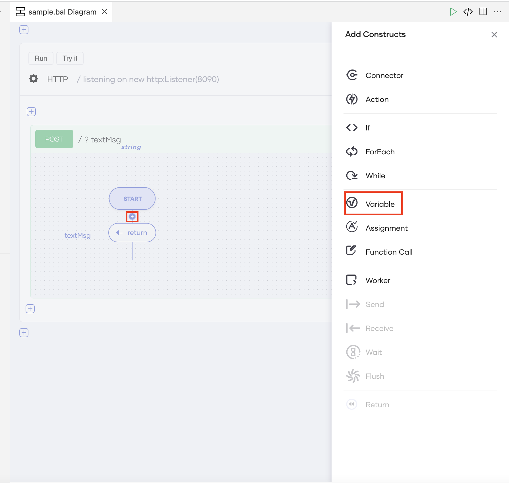
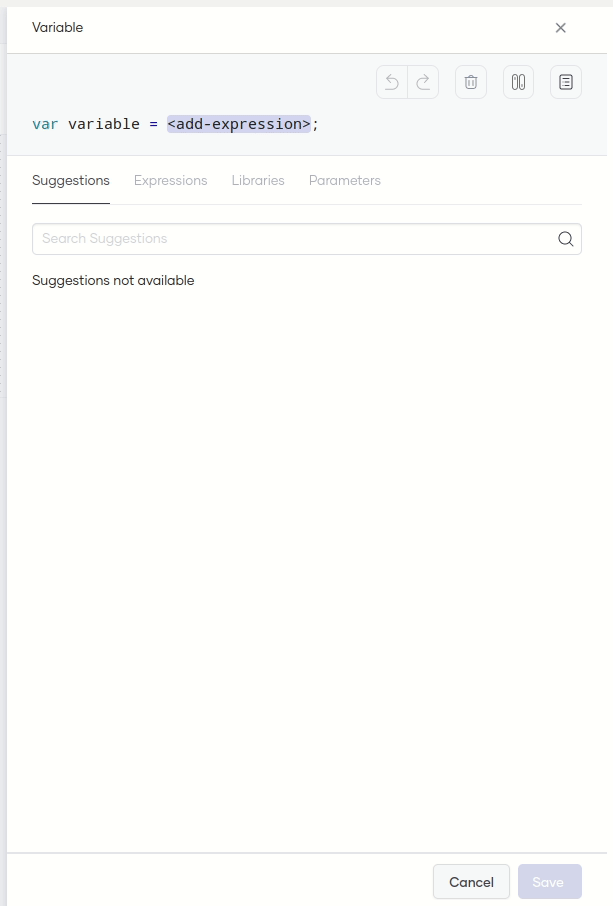
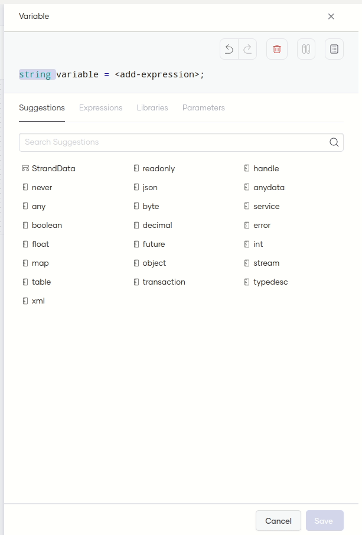
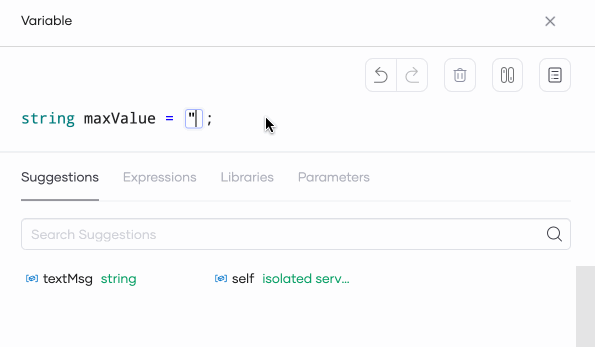
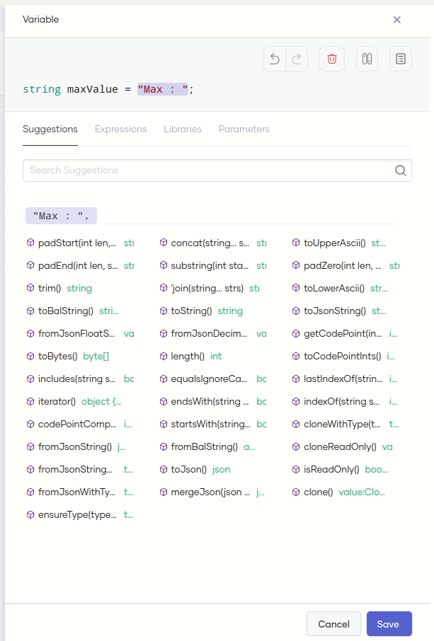
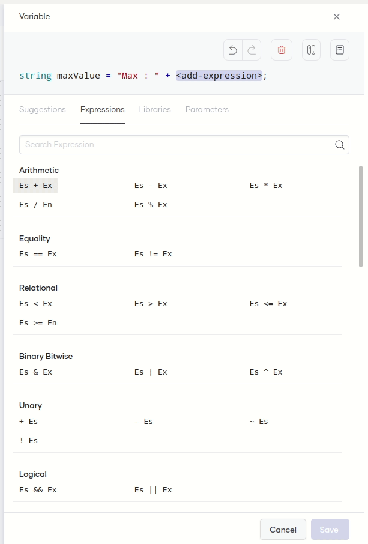
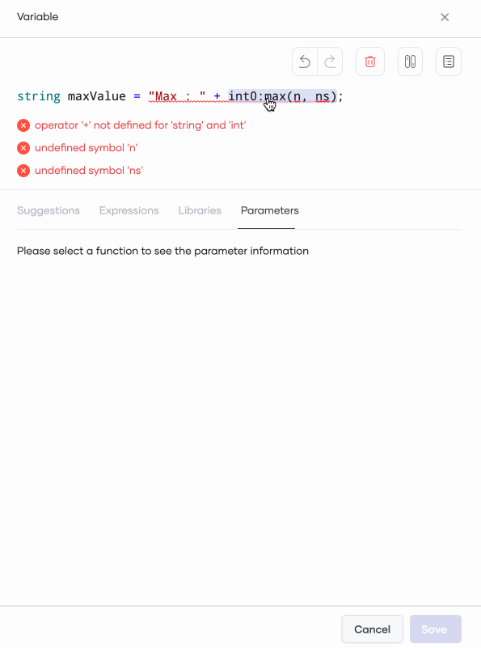
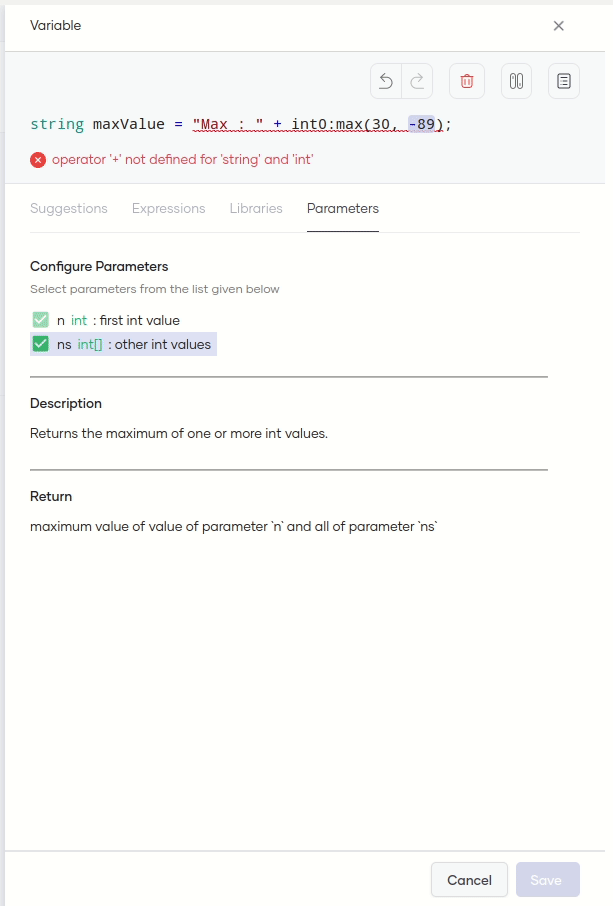

# Construct Statements

The Choreo Web Editor allows you to construct Ballerina statements depending on the use case you want to build. It is an intuitive visual editor that is easy to use even without an in-depth knowledge of the [Ballerina Programming Language](https://ballerina.io/).

It provides the following:

- Context-based suggestions

- Ballerina libraries (standard libraries and language libraries)

- Pre-defined expression templates

- Documentation for functions and methods to easily configure parameters

This guide walks you through the steps to build the following statement using the editing capabilities in the Choreo Web Editor.

```
string maxValue = "Max : " + int0:max(30, -89).toString();
```

The above is a variable statement named `maxValue` that derives the maximum value in a list of two integers and passes the value in string format (for example, as `"Max : 30"` ).

!!! info "Access the Choreo Web Editor"
    If you have not already accessed the Choreo Web Editor, follow these steps:</br></br>
     1. Sign in to the Choreo Console at [https://console.choreo.dev](https://console.choreo.dev).</br></br> 
     2. On the **Home** page, scroll to the **Get started with a template** section. On the **Echo Service** template, click **Get Started**.</br></br>
        The REST API created via the template opens on a separate page.</br></br>
     3. Click **Edit Code**. The Web Editor opens.

To build the statement, follow these steps:

!!! tip
    If you want to make changes to the content you have added to the statement that you are creating, you can undo and redo your actions via the relevant icons on the top right of the toolbar. You can also remove content via the icon for deleting.

1. On the low-code diagram, click **+**. Then click **Variable** in the **Add Constructs** pane that opens.

    !!! info
        From here onwards, let's use the term Statement Editor to refer to this collection of panes that help you to add and edit statements.

    {.cInlineImage-full}

    The **Variable** pane opens displaying the syntax for a variable statement with **`<add-expression>`** selected by default.

2. Click the **var** type descriptor on the statement and click **string** on the **Suggestions** tab.

    !!! info
        The **Suggestions** tab provides contextual suggestions based on the selected item. The **Suggestions** tab currently lists variable type suggestions because you selected the type descriptor.    

    {.cInlineImage-half}

    Here, you are specifying that the variable value is a string.

3. To edit the variable name, double-click **`variable`** and type `maxValue` in the text box.

    !!! info
        Another way to make a part of a statement editable is to click on the required statement component and press  **Enter**/**Return**.

    {.cInlineImage-half}

4. Double click **`<add-expression>`** and type `"Max : "` in the text box.

    !!! info
        To navigate from one item on the statement to another, you can also press **Tab** or **Shift** + **Tab**.

    {.cInlineImage-half}

    Here, you are entering static text as a part of the variable value.

5. Click **Expressions**, and under the **Arithmetic** section, click the **Es + Ex** expression.

    !!! info
        The **Expressions** tab lists all the pre-defined templates that you can use to define complex expressions.

    {.cInlineImage-half}

    In the `Es + Ex` expression template, `Es` refers to the existing expression you clicked and selected. `+ Ex` combines another expression with `Es`.

6. Click **Libraries** and search for `max`. In the filtered list, click  **lang.int:max**.

    !!! info
        The **Libraries** tab lists all the Ballerina standard and language libraries.

    {.cInlineImage-half}

    `lang.int:max` is a Ballerina standard library for deriving the maximum value.

     You will see some diagnostics generated for the library you selected. Move on to the next step to resolve them. 

7. Click the **int0:max(n,ns)** function. 

     When you select a function or a method call, the **Parameters** tab opens by default. This tab displays information about the selected function or method call, including details about parameters, descriptions, and return type descriptions. On this tab, you can easily add parameters to the expression by selecting the checkboxes for the relevant parameters.

     {.cInlineImage-half}

      !!! note
          When a function or a method call requires a particular parameter to work, the Statement Editor selects the appropriate parameter by default and does not allow you to clear it.

8. Change the **n** and **ns** parameter values to integers. To make each parameter value editable, you can double-click the corresponding **`<add_expression>`** on the variable statement. Let's change them as follows:

     | **Parameter** | **Value** |
     |---------------|-----------|
     | **n**         | **`30`**  |
     | **ns**        | **`-89`** |

9. Select **int0:max(30,-89)** and click **Suggestions**. Click **toString()** in the suggestions list to convert the value that the expression derived to a string format.

     {.cInlineImage-half}

     Note that the Statement Editor has cleared all the diagnostics messages, indicating that the statement is valid.

     You will see the variable statement to be as follows:

     ```
     string maxValue = "Max : " + int0:max(30, -89).toString();
     ```
    
Congratulations! You have constructed a valid statement via the Statement Editor!

You can click **Save** to add the variable statement to the low-code diagram.


