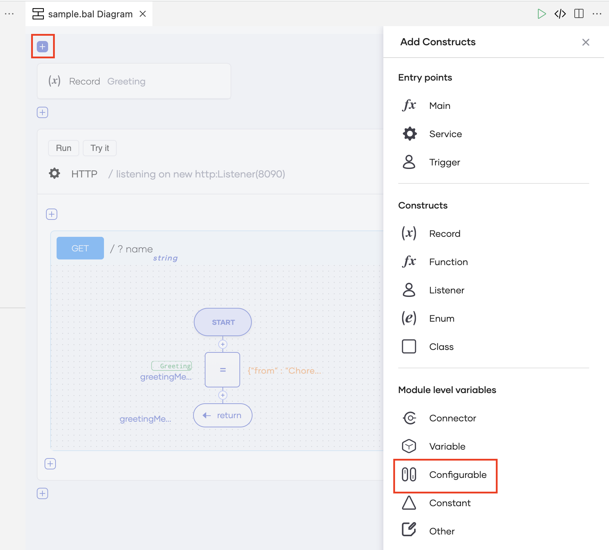
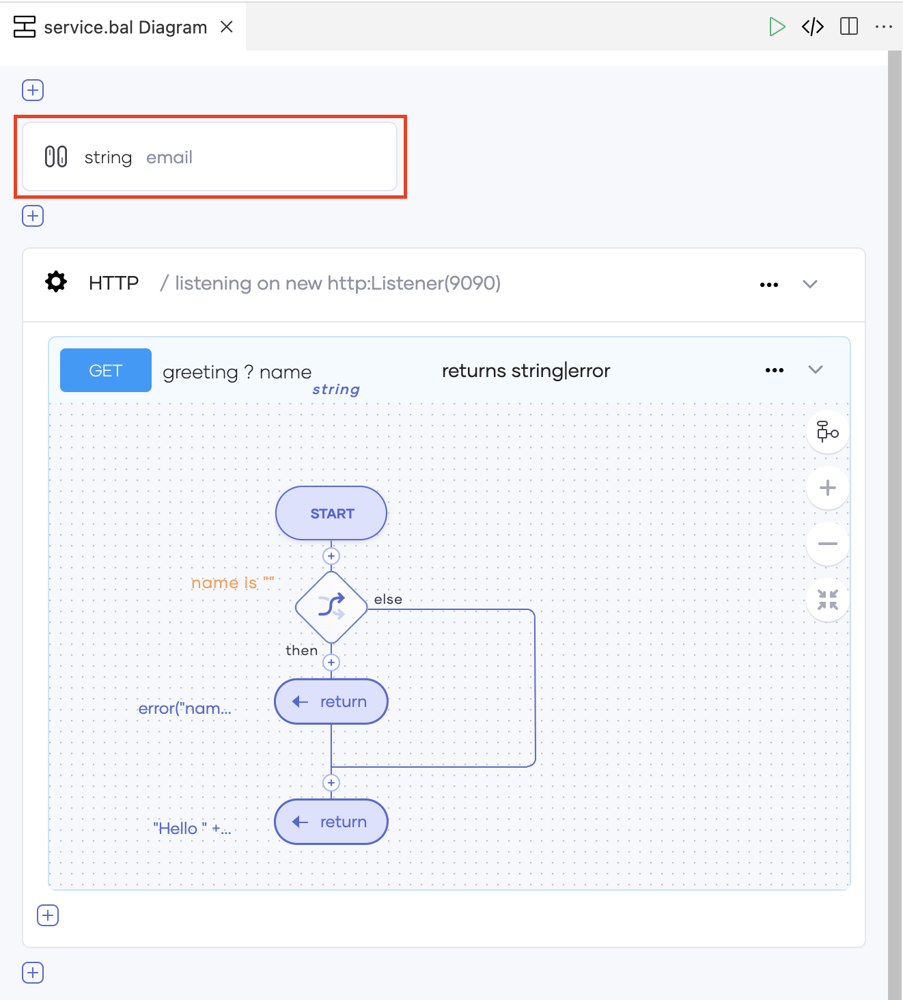
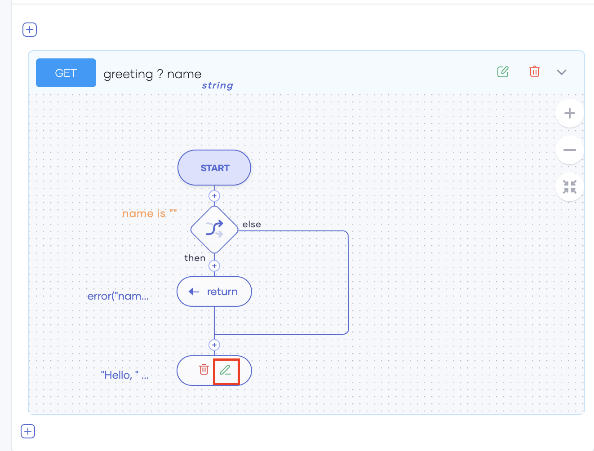
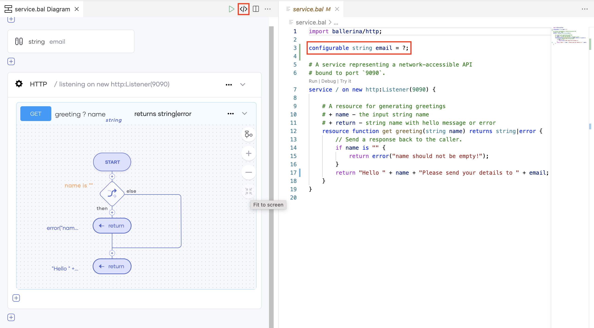
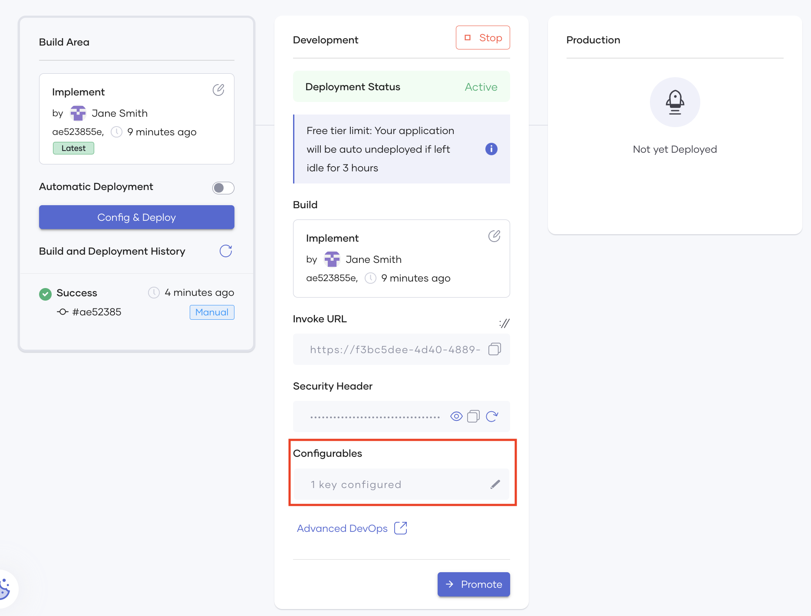
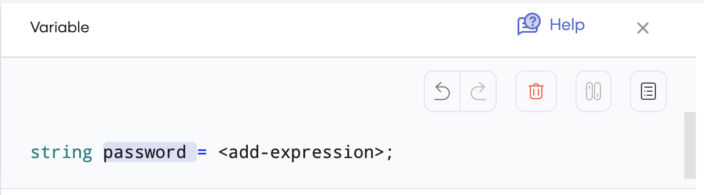
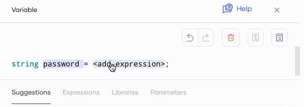

# Define Configurable Variables

A configurable variable allows you to define a parameter for which you specify the value when you deploy the component that includes it.

You may want to define a configurable variable in the following scenarios:

- A Choreo component you create is accessible to all the members of your organization. If a specific variable value contains sensitive information, you can define it as a configurable variable to avoid exposing the value in the component implementation.<br/>

    For example, consider a REST API that returns a password to users whose requests meet specific conditions. In this scenario, you may not want to expose that password to everyone who can access the REST API implementation.

- You may need to provide different values for a specific variable.

    For example, each component user may want to provide a unique email address to receive the response.


To understand how to define a configurable variable, let's  create a REST API that returns a configurable email address to its users  as follows:

1. First, let's create the component in which you can add a configurable variable:

    1. Sign in to the Choreo Console at https://console.choreo.dev.

    2. Under **Create a New Component**, click **REST API** to start creating a REST API.
   
    3. In the **Create REST API** dialog, click **Start From Scratch**. Next, enter a unique name for the REST API and click **Create**.
   
        !!! Info
            To learn how to create a REST API with more details, try the .

    4. Once the **Overview** page opens, click **Edit Code** to open the Web Editor.

2. Now let's define the email address you want to return as a configurable by following these sub-steps:

    1. Click the first **+** icon on the page, and in the **Add Constructs** pane that appears, click **Configurable**.
   
        {.cInlineImage-threeQuarters}
    
    2. The **Configurable** pane displays the configurable template. Let's use this template and define the configurable.
   
        1. By default, the data type of the configurable variable is `int`. To change it to a different type, click **`int`**, and click the required type in the list of suggestions. For this guide, click **string**.
       
        2. To enter a name for the configurable variable, double-click **`<add-config-name>`** and enter the required text (e.g., `email`).
       
        3. By default, the value of the configurable variable is **`?`**. This value specifies that the configurable field should appear as an empty field at deployment. For this guide, let's leave it unchanged.

        4. Click **Save**. The Web Editor displays the added configurable as shown in the image below:

            {.cInlineImage-half}
   
3. Now let's update the last return statement to return the configurable variable you added instead of the default greeting. To do this, follow these sub-steps:

    1. Click the edit icon on the last return statement (shown in the image below).

        {.cInlineImage-half}

        This **Return** pane opens, displaying the existing return statement.

    2. Click **`name`** and then click **Expressions**.
   
    3. Under **Arithmetic**, click **Es + Ex**.
   
    4. Double-click **`add-expression`**, and enter `"Please email your application to "`.
   
    5. Click **Es + Ex** again, and then click **Suggestions**.
   
    6. In the list of suggestions, click **email**. Here, you are selecting the configurable variable that you previously added.

    7. Click **Save**.
   
        You have completed editing the REST API configuration.

4. To view the code view of the REST API, click the icon marked in the image below:

    {.cInlineImage-full}

    You will see the configurable you added in the code view as `configurable string email = ?;`.

5. Commit and push the REST API changes you made to GitHub so that they are also available in the Choreo Console. For instructions, see [Create Your First REST API - Step 1.5: Commit the REST API to GitHub](https://wso2.com/choreo/docs/get-started/tutorials/create-your-first-rest-api/#step-15-commit-the-rest-api-to-github).

6. Open the browser tab in which you are running the Choreo Console and refresh it.

7. Click **Deploy** in the left navigation menu for your REST API.

8. To deploy the REST API, click **Config & Deploy**. 

    The **Configure & Deploy** pane opens on the left of the page. The **email** field in this pane is the configurable you added to the REST API implementation. Choreo saves the value you enter here in an Azure key vault.

9. In the **email** field, enter any email address.

10. Click **Deploy**.

     Once Choreo completes the deployment, the **Configurables** field indicates that the REST API has a configured key.

      {.cInlineImage-full}

      If you want to enter a different value for the configurable, you can click on the edit icon in this field and repeat steps 9-10.

Now you have tried out adding a basic configurable. Proceed to the subsections to learn how to add configurables with default values and define configurable variables as you develop your components.

## Define a configurable with a default value

When you add a configurable to your component in the Web Editor, you can enter a specific value as the configurable value instead of `?` as shown below.

```
configurable <VARIABLE_TYPE> <VARIABLE_NAME> = <DEFAULT_VALUE>
```
e.g., If you want to add a configurable named password of which the value should be in string format with `secret` as the default value, you can add the configurable statement as follows:

```
configurable string password = "secret";
```

## Define configurable values as you develop

As you develop your component, you may identify a parameter for which the value needs to be configurable and for which you have not already defined the required configurable. Then you can access the configurable variable template while defining/editing the required statement. For example, if you are adding a variable and you want its value to be configurable, you can follow these steps:

1. Update the name and the type of the variable as required. For example, you can enter `string` as the variable type and `password` as the variable name.

    {.cInlineImage-half}

2. To enter the variable value as a configurable, click **`<add-expression>`** and then click the **Configurable** icon.

    {.cInlineImage-half}

    The template for the configurable variable appears. You can update the configurable type, name, and value as required.
