# Map Data

The data mapping feature of Choreo allows you to convert and transform one data format to another, change the structure of the data, or perform both.
You can configure a data mapping for a component when you develop it in the Web Editor.

This guide walks you through a simple use case where you will input student data in a specific structure and convert and transform the student data to a different format.

Let's Start!

### Step 1: Add a REST API

First, let's add a new REST API. To do this, follow the steps given below:

1. Sign in to the Choreo Console at [https://console.choreo.dev](https://console.choreo.dev).

2. On the **Home** page, scroll to the **Create from a sample** section. On the **Echo Service** template, click **Get Started**.

    The REST API created via the template opens on a separate page.</br></br>3. Click **Edit Code**.

3. Let's start fresh by cleaning up the default implementation to implement our data mapping. To clean up, remove the default resource of the REST API by clicking its Delete icon.

    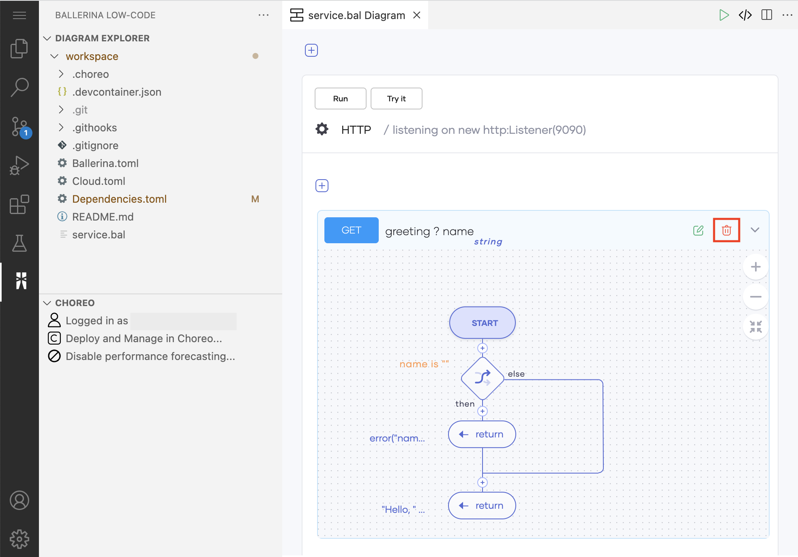{.cInlineImage-half}

Now you can add a data mapping to this REST API and design a REST API implementation that includes the data mapping.

### Step 2: Add a basic data mapping

Let's first create a basic data mapping that maps a parameter named `id`  nested under `person` in the input to a parameter with the same name that is not nested in the output.

To do this, follow the steps given below:

1. Click the first **+** icon on the page, and then click **Data Mapper** in the **Add Constructs** pane.

    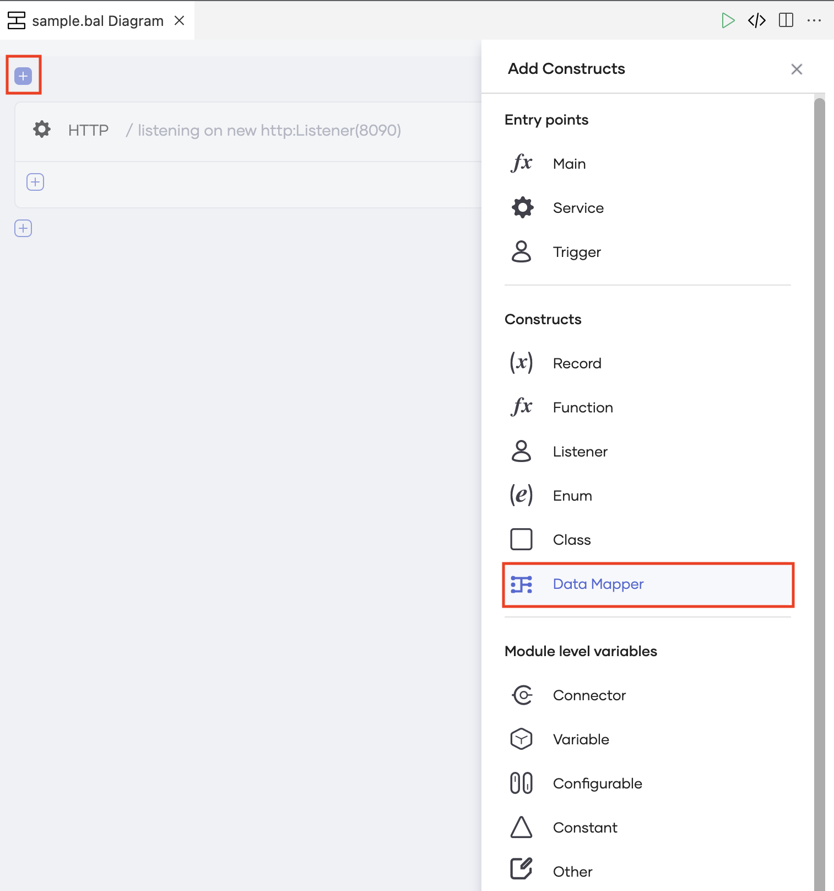{.cInlineImage-half}

    The **Data Mapper** pane opens.

2. Enter a unique name for the data mapper (for example, `transform`).

3. Add two input  records in `JSON` format by following the steps given below:

    1. Under **Inputs**, click **+ New Record**.
   
    2. Click  **Import a JSON**.
   
    3. In the **Name** field, enter a name for the input record. For this example, let's enter `personDetails` as the name.
   
    4. In the **Sample JSON** field, paste the following JSON content. (This is a sample student record.)

        ```json
         {
             "person": {
                 "id": 1001,
                 "firstName": "Vinnie",
                 "lastName": "Hickman",
                 "age": 15
             }
         }
        ```
       
    5. Click **Save**.
   
    6. Similarly, add another JSON record under **Inputs** named `courseDetails` with the following content.

        ```json
         {
             "course": [
                 {
                     "id": "CS6002",
                     "name": "Computation Structures",
                     "credits": 4
                 },
                 {
                     "id": "CS6003",
                     "name": "Circuits and Electronics",
                     "credits": 3
                 },
                 {
                     "id": "CS6004",
                     "name": "Signals and Systems",
                     "credits": 3
                 }
            ]
         }
        ```        
   
   
4. Add the output JSON by following the steps given below:

    1. Under **Output Type**, click **+ New Record**.
   
    2. Click  **Import a JSON**.
   
    3. In the **Name**** field, enter  `studentDetails`.
   
    4. In the **Sample JSON** field, paste the following JSON content that has the format in which Choreo should generate the output.

        ```json
         {
             "id": 1001,
             "fullName": "Vinnie Hickman",
             "age": "15",
             "courses": [
                 {"title": "CS6002 - Computation Structures", "credits": 4},
                 {"title": "CS6003 - Circuits and Electronics", "credits": 3},
                 {"title": "CS6004 - Signals and Systems", "credits": 3}
             ],
             "totalCredits": 10
         }
        ```
       
    5. Click **Save**.
   
5. Click **Save** again to save the data mapper.

### Step 3: Configure the data mapper

In this step, you will map parameters in the input JSON with parameters in the output JSON. You will learn how to do basic mappings, troubleshoot mapping errors, and map arrays.

#### Basic mapping

To map the person ID with the student ID, select **id** under **personDetails**, and then select **id** under **studentDetails** as shown below:

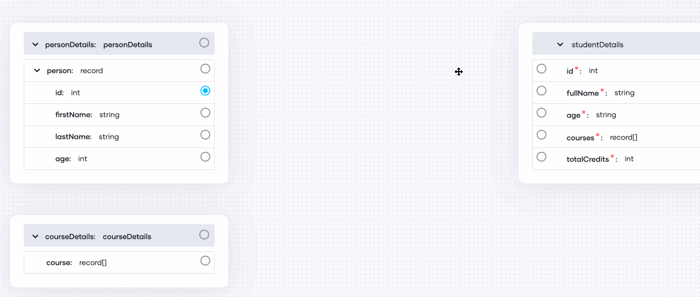{.cInlineImage-threeQuarters}

#### Diagnose and fix mapping errors

If any error occurs when you map parameters, you can fix them in the Statement Editor. To try it, follow the steps given below:

1. Select **age** under **personDetails**, and then select **age** under **studentDetails**.

    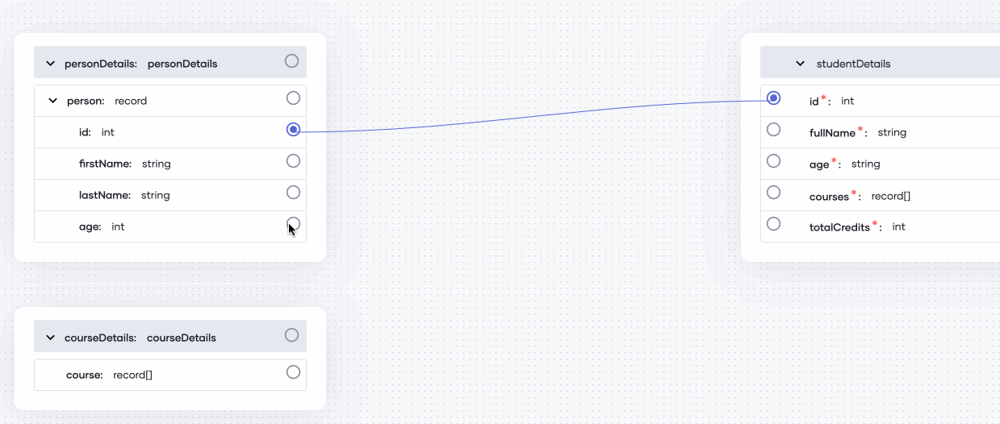{.cInlineImage-threeQuarters}

    The connection appears in red to indicate an error in the data mapping (because the data type of the `age` parameter is different in the two records).

2. Click on the connection, move the cursor over the warning icon to view the error, and then click **Fix by editing expression**.

    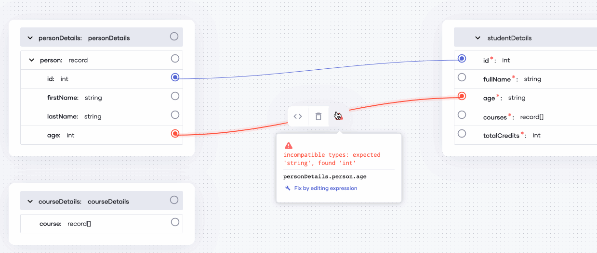{.cInlineImage-threeQuarters}

3. Leave the expression selected (as by default), and in the **Suggestions** tab of the Statement Editor, click **toString()**.

      Doing so converts the parameter value to the string format.

      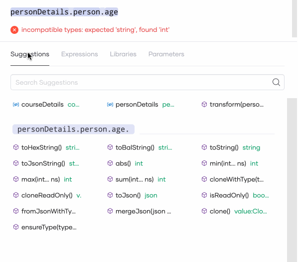{.cInlineImage-half}

4. Click **Save**.

The connection appears in blue to indicate that there are no errors.

#### Aggregate multiple input fields into one output field

You can derive one output parameter by combining two or more input parameters. In this example, the value for the `fullName` output parameter is a combination the values for the `firstName` and `lastName` input parameters.  You can map them as shown below:

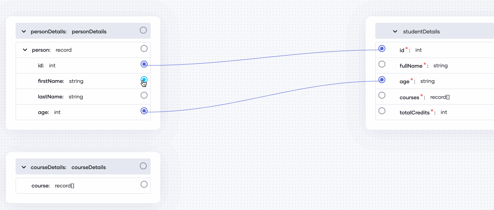{.cInlineImage-threeQuarters}
   
!!! info
    By default, the Web Editor combines the two input parameters with a plus (**+**) operator. If you want to use a different operator or method to integrate two fields, click on the code icon to edit the expression via the Statement Editor.<br/><br/>{.cInlineImage-threeQuarters}

#### Map the arrays

When the input and the output contain arrays, you can map an input array with the required output array and then convert the mapping to a query to map the individual parameters within the arrays.

In the example in this tutorial, you need to map the `course` array under **courseDetails** with the `courses` array under **studentDetails**. Let's map them as follows:

1. Select **course** in the **courseDetails** and then select **courses** under **studentDetails**.

    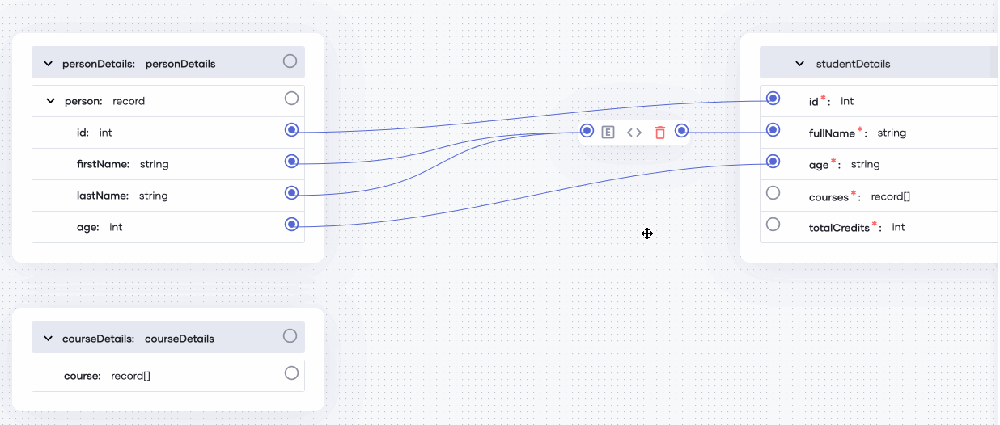{.cInlineImage-threeQuarters}

    The mapping appears in red because the types of the two records you selected are incompatible. Let's move on to the next step to fix it.

2. To convert the mapping to a query, click the icon for code action and then click **Convert to Query** as shown below:

    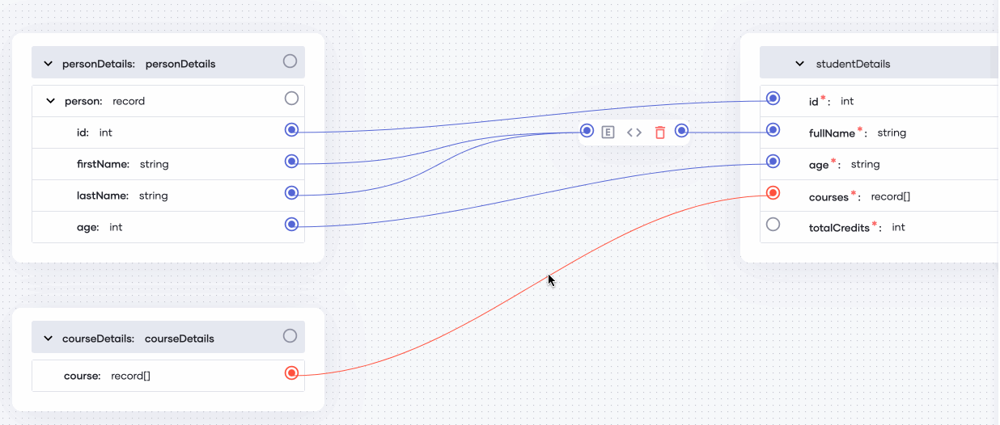{.cInlineImage-threeQuarters}

3. To map the individual parameters within the array, click the icon for expanding the query.

    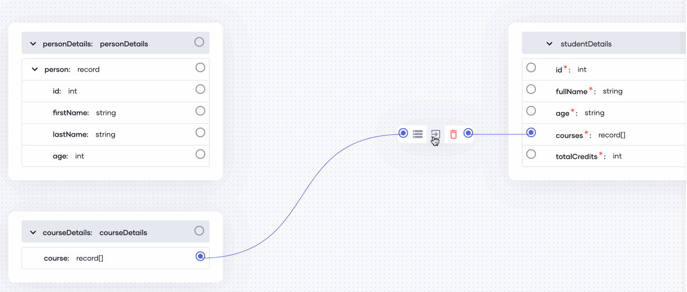{.cInlineImage-threeQuarters}

4. Map the parameters within the arrays as given below:

   1. Map **id** and **name** with **title**. Once you add this mapping, click the icon for editing code and change the expression to `courseItem.id + "" + courseItem.name`.

       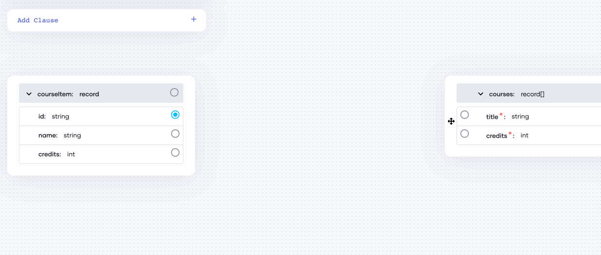{.cInlineImage-threeQuarters}
   
   2. Map **credits** under **courseItem** with **credits** under **courses**.

       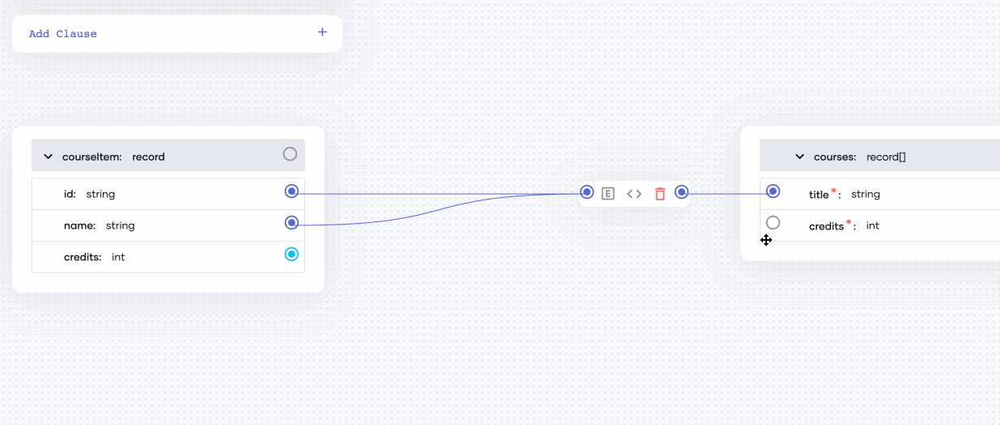{.cInlineImage-threeQuarters}

5. Click **Configure**, and once the **Data Mapper** pane appears, click **Save** in it.

Now you have successfully configured the data mapper.

### Step 4: Design the REST API with the data mapper

You can use the data mapper you configured in the REST API implementation.

!!! tip
    For more information on how to create a REST API, see [Create Your First REST API](../../get-started/tutorials/create-your-first-rest-api.md)

The following is a sample REST API implementation that includes the data mapper you configured. It uses a function to derive the sum of the credits a student earned by completing each subject. Then the REST API calculates the total number of credits the student has earned by adding `n` (i.e., the value provided by the user) to the sum of credits the student earned from the subjects.

```
import ballerina/io;

type Person record {
    int id;
    string firstName;
    string lastName;
    int age;
};

type Courses record {
    record {
        string id;
        string name;
        int credits;
    }[] courses;
};

type Student record {
    int id;
    string fullName;
    string age;
    record {
        string title;
        int credits;
    }[] courses;
    int totalCredits;
};

function transform(Person person, Courses courses) returns Student => {
    totalCredits: getTotalCredits(courses),

    courses: from var coursesItem in courses.courses
        select {
            title: coursesItem.id + " - " + coursesItem.name,
            credits: coursesItem.credits
        },
    age: person.age.toBalString(),
    id: person.id,
    fullName: person.firstName + " " + person.lastName

};

function getTotalCredits(Courses courses) returns int {
    int total = courses.courses.'map(course => course.credits).reduce(getSum, 0);
    return total;
}

function getSum(int total, int n) returns int
{
    return total + n;
}

public function main() {
    Person person = {
        id: 1001,
        firstName: "Vinnie",
        lastName: "Hickman",
        age: 15
    };

    Courses courses = {
        courses: [
            {
                id: "CS6002",
                name: "Computation Structures",
                credits: 4
            },
            {
                id: "CS6003",
                name: "Circuits and Electronics",
                credits: 3
            },
            {
                id: "CS6004",
                name: "Signals and Systems",
                credits: 3
            }
        ]
    };

    Student student = transform(person, courses);
    io:println(student);
```


    
