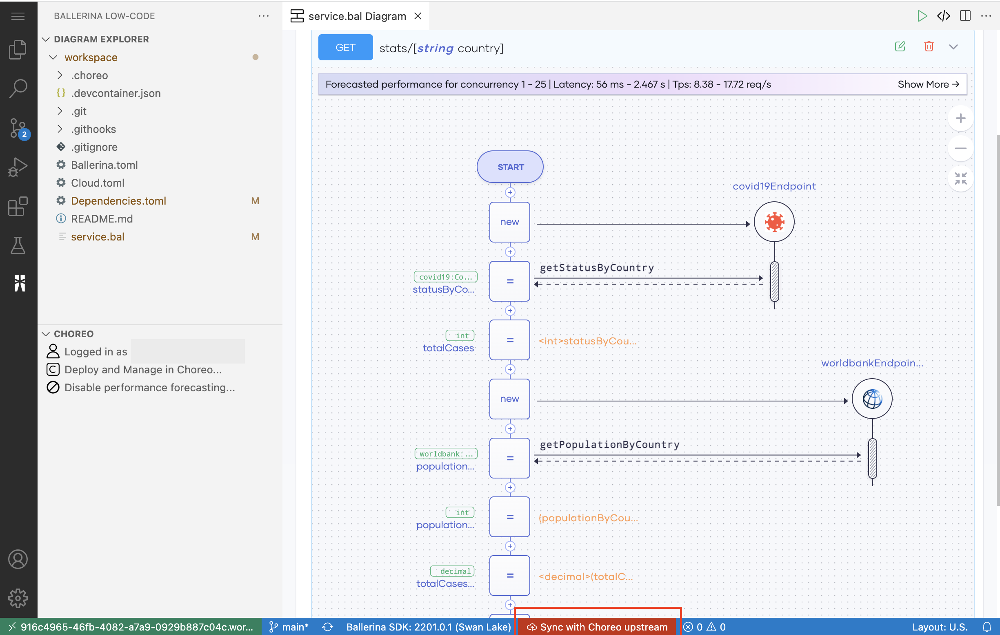
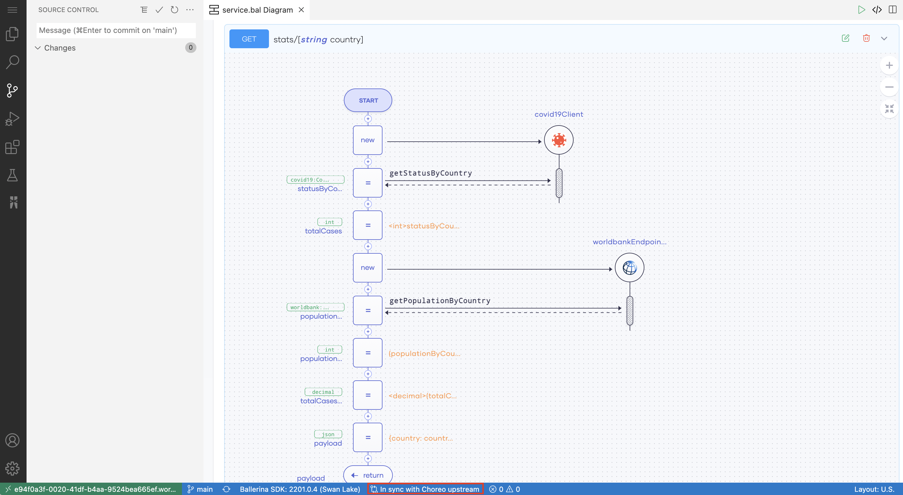

# Connect Your Own GitHub Repository to Choreo

Choreo allows you to either proceed with a Choreo-managed repository or connect your own GitHub repository to maintain the source code of a component when you create any of the following Choreo components:

- REST API
- Manual Trigger
- Scheduled Task
- Webhook

 Choreo provides the capability to connect your own GitHub repository to maintain the source code of a Choreo component you create either as a Ballerina project or a Docker container. This enables multiple developers to work on a particular Choreo component by collaborating via pull requests on a shared repository. Furthermore, this lets developers keep the source repository within their control and adhere to enterprise-specific best practices and development guidelines such as PR checks, code analysis, styling preferences, etc.

This tutorial walks you through the steps to connect your own GitHub repository when creating a component. In this tutorial, you will,

- Create a REST API component and connect it to your own GitHub repository.
- Design the REST API and try it out via the Web Editor.
- Commit the source code of the REST API component to the GitHub repository you connected.

## Step 1: Create a project to add the REST API component

1. Sign in to the Choreo Console at [https://console.choreo.dev](https://console.choreo.dev).
2. Click the **+ Create Project** card from the landing page.
   {.cInlineImage-full}

3. Enter a unique name and description for your project. In this tutorial, let's use the following values:

      | **Field**       | **Value**                    |
      |-----------------|------------------------------|
      | **Name**        | COVID-19 Statistics          |
      | **Description** | Maintain COVID-19 Statistics |

4. Click **Create**. This takes you to the **Components** page.

## Step 2: Add a REST API component and connect it to your own GitHub repository

1. On the **Components** page, click **+Create** on the the **REST API** card.
   {.cInlineImage-full}

3. Enter a unique name and a description for the API. In this tutorial, let's enter the following values:

      | **Field**       | **Value**                   |
      |-----------------|-----------------------------|
      | **Name**        | COVID-19 Statistics         |
      | **Description** | Retrieve COVID-19 Statistics|
      
4. Click **Next**.
5. Provide authorization with your GitHub account by clicking  **Authorize with GitHub**. 
6. If you have not already authorized Choreo apps, click **Authorize Choreo Apps** when prompted.
7. Select a GitHub account, a GitHub repository that includes a Ballerina project or a dockerfile, the relevant branch and the build preset: Ballerina or Dockerfile. 

    !!! info
        If a selected repository is already integrated with Choreo to create a component, you cannot reuse it to create another Choreo component.

8. Enter a valid path for the component and click **Create**.
9. To configure the pre-commit hook that Choreo uses to extract configurables defined in the Ballerina code, follow the steps given below:

     1. Carry out a GitHub pull locally to update your clone with the latest changes.

     2. In your terminal, navigate to the root directory of your GitHub repository and issue the following commands:

         !!! note
             Before issuing these commands, you need to check whether the `<MODULE_ROOT>/.githooks/pre-commit` file exists. If it does not, contact our Support team.

         - `chmod +x <MODULE_ROOT>/≈`
         - `git config core.hooksPath <MODULE_ROOT>/.githooks`

         !!! info
             If the Ballerina module resides at the repository root, exclude `<MODULE_ROOT>/` from the commands. If the Ballerina module resides in a subdirectory, replace `<MODULE_ROOT>/` with the name of that subdirectory.<br/><br/>For example, if the Ballerina module resides in the root directory, the commands can be as follows:<br/><br/> `chmod +x .githooks/pre-commit`<br/> `git config core.hooksPath .githooks`<br/><br/>If the Ballerina module resides in a subdirectory named `foo`, the commands should be as follows:<br/><br/> `chmod +x foo/.githooks/pre-commit`<br/>`git config core.hooksPath foo/.githooks`

     Once you have completed this configuration, your commits to update the component implementation will trigger the pre-hook and generate logs similar to the following extract.

      ```
       Compiling source
         johnsmith/foo:0.1.0
    
       Generating executable
         .choreo/build/bin/foo.jar
       [main ea3deab] test
       3 files changed, 7 insertions(+), 3 deletions(-)
      ```

## Step 3: Design the REST API

Follow the step-by-step instructions under [step 1.3](https://wso2.com/choreo/docs/get-started/tutorials/create-your-first-rest-api/#step-13-design-the-rest-api) in the Create Your First REST API tutorial. 

## Step 4: Run and try out the REST API

Follow the step-by-step instructions under [step 1.4](https://wso2.com/choreo/docs/get-started/tutorials/create-your-first-rest-api/#step-14-run-and-test-the-rest-api) in the Create Your First REST API tutorial.

## Step 5: Commit the source code of the REST API component to your GitHub repository

The REST API component you designed is currently available only in the Web Editor. To allow multiple developers to develop it in collaboration, you must commit the source code of the REST API component to the GitHub repository you connected.
Follow these steps:

1. Click **Sync with Choreo Upstream** in the bottom pane of the page.
   {.cInlineImage-full}
2. In the displayed message, click **Sync my changes with Choreo**.
3. In the left pane, enter a commit message (for example, `Implement REST API`) and click the tick to commit.
   {.cInlineImage-full}

    This displays a message requesting you to confirm that you want to stage all your changes and commit them directly.

4. Click **Yes**.

    !!! info
        If you are connecting your own repository to Choreo for the first time, you will see a message requesting you to configure your user name and email address in GitHub. Click Open Git Log, go to the **Terminal** tab, and run the following commands to configure your username and email address for GitHub commits:

         `git config --global user.email "<email@example.com>"`

         `git config --global user.name "<Your User Name>"` 

5. To push changes to your GitHub repository, click **0↓ 1↑** in the bottom pane.
   {.cInlineImage-full}

    !!! info 
        This icon is displayed only when you complete the commit process.

Once the changes get pushed to the GitHub repository, the bottom pane of the page displays **In sync with Choreo upstream**.
{.cInlineImage-full}

You have now successfully synced your component source code to your own GitHub repository to allow multiple developers to develop the component in collaboration via pull requests.

Developers can collaborate via any of the following approaches:

- Use the same upstream repository to create a shared component in the same organization, develop, push changes to the respective tracking branch, and eventually send a PR to the main branch.
- Create their forks from the shared upstream repository, connect to individual components, commit, and send PRs to the upstream repository.

Once you collaborate and complete developing the REST API component, you can deploy it and test it. For step-by-step instructions, see [steps 2 and 3 in the Create Your First REST API tutorial](https://wso2.com/choreo/docs/get-started/tutorials/create-your-first-rest-api/#step-2-deploy).
