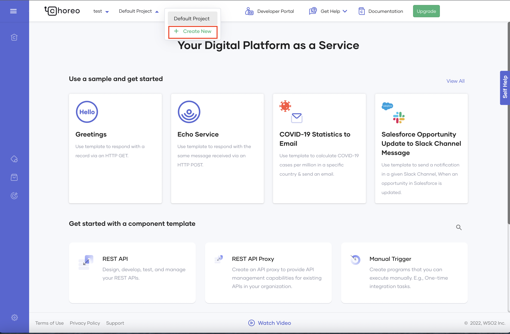
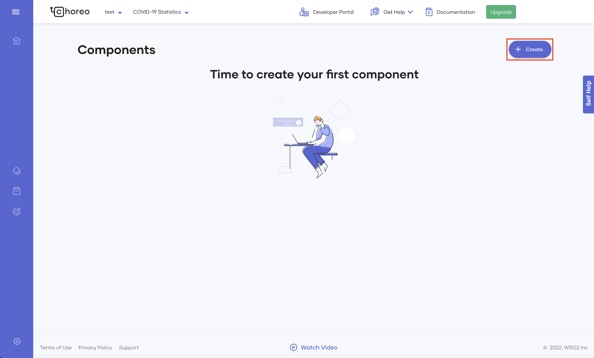

# Connect Your GitHub Repository to Choreo

Choreo allows you to connect your own GitHub repository to maintain the source code of a component when you create any Choreo components. You can create a Choreo component using a Ballerina project or a service written in any language in a Docker container. By connecting your GitHub repository, you enable collaborative development for Choreo components. Furthermore, this lets developers keep the source repository within their control and adhere to enterprise-specific best practices and development guidelines such as checking pull requests, code analysis, styling preferences, etc.

This tutorial walks you through the steps to connect your own GitHub repository when creating a component. In this tutorial, you will connect your GitHub repository and use the REST API implementation in your GitHub repository to create a REST API in Choreo.
    
!!! info
    You can create a component by connecting an empty repository. However, you can only deploy it after you implement it. 

## Prerequisites: Create a project

Let's begin by creating a project as follows:

1. Sign in to the Choreo Console at [https://console.choreo.dev](https://console.choreo.dev).
2. Click the **+ Create Project** card from the landing page.

    {.cInlineImage-small}

3. Enter a unique name and description for your project. In this tutorial, let's use the following values:

      | **Field**       | **Value**                    |
      |-----------------|------------------------------|
      | **Name**        | COVID-19 Statistics          |
      | **Description** | Maintain COVID-19 Statistics |

4. Click **Create**. 

## Connect your GitHub repository

Let's connect your GitHub repository and use the REST API implementation in it to create a REST API component in Choreo: 

1. On the **Components** page, click **+Create** on the **REST API** card.

    {.cInlineImage-small}

2. Enter a unique name and a description for the API. In this tutorial, let's enter the following values:

      | **Field**       | **Value**                   |
      |-----------------|-----------------------------|
      | **Name**        | COVID-19 Statistics         |
      | **Description** | Retrieve COVID-19 Statistics|
      
3. Click **Next**.
4. Provide authorization with your GitHub account by clicking  **Authorize with GitHub**. 
5. If you have not already authorized Choreo apps, click **Authorize Choreo Apps** when prompted.
6. Select a GitHub account, a repository that includes the implementation, the relevant branch, and the build preset (i.e., **Ballerina** or **Dockerfile**). 
7. Enter a valid path relative to the root of your repository that points to the implementation of the REST API. If you have not designed and implemented your REST API yet, you can connect an empty repository or a sub-folder and proceed to create the component. 

    !!! info
        You can create a component by connecting an empty GitHub repository. However, you can only deploy it after you implement it. 

8. Click **Create**.

You have now successfully created your component by connecting your own GitHub repository.

Developers can collaborate via any of the following approaches:

- Use the same upstream repository to create a shared component in the same organization, develop, push changes to the respective tracking branch, and eventually send a pull request to the relevant branch.
- Create their forks from the shared upstream repository, connect to individual components, commit, and send pull requests to the upstream repository.

Once you collaborate and complete developing the REST API component, you can deploy and test it. For detailed instructions, see [steps 2 and 3 in the Create Your First REST API tutorial](https://wso2.com/choreo/docs/get-started/tutorials/create-your-first-rest-api/#step-2-deploy).

## Migrate Choreo-managed repositories to your own GitHub repositories

If you previously created components on Choreo without connecting your GitHub repository,  your code resides in a Choreo-managed repository. **Choreo will remove all Choreo-managed repositories and the relevant components created using them by the 31st of January, 2023**. Choreo will send the source code to the users via mail. Users can then use this source code, store it in their GitHub repositories and create new components. 

**If you have published any connectors for these components, Choreo will continue to keep them published**. Once you create a new version of the component, you can then publish a new version of the connector. However, any applications using the original version of the connector will have to use the new connector version to use the new REST API. To do this,  a user needs to change the  ServiceUrl (REST API URL) and the auth credentials (generated from the Choreo Developer portal) used by the client application to consume the connector.