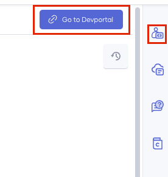

# Subscribe to an API

A subscription to an API makes it possible for the application to know which APIs it can authenticate with its keys. You should subscribe to the published API for an application to invoke it using the application credentials.

Alternatively, you can generate credentials for an API without an explicit subscription to an application. However, this will not let you control advanced configurations such as access token expiry time, revoke token expiry time, ID token expiry time, and enabling access to the API without a secret. Generating keys in the API is recommended for testing or short-term usage but not for long-term production usage.

This guide takes you through the steps to subscribe to APIs in Choreo. 

Let's get started!

1. Sign in to Choreo Developer Portal at [https://devportal.choreo.dev](https://devportal.choreo.dev).Alternatively, click on the Developer Portal link on the Choreo Console header. 

    {.cInlineImage-half}

2. Click **Applications**. 
3. From the application list, find the application for which you want to subscribe the API. Open it by clicking it.
4. In the left pane, click **Subscriptions**. 
5. Click **+ Add APIs**. 
6. Select the usage plan and click **Add** to subscribe to the API. You can subscribe to multiple APIs. You can change the usage plan after subscribing as well.
   {.cInlineImage-small}

You can now invoke the API using the application keys. 