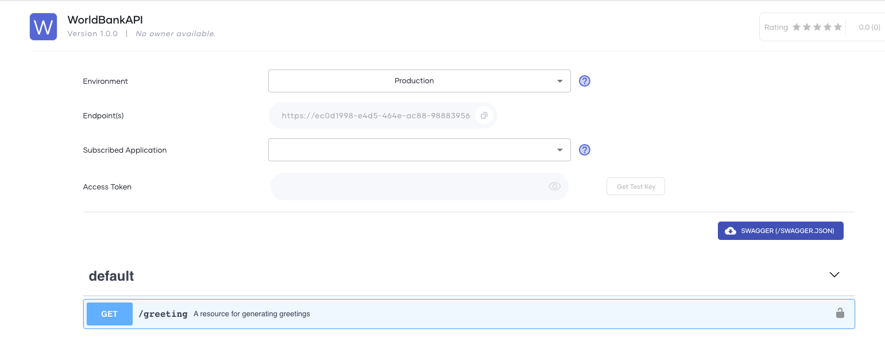
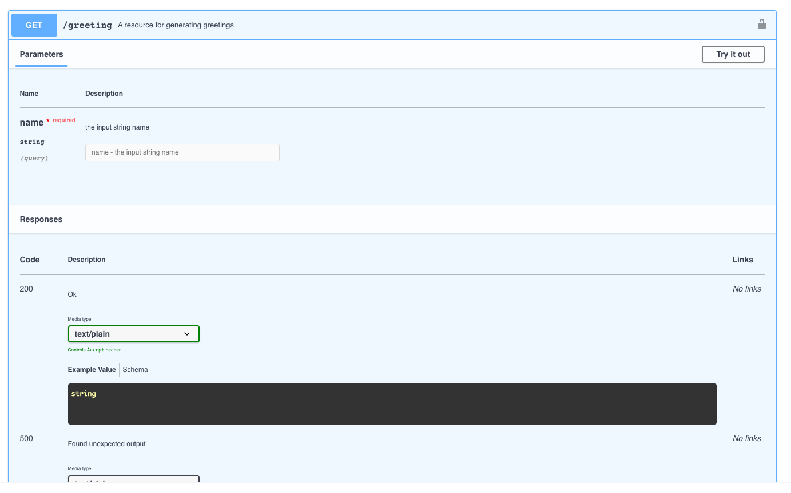
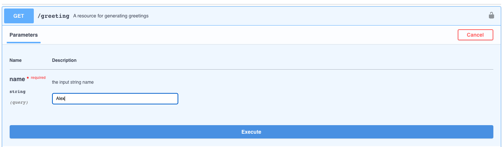

# Test an API
 
Before using your API in production, you can test it using the integrated OpenAPI console in Choreo. Once you deploy the API in the required environment, an API consumer can use the application credentials, generate an OAuth 2.0 token, and invoke the API to test its functionality by providing values for the required parameters.

This guide will take you through the steps to test an API in Choreo. 

1. Sign in to Choreo Developer Portal at [https://devportal.choreo.dev](https://devportal.choreo.dev). Alternatively, click  Developer Portal link on the Choreo console header. 

    {.cInlineImage-half}

2. Click **APIs**.
3. Select an API you want to test and click **Try Out** on the card. In this case, skip step 4. Alternatively, you can click on the API and follow step 4.
4. Click **Try Out** from the left panel.
5. Select the required environment from the **Environment** dropdown.

    {.cInlineImage-half}

6. Select the relevant**Subscribed Application** from the dropdown that you subscribed the API to. 
7. Click **Get Test Key** on the **Access Token** field to generate a test access token. 
8. Next, expand a resource you want to test by clicking on the resource.

    {.cInlineImage-half}

9. Click **Try it Out** to enable the resource to be tested.  
10. Fill in values for the required parameters and click **Execute**.

   {.cInlineImage-half}

11. Once the Choreo executes the request, you can view the response in the OpenAPI console.  

