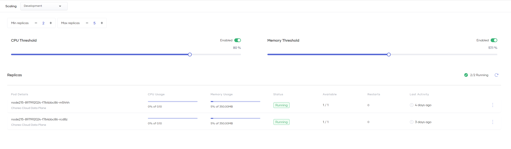

# Autoscale Component Replicas

Choreo allows you to automatically scale your component replicas up or down in number based on resource consumption to ensure high availability.

!!! info "Note"
    Autoscaling capabilities are only available in paid plans for private data plane organizations.
    In the free tier, components run in a single-replica, low-availability mode.

{.cInlineImage-full}

The following parameters allow you to scale component replicas:

- **Min replicas**: The minimum number of replicas to run at any given time. It is recommended to keep the value at a minimum of `2`.
- **Max replicas**: The maximum number of replicas to scale up to. In the cloud data plane, this is restricted to a maximum of `5`. There is no restriction on the value in private data planes.
- **CPU Threshold**: The average CPU utilization across all running replicas. If the CPU utilization across all active instances reaches the threshold, the number of active replicas automatically scales up until the average CPU utilization falls below the threshold.
- **Memory Threshold**: The average memory usage across all running replicas. Like the **CPU Threshold**, if all active instances reach the memory threshold, the number of active replicas automatically scales up until the average memory usage falls below the threshold.

!!! tip
    If you update a scaling parameter, it may not immediately reflect in the Choreo Console because the change can take some time to propagate.

!!! info "Run a fixed number of replicas"
    If you want to run exactly `3` replicas for a component, you must set the minimum and maximum replicas to `3`.

!!! warning "Scale to zero"
    - Although it is possible to set the minimum number of replicas to `0`, your component does not scale to zero automatically during low usage. It can only go down to `1` replica.
    - Setting both the minimum and maximum replicas to `0` suspends the deployment.
