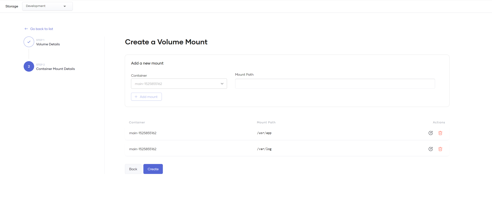

# Configure Storage

All components you create in Choreo have a default **read-only file system**, which you cannot access or write to from your applications.

Volume mounts allow you to create either temporary or persisted writable file system storage locations for your applications.

## Volume mount types

| Type                              | Description                                                                                                                                                         |
| --------------------------------- | ------------------------------------------------------------------------------------------------------------------------------------------------------------------- |
| Empty Directory (In-Memory)       | A fast, temporary in-memory (tmpfs) storage location. This volume gets erased when you restart or remove the attached container. *Available on all data planes.*    |
| Empty Directory (Disk)            | A temporary storage location on disk. This volume gets destroyed when you restart or remove the attached container. *Only available on private data planes.*        |
| Persistent Volume                 | A permanent storage location. This volume persists even if you restart or remove the attached container. *Only available on private data planes.*                   |

!!! tip 
    All components have a writable location in the `/tmp` directory at the time of component creation. You can also configure other writable locations if required.

## Create a temporary storage space for your container

Empty directory (in-memory or on-disk) mounts allow you to create temporary file systems that your application can read from and write to. This option provides a convenient way to create a *scratch space* to write files temporarily before storing them in a more permanent storage location such as a cloud-backed storage bucket.
For example, unzipping a file, temporarily writing results from a memory-intensive operation to disk, a temporary local cache, etc. 
However, it is important to note that these volumes destroy when you restart or update a container because the volumes are attached to the lifetime of a container.

Follow these steps to create a temporary storage space for your container:

1. Sign in to the [Choreo Console](https://console.choreo.dev/).
2. In the **Component Listing** pane, click on the component for which you want to create a temporary storage.
3. In the left navigation menu, click **DevOps** and then click **Storage**.
4. Click **+ Create**.
5. In the **Create a Volume Mount** pane, specify a name for the volume and select **Empty Directory (In-Memory)**.

   {.cInlineImage-full}

6. Click **Next**.

    !!! warning "In-memory (tmpfs) storage uses up container memory"
        Storage capacity for this type of volume will count against the container's memory limit. 
        Uncontrolled writes to this location may starve your application process of memory and can result in the container getting killed and restarted if the memory limits exceed.

7. To add a mount location, specify a **Mount Path** and click **Add mount**.
  
    !!!tip

          - You can add multiple mount locations to a volume.
          - Mount paths should be *absolute file paths* and will be available to your application to read/write from.

    {.cInlineImage-full}

8. Click **Create**. This applies the volume mount immediately to your container and triggers a rolling restart.

## Create a persistent storage space for your container

Follow these steps to create a persistent storage space for your container:

!!! info "Note"

       Persistent volume options are only available in private data plane organizations.

1. Sign in to the [Choreo Console](https://console.choreo.dev/).
2. In the **Component Listing** pane, click on the component for which you want to create a persistent storage.
3. In the left navigation menu, click **DevOps** and then click **Storage**.
4. Click **+ Create**.
5. In the **Create a Volume Mount** pane, specify a name for the volume and select **Persistent Volume**.
6. Select a **Storage Class**.
7. Move the **Storage Capacity** slider to set the required capacity.
8. Select an appropriate **Access Mode**. 

    !!! tip "Check and specify an access mode supported by the storage class"
        - You must check the cloud provider documentation to select an appropriate access mode that the storage class supports. Choreo does not verify whether the storage class supports the access mode you select.
        - If the storage class does not support the access mode you select, it can result in a runtime mount error.

    {.cInlineImage-full}

9. Click **Next**.
10. To add a mount location, specify a **Mount Path** and click **Add mount**.
  
    !!!tip

          - You can add multiple mount locations to a volume.
          - Mount paths should be *absolute file paths* and will be available to your application to read/write from.

11. Click **Create**. This applies the volume immediately to your container.
