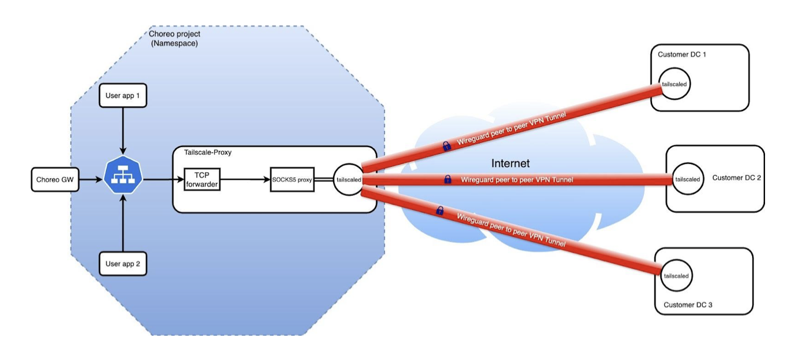
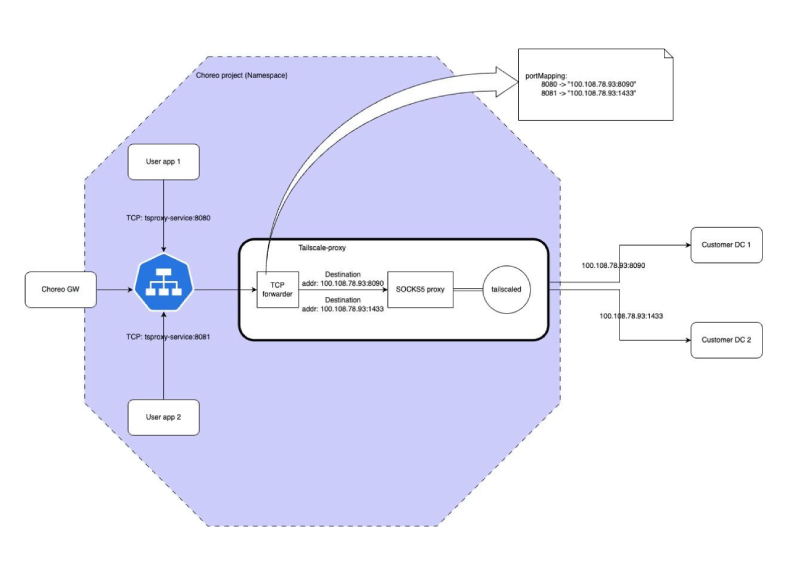

# Configure VPNs on the Choreo Cloud Data Plane

Secure access to private networks from the Choreo cloud data plane is an essential use case for cloud data plane users. 

Choreo allows this secure connection using [Tailscale](https://tailscale.com/). For this, Choreo provides a pre-installed Tailscale image that you can use in your Choreo project. This image serves as a forward proxy, allowing you to connect to your private endpoints through Tailscale's peer-to-peer [WireGuard](https://tailscale.com/kb/1035/wireguard) network tunnels.

The following diagram illustrates the high-level deployment architecture of the Tailscale pre-installed forward proxy:



Let's take a look at the specifics of each part to understand the deployment architecture.

**Choreo project**

In Choreo, a project groups various components. For more information on what a project in Choreo is, see the documentation on [Project](../choreo-concepts/project.md).

**Tailscale proxy**

This acts as the Tailscale pre-installed forward proxy, facilitating secure peer-to-peer WireGuard connections from the Choreo cloud data plane to private networks. It includes a [Tailscale Daemon](https://tailscale.com/kb/1278/tailscaled), [SOCKS5 proxy](https://tailscale.com/kb/1112/userspace-networking#socks5-vs-http), and a configurable TCP forwarder.

**Tailscale daemon**

This is the core component of Tailscale. It is a software service that provides secure network connectivity and private networking solutions. For more details see the [Tailscale documentation](https://tailscale.com/kb/1278/tailscaled).

**SOCKS5 proxy**

This uses Tailscale’s [userspace networking](https://tailscale.com/kb/1112/userspace-networking) mode, rather than the kernel mode. Therefore, the inbuilt SOCKS5 proxy handles the forwarded traffic and directs it through the Tailscale network.

**TCP forwarder**

Forwards inbound TCP (transmission control protocol) traffic from the Tailscale proxy container’s network interface to the SOCKS5 proxy, ensuring it reaches its destination via the secured WireGuard tunnel.

**User applications and the Choreo API gateway**

User applications within the same namespace (project) can use the Kubernetes service created to front the Tailscale proxy, for connecting to the corresponding private endpoints. You can either expose this service within the organization via the internal API gateway or expose it to the public via the external API gateway. For more details, see the documentation on [Choreo endpoints](../develop-components/configure-endpoints.md).

<hr>

Now that you understand the deployment architecture, let’s explore how you can use Tailscale to secure connections to your private networks.

## Configure and use Tailscale to access private network endpoints

This section walks you through the steps to create, configure, deploy, and use the Tailscale proxy component. 
  


Let's get started.

### Prerequisites

- Understand the basics of [how Tailscale works](https://tailscale.com/blog/how-tailscale-works).
- Have a Tailscale account (Tailnet). There are multiple plans available for you to set up your Tailscale network. For details, see [Tailscale plans](https://tailscale.com/pricing).
- Install Tailscale and connect your private services and database server to it. To quickly get started with Tailscale, see the [Tailscale quickstart](https://tailscale.com/kb/1017/install).
- If you are signing in to the Choreo Console for the first time, create an organization as follows:

    1. Go to [https://console.choreo.dev/](https://console.choreo.dev/), and sign in using your Google, GitHub, or Microsoft account.
    2. Enter a unique organization name. For example, `Stark Industries`.
    3. Read and accept the privacy policy and terms of use.
    4. Click **Create**.

    This creates the organization and opens the organization home page.

### Step 1: Create the Tailscale proxy

#### Step 1.1: Create a project 

Follow the steps given below to create a project:

1. Go to [https://console.choreo.dev/](https://console.choreo.dev/) and sign in. This opens the organization home page.
2. On the organization home page, click **+ Create Project**.
3. Enter a display name, unique name, and description for the project. You can enter the values given below:
    
    !!! info
         In the **Name** field, you must specify a name to uniquely identify your project in various contexts. The value is editable only at the time you create the project. You cannot change the name after you create the project.

    | **Field**                | **Value**                          |
    |--------------------------|------------------------------------|
    | **Project Display Name** | Tailscale Proxy Project            |
    | **Name**                 | tailscale-proxy-project            |
    | **Project Description**  | My Tailscale project               |

4. Click **Create**. This creates the project and takes you to the project home page.

#### Step 1.2: Create the Tailscale proxy component

1. On the project home page, click **Service** under **Create a Component**.
2. Enter a display name, component name, and a description for the service. For this guide, let's enter the following values:

    |Field                 |     Value                |
    |----------------------|--------------------------|
    |Component Display Name| Tailscale proxy          |
    |Component Name        | tailscale-proxy          |
    |Description           | Tailscale proxy component|

3. Click the **Container Registry** tab.
4. In the **Container Registry** list, select **Choreo Samples Registry**.
5. Click the **Tailscale Proxy** card.
6. Click **Create**.

Now you have successfully created the Tailscale proxy. You can proceed to configure and deploy it.

### Step 2: Configure and deploy the Tailscale proxy

Here, you will add the required volume mounts, set the Tailscale authentication key, configure the TCP forwarder, configure endpoints, and deploy the Tailscale proxy. Follow the steps given below:

#### Step 2.1: Add required volume mounts

Tailscale requires the following volume mounts for its operations:

 - `/var/run/tailscale`
 - `/.local`

To create the volume mounts, follow the step-by-step instructions in [Configure Storage](../devops-and-ci-cd/configure-storage.md). 

#### Step 2.2: Configure and deploy the component

To configure and deploy the component, follow the steps given below:

1. In the left navigation menu, click **Deploy**.
2. On the **Build Area** card, click **Configure &  Deploy**.
3. In the **Environment Configurations** pane that opens, click **+ Add** and add the `TS_AUTH_KEY` environment variable as a secret. To add the environment variable, you must obtain an authentication key from your Tailscale network.
    - For details on how to obtain an authentication key from your Tailscale network, see [Auth keys](https://tailscale.com/kb/1085/auth-keys) in the Tailscale documentation.

4. Click **Next**.
5. In the **File Mount** pane that opens, click **+ Add** and mount a configuration file to the Tailscale proxy component to specify the port mapping for the TCP forward proxy running there.
    - Specify `/Config.yaml` as the **Mount Path**.
    - Specify the following in the sample configuration file:
       ```
       portMappings:
           8080: "100.108.78.93:8090"
           8081: "100.108.78.93:1433"
       ```
6. Click **Next**.
7. In the **Endpoints** pane that opens, click **+ Add** to edit the `endpoints.yaml` configuration to expose your Tailscale proxy as a service. The following is a sample `endpoints.yaml` configuration you can use:

    !!! note
        The sample `endpoints.yaml` given below exposes two project-level endpoints that you can also use in other components in the same project to access the services. If you want to directly expose your private endpoint via the Choreo gateway either with public or organization visibility, you can set the `networkVisibility` property of the endpoint to `Public` or `Organization`.


    ``` yaml

    version: 0.1
    endpoints:
      - name: Private HTTP service
        port: 8080
        type: REST
        networkVisibility: Project
        context: /
      - name: Private DB service
        port: 8081
        type: TCP
        networkVisibility: Project
        context: /

    ```

8. Click **Save**.
9. Click **Next** and then click **Deploy**.

    !!! note
        Deploying the component may take a while. You can track the progress by observing the logs. Once the deployment is complete, the build status changes to **Active** on the **Development** environment card.

When the component is deployed, you can observe a new node connected to your Tailscale network. To view this, go to the [Tailscale machines](https://login.tailscale.com/admin/machines) page of your Tailscale coordination server.

### Step 3: Access private network endpoints with the Tailscale proxy

Now you have successfully deployed the Tailscale proxy in your project and it is connected to your Tailnet. You can use the Tailscale proxy to provision access to other components to securely access private network endpoints.

You can [configure endpoints](https://wso2.com/choreo/docs/develop-components/configure-endpoints/#learn-the-endpointsyaml-file) of the Tailscale proxy to use it for various aspects within Choreo.

## Post-deployment considerations

### Node key expiry

Tailscale nodes have a default [node key](https://tailscale.com/kb/1010/node-keys) expiry time of 180 days. Nodes require re-authentication after key expiry to avoid connection losses and application downtime. Consider disabling node key expiry if needed. For more details,  
There is an option to disable node key expiry if necessary. For more details, see [Node key expiry documentation](https://tailscale.com/kb/1028/key-expiry).

### Auth key expiry

[Auth keys](https://tailscale.com/kb/1085/auth-keys) are used to register new nodes into your Tailscale network. The default [expiry time for auth keys](https://tailscale.com/kb/1085/auth-keys#key-expiry) is 90 days, but nodes remain connected even after auth key expiry. This becomes an issue only if the Tailscale Proxy component is redeployed or restarted.


### Updating port mapping configurations

If you want to add a new private endpoint to your network and access it via the same Tailscale proxy within Choreo, you must add a new port mapping entry in the port mapping configuration of your Tailscale proxy deployment.


## Best practices

### Configure health checks

Since the Tailscale proxy acts as a forward proxy, it is important to configure health checks. You can use one of the open ports of the TCP forwarder as a health endpoint. For details on how to set up health probes in Choreo, see [Set up health checks](./set-up-health-checks.md).

### Use Tailscale ACLs
It is recommended to use [Tailscale ACLs](https://tailscale.com/kb/1018/acls) to precisely manage permission for users and devices on your Tailnet.

### Disable scale-to-zero for the Tailscale proxy
It is recommended to disable [Scale-to-Zero](./autoscale/autoscale-components-with-scale-to-zero.md) for the Tailscale proxy because it acts as a forward proxy and should always be up and running to make consistent connections with the Tailscale VPN mesh.
If you enable Scale-to-Zero, you may experience service downtime.

### Run multiple replicas with HPA (horizontal pod autoscaler) 
To achieve high availability and resiliency for the Tailscale proxy, you must run multiple replicas with HPA. To configure multiple replicas for the Tailscale proxy component, go to the **Scaling** page under **DevOps**. For more details, see [Autoscale component replicas](./autoscale/autoscale-component-replicas.md)

## Security considerations

It is recommended to follow production best practices & security best practices before deploying the Tailscale proxy in production environments.

!!! Note
     Choreo blocks incoming connections from other nodes in your Tailnet to the Tailscale proxy to prevent access to your project’s namespace in the Choreo cloud data plane. 

## Troubleshoot issues

For assistance in resolving common Tailscale proxy issues, see [Troubleshoot Tailscale proxy issues](../references/troubleshoot-choreo.md#troubleshoot-tailscale-proxy-issues).
