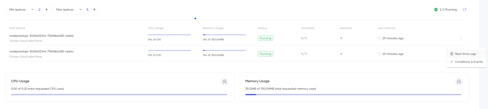

# View Runtime Details

In Choreo, you can view details about running replicas of a component in a specific environment (i.e., Development or Production).

To view the runtime details of a component, follow the steps given below:

1. Sign in to the [Choreo Console](https://console.choreo.dev/).
2. In the **Component Listing** pane, click on the component for which you want to view runtime details.
3. In the left navigation menu, click **DevOps** and then click **Runtime**. This opens the **Runtime** page populated with data retrieved from the underlying Choreo data plane.

{.cInlineImage-full}

The runtime details you can see here are analogous to a *zoomed-in* view of a specific environment on the **Deploy** page.

The following topics walk you through the specific details you can view and actions you can perform via the **Runtime** page.

## Redeploy a release

On the **Runtime** page, you can click **Redeploy Release** to immediately redeploy all resources, including configurations and secrets, to a specific environment. This triggers a rolling update to sync all the latest changes to the data plane.

!!! info "What is a release?"
    A release in Choreo uniquely identifies an underlying deployment of a component to an environment for a given version. For example, if you deploy a component to two environments across two versions, the component will have four active releases.

The capability to redeploy a release also allows you to quickly restart all the running replicas of a component in a specific environment.

## View running instances

The running instances you see on the **Runtime** page provide insights into the active replicas of your component in the selected environment.

- You can view details of each active replica and its associated real-time CPU and memory usage, status, restarts, and the time of the last activity.
- If you want to see the real-time logs and information on conditions and events of a replica, click the menu icon of the replica and then click **Real-time Logs** or **Conditions & Events** depending on what you need to view. These options provide insights that help to diagnose issues in deployments.

    {.cInlineImage-full}

    !!! info "Note"
        - All metrics such as the total and replica-level CPU and memory usage displayed on the **Runtime** page are real-time data and are instantaneous representations of a component's current state. 
        - You can take a look at the observability metrics of a component to see historical data and usage trends.

### Observe real-time container logs

Unlike the logs available in the **Observability Metrics** of a component, these logs are fetched in real-time from the data plane and are not historical. Therefore, you can only see logs of active containers and the last shutdown container.

{.cInlineImage-full}

- **Display Previous Logs:** Enable to retrieve logs from the last shutdown/crashed/restarted container of an instance.
- **Since Seconds**: Specify the duration in seconds to fetch corresponding logs.  
- **Filter Logs**: Enable to filter and displays matching log lines. This is a fuzzy string search.

### View container conditions and events

Conditions and events provide information necessary to troubleshoot failing deployments. 

{.cInlineImage-full}

If a component is not behaving as expected and you cannot detect any issues via the application logs, these events can provide necessary debugging information, such as the following:

- Failing health checks (liveness and readiness probes).
- Missing or invalid configuration/secret mounts.
- Missing or invalid storage volume mounts.
- Scheduling issues in the underlying data plane.
