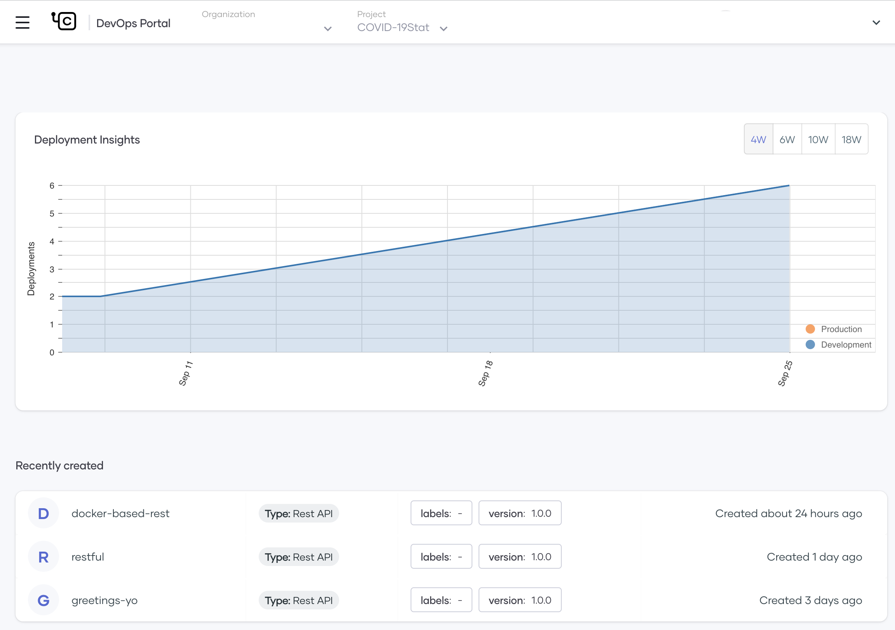
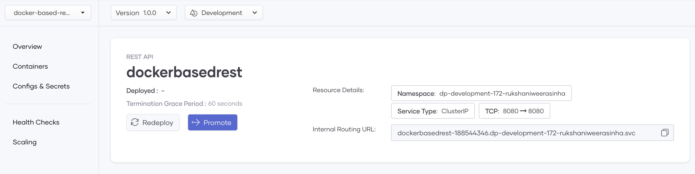
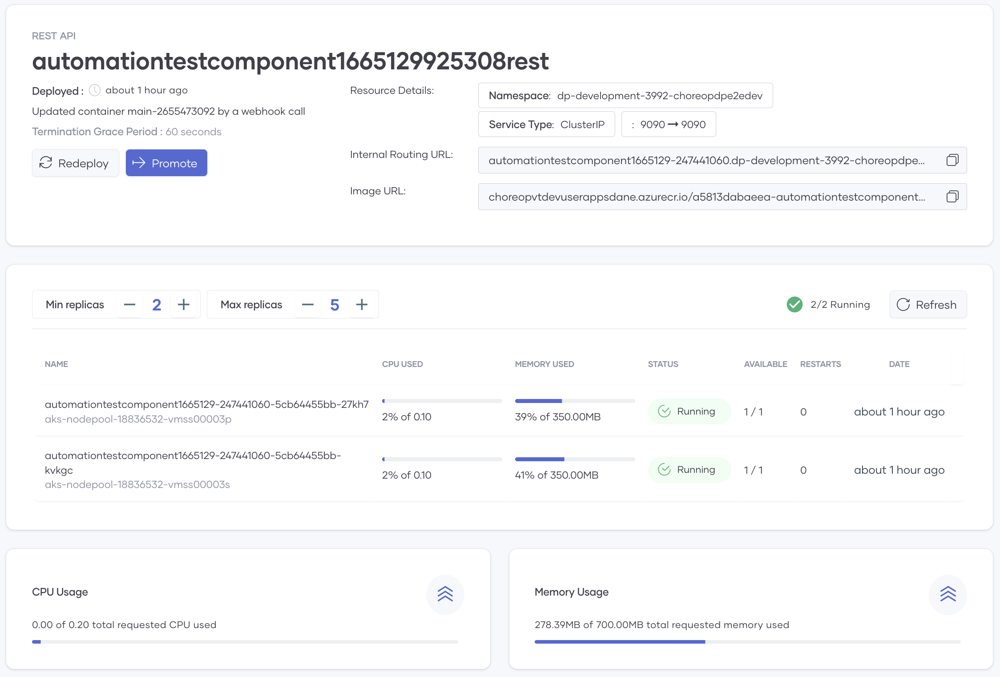
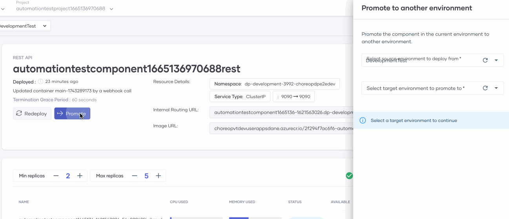
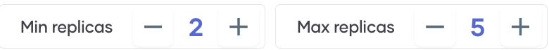
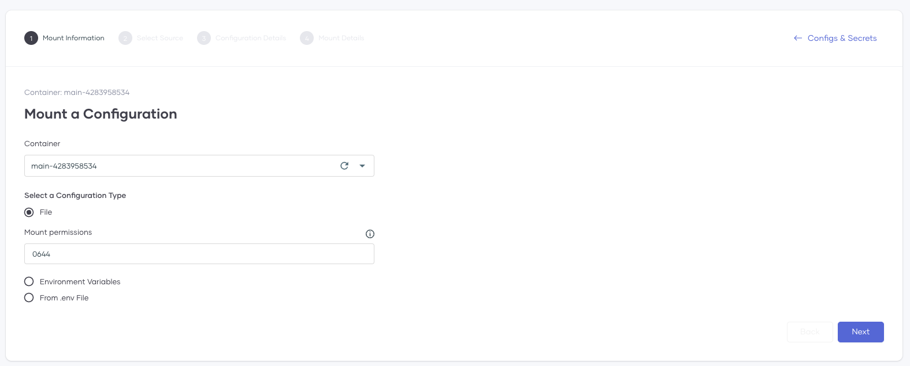
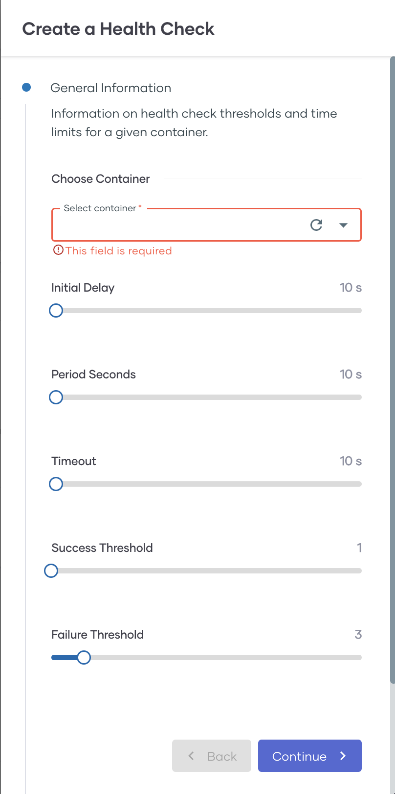
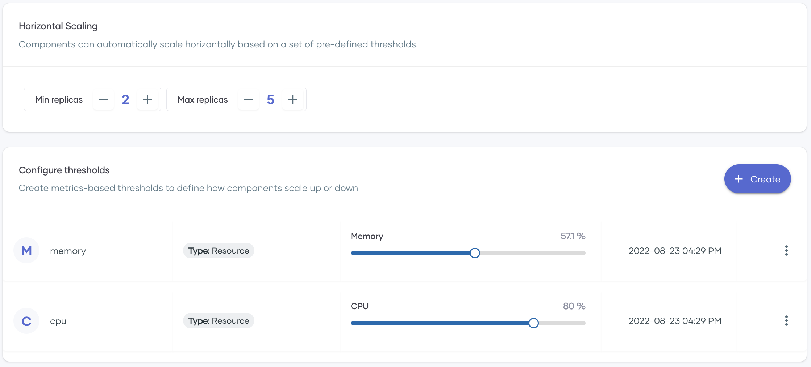

# DevOps Portal

The Choreo Console allows you to observe the basic deployment process of a Dockerfile-based component. The Choreo DevOps Portal provides a low-level Kubernetes view of the underlying data plane resources for advanced developers who want to carry out a detailed diagnosis of Choreo components. Most advanced features on the DevOps Portal are only available for private data planes.

## Access the DevOps Portal

You can access the DevOps Portal in one of the following ways:

- Via https://devops.choreo.dev/

- Clicking **DevOps Portal** in the top menu of the Choreo Console

   {.cInlineImage-full}

When you open the DevOps Portal, it displays the deployment insights and the recently created components of the currently selected project as shown below:

{.cInlineImage-threeQuarter}

If you hold the pointer over the **Deployment Insights** graph, it displays the number of components you have deployed to each environment up to the date you are pointing. This count applies to the currently selected organization and project.

You can select the required organization and the project for which you need to view this data by selecting the required values in the **Organization** and **Project** lists.

## View component specific information

In the **Recently Created** section, click on a component to open it on a separate page.

{.cInlineImage-threeQuarter}

On this page, you can view the information described in the following subtopics.

### Overview

This tab displays the following information:

{.cInlineImage-full}

!!! Tip
    The internal routing URL is an internal endpoint for the component. Other components in the same organization can use this URL to communicate with this component without using the public internet or an internal gateway.

In this tab, you can perform the following activities:

- Deploy or redeploy a component

    You can click **Deploy** or **Redeploy** as relevant.

- Perform advance promotions for a component

    When you have multiple environments, the **Overview** tab of the DevOps Portal allows you to select the environment to which you want to promote the component as shown below: 

    {.cInlineImage-threeQuarter}

    In doing so, you might bypass one or more environments. For example, when you promote a component to the production environment, you can bypass one or more development environments.

- Manage replicas

    If you are on a private data plane, you can click the **+** and **-** icons on this bar to change the minimum and the maximum number of replicas that you want to allow the component to have at any given time.

    {.cInlineImage-half}

    Each row displays basic information (such as the CPU and memory usage) about an individual replica. If you move the pointer over a row, three icons will appear. These enable you to view the replica events, status, and logs.

### Containers

This tab displays information related to a selected Docker container such as the URL to the Docker image from which Choreo pulls the component, the image pull policy, resource limits and requests, exposed ports, etc.

If you are on a private plane, you can edit this information. You can also add commands and arguments to the Docker image.

### Configurations and secrets

This tab displays configurations and/or secrets that you have configured for your component.

You can also add new configurations and/or secrets.

{.cInlineImage-full}

### Health Checks

This tab allows you to define health checks for a selected container. 

{.cInlineImage-half}

### Scaling

In this tab, you can define the thresholds based on which the component can scale horizontally.

{.cInlineImage-half}

The threshold limits for memory and CPU consumption are available by default, and you can edit them if required. To add a new threshold criterion, click **Create**. The **Create a Scaling Threshold** pane opens. In this pane, you can select more threshold criteria. You can also create custom thresholds.

When the component reaches the threshold for any resource, the system automatically creates a new replica for it. In this tab, you can specify the minimum and the maximum number of replicas that you want to allow the component to have at any given time.

