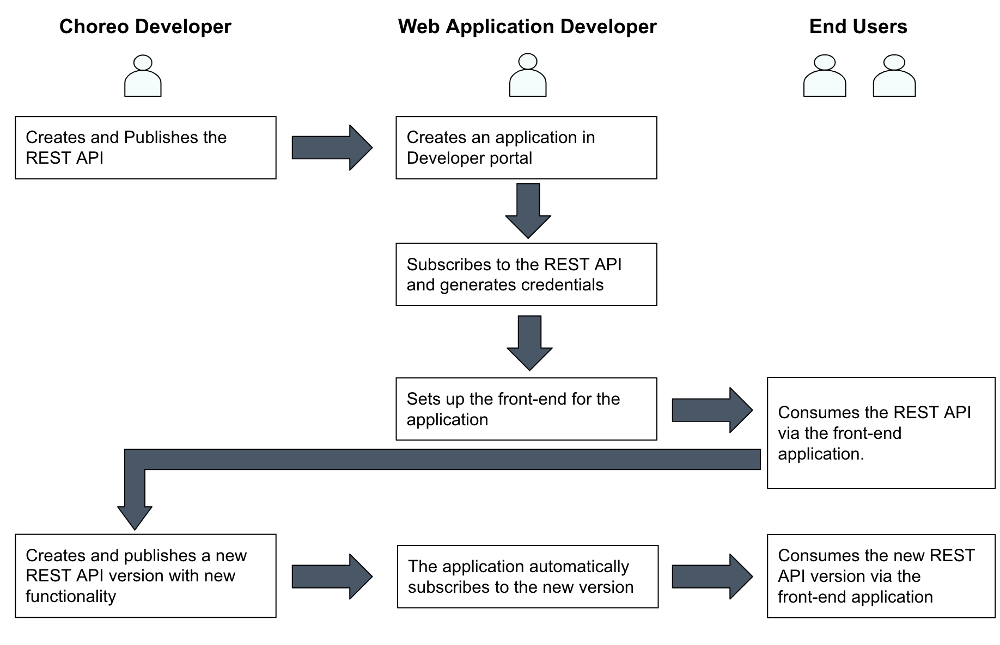
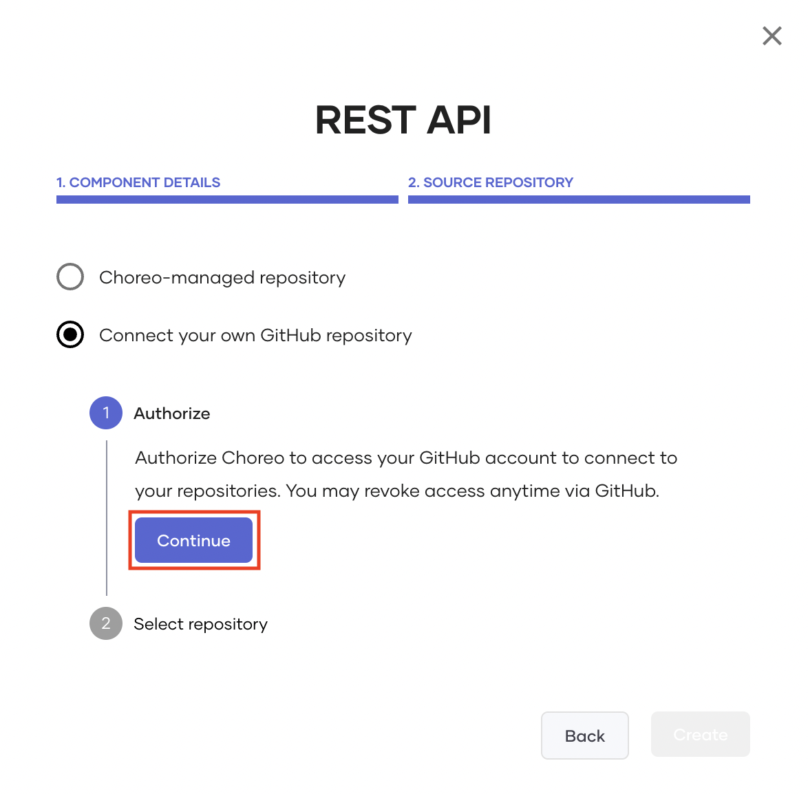
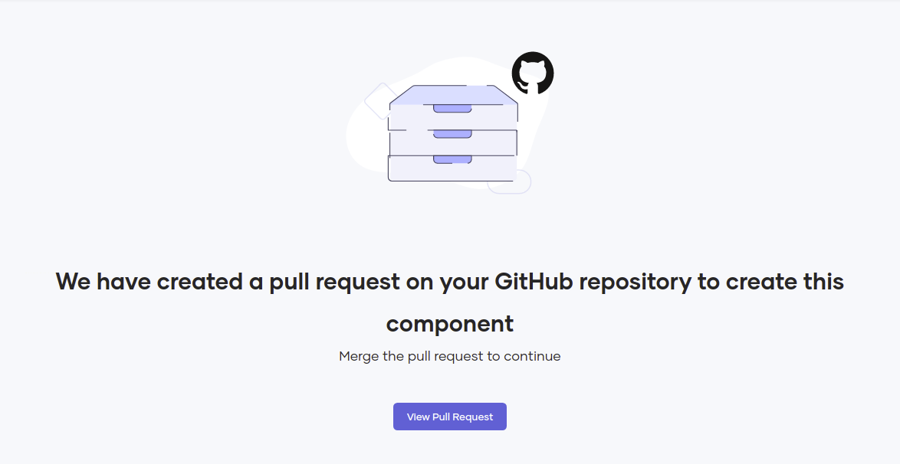
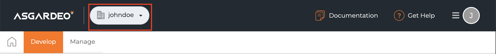
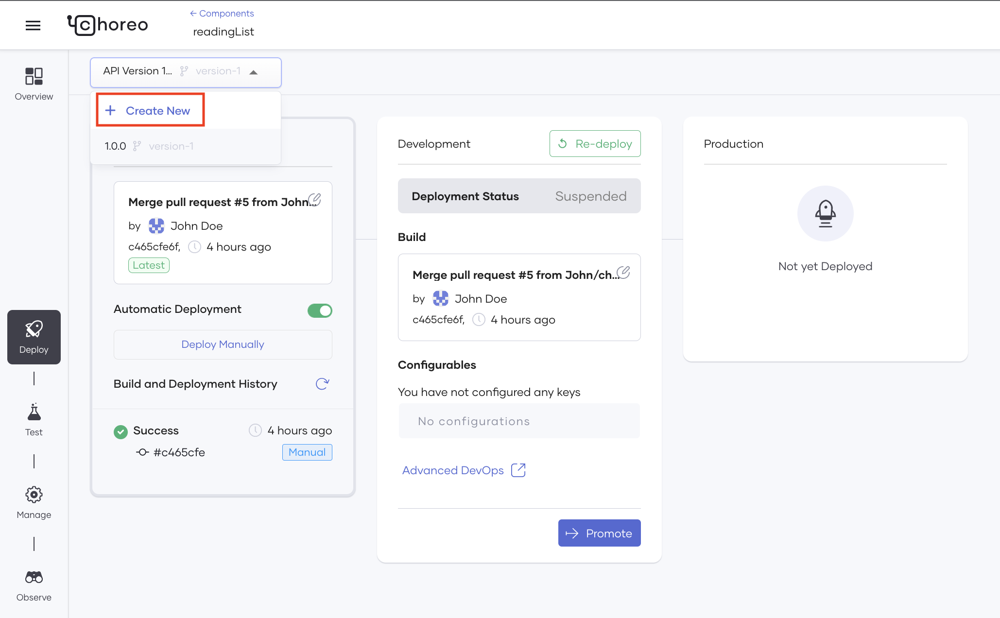

# Get Started with Choreo

Choreo is a full lifecycle cloud-native developer platform that enables your developers to create, deploy and run new digital components like APIs, microservices, and automations in serverless mode on any Kubernetes cluster.

This guide walks you through the following:

- Developing, deploying, testing, and publishing a REST API.
- How an external application consumes the published REST API.
- How to release new versions of the REST API with added functionality.

Let's consider a use case where a developer named Jane designs an application for reading lists. A Choreo developer named John develops a REST API for this application to consume. The two developers will develop two versions of the solution in two iterations. The second version of the application will add data persistence as a new feature.

The following diagram summarizes the use case:

{.cInlineImage-full}

Let's get started!

## Prerequisites

Before you try out this guide, complete the following:

1. Create a GitHub repository to save the REST API implementation. For this guide, you can fork [https://github.com/Asitha/choreo-reading-list-application-example](https://github.com/Asitha/choreo-reading-list-application-example).

2. If you are logging in to Choreo Console for the first time, create an organization as follows:

    1. In [https://wso2.com/choreo/](https://wso2.com/choreo/), click **Try Choreo Now**.

    2. Sign in to Choreo using your Google, GitHub, or Microsoft account.

    3. Enter a unique organization name. For example, `Stark Industries`.

        {.cInlineImage-small}

    4. Access and read the Privacy Policy and Terms of Use via the provided links, and select the **I agree with the Privacy Policy and Terms of Use** checkbox if you agree with them.

    5. Click **Create** to add the new organization.

    6. When the **Welcome to Choreo!** message appears, click either **Decline** or **Confirm** as you prefer depending on whether you want Choreo to send you emails with product updates, resources, and event invites.

    You will be viewing the Home page of the Choreo Console.

3. If required, create a new project as follows:

    !!! info
        If you do not create a new project, you can create the REST API for the default project.
    
    1. On the Home page of the Choreo Console, click **+ Create Project**.

    2. Enter a unique name and a description for the project.

    3. Click **Create**.

## Step 1: Create and publish a REST API

In this step, you are playing the role of John, the API developer. You will create and publish the REST API that the application developed by Sam needs to consume.

### Step 1.1: Create the REST API

Let's create your first REST API.

1. On the Home page, click on the required project.

2. If your project already has components, click **Create** and then click **Create** again in the REST API card. If not, click **Create** in the  REST API card.

3. Enter a unique name and a description for the API. For example, you can enter the name and the description given below:

    | **Field**       | **Value**               |
    |-----------------|-------------------------|
    | **Name**        | `readingList`           |
    | **Description** | `Manages reading lists` |

4. In the **Access Mode** field, leave the default selection unchanged so that users outside your organization can access your API.

5. Click **Next**.

6. Click **Authorize with GitHub**.

7. Enter your GitHub credentials, and select the private repository you created by forking  [https://github.com/Asitha/choreo-reading-list-application-example](https://github.com/Asitha/choreo-reading-list-application-example) to install the [Choreo GitHub App](https://github.com/marketplace/choreo-apps).

    !!! info
         The **Choreo GitHub App** requires the following permission:<br/><br/>- Read and write access to code and pull requests.<br/><br/>- Read access to issues and metadata.<br/><br/>You can [revoke access](https://docs.github.com/en/authentication/keeping-your-account-and-data-secure/reviewing-your-authorized-integrations#reviewing-your-authorized-github-apps) if you do not want Choreo to have access to your GitHub account. However, write access is only used to send pull requests to a user repository. Choreo will not directly push any changes to a repository.

     {.cInlineImage-half}


8. In the **Connect Repository** dialog box, enter the following information:

    | **Field**             | **Description**                               |
    |-----------------------|-----------------------------------------------|
    | **GitHub Account**    | Your account                                  |
    | **GitHub Repository** | `**choreo-reading-list-application-example**` |
    | **Branch**            | `**version-1**`                               |
    | **Path**              | `**reading-list-service**`                    |

9. Click **Create** to proceed with component initialization. This displays a pull request similar to the following:

     {.cInlineImage-full}

10. Click **View Pull Request**.

11. Review and click **Merge pull request**, and then click **Confirm Merge**. When you merge the pull request, it adds the necessary metadata files to connect your GitHub repository to Choreo so that you can proceed to create the component.


###  Step 1.2: Deploy the REST API

To deploy the REST API, follow the steps given below:

1. Navigate back to the Choreo Console. You will be viewing the page for the `readingList` REST API.

2. In the left pane, click the **Deploy** icon.

3. Click **Deploy Manually**.

    !!! info
        Automatic deployment is enabled for the component by default. You are required to carry out only the first deployment manually. To learn more about automatic deployment, see [Configure Automatic Deployment](../tutorials/configure-automatic-deployment).

   This deploys the API to the development environment to make it invokable.

### Step 1.3: Test the REST API

Let's test the `readingList` REST API via Choreo's Open API Console by following the steps given below:

1. Click Test in the left pane.

2. Expand the **POST** method.

3. Click **Try it out**.

4. Update the request body so that the parameters have the values given below:

    | **Parameter** | **Value**       |
    |---------------|-----------------|
    | **author**    | `Bram Stoker`   |
    | **status**    | `To Read`       |
    | **title**     | `Dracula`       |

    The request body should look as follows:

    ```json
      {
        "author": "Bram Stoker",
        "status": "To Read",
        "title": "Dracula"
      }
    ```
   
5. Click **Execute**.

    Check the **Server Response** section. You will have received a successful response with the `200` response code.

Similarly, you can expand and try out the **GET** and **DELETE** methods.


### Step 1.4: Publish the REST API

In the previous step, you tested the `readingList` REST API and found that it works as expected. Therefore, let's publish it and make it available for subscriptions.

#### Step 1.4.1: Update the CORS configuration

The application developer in this scenario calls the API from a different domain (i.e., Vercel). By default, web browsers block these calls for security reasons. To enable the application to call the API, follow the steps given below:

1. In the left pane, click the **Manage** icon.

2. Click **Settings**.

3. Under **API Settings** click **Edit**.

4. Toggle the **CORS Configuration** switch to enable the CORS configuration.

5. Select the **Access Control Allow Credentials** checkbox.

6. In the **Apply to Development** pane that opens on the right of the page, enter a meaningful message. Then click **Apply**.

7. Click **Save**.

#### Step 1.4.2: Publish the REST API

To publish the REST API, follow the steps given below:

1. In the **Manage** tab, click **Lifecycle**.

2. Click **Publish** to publish the REST API to the Developer Portal.

3. To access the Developer Portal, click **Go to DevPortal**.

    The readingList REST API will open in the Developer Portal.

## Step 2: Consume the REST API

You have published the readingList REST API to the Developer Portal where application developers can find it and subscribe their applications to it.

In the previous steps, you played the role of a REST API developer and developed a REST API. In this step, you will play the role of a consumer of this REST API.

To consume the  `readingList` REST API, let's create an application, subscribe it to the REST API, and send a request to it.

### Step 2.1: Create an application

First, let's create an application by following the steps given below:

1. In the top menu of the Developer Portal, click **Applications**.

2. Click **Create**.

3. Enter `readingListApp` as the name of the application and click **Create**.

    Your Application will open on a separate page.

### Step 2.2: Subscribe to your application to the API

To subscribe your application to the API, follow the steps given below:

1. In the left navigation menu, click **Subscriptions**.

2. Click **Add APIs**.

3. Find your REST API and click **Add** for it.

Now your application has subscribed to the `readingList` REST API.

### Step 2.3: Generate a token for your application

To generate a security token that your application can use to invoke the REST API, follow the steps given below:

1. In the left navigation menu, click **OAuth 2.0 Tokens**.

2. Click **Generate Credentials**.

3. Click **Generate Test Token**.

4. Copy the test token that appears by clicking the icon for copying and save it for later use.

5. Expand **Advanced Configurations** and select the **Public Client** checkbox.

6. Click **Update**.

### Step 2.4: Deploy a Web application and invoke the REST API

At present, any user can invoke the `readingList` REST API via the `readingListApp` application (i.e., using its token) and update the same reading list. To allow multiple users to use the application and maintain unique reading lists, you need a front-end application that allows each user to log in with a unique user ID.

In this step, let's deploy a pre-designed front-end application for the REST API, configure Asgardeo as the identity provider, and invoke the REST API with a unique user ID.


#### Step 2.4.1: Set up the front-end application

To configure the front-end application by defining the ports it needs to run on, adding the endpoint to the `readingList API`, etc., follow the steps given below:

1. Access Asgardeo at [https://console.asgardeo.io/](https://console.asgardeo.io/) and log in with the same credentials with which you logged in to Choreo.

2. Click **Single-Page Application** to start adding a single-page application.

3. Enter a name for the single-page application and enter `https://localhost:5173` as the authorized redirect URL.

4. Click **Register**.

5. Click **Protocol**.

6. In the **Protocol** tab, make the following changes:

    1. Under **Access Token**, select **JWT** as the token type.
   
    2. Scroll down to the **ID Token** section and enter the following value in the **Audience** field.

        `https://sts.choreo.dev/oauth2/token`

         Click **Add URL** to save this value.
   
    3. Click **Update**.

7. Click **Quick Start**, and then click the **React** icon (because you will be using a pre-configured sample react front-end application).

    A separate page opens for your application with **Integrate Your Application** option selected by default.

    !!! info   
        Under this option, you will see some instructions to configure the application. Some of these steps are already completed for the pre-configured front-end application you will be using.

8. Clone `version-1` branch of in your fork of [Asitha/choreo-reading-list-application-example](Asitha/choreo-reading-list-application-example).

9. Open the cloned repository using an IDE (for example Visual Studio Code), and make the following changes.

    1. Navigate to the `choreo-reading-list-application-example/reading-list-front-end/.env.example` file and rename it to `.env`.

    2. Enter values for the parameters in the `.env` file as given below.

    3. On the page of the application you created in Asgardeo, **Configure the AuthProvider** section displays some parameters with values. You can copy those values for some of these parameters in the `choreo-reading-list-application-example/reading-list-front-end/.env` file based on the mapping given in the following table:

        | **.env File Parameter**     | **AuthProvider Parameter** |
        |-----------------------------|----------------------------|
        | `VITE_SIGNIN_REDIRECT_URL`  | `signInRedirectURL`        |
        | `VITE_SIGNOUT_REDIRECT_URL` | `signOutRedirectURL`       |
        | `VITE_ASG_CLIENT_ID`        | `clientID`                 |
        | `VITE_BASE_URL`             | `baseUrl`                  |

    4. Enter values for the rest of the parameters as given below:

        - `VITE_RESOURCE_SERVER_URL`

            1. On the page for the `readingList` REST API in the Choreo Console, click **Test** to open the **Test** tab.

            2. In the **Open API Console** pane, copy the API endpoint.

            3. Add `/books` to the end of the API endpoint you copied to complete the resource server URL.

        - `VITE_CHOREO_CLIENT_ID`

            1. Access the Choreo Developer Portal at [https://devportal.choreo.dev/](https://devportal.choreo.dev/).

            2. In the top menu, click **Applications** and then click the **readingListApp** application.

            3. In the left navigation menu, click **Production Keys**.

            4. Copy the value in the **Consumer Key**field and paste it as the value of the `VITE_CHOREO_CLIENT_ID` parameter.

        - `VITE_ORG_HANDLE`

            This is the value displayed next to the **Asgardeo** logo in the Asgardeo Console.

            {.cInlineImage-threeQuarters}

        - `VITE_STS_TOKEN_ENDPOINT`

            1. In the Choreo Developer Portal, open the **readingListApp** application.

            2. Copy the value in the **Token Endpoint**field and paste it as the value of the `VITE_STS_TOKEN_ENDPOINT` parameter.

Now you have configured your front-end application. Next, you need to configure Asgardeo as the identity provider for your application.

#### Step 2.4.2: Configure Asgardeo as an identity provider

The GitHub branch that you connected to the `readingList` REST API contains a pre-configured front-end application designed with React. To enable users to log in securely to this front-end application, you need to configure Asgardeo as the identity provider. To do this, follow the steps given below:

1. In the Choreo Console, open the **Home** page.

2. In the left navigation menu, click **Settings**.

3. Click API Management and under **Identity Providers**, click **+ Add Provider**.

4. In the list of identity providers, click **Asgardeo**.

5. In the **Asgardeo** dialog, enter the following information:

    1. In the **Name** and **Description** fields, enter a name and a description for the identity provider.

    2. To get the well-known URL, follow the steps given below:
    
        1. Navigate back to Asgardeo and open the single-page application you created in [Step 2.4.2: Configure the front-end application](#step-242-configure-asgardeo-as-an-identity-provider).

        2. Click **Info** to view the endpoints of the application.

        3. Copy the endpoint in the **Discovery** field.

        4. Navigate back to the Choreo Console and paste the URL you copied in the **Well-Known URL** field in the **Asgardeo** dialog.

    3. Click **Next**, and then click **Add**.
    
Now you have successfully configured Asgardeo as the identity provider for the front-end application.

#### Step 2.4.3: Create a user in Asgardeo

To define a user for the readingListApp application, follow the steps given below:

1. Navigate back to the Asgardeo Console.

2. On the Home page, click **View users** to open the **Users** page.

3. Click **Add User**.

4. In the **Add User** dialog, enter your email, first name, and last name, and click **Finish**.

    Asgardeo will send you an email to set your password.  It will also open your user profile on a separate page.

5. In your user profile, toggle the **Lock User** switch to unlock your profile.

6. In the email you received from Asgardeo (with the subject **Here is your new account in the organization <ORGANIZATION_ID>**), click **Set Password**.

7. Enter a password that matches the given criteria in the **Enter new password** and **Confirm password** fields, and click **Proceed**.

!!! tip 
    You can create more users to test your front-end application with multiple users.

#### Step 2.4.4: Consume the REST API via the front-end application

To start the front-end application and send requests to the `readingList` REST API via it, follow the steps given below:

1. In the terminal, navigate to the `choreo-reading-list-application-example/reading-list-front-end` directory in the clone of your GitHub repository.

2. Issue the following commands in the given order:

    `npm i`

    `npm run dev`

    The front-end application will start running at http://localhost:5173/.

3. Access the front-end application via http://localhost:5173/.

4. Click Login, and sign in with the credentials of a user that you have created in Asgardeo.

5. To allow your application to access your Choreo account, click **Allow**.

    The user's username is displayed.

6. Add a new reading item as follows:

    1. Click **+ Add New**.

    2. Enter values for the **Name**, **Author**, and **Status** fields.

    3. Click **Save**.

7. Log out of the front-end application.

8. Log in to the front-end application again with the credentials of a different user that you created in Asgardeo.

    You will not see the reading list item that you previously entered.

## Step 3: Create and publish a new version of the REST API

Currently, the updates to the readinglist are saved only as long as the deployment status of the `readingList` API remains **Active**. If you undeploy and redeploy the `readingList` API, you cannot retrieve the reading list with the updates you made after the last deployment. To address this, let's connect the REST API to a MySQL database. You can then release the improved REST API as a new version where data persistence is the new feature offered to application users.

### Step 3.1: Create a new version of the REST API

To create a new version of the `readingList` REST API with data persistence, connect it to a MySQL database on a cloud platform and redeploy it by following the steps given below:

1. In the Choreo Console, open the `readingList` component (if it is not already open) and click the **Deploy** icon to open the **Deploy** tab.

2. Expand the list of versions and click **+ Create New**.

    {.cInlineImage-threeQuarters}

3. Select **version-2** as the associated GitHub branch and enter `2.0.0` as the version name. Next click **Create**.

4. Click **Config & Deploy**.

5. For this scenario, you can connect to the pre-configured MySQL database on AWS. To do this, enter the following information in the **Configure & Deploy** pane:

    !!! info
        When you are connecting to an external database for a real-life use case, you are required to provision your database on a cloud platform. To allow Choreo to connect to the external database, it is important to add the relevant IPs to the allow list.<br/><br/>For detailed instructions, see [Access Your RDBMS Data Using Choreo](https://wso2.com/choreo/resources/access-your-rdbms-data-using-choreo/).

    | **Field**      | **Value**                                                 |
    |----------------|-----------------------------------------------------------|
    | **dbHost**     | `choreo-gsg-db.csobrmx6fi0k.ap-south-1.rds.amazonaws.com` |
    | **dbUser**     | `admin`                                                   |
    | **dbPassword** | `qYy71wQaxfLlH4`                                          |
    | **dbName**     | `reading_list_db`                                         |
    | **dbPort**     | `3306`                                                    |

6. Click **Deploy**.

Now you have successfully deployed a new version of your REST API.

### Step 3.2: Publish the new REST API version

To publish the new version of the REST API you created, repeat [Step 6.2: Publish the REST API](#step-62-publish-the-rest-api)

### Step 3.3: Consume the new REST API version

You can try out the new version via the front-end application. For more information about accessing and using the front-end application, see [Step 2.4.4: Consume the REST API via the front-end application](#step-244-consume-the-rest-api-via-the-front-end-application).