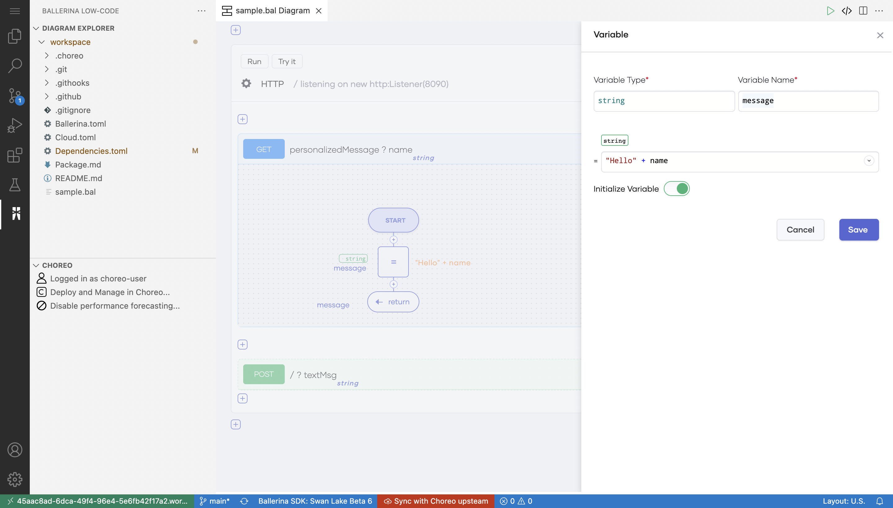
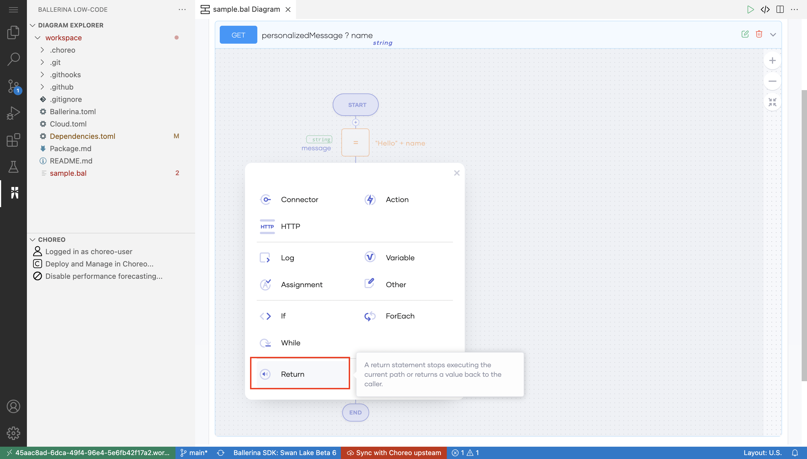
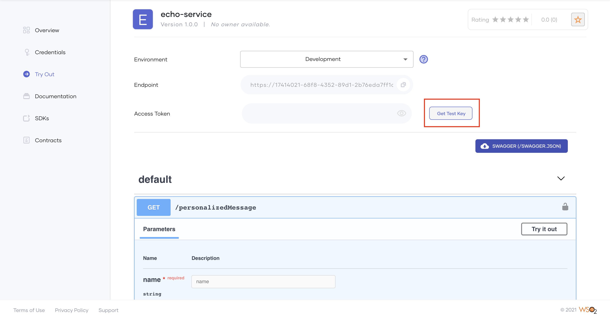

# Quick Start Guide

Choreo is a cloud-native low-code engineering platform that allows you to create APIs, API Proxies, triggers, and scheduled tasks to implement your integration solution. 

This quick start guide walks you through the steps to create, develop, publish, deploy, and invoke a REST API using Choreo. 

## Create your first REST API 

### Step 1: Create a REST API

1. Sign in to the Choreo Console at [https://console.choreo.dev/](https://console.choreo.dev/).

2. On the **Home** page, scroll to the **Use a sample and get started** section. 

3. Go to the **Echo Service** card and click **Get Started**.
 
Now you have successfully created an API using a template and you can see the flow diagram of the integration logic implemented for this API.

Next, let's deploy this API and make it invokable.
 
### Step 2: Deploy the REST API 

Choreo maintains 2 environments by default: development and production. Let's deploy the API to the development environment.

1. Click **Deploy** in the left pane. 

2. Go to the **Build Area** card and click **Deploy**.

    {.cInlineImage-full}

   This deploys the API to the development environment to make it invokable. 

Now let's test the REST API to verify whether it works as expected.

### Step 3: Test the REST API 

1. Click **Test** in the left pane.

2. Expand the **POST** method with the **/** resource path. 
    {.cInlineImage-full}

3. Click **Try it out**.

4. Add a meaningful string as the request body. For example, `Welcome to Choreo`.
    {.cInlineImage-full}

5. Click **Execute**. You'll see the string you entered in step 4 above returned as the server response.

Congratulations! You have now tested the REST API and are ready to implement the business logic.

## Implement the business logic

Developing the API involves writing the business logic for the API. APIs often need to integrate with third-party systems to create a comprehensive integration solution. With Choreo, you can create your integration solution easily using its low-code editor, pro-code editor, or both to publish your API at a faster time-to-market.

In this guide, you will further develop the API by adding a new resource and simple business logic to it:

### Step 1: Develop in low-code

1. Click **Develop** in the left pane.

2. Click **Edit with VS Code Online**.
 
    !!! info
        The VS Code Editor can take some time to open if you are a first-time user.
 
    {.cInlineImage-full}

3. Click **+** on the low-code diagram, click **Resource**, and configure it as follows: 
  
    {.cInlineImage-full}

     | **Field** | **Value** |
     |-----------------|-----------------------|
     | **HTTP Method** | `GET` |
     | **Path** | `personalizedMessage` |
     | **Return Type** | `string` |

4. Click **Advanced** and then click **+ Add Query Param** to add a query parameter with the following values to get a name as an input:

     | **Field** | **Value** |
     |-----------------|-----------------------|
     | **Type** | `string` |
     | **Name** | `name` |

     {.cInlineImage-full}

 5. Click **Save**.

 6. Expand the **GET personalizedMessage** resource. This displays the low-code diagram for it.

 7. Click **Variable** and configure it as follows: 
    {.cInlineImage-full}

     | **Field** | **Value** |
     |-----------------|-----------------------|
     | **Type** | `string` |
     | **name** | `message` |
     | **string** |`"Hello "+ name`|

     {.cInlineImage-full}

8. Click **Save**.

9. To return the personalized message, click **+** below the variable you created,  click **Return**, and enter `message` as the **Return Expression**.
   {.cInlineImage-full}

   {.cInlineImage-full}
   
10. Click **Save**.

!!!info
    You can click the **</>** icon on the top left corner of the editor if you want to work in the code view. Depending on your expertise, you can choose to work in the low-code view or pro-code view, or both simultaneously.    
    {.cInlineImage-full}

### Step 2: Commit Changes to GitHub

Choreo maintains source code in a private GitHub repository. When you create a component in Choreo, it creates it in the private-GitHub repository associated with your account. Therefore, when you change the API Implementation, you must commit and push your changes.

1. Click **Sync with Choreo upstream** on the bottom bar of the editor. 
    {.cInlineImage-full}

    Alternatively, you can click source control on the left pane or click **Sync changes with Choreo** in the pop-up displayed at the bottom right corner. 

    {.cInlineImage-full}

2. Click **Sync my changes with Choreo** in the window displayed. 

     {.cInlineImage-full}

3. Enter a meaningful commit message and click **✓** on the toolbar. This commits the changes to your private GitHub repository.

     {.cInlineImage-full}

4. Click **...** on the top toolbar and then click **Push**. 

!!! tip
    If you want to re-deploy new changes, see [Deploy Your REST API](#deploy-your-rest-api). 

 Now let's publish the API. 

## Manage your REST API

Choreo provides full API management capabilities so that you can manage your REST API lifecycle, apply security, apply rate-limiting policies, configure usage plans, and add documentation.

The following topics walk you through the steps to publish and invoke the API you created.  

### Step 1: Publish the API
Follow this procedure to publish the API to the API Developer Portal so that external consumers can view and consume the API:

1. Click **Manage** in the left pane.

2. On the **Lifecycle Management** page, click **Publish**.

3. Click **Go to Developer Portal**. 
    {.cInlineImage-full}
 
    You'll see the published API:
 
    {.cInlineImage-full}

### Step 2: Invoke the API 
Follow this procedure to invoke the REST API via the API Developer Portal:

1. Click **Credentials** in the left pane of the API Developer Portal.

2. Click **Generate Credentials**. Choreo creates credentials for an internal application and subscribes this API to that internal application.
     {.cInlineImage-full}

3. Click **Generate Access Token**, copy the generated access token, and click **Close**.

     {.cInlineImage-full}

4. Click **Try Out** in the left pane. 

5. Paste the copied access token in the **Access Token** field.
     {.cInlineImage-full}

6. Click the `GET` resource you added to expand it.

7. Click **Try it out** and enter a name for the query parameter.
     {.cInlineImage-full} 

8. Click **Execute**. You'll see the personalized message as the response from the API.

Congratulations! You have successfully created a REST API, published it on the API Developer Portal, and invoked it via the API Developer Portal.
