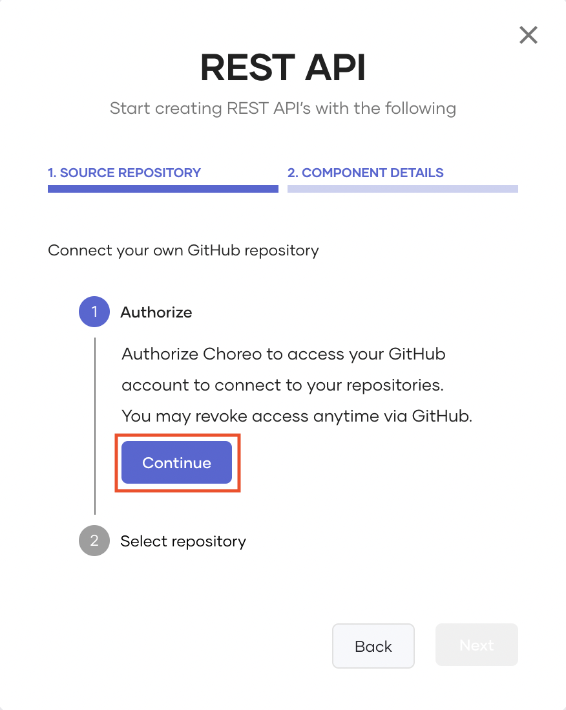
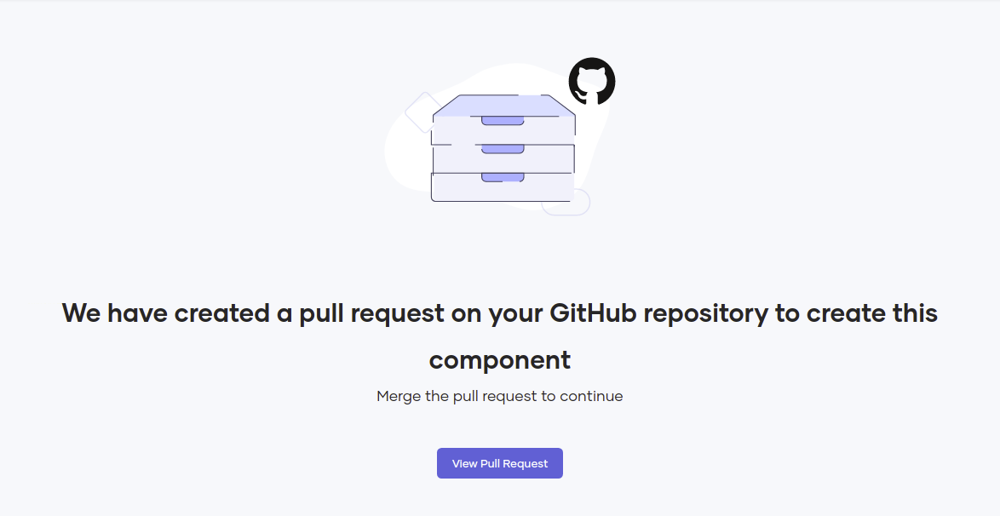

# Connect Your Existing Ballerina Project to Choreo

You can connect your existing Ballerina project repository to Choreo when you create any of the following components:

- REST API
- Manual Trigger
- Scheduled Task
- Webhook

Connecting your existing Ballerina repository to Choreo allows you to keep the source code of a component you create within your control. This capability also allows your development team to work on a particular Choreo component by collaborating via pull requests while adhering to enterprise-specific best practices and development guidelines such as PR checks, code analysis, styling preferences, etc.  

This tutorial walks you through the steps to connect your existing Ballerina project to Choreo when you create a REST API component. 

Let's get started!

1. Sign in to the Choreo Console at [https://console.choreo.dev](https://console.choreo.dev).
2. Create a project to add the REST API component. You can follow the instructions under [step 1 in the Connect Your Own GitHub Repository to Choreo](../connect-your-own-github-repository-to-choreo/#step-1-create-a-project-to-add-the-rest-api-component) tutorial.
3. On the **Components** page, click **+Create**.
4. Click the **REST API** card.
5. Click **Existing code**. This displays the REST API dialog box where you can proceed to connect your existing Ballerina project repository to Choreo.
6. To authorize Choreo to access your GitHub account, click **Continue**, enter your GitHub credentials, and select one or more repositories to install the [Choreo GitHub App](https://github.com/marketplace/choreo-apps).

    {.cInlineImage-half}

    !!!info

         - The **Choreo GitHub App** requires the following permission:
         - Read access to issues and metadata
Read and write access to code, pull requests, and repository hooks
         - You can [revoke access](https://docs.github.com/en/authentication/keeping-your-account-and-data-secure/reviewing-your-authorized-integrations#reviewing-your-authorized-github-apps) if you do not want Choreo to have access to your GitHub account. Choreo needs write access only to send pull requests to a user repository. Choreo does not directly push any changes to a repository.

7. Select the appropriate **GitHub account**, **GitHub repository**, and **Branch** depending on the existing Ballerina project repository you want to connect to Choreo.

    !!! tip 
        You must select a GitHub repository branch that includes an existing Ballerina project.

8. Click **Create** to proceed with component initialization. This displays a pull request similar to the following:
   {.cInlineImage-full}

9. Click **View Pull Request**.
10. Review and click **Merge pull request**, and then click **Confirm Merge**. 
   When you merge the pull request, it adds the necessary metadata files to connect your Ballerina project repository to Choreo so that you can proceed to create the component.

11. To configure the pre-commit hook that Choreo uses to extract configurables defined in the Ballerina code, follow the steps given below:

    !!! info
        When you develop a Choreo component via the Web Editor, Choreo configures this pre-commit hook automatically. However, when you develop a component locally, you need to configure this pre-commit hook manually.

     1. Carry out a GitHub pull locally to update your clone with the latest changes.

     2. In your terminal, navigate to the root directory of your GitHub repository and issue the following commands:

        !!! note
            Before issuing these commands, you need to check whether the `<MODULE_ROOT>/.githooks/pre-commit` file exists. If it does not, contact our Support team.

         - `chmod +x <MODULE_ROOT>/.githooks/pre-commit`
         - `git config core.hooksPath <MODULE_ROOT>/.githooks`

        !!! info
            If the Ballerina module resides at the repository root, exclude `<MODULE_ROOT>/` from the commands. If the Ballerina module resides in a subdirectory, replace `<MODULE_ROOT>/` with the name of that subdirectory.<br/><br/>For example, if the Ballerina module resides in the root directory, the commands can be as follows:<br/><br/> `chmod +x .githooks/pre-commit`<br/> `git config core.hooksPath .githooks`<br/><br/>If the Ballerina module resides in a subdirectory named `foo`, the commands should be as follows:<br/><br/> `chmod +x foo/.githooks/pre-commit`<br/>`git config core.hooksPath foo/.githooks`

     Once you have completed this configuration, your commits to update the component implementation will trigger the pre-hook and generate logs similar to the following extract.

      ```
      Compiling source
        johnsmith/foo:0.1.0

      Generating executable
        .choreo/build/bin/foo.jar
      [main ea3deab] test
      3 files changed, 7 insertions(+), 3 deletions(-)
      ```

Now you have successfully connected your existing Ballerina project repository to Choreo. You can go back to the Choreo Console tab to design the component depending on your requirement.

For details on how you can design, test, and commit a REST API component, follow the instructions from [step 3 onwards in the Connect Your Own GitHub Repository to Choreo](connect-your-own-github-repository-to-choreo/#step-3-design-the-rest-api) tutorial.
