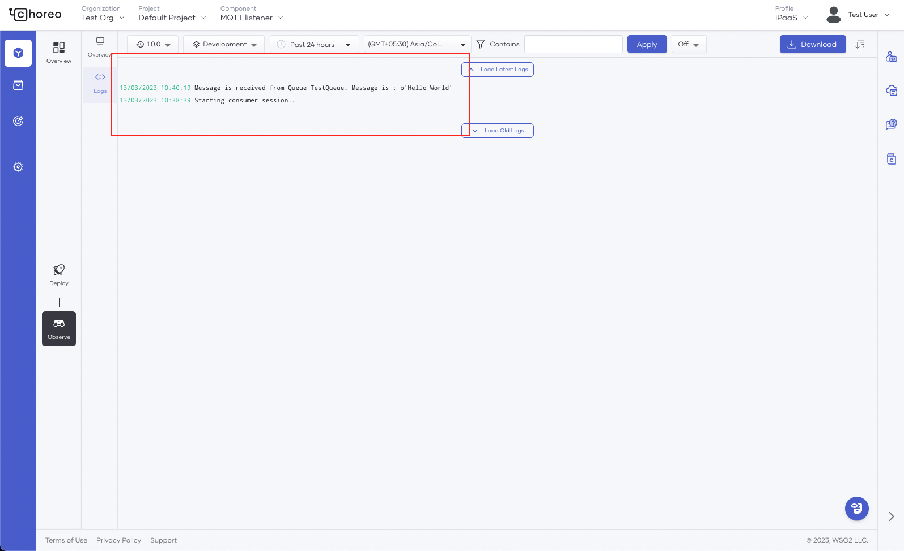

# Create Event-Triggered Integration as a BYOC component

Event-triggered integrations can help automate business processes and reduce manual work. Choreo allows you to create and manage event-triggered integrations without a complex infrastructure setup.

Consider a scenario where a developer has an event-triggered integration and he needs to deploy as a containerized application. This tutorial walks you through the steps to accomplish this requirement. 

In this tutorial, you will do the following:

- Create an event-triggered integration component in Choreo by connecting a GitHub repository with a sample containerized application developed using python language. 

	!!! info
    	    The sample application creates a [RabbitMQ](https://www.rabbitmq.com/) topic, listens to it and logs incoming messages.

- Deploy the integration component to the development environment in Choreo.
- Test the integration component.


!!! tip "Before you begin"
    - Fork the [choreo examples](https://github.com/wso2/choreo-examples) GitHub repository. For this tutorial, you need the [containerized-rabbitmq-listener](https://github.com/wso2/choreo-examples/tree/main/ipaas/micro-integrator/containerized-rabbitmq-listener) in the **choreo-examples** repository.  
 
    - Use an existing RabbitMQ instance or start a new [RabbitMQ](https://www.rabbitmq.com/download.html) instance. The instance should be accessible via the internet. Obtain the `username`, `host`, `password`, and `vhost` from the RabbitMQ instance to use later as environment variables. 

!!! tip "RabbitMQ instance"
    You can use RabbitMQ services such as [CloudAMQP](https://www.cloudamqp.com/) to set up RabbitMQ instances easily.
  
## Step 1: Create the integration component

Let's create the integration component by following the steps given below:

1. Go to [https://console.choreo.dev/ipaas](https://console.choreo.dev/ipaas) and sign in to the Choreo Console.

2. On the **Home** page, click **+Create Project**.

3. Enter a unique name and a description for the project, and select a region.

4. Click **Create**.  

5. Go to the **Event-Triggered Integration** card, click **Create**, and enter the following information:

    | **Field**       | **Value**               |
    |-----------------|-------------------------|
    | **Name**        | `MQTT listener`           |
    | **Description** | `My sample listener`    |
    
6. Click **Next**.

7. To allow Choreo to access your GitHub account, click **Authorize with GitHub**. 

	!!! tip
    	    If you have not already connected your GitHub repository to Choreo, enter your GitHub credentials, and select the [sample application](https://github.com/wso2/choreo-examples) GitHub repository to install the [Choreo GitHub App](https://github.com/marketplace/choreo-apps).

8. In the **Connect Repository** dialog box, enter the following information:

    | **Field**             | **Description**                                   |
    |-----------------------|---------------------------------------------------|
    | **GitHub Account**    | Your account                                      |
    | **GitHub Repository** | `choreo-examples`                                 |
    | **Branch**            | `main`                                            |
    | **Build Preset**      | Click **Dockerfile**                        |
    | **Path**              | `ipaas/micro-integrator/containerized-rabbitmq-listener` |
    | **Dockerfile Path**   | `Dockerfile` |  
    | **Docker Context Path**   | `.` | 

	!!! tip
    	    - **Build Preset** specifies the type of build to run depending on the implementation of the component. It converts the integration code into a Docker image that can run on the Choreo cloud. If an integration is developed using [WSO2 Integration Studio](https://wso2.com/integration/integration-studio/), select **Micro Integrator** as the build preset. If integration is developed using the [Ballerina language](https://ballerina.io), select **Ballerina** as the build preset. If integration is Containerized application, select **Dockerfile** as the build preset.

            - **Path** specifies the location of the project to build the component. 

9.   Click **Create**. This creates the component and takes you to the **Deploy** view, where you can proceed to deploy the component.


## Step 2: Deploy
Before you deploy the component, you must follow the steps given below to assign appropriate RabbitMQ credentials to the environment variables:

1. In the **Deploy** view, go to the **Development** card and click **Configure via the DevOps Portal**. This takes you to the **Configs & Secrets** page in the **DevOps** profile, where you can apply environment-specific configuration files, environment variables, and other secret resources to containers.
2. Click **Let's Get Started**.
3. In the **Mount a Configuration** page, select **Environment Variables** as the configuration type and click **Next**.
4. Select **Create New** and enter a **Config Name**. Here, let's specify `environmentconf` as the **Config Name**.
5. Click **Next**.
6. Specify the environment variables as key-value pairs. You must use the values you obtain from your RabbitMQ instance as the values for the following keys: 

    | **Key**    |
    |------------|
    | HOST       | 
    | USERNAME   |
    | PASSWORD   | 
    | VHOST      | 

7. Click **Finish**. Now you are ready to deploy the component to the developer environment. 

8. Go to the **iPaaS** profile and click the `MQTT listener` component you created.

9. Click **Deploy** on the left navigation, go to the **Build Area** card, and then click **Deploy Manually**.

    !!! info
        You have to deploy the component manually the first time. Subsequent deployments will occur automatically because automatic deployment is enabled by default.

After Choreo deploys the component, you can proceed to test it.

## Step 3: Test

To test the component, you must publish messages to a designated topic in your RabbitMQ server.

1. Go to the RabbitMQ Management Console and publish the following message to the **TestQueue** topic.

    ```
      Hello World
    ```
   Now you are ready to observe the logs and see the message received by the integration component.

    !!! info
         Our containerized python app creates the  **TestQueue** in the RabbitMQ queues once it is connected successfully. If you can not see this queue in the queue list of your RabbitMQ instance, most probably app is not connected correctly.  

2. Go to the **iPaaS** profile and click the `MQTT listener` component you created.

3. Click **Observe** on the left navigation, go to the **Logs** section, and observe the message received by the integration component from the RabbitMQ server. You will see a message similar to the following:

    !!! info
            It can take a few minutes for messages to appear in the **Logs** section. To view the latest logs, click **Load Latest Logs**.

      {.cInlineImage-full}

      This confirms that the event-triggered integration is functioning as expected.

    !!! tip
            The `Observe` view allows you to observe statistics related to your Choreo component. For more information on observing a Choreo component, see the [Observability overview](../../observe-and-analyze/observe/observability-overview.md).


Congratulations! You have successfully created an event-triggered integration in Choreo with an existing containerized integration, deployed the integration component, triggered an event, and tested the component.
