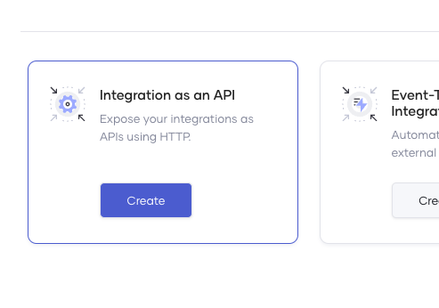
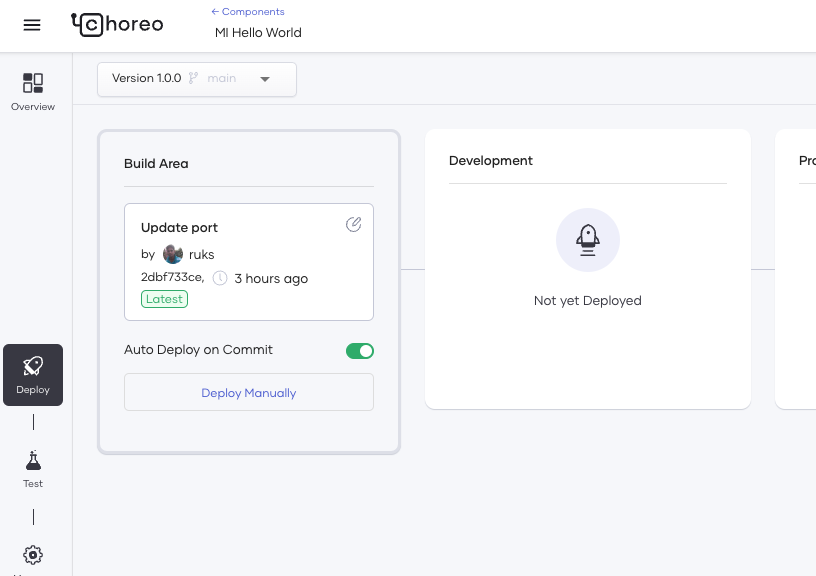
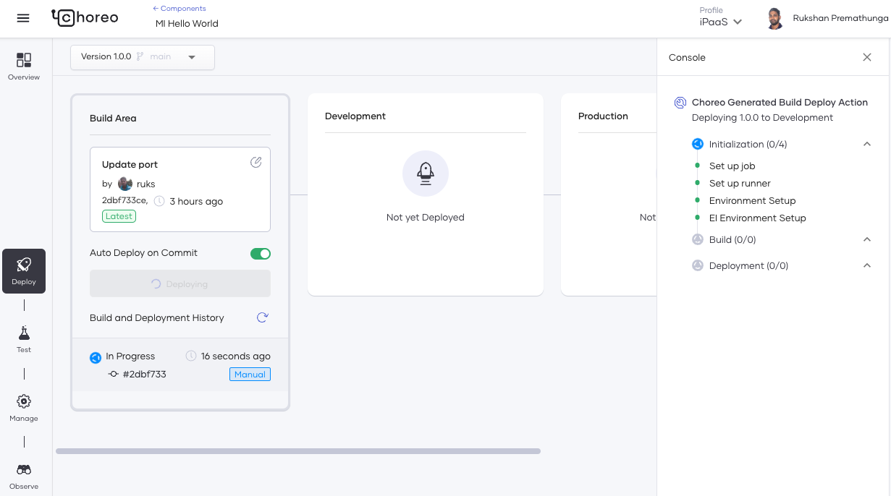
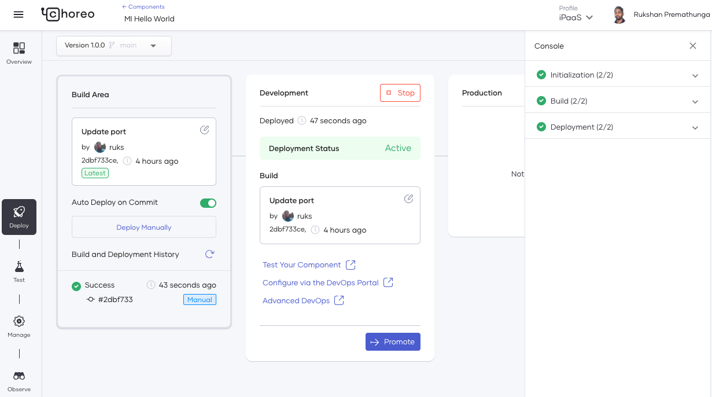
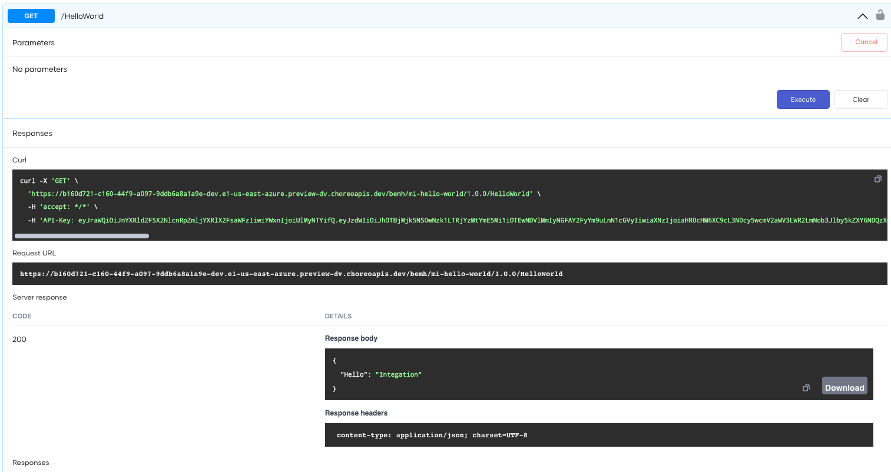

# Create Your First Integration

An integration component integrates APIs, microservices, applications, and data in different languages and formats.

Consider a scenario where a developer has created an integration in [WSO2 Integration Studio](https://wso2.com/integration/integration-studio/) and wants to use it for API-led integration by exposing it in Choreo. In this tutorial, you will learn how to do the following actions to address this requirement:

- Expose an integration created in [WSO2 Integration Studio](https://wso2.com/integration/integration-studio/) as an API in Choreo by connecting the GitHub repository in which it resides to Choreo.
- Deploy the Integration component to the development environment.
- Test the Integration component.
- Observe statistics for the Integration component.
- Publish the Integration component and try it out in the production environment.

For this tutorial, let's use a basic sample application for the purpose of exposing a proxy service developed in the [WSO2 Integration Studio](https://wso2.com/integration/integration-studio/).

!!! tip "Before you begin!"
    To try this tutorial, you can use a sample integration designed via [WSO2 Integration Studio](https://wso2.com/integration/integration-studio/).  To do this, fork the [https://github.com/wso2/choreo-examples/tree/main/ipaas/wso2-synapse/simple-proxy](https://github.com/wso2/choreo-examples/tree/main/ipaas/wso2-synapse/simple-proxy).

## Step 1: Create

Let's add the integration by following the steps given below:

1. Sign in to the Choreo Console at [https://console.choreo.dev/](https://console.choreo.dev/).

2. On the **Home** page, click on the project in which you want to create the integration. Alternatively, you can click **+ Create Project** and add a new project.

3. If your project has one or more components, click **+ Create**. If not, proceed to the next step.

    {.cInlineImage-small}

4. On the **Integration as an API** card, click **Create** to start creating a micro integrator REST API.

5. Enter a name and a description for the micro integrator REST API. For example, you can enter `MI Hello World` as the name and `MI Hello World REST API` as the description.

6. To the micro integrator REST API as a publicly accessible API, leave the selection in the **Access Mode** list unchanged.

7. Click **Next**.

8. Authorize Choreo to connect to your GitHub account by clicking **Authorize with GitHub**.

9. If you have not already authorized Choreo applications, click **Authorize Choreo Apps** when prompted.

10. Enter information related to the GitHub repository you want to connect as follows:

     | **Field**             | **Value**                                                                                      |
     |------------------------------------------------------------------------------------------------|-------------------------------------------------------------------------------------------------------------|
     | **GitHub Account**    | Select your GitHub account.                                                                    |
     | **GitHub Repository** | Select your fork of the [Choreo examples repository](https://github.com/wso2/choreo-examples). |
     | **Branch**            | `main`                                                                                         |

11. Under **Build Preset**, click **Micro Integrator**.

     !!! info
         The build preset specifies the type of build that Choreo needs to run for the component (for example, Choreo needs to run a micro integrator build for components developed via the [WSO2 Integration Studio]((https://wso2.com/integration/integration-studio/), a Ballerina build for a component added via a Ballerina project etc.).

12. Enter information related to the `MI Hello World` project as follows:

    | **Field**             | **Value**                        |
             |-----------------------|-------------------------------------------------------------------------------------------------------------|
    | **Path**    | ipaas/wso2-synapse/simple-proxy                                                                                 |
    | **OpenAPI File Path** | ipaas/wso2-synapse/simple-proxy/openapi.yaml |
 
13. Click **Create**.

The micro integrator REST API opens on a separate page.

## Step 2: Deploy

Let's deploy the micro integrator REST API you created to the developer environment by following the steps given below:

1. Click the **Deploy** icon. Then in the **Build Area** card, click **Deploy Manually**.

   !!! note
   Automatic deployment is enabled by default. However, you have to deploy the component manually the first time. Subsequent deployments will occur automatically.

   {.cInlineImage-small}

2. To check the progress of the deployment, observe the **Console** pane.

   {.cInlineImage-threeQuarter}

Once the API is deployed, the **Development** card indicates that the API is active as shown below.

{.cInlineImage-threeQuarter}

Once Choreo has deployed the micro integrator REST API, you can proceed to the next step to test it.

## Step 3: Test

Once you have deployed the Integration REST API you can test it via the OpenAPI Console, or a cURL command.

In this tutorial, let's test via the OpenAPI Console:

1. To open the test view, click **Test** in the **Development** card. Alternatively, you can click the **Test** icon in the left panel.

2. Click **OpenAPI Console**.

3. Select **/HelloWorld** resource and click **Try it out**.

4. Click **Execute**.

   Choreo displays the following response body under **Responses**.

   {.cInlineImage-half}

The above response indicates that your micro integrator REST API is working as expected.

## Step 4: Observe

To observe statistics for your micro integrator REST API, click **Observe** in the left navigation menu. The graphs for throughput and latency will display the request you sent in [Step 3: Test](#step-3-test).

For more information about observing components, see [Observability Overview](../../observe-and-analyze/observe/observability-overview.md).

## Step 5: Publish

Let's publish the micro integrator REST API to make it available for subscriptions in the Developer Portal.

1. In the left navigation menu, click **Manage**, and then click **Lifecycle**.

2. Click **Publish**.

    The lifecycle status of the API will change to **Published**.

3. To view the API in the Developer Portal, click **Go to Devportal**. The API opens on a separate page in the Developer Portal.

Congratulations! You have successfully exposed an integration designed in the [WSO2 Integration Studio](https://wso2.com/integration/integration-studio/) as a REST API in Choreo and published it!

!!! info "What's next"
    For a micro integrator REST API, you can also perform API management actions. For more information about these API Management actions, see [API Management](../../manage/api-management.md).

