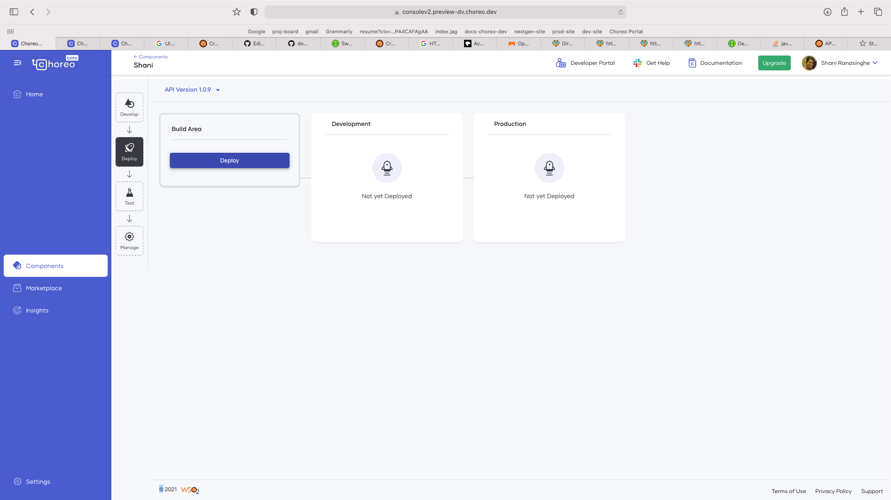
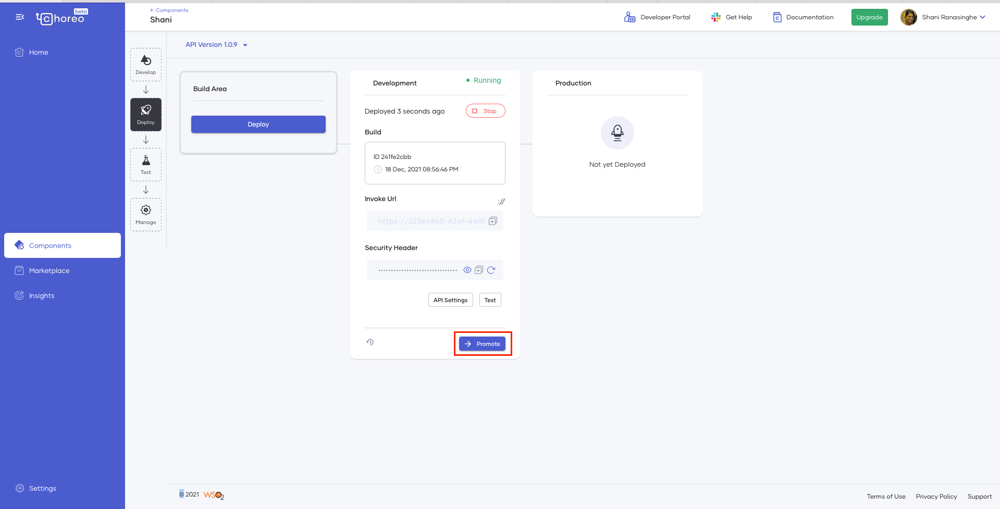
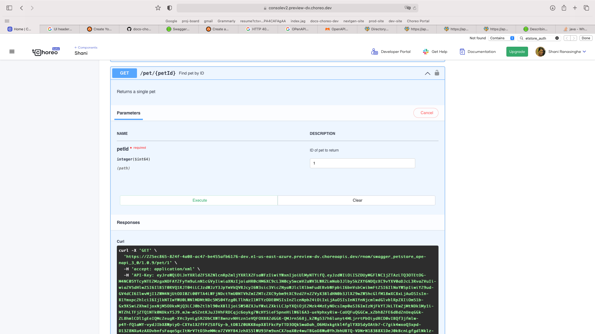
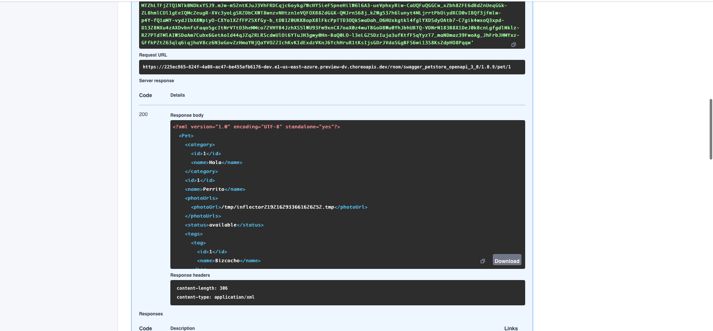
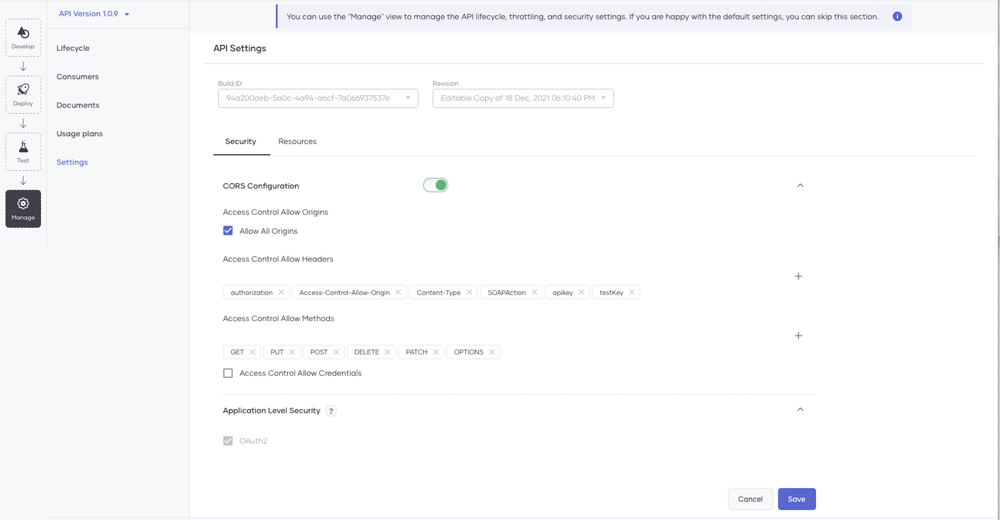
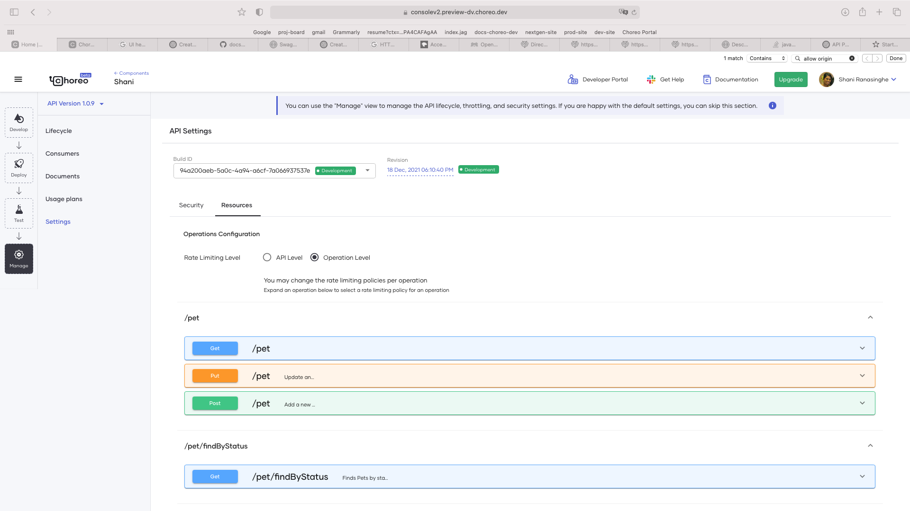
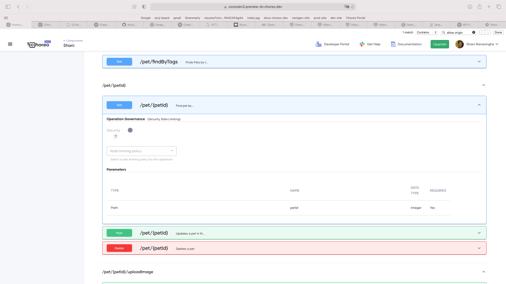
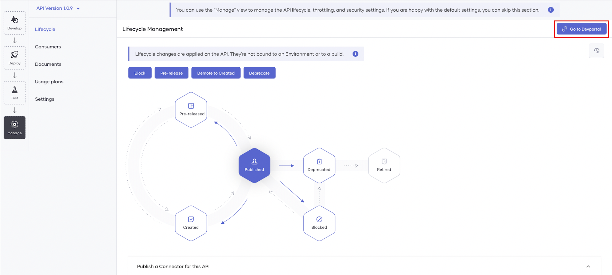

# Create Your First REST API Proxy

Choreo is a low-code cloud-native platform for building integration solutions. In this tutorial, you will do the following to explore REST API Proxies in Choreo:

1. Expose an existing API by creating a REST API proxy
2. Deploy the REST API proxy
3. Test the REST API proxy to verify its functionality
4. Manage your REST API proxy by adding rate limiting and security policies and leveraging the platform's API management capabilities.

!!!tip "Before you begin..."
    Familiarize yourself with REST API Proxies in Choreo. [REST API Proxies](../../develop/components/api-proxies/api-proxy.md) 

Let's begin...
## Step 1: Create a REST API Proxy

You can create a REST API proxy in one of the following methods: 

- Design a new REST API proxy using an existing endpoint. 
- Importing an OpenAPI specification of the existing API.

In this tutorial, you will be importing an OpenAPI specification and creating a REST API proxy:

1. Sign in to the Choreo Console at [https://console.choreo.dev](https://console.choreo.dev).

2. Expand the project dropdown on the console header and click **+ Create New** to create a new project.
   {.cInlineImage-full}

3. Enter a unique name and description for your project and click **Create**. 

    You can now start adding components to your project. Let's add a REST API proxy component.

    !!! tip
        Once you create a project successfully, you are taken to the components landing page. You can also select the components icon from the left menu and open the **Components** landing page. 

4. On the **Components** landing page, click **Create**.

5. Click the **REST API Proxy** card.

6. Click **Import OpenAPI**.

7. Select the **Input Type** and provide the OpenAPI URL as follows:
 
    | **Field** | **Value** |
    |-----------------|-----------------------|
    | **Input Type** | OpenAPI URL |
    | **OpenAPI URL** | `https://petstore3.swagger.io/api/v3/openapi.json` |

8. Click **Next**.

9. Review the information (API Name, API Version, API Base Path, Endpoint) that Choreo extracted from the OpenAPI. You can make any changes to the fields if you require. Click **Create** to create your REST API Proxy.

## Step 2: Developing the REST API Proxy

1. Click **Develop** The Web Editor opens. 
       
       Notice all the resources on the OpenAPI specification are populated on Choreo.

2. Click **API Definition** and view the OpenAPI specification. The API definition will include any modifications you made in the **Resources** tab.

## Step 3: Deploy the REST API Proxy

Deploying the REST API proxy makes it invokable. Choreo maintains two environments by default: development and production. [Learn more](../../develop/components/api-proxies/api-proxy#choreo-environments). 

1. Return to the Choreo Console. From the left navigation, click **Deploy**. 

2. Let's deploy the REST API proxy to the development environment. Click **Deploy** in the **Build Area** column.
    {.cInlineImage-full}

3. Once you have deployed it to the development environment, you can test it. When you are ready to take it to production, you can come back to this view and promote it by clicking on the **Promote** button on the **Development** column.
    {.cInlineImage-full}

## Step 4: Test your REST API Proxy

In Choreo, you can test your REST API proxy before publishing it for consumers to use. Choreo provides you with three modes to test your REST API proxy: 

- OpenAPI Console 
- cURL
- Postman

In this tutorial, let's use the inbuilt OpenAPI Console. 

1. Click **Test** from the left navigation.

2. Select `Development` as the environment from the **Environment** dropdown. 

3. Choreo uses OAuth 2.0 Therefore, you will notice the security header. Click **Get Test Key** to generate a new test key for testing purposes.

4. Let's invoke. Expand the **GET** resource **/pet/{petID}**.
 {.cInlineImage-full}

5. Click **Try it Out**.

6. Enter `1` as the **petid**.

7. Click **Execute** and observe the response. 
    {.cInlineImage-full}

## Step 5: Manage your REST API Proxy

Now that you have a tested REST API proxy, let's publish it and make it available for application developers to consume.

### Step 5.1: Secure your REST API Proxy

First, let's review the security settings and add a rate limit to the API. 

1. Click **Manage** on the left navigation and click **Settings**.

2. Click **Security**. Review the security settings. If you wish to change the security settings, click **Edit** at the bottom of the page and make the necessary changes. Once the changes are confirmed, you can save them by clicking on **Save**.
    {.cInlineImage-full}

3. Next, let's add a rate-limiting policy to the API. Click **Resources**.

4. Scroll down to the end of the page and click **Edit**.

5. Scroll back up and select the **Rate Limiting Level** to be **API Level**. Here, you are adding a rate-limiting policy to the entire API. You can also choose to apply rate limits per resource. [Learn more](../../develop/components/api-proxies/api-proxy#settings)
    {.cInlineImage-full}
    {.cInlineImage-full}

5. Next, from the dropdown, select an appropriate rate limiting level.

6. Click **Save**.

### Step 5.2: Apply usage plans on the REST API Proxy

Apply usage plans on the REST API proxy to allow API developers to select the suitable usage plan when subscribing to the REST API proxy.

1. Click **Usage Plans** from the left menu. 

2. Select **Bronze**, **Gold**, and **Unlimited**. 

3. Click **Save**.

### Step 5.3: Publish the REST API Proxy 

Publishing the REST API proxy makes it available for consumers to discover and subscribe to. 

1. Click **Lifecycle** from the left menu. 

2. Click **Publish**.

    A pop-up named **Publish a connector** appears. Let's publish a connector for this REST API proxy. Creating a connector for this REST API proxy makes it available on the Marketplace. Click **Yes, Please**.

3. Click **Publish**.

    As a result, the status of the API changes to **Published**.

    To understand how a user can generate credentials for the API and then invoke it, proceed to the next step.

### Step 5.4: Invoke your REST API Proxy

Now your REST API proxy is ready to be consumed. An application developer can discover your REST API proxy, subscribe to it, and invoke it. 

#### Step 5.4.1: Generate Credentials

1. On the **Lifecycle Management** page, click **Go to DevPortal**.
    {.cInlineImage-full}

2. Once you sign in to the API Developer Portal, click **Credentials** in the navigator.

3. Click **Generate Credentials**. As a result, Choreo populates the **Consumer Key** and **Consumer Secret** fields with the newly generated tokens.

4. Click **://Curl**. Then copy the cURL command that is displayed.

    !!!info
        Click the button to copy the cURL command. **Do not manually copy it**. The displayed cURL command is only a template, and it does not include the generated credentials.

5. Close the **Get cURL to Generate Access Token** card. Then click **Update**. 
    A message appears to confirm that the keys are successfully updated.
 
6. Replace `consumer-key` and `consumer-secret` with the consumer key and the consumer secret you generated in the API Developer Portal to generate an access token.

Now, let's try out the REST API proxy you created by invoking a resource. 

#### Step 5.4.2; Invoke the REST API Proxy

1. Click **Try out**.

2. Enter the following values:

    | **Field** | **Value** |
    |-----------------|-------------------------------|
    | **Environment** | `Development` |
    | **Access Token**| the generated access token in step 6. Alternatively, click **Get Test Key** to generate a test access token. |

3. Expand the **GET** resource **/pet/{petid}**

4. Click **Try it out**.

5. Enter the **petid** value as `1`.

6. Click **Execute** and observe the response. 

Congratulations! You have successfully created your first REST API Proxy, deployed, developer tested, managed, and invoked it. 
