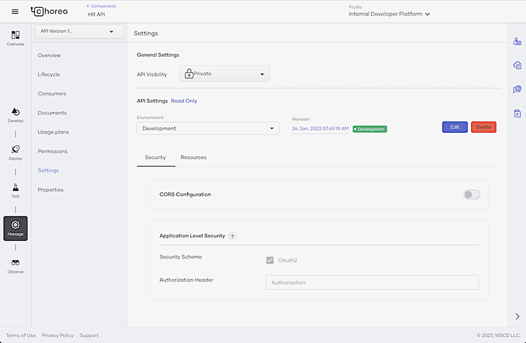
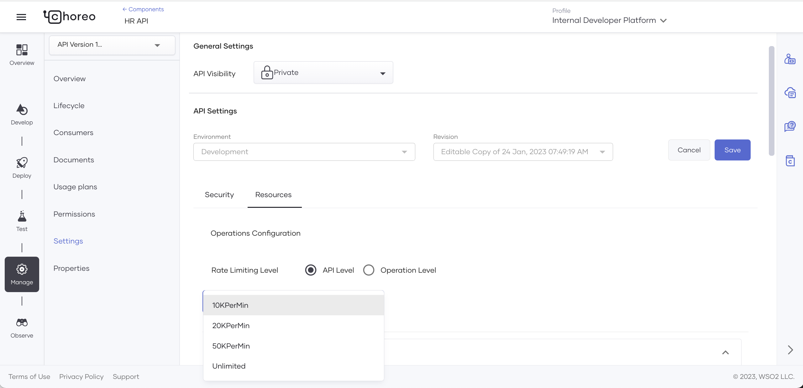
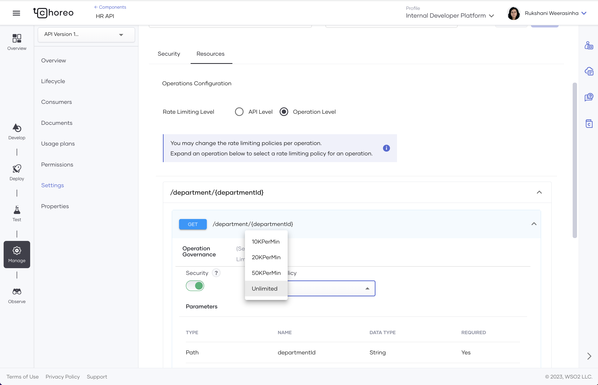

# Create Your First REST API Proxy

This tutorial introduces REST API proxies. 

An API Proxy exposes an existing API on Choreo and intercepts the requests to the REST API. It API Proxy acts as a managed API to which you can apply security, rate-limiting, etc.

In this tutorial, you will learn how to do the following:

1. Expose an existing API by creating a REST API proxy
2. Deploy the REST API proxy
3. Test the REST API proxy to verify its functionality
4. Manage your REST API proxy by adding rate limiting and security policies, thereby leveraging the platform's API management capabilities.

!!!tip "Before you begin..."
    Familiarize yourself with REST API Proxies in Choreo. [REST API Proxies](../../develop/components/api-proxy.md) 


Let's begin!

## Step 1: Create a REST API Proxy

You can create a REST API proxy in one of the following methods: 


In this tutorial, you will be providing a URL to an OpenAPI definition of a sample API. 

1. Sign in to the Choreo Console at [https://console.choreo.dev](https://console.choreo.dev).

2. Click **+ Create Project**. Enter a unique name and a description for the project, and click **Create**.

3. On the **REST API Proxy** card, click **Create**.

4. Click **Try with Sample URL** to create an API proxy for a sample API.

5. Enter API proxy details as follows:

    |  **Field**    | **Value**                                   |
    |---------------|---------------------------------------------|
    | **Name**      | `HR API`                                    |
    | **Base Path** | `<DEFAULT_VALUE>/ abc-hr`                   |
    | **Version**   | `1.0.0`                                     |
    | **Target**    | `https://samples.choreoapps.dev/company/hr` |

7. Click **Create**. 

The API proxy opens on a separate page.

## Step 2: Develop the REST API Proxy

Let's develop the REST API proxy by adding an operation. To do this, follow the steps given below:

1. In the left navigation, click **Develop**.

2. In the **Resources** tab, add a new resource to fetch the department ID as follows:

    1. Select **GET** as the HTTP verb.

    2. Enter `/department/{departmentId}` as the URI pattern.

    3. To add the new resource, click **+**.

    4. Once the resource is added, expand it, and then enter a name and a description for it as given below:

        | **Field**        | **Description**                      |
        |------------------|--------------------------------------|
        | **Operation ID** | `findDepartment`                     |
        | **Description**  | `Find a department by Department ID` |

    5. Click **Save**.

3. Click **API Definition**. You will see the new operation you added in the OpenAPI definition.

## Step 3: Deploy the REST API Proxy

Deploying the REST API proxy makes it invokable. By default, Choreo maintains two environments for development and production. [Learn more](../../develop/components/api-proxies/api-proxy#choreo-environments). For this tutorial, let's deploy the proxy to the development environment.

1. In the left navigation menu, click **Deploy**. 

2. Click **Configure & Deploy**. The **Configure & Deploy** pane opens.

3. In the **Endpoint** field, enter `https://samples.choreoapps.dev/company/hr`. 

    The above URL is the endpoint of the sample API.

4. If you have a sandbox environment to test the API proxy, you can give the URL to that environment in the **Sandbox Endpoint** field.

5. Click **Save & Deploy**.

Once you have deployed it to the development environment, you can test it. When you are ready to take it to production, you can return to this view and promote it by clicking **Promote** on the **Development** card.

## Step 4: Test your REST API Proxy

In Choreo, you can test your REST API proxy before publishing it for consumers to use it. Choreo provides you with three modes to test your REST API proxy: 

- OpenAPI Console 
- cURL
- Postman

In this tutorial, let's use the inbuilt OpenAPI Console. 

1. In the left navigation menu, click **Test**.

2. In the **Environment** list, select **Development**.

3. Choreo uses OAuth 2.0 Therefore, you will notice the security header. Click **Get Test Key** to generate a new test key for testing purposes.

4. Let's invoke. Expand the **GET** resource with the **/department/{departmentId}** path and click **Try it Out**.

5. Enter `1` in the **departmentId** field and click **Execute**.

    You will see the following response:

    ```json
     {
      "id": "1",
      "name": "Finance"
     }
    ```

## Step 5: Manage your REST API Proxy

Now that you have a tested REST API proxy, let's publish it and make it available for application developers to consume.

### Step 5.1: Secure your REST API Proxy

First, let's review the security settings and add a rate limit to the API. 

1. Click **Manage** on the left navigation and click **Settings**.

2. Click **Security**. Review the security settings. If you wish to change the security settings, click **Edit** and make the necessary changes. Once the changes are confirmed, you can save them by clicking **Save**.
    {.cInlineImage-full}

3. Next, let's add a rate-limiting policy to the API. Click **Resources**.

4. Click **Edit**.

5. Select **API Level** as the rate-limiting level and then select the required rate-limiting level. Here, you are adding a rate-limiting policy for the entire API.  

    {.cInlineImage-full}

    !!! info
        You can also apply rate limits per resource as shown in the image below.<br/><br/>{.cInlineImage-full}<br/><br/>[Learn more](../../develop/components/api-proxies/api-proxy#settings).

8. Click **Save**.

### Step 5.2: Apply usage plans on the REST API Proxy

Apply usage plans on the REST API proxy to allow API developers to select the suitable usage plan when subscribing to the REST API proxy.

1. In the left pane, click **Usage Plans**. 

2. Select the **Bronze**, **Gold**, and **Unlimited** checkboxes. 

3. Click **Save**.

### Step 5.3: Publish the REST API Proxy 

Publishing the REST API proxy makes it available for consumers to discover and subscribe. 

1. In the left pane, click **Lifecycle**. 

2. Click **Publish**.

    A message appears where you can specify whether you want to publish a connector for this REST API proxy. Creating a connector for this REST API proxy makes it available in the Marketplace. Click **Yes, Please**.

3. Click **Publish Connector**.

    This changes the status of the API to **Published**.

    To understand how a user can generate credentials for the API and then invoke it, proceed to the next step.

### Step 5.4: Invoke your REST API Proxy

Now your REST API proxy is ready to be consumed. An application developer can discover your REST API proxy, subscribe to it, and invoke it. 

#### Step 5.4.1: Generate Credentials

1. On the **Lifecycle Management** page, click **Go to DevPortal**.

    {.cInlineImage-full}

2. Once you open the API Developer Portal, click **Credentials** in the left navigation menu.

3. Click **Generate Credentials**. Choreo populates the **Consumer Key** and **Consumer Secret** fields with newly generated tokens.

4. Click **://Curl**. Then copy the cURL command that is displayed.

    !!!info
        Click the icon for copying to copy the cURL command. **Do not manually copy it**. The displayed cURL command is only a template, and it does not include the generated credentials.

5. Close the **Get cURL to Generate Access Token** card. Then click **Update**.

    A message appears to confirm that the keys are successfully updated.
 
6. Issue the cURL command you copied to generate an access token.

    !!! info "Before issuing the cURL command:"
        Replace `consumer-key` and `consumer-secret` with the consumer key and the consumer secret you generated in the API Developer Portal.

    Now, let's try out the REST API proxy you created by invoking a resource.

#### Step 5.4.2; Invoke the REST API Proxy

1. In the left navigation menu, click **Try out**.

2. Enter the following values:

    | **Field** | **Value** |
    |-----------------|-------------------------------|
    | **Environment** | `Development` |
    | **Access Token**| the generated access token in step 6. Alternatively, click **Get Test Key** to generate a test access token. |

3. Expand the **GET** resource with the **/department/{departmentId}** path and click **Try it out**.

4. Enter the **departmentId** value as `1`.

5. Click **Execute** and observe the response. 

Congratulations! You have successfully created your first REST API Proxy, deployed, developer tested, managed, and invoked it. 
