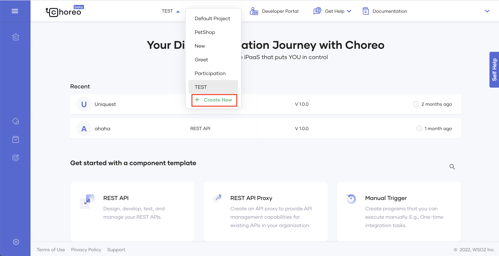

# Create Your First REST API

A RESTful API (Application Program Interface) uses HTTP requests to access and use data. The operations you can perform on data are GET (reading), PUT (updating), POST (creating), and DELETE (deleting).

Choreo’s low-code editor allows developers to easily design (and then implement) high-quality REST APIs. To explore this capability, let's consider a scenario where an Analyst needs to retrieve the daily count of COVID-19 patients per one million population by country. In this tutorial, you will address this requirement by doing the following:

- Design a REST API that addresses the described requirement, test it in the Web Editor, and then commit it so that it is available in the Choreo Console.
- Deploy the REST API you created to make it available for use.
- Test the REST API after deploying it to check whether it works as expected.

## Step 1: Create

In this section, let's create the API that retrieves COVID-19-related statistics.

### Step 1.1: Create a project and add a REST API component

1. Sign in to the Choreo Console at <a  href="https://console.choreo.dev?utm_source=choreo_docs" onclick="appInsights.trackEvent({name: 'choreo-docs-rest-api-product-link', properties: { utm_source: 'choreo_docs' }});">https://console.choreo.dev/</a>.

2. On the **Home**** page, click the **+ Create Project**.

    {.cInlineImage-small}

3. Enter a unique name and a description for the project. For this tutorial, let's enter the following values:

    | **Field**       | **Value**                             |
    |-----------------|---------------------------------------|
    | **Name**        | `COVID-19Stats`                       |
    | **Description** | `Get statistics relating to COVID-19` |

4. Click **Create**. This takes you to the **Components** page.

### Step 1.2: Add a REST API component

Let's create a new REST API component as follows:

1. On the **Components** page, click **Create** on the the **REST API** card.

    {.cInlineImage-small}

2. Enter a unique name and a description for the API. For this tutorial, let's enter the following values:

    | **Field**       | **Value**             |
    |-----------------|-----------------------|
    | **Name**        | `Statistics`          |
    | **Description** | `COVID-19 Statistics` |

3. Click **Next**.
4. Provide authorization for Choreo to connect to your GitHub account by clicking  **Authorize with GitHub**. 
5. If you have not already authorized Choreo applications, click **Authorize Choreo Apps** when prompted.
6. Select a GitHub account, a repository that includes the implementation, the relevant branch, and the build preset (i.e., **Ballerina** or **Dockerfile**).
7. Enter a valid path relative to the root of your repository that points to the implementation of the REST API. If you have not designed and implemented your REST API yet, you can connect an empty repository or a sub-folder and proceed to create the component. 

    !!! note
        You can create a component by connecting an empty GitHub repository. But you can only deploy it after you implement it. 

8. Next, click **Create**.

### Step 1.2: Design the REST API

Designing the REST API involves specifying how the REST API should function by adding and configuring the required connectors and statements. You can do this by editing the low-code diagram of the REST API or by editing its code.

You can implement your REST API in Ballerina or any other language and containerize it. You can use the [Ballerina VS code extension](https://ballerina.io/downloads/) to develop the REST API in Ballerina. [Learn more](https://wso2.com/vscode-extentions/ballerina/).

## Step 2: Deploy

Once you have designed, tested, and committed the REST API, you need to deploy it so that users can invoke it.

To deploy the API, follow the steps below:

1. Click the **Deploy** icon. Then in the **Build Area** card, click **Deploy Manually**.
   
    !!! note
         Automatic deployment is enabled by default. However, you have to deploy the component manually the first time. Subsequent deployments will occur automatically.

    {.cInlineImage-small}

2. To check the progress of the deployment, observe the **Console** pane.

    {.cInlineImage-threeQuarter}

Once the API is deployed, the **Development** card indicates that the API is active as shown below.

{.cInlineImage-threeQuarter}

Now you can test your deployed REST API to check again whether it is working as expected.

## Step 3: Test

Once you have deployed the Choreo application you can test it via the OpenAPI Console, a cURL command, or Postman.

In this tutorial, let's test via the OpenAPI Console:

1. To open the test view, click **Test** in the **Development** card. Alternatively, you can click the **Test** icon in the left panel.

2. Click **Try it out**.

3. In the **country** field, enter `USA`.

4. Click **Execute**.

    Choreo displays the following response body under **Responses**.

    {.cInlineImage-half}

Congratulations! You have now successfully created and tested a REST API in Choreo!

## Step 4: Manage

Once you have successfully deployed your API and tested it, you can perform the following actions for it

- Manage the lifecycle: You can publish your API to the Developer Portal to make it available for public use, or deploy it as a prototype so that users can try it out and provide feedback for improvement. Once you publish an API, you can deprecate it or block it from being used if required.

- Validate subscriptions: You can configure subscription validation to mandate subscriptions.

- Add documents: This involves attaching files with information about the API for users.

- Select/switch usage plans: You can select a usage plan for your API out of `Bronze` `Silver`, `Gold`, and `Unlimited` based on the level of traffic that you expect the API to receive. You can change the usage plan when required.

- Update API settings.
