# Create Your First Webhook

Choreo’s low-code editor allows developers to easily design (and then implement) high-quality webhooks. To explore this capability, let's consider a scenario where a team of software engineers in an organization wants to be notified via email whenever someone creates a GitHub issue with the `bug` label in a specific repository. 

In this tutorial, you will address this requirement by doing the following:

- Design a webhook that addresses the described requirement and test it in the Web Editor (i.e., the editing tool of Choreo), and commit the changes so that they are also available in the Choreo Console.
- Deploy the webhook you created to the development environment.
- Integrate GitHub with Choreo by connecting the webhook that you created to the required GitHub repository.
- Test the webhook.
- Promote the webhook to the production environment.

## Step 1: Develop

To create a project, add a Webhook component to it, design the webhook, test it, and then commit it to make it available in the Choreo Console, follow these sub-steps:

### Step 1.1: Create a project and add a Webhook component

First, let's add a Webhook component as follows:

1. Sign in to the Choreo Console at [https://console.choreo.dev](https://console.choreo.dev).

2. Expand the **Project** list and click **+ Create New**.

    {.cInlineImage-full}

3. Enter a unique project name and a description. For this tutorial, let's enter the following values:

    | **Field**       | **Value**             |
    |-----------------|-----------------------|
    | **Name**        | `IssueTracking`       |
    | **Description** | `Track GitHub issues` |

4. Click **Create**.

    The **Components** page opens as shown in the below image.

    {.cInlineImage-full}

5. On the Components page, click **+ Create**.

6. Click **Webhook**.

    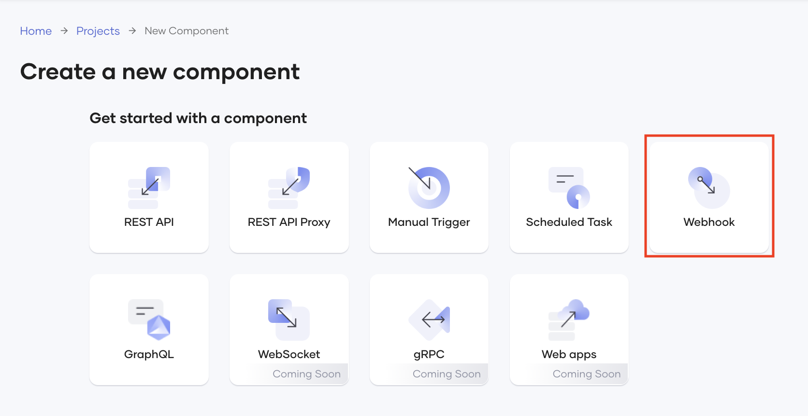{.cInlineImage-full}

7. Click **Start from scratch**.

8. Select **GitHub** as the event source.

    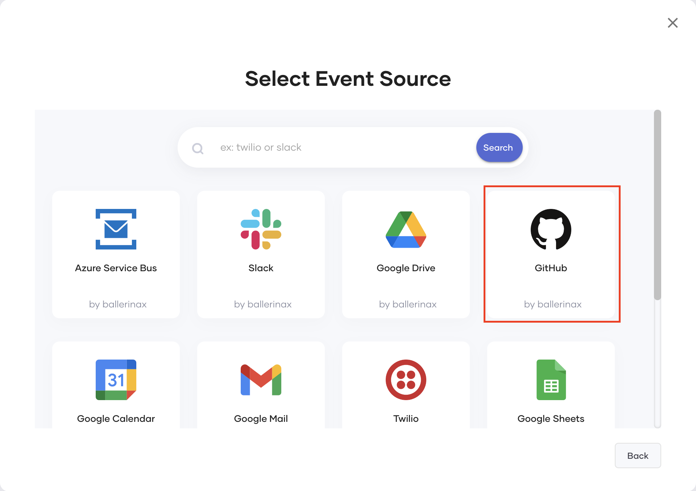{.cInlineImage-half}

9. In the **Webhook** dialog, enter information as follows:

    1. In the **Webhook Name** field, enter a unique webhook name (e.g., `IssueTracking`).
   
    2. From the **Trigger Channel** list, select **IssuesService** so that the system can trigger your webhook based on a change it observes in GitHub issues (i.e., assigning a label in this scenario).
   
    3. You need to save your Webhook implementation in a GitHub repository from which Choreo can access it. You can use a Choreo-managed GitHub repository or one of your own GitHub repositories. Let's use the Choreo-managed GitHub repository, which is the default selection.

    4. Click **Create**.

         The webhook opens on a separate page.
      
### Step 1.2: Design the webhook

In this step, let's design the webhook to read the labels of GitHub issues in a specific repository and generate an email notification for GitHub issues with the `bug` label. To do this, follow these steps:

1. To access the Web Editor in which you will design the webhook, click **Edit Code**.

    The Web Editor opens in a separate browser tab. 

    !!! info
        Opening the Web Editor may take a little while if you are a first-time user.


2. In the Web Editor, scroll down to the **onLabeled** resource under the GITHUB section. This resource is the default resource that is triggered by labels of GitHub issues. Let's first add a variable that reads the issue labels:

    1. Click the **+** icon after **Start**.
   
    2. In the **Add Constructs** pane, click **Variable**.
   
    3. In the **Variable** pane, update the statement template as follows:
   
        !!! Tip
            When you open the **Add Constructs** pane and select a statement type, you are accessing the Statement Editor that assists you to construct statements.<br/><br/> To edit each value, you can double-click the default value and enter the new value.<br/><br/> Alternatively, you can select values that the Statement Editor suggests, use expression templates and libraries etc., via the Statement Editor. For more information on constructing statements via the Statement Editor, see [Construct Statements](../../develop/explore-code-editor/construct-statements.md).

         | **Default Value**      | **NewValue**   |
         |------------------------|-----------------|
         | **`var`**              | `github:Label?` |
         | **`variable`**         | `label`         |
         | **`<add-expression>`** | `payload.label` |

         Here, you are adding a variable named `label` of which the value type is a GitHub label. `payload.label` value expression extracts the GitHub label as the value of the variable.
   
    4. Click **Save**.
   
4. Once the component extracts the GitHub label of an issue, it needs to check whether the value of the `label` parameter is `bug`. To do this, add an If statement as follows:

    1. Click **+** after the `label` variable statement.
   
    2. In the **Add Constructs** pane, click **If**.

    3. In the **If** pane, double-click **`<add-expression>`** and enter the following as the expression.
      
        ```
         label is github:Label && label.name == "bug"
        ```
      
        This condition checks whether the GitHub label derived as the value of the `label` variable is equal to `bug`.

    4. Click **Save**.

5. To send an email when a GitHub issue meets the condition you defined in the previous step, let's add the Choreo SendEmail connector as follows:

     1. Click **+** after the If statement (i.e., the **+** on the `then` flow).
   
     2. In the **Add Constructs** pane, click **Connector**. 
   
     3. In the **Connectors** pane, find the **Choreo SendEmail** connector, click it, and click **Save** to add it.
   
     4. Click the **+** after the **sendEmailEp** connector you added.
   
     5. In the **Add Constructs** pane, click **Action**.
   
     6. To connect the action you are defining to the Choreo SendEmail connector, click **sendEmailEp**.
   
     7. Under **Select an Action**, click **Send Email**.
   
        In the **Recipient** field, you can enter the email address to which the webhook should send the email notification.

        However, this email address can be a sensitive information item that your clients may not want to expose in the code of the webhook. To address this, you can define the recipient as a configurable variable as follows:

          1. In **`recipient = ""`**, click **`""`** and then click the **Add Configurable** icon.
       
             
           
          2. In the **Add Configurable** pane, double-click **conf** and replace it with `toEmail` Here, you are specifying `toEmail` as the configurable name.
        
          3. Leave the default configurable variable type (i.e., `string`) and the expression (i.e., **`?`**) unchanged, and click **Add**.
          
              When you add this configurable variable with `?` as the expression, the **toEmail** field will be available when you deploy this webhook, allowing you to enter any email address in string format. This way, you do not have to include the actual value for the **toEmail** field in the code.
        
     9. Update the values for **`subject`** and **`body`** parameters as follows:

         | **Parameter**  | **Value**                                                           |
         |----------------|---------------------------------------------------------------------|
         | **`subject`**  | `"Bug reported: " + payload.issue.title`                            |
         | **`body`**     | `"A bug has been reported. Please check " + payload.issue.html_url` |

          According to the above, the subject must start with the  `Bug reported:` text. The next part of the subject is the GitHub issue number and the subject extracted from the payload. The body of the email must start with the `A bug has been reported. Please check` text and have the HTML URL to the GitHub issue after it. The webhook derives this URL from the payload.
        
          The updated statement now looks as follows:

          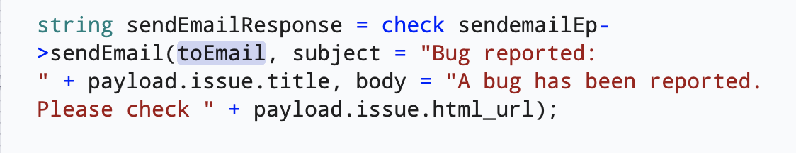{.cInlineImage-half}

     10. Click **Save**.
       
7. To monitor whether the webhook generates emails as configured, let's add a log statement that prints a log for each email sent by the webhook:

    1. Click **+** after the **sendEmailResponse** variable statement (i.e., the last **+** icon within the If loop).
       
    2. In the **Add Constructs** pane, click **Function Call**. 
       
    3. In the **Libraries** tab of the **Function Call** pane, search for the `log` module and click it once it appears in the search results.
   
    4. Under **Functions**, click **log:printInfo**.
   
    5. On the updated log statement, double-click **`<add-param>`** and replace it with the following value.

        ```
        "Email sent " + sendEmailResponse
        ```
              
        This will log `Email sent` and the value of the **sendEmailResponse** variable statement for each GitHub issue with the `bug` label.

    6. Click **Save**.

Now you have completed designing the webhook. To view its source code, click **</>** on the top panel. The source code is displayed as follows:

```
import ballerina/log;
import wso2/choreo.sendemail;
import ballerinax/trigger.github;
import ballerina/http;

configurable string toEmail = ?;

configurable github:ListenerConfig config = ?;

listener http:Listener httpListener = new (8090);
listener github:Listener webhookListener = new (config, httpListener);

service github:IssuesService on webhookListener {

    remote function onOpened(github:IssuesEvent payload) returns error? {
        //Not Implemented
    }
    remote function onClosed(github:IssuesEvent payload) returns error? {
        //Not Implemented
    }
    remote function onReopened(github:IssuesEvent payload) returns error? {
        //Not Implemented
    }
    remote function onAssigned(github:IssuesEvent payload) returns error? {
        //Not Implemented
    }
    remote function onUnassigned(github:IssuesEvent payload) returns error? {
        //Not Implemented
    }
    remote function onLabeled(github:IssuesEvent payload) returns error? {
        //Not Implemented
        github:Label? label = payload.label;
        if label is github:Label && label.name == "bug" {

            sendemail:Client sendemailEp = check new ();
            string sendEmailResponse = check sendemailEp->sendEmail(toEmail, subject = "Bug reported: " + payload.issue.title, body = "A bug has been reported. Please check " + payload.issue.html_url);
            log:printInfo("Email sent " + sendEmailResponse);
        } else {

        }
    }
    remote function onUnlabeled(github:IssuesEvent payload) returns error? {
        //Not Implemented
    }
}
```

### Step 1.3: Run and compile the webhook

Let's run and compile the webhook you created to check whether it is executable or whether it requires further changes:

1. Click the menu icon for the webhook listener and then click **Run**.

    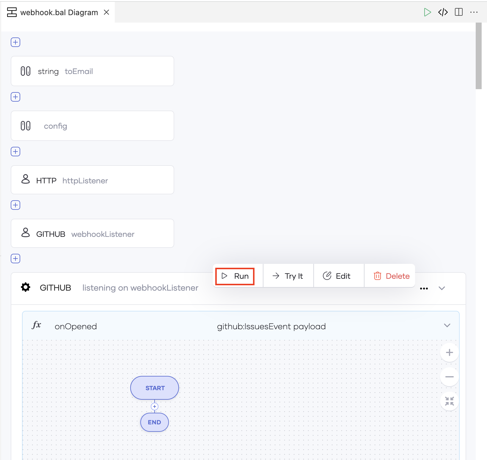{.cInlineImage-full}

    The **Configurable Editor** panel opens on the right of the page.

2. In the **toEmail** field, enter your email address.

3. In the **Config** field, enter any value.


If the webhook is successfully run and compiled, the Web Editor logs the following in the terminal:

```
Running executable
```

Now you can make this webhook available in the Choreo Console.

### Step 1.4: Commit the webhook to GitHub

The webhook you designed is currently available only in the Web Editor. To use it, you need to save it in the Choreo Console. You can do this by committing the webhook implementation to a GitHub repository. Choreo will use this GitHub repository to update the Choreo Console with the changes you make to the webhook in the Web Editor.

In [Step 1.1: Create a project and add a webhook component](#step-11-create-a-project-and-add-a-webhook-component), you selected to save the webhook implementation in a Choreo-managed repository.

To commit your changes to this Choreo-managed repository, follow these steps:

1. Click **Sync with Choreo Upstream** (highlighted in red) in the Git Status Bar.

    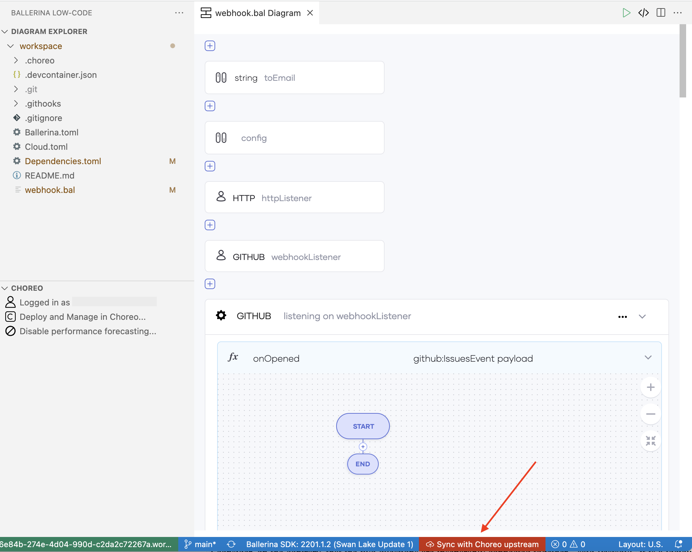{.cInlineImage-full}

    In the message that appears, click **Sync my changes with Choreo**.

2. In the left panel, enter a commit message (e.g., Implement webhook) and click the tick.

    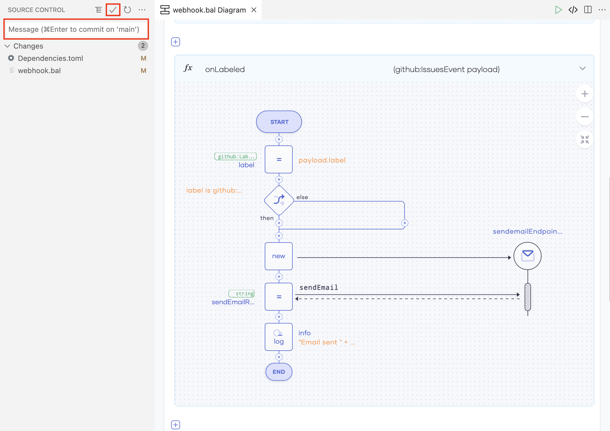{.cInlineImage-full}

    Click **Yes** in the message that appears. Doing so will stage all the changes.

3. To push the changes to the private GitHub repository maintained by Choreo, click **0↓ 1↑** in the Git Status Bar.

    !!! info
        This icon only appears after the Web Editor completes the committing process.

     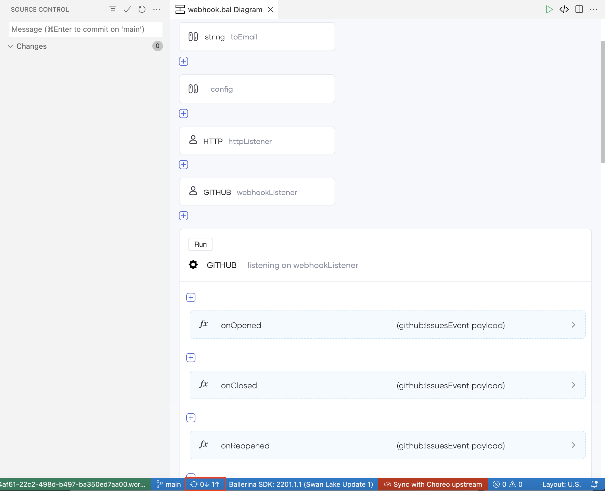{.cInlineImage-full}

     Click **OK** in the message that appears.

    Once the Web Editor successfully pushed the changes to the GitHub repository, the Git Status bar indicates by displaying the **In sync with Choreo upstream** text.


## Step 2: Deploy

Let's deploy your webhook to the development environment to make it invokable:

1. In the Choreo Console, click **Deploy** for your Webhook component, and click **Config & Deploy**.

    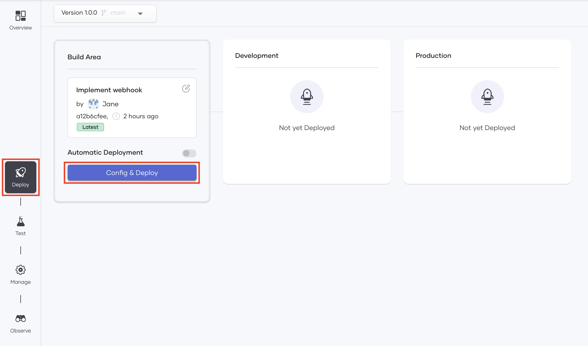{.cInlineImage-full}

2. In the **Configure & Deploy** pane, enter the following information:

    1. In the **toEmail** field, enter the email address to which you want the webhook to send the notification emails.
   
    2. In the **webhookSecret** field, enter any value.
   
        !!! note
            You must save this value for later use.
   
    3. Click **Deploy**.

    Choreo starts deploying the webhook. You can monitor the progress of the deployment in the **Console** pane that opens on the right of the page.

Once Choreo completes the deployment, the **Deploy** page displays the **Active** deployment status for the webhook as shown in the image below:

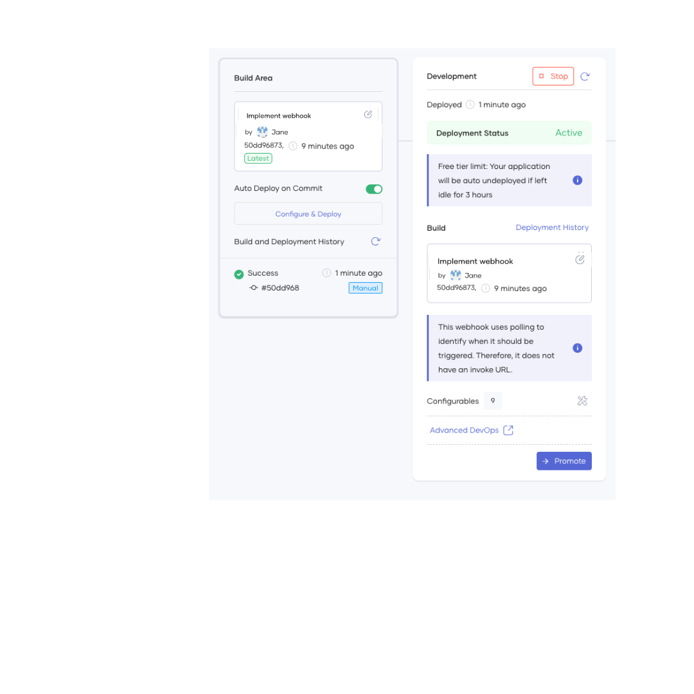{.cInlineImage-full}

!!! notes
    - The **Invoke URL** shows the URL via which GitHub can invoke the webhook.<br/><br/>
    - You can update the security header of the webhook by clicking the refresh icon within the **Security Header** field.<br/><br/>
        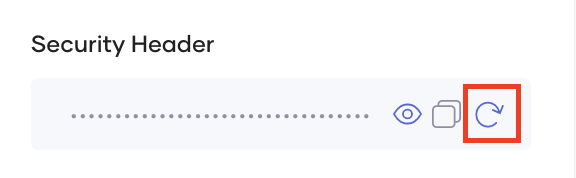{.cInlineImage-small}<br/><br/>
    - The **Configurables** field shows the number of times you have updated the webhook secret. You will see **2 keys configured** text displayed in this field as shown in the image if you specified a different webhook secret when you tested the webhook in the Web Editor. If you want to edit the webhook secret again, follow these steps:<br/><br/>
        1. Click the edit icon within the **Configurables** field.<br/><br/>
           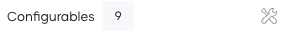{.cInlineImage-small}<br/><br/>
        2. In the **Configure & Deploy** panel, enter a webhook secret different from the one you specified previously.<br/><br/>
        3. Click **Deploy**.<br/><br/>

You can now connect the webhook to the required GitHub repository.

## Step 3: Connect the webhook to the GitHub repository

To allow the webhook to read the labels of the required GitHub repository, you need to connect the webhook to this repository. To do this, follow these steps:

1. On the **Deploy** page, copy the invoke URL by clicking the copy icon within the **Invoke URL** field.

    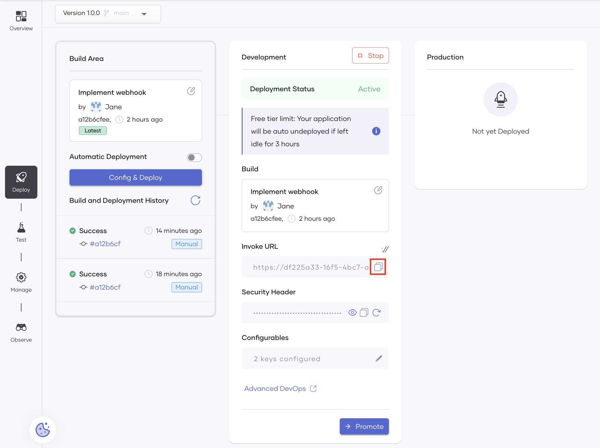{.cInlineImage-full}

2. Access your GitHub account and open the repository for which you want to generate notification emails.

3. In the top menu, click **Settings**.

4. In the left navigation, click **Webhooks**.

5. Click **Add Webhook** and enter the following information:

    | **Field**        | **Value**                                                          |
    |------------------|--------------------------------------------------------------------|
    | **Payload URL**  | The invoke URL you copied in Step 3, sub-step 1.                   |
    | **Content Type** | Select `application/json`.                                         |
    | **Secret**       | The last webhook secret you configured in [Step 2](#step-2-deploy).|

6. Under **Which events would you like to trigger this webhook?** select **Let me select individual events**.

7. Select the **Issues** checkbox in the list that appears. 

    By doing so, you select GitHub issues as events that need to trigger this webhook. 

8. In the same list, clear the **Pushes** check box to ensure that GitHub does not trigger your webhook when the team pushes changes to the selected GitHub repository.

9. Click **Add Webhook** to save the configuration.

Now you have integrated Choreo with GitHub via the webhook you created and deployed. Proceed to step 4 to test it.

## Step 4: Test

To test your webhook, create a GitHub issue with the `Bug` label in the repository to which you connected the webhook.

You will receive a mail similar to the following to the email address you provided in [Step 2](#step-2-deploy).

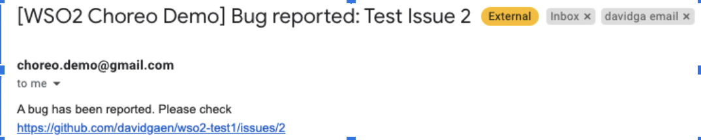{.cInlineImage-half}

## Step 5:  Promote

To promote the webhook to the Production environment, follow these sub-steps:

1. On the **Deploy** page, click **Promote**

2. In the **Configure & Deploy** pane, leave the default selection (i.e., **Use default configuration values**) unchanged. 

    If you have configured any default values for the configurable variables, selecting **Use default configuration values** allows you to proceed with those values.

    However, you did not configure any default values for configurable variables in this tutorial. Therefore, you need to enter new values.

3. To enter values for configurable variables, click **Next**.

4. In the **toEmail** field, enter the email address to which you want the webhook to send the notification emails.

5. In the **webhookSecret** field, enter any value.

    !!! note
        You must save this value for later use.

6. Click **Promote** in the pane.

    Once the system completes the promoting process, the **Production** card displays the deployment status as **Active**.

   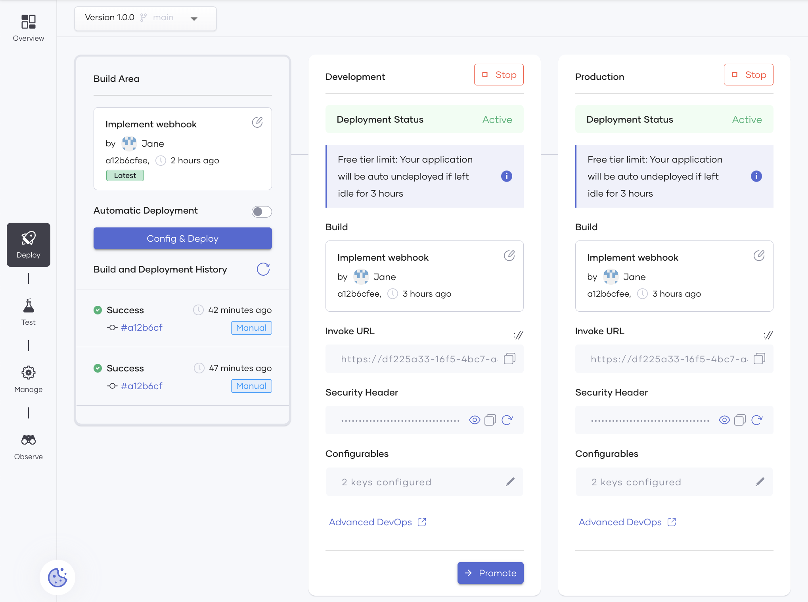{.cInlineImage-full}


