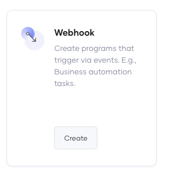

# Create Your First Webhook

Choreo’s low-code editor allows developers to easily design (and then implement) high-quality webhooks. To explore this capability, let's consider a scenario where a team of software engineers in an organization wants to be notified via email whenever someone creates a GitHub issue with the `bug` label in a specific repository. 

In this tutorial, you will address this requirement by doing the following:

- Create a webhook component by connecting to your GitHub repo that includes the implementation of the webhook which addresses the described requirement 
- Deploy the webhook you created to the development environment.
- Modify the webhook implementation to connect to GitHub to act on GitHub related events.
- Test the webhook.
- Promote the webhook to the production environment.

## Step 1: Develop

To create a project, add a Webhook component to it, design the webhook, test it, and then commit it to make it available in the Choreo Console, follow these sub-steps:

### Step 1.1: Create a project and add a Webhook component

First, let's add a Webhook component as follows:

1. Sign in to the Choreo Console at [https://console.choreo.dev](https://console.choreo.dev).

2. Click the **+ Create Project** card from the landing page.

    {.cInlineImage-small}

3. Enter a unique project name and a description. For this tutorial, let's enter the following values:

    | **Field**       | **Value**             |
    |-----------------|-----------------------|
    | **Name**        | `IssueTracking`       |
    | **Description** | `Track GitHub issues` |

4. Click **Create**.This takes you to the **Components** page.

5. On the **Components** page, click **Create** on the the **Webhook** card.

    {.cInlineImage-small}

6. Provide authorization with your GitHub account by clicking  **Authorize with GitHub**. 
7. If you have not already authorized Choreo apps, click **Authorize Choreo Apps** when prompted.
8. Select a GitHub account, a repository that includes a Ballerina project or a dockerfile, the relevant branch and the build preset as **Ballerina**. 
9. Enter a valid path relative to the root of your repository that points to the implementation of the webhook. If you have not designed and implemented your webhook yet, you can connect an empty repository or a sub-folder and proceed to create the component. 

    !!! note
        If you connect an empty repository to create the component, you cannot deploy the component. Be sure to implement your webhook before proceeding to the deployment stage. 

10. Click **Next**.

10. In the **Create a Webhook** pane, click on the Webhook type you want to create, for example **GitHub**. 
11. Click **Create**.

    1. In the **Webhook Name** field, enter a unique webhook name (e.g., `IssueTracking`).
   
    2. From the **Trigger Channel** list, select **IssuesService** so that the system can trigger your webhook based on a change it observes in GitHub issues (i.e., assigning a label in this scenario).
   
    3. You need to save your webhook implementation in a GitHub repository from which Choreo can access it. You can use a Choreo-managed GitHub repository or one of your own GitHub repositories. Let's use the Choreo-managed GitHub repository, which is the default selection.

    4. Click **Create**.

         The webhook opens on a separate page.
      
### Step 1.2: Design the webhook

Designing a webhook involves specifying how the webhook should function by adding and configuring the required connectors and statements. You can do this by editing the low-code diagram of the Webhookor by editing its code.

You can implement your webhook in Ballerina or any other language and containerize it. You can use the [Ballerina VS code extension](https://ballerina.io/downloads/) to develop the webhook in Ballerina. [Learn more](https://wso2.com/vscode-extentions/ballerina/).

For example, you can use the following source code to design a webhook to read the labels of GitHub issues in a specific repository and generate an email notification for GitHub issues with the `bug` label. You can add this code in the .bal file in your repository.

```
import ballerina/log;
import wso2/choreo.sendemail;
import ballerinax/trigger.github;
import ballerina/http;

configurable string toEmail = ?;

configurable github:ListenerConfig config = ?;

listener http:Listener httpListener = new (8090);
listener github:Listener webhookListener = new (config, httpListener);

service github:IssuesService on webhookListener {

    remote function onOpened(github:IssuesEvent payload) returns error? {
        //Not Implemented
    }
    remote function onClosed(github:IssuesEvent payload) returns error? {
        //Not Implemented
    }
    remote function onReopened(github:IssuesEvent payload) returns error? {
        //Not Implemented
    }
    remote function onAssigned(github:IssuesEvent payload) returns error? {
        //Not Implemented
    }
    remote function onUnassigned(github:IssuesEvent payload) returns error? {
        //Not Implemented
    }
    remote function onLabeled(github:IssuesEvent payload) returns error? {
        //Not Implemented
        github:Label? label = payload.label;
        if label is github:Label && label.name == "bug" {

            sendemail:Client sendemailEp = check new ();
            string sendEmailResponse = check sendemailEp->sendEmail(toEmail, subject = "Bug reported: " + payload.issue.title, body = "A bug has been reported. Please check " + payload.issue.html_url);
            log:printInfo("Email sent " + sendEmailResponse);
        } else {

        }
    }
    remote function onUnlabeled(github:IssuesEvent payload) returns error? {
        //Not Implemented
    }
}
```

## Step 2: Deploy

Let's deploy your webhook to the development environment to make it invokable:

1. In the Choreo Console, click **Deploy** for your Webhook component, and click **Config & Deploy**.

    {.cInlineImage-threeQuarter}

2. In the **Configure & Deploy** pane, enter the following information:

    1. In the **toEmail** field, enter the email address to which you want the webhook to send the notification emails.
   
    2. In the **webhookSecret** field, enter any value.
   
        !!! note
            You must save this value for later use.
   
    3. Click **Deploy**.

    Choreo starts deploying the webhook. You can monitor the progress of the deployment in the **Console** pane that opens on the right of the page.

Once Choreo completes the deployment, the **Deploy** page displays the **Active** deployment status for the webhook as shown in the image below:

{.cInlineImage-threeQuarter}

!!! notes
    - The **Invoke URL** shows the URL via which GitHub can invoke the webhook.<br/><br/>
    - You can update the security header of the webhook by clicking the refresh icon within the **Security Header** field.<br/><br/>
        {.cInlineImage-small}<br/><br/>
    - The **Configurables** field shows the number of times you have updated the webhook secret. You will see **2 keys configured** text displayed in this field as shown in the image if you specified a different webhook secret when you tested the webhook in the Web Editor. If you want to edit the webhook secret again, follow these steps:<br/><br/>
        1. Click the edit icon within the **Configurables** field.<br/><br/>
           {.cInlineImage-small}<br/><br/>
        2. In the **Configure & Deploy** panel, enter a webhook secret different from the one you specified previously.<br/><br/>
        3. Click **Deploy**.<br/><br/>

You can now connect the webhook to the required GitHub repository.

## Step 3: Connect the webhook to the GitHub repository

To allow the webhook to read the labels of the required GitHub repository, you need to connect the webhook to this repository. To do this, follow these steps:

1. On the **Deploy** page, copy the invoke URL by clicking the copy icon within the **Invoke URL** field.

    {.cInlineImage-threeQuarter}

2. Access your GitHub account and open the repository for which you want to generate notification emails.

3. In the top menu, click **Settings**.

4. In the left navigation, click **Webhooks**.

5. Click **Add Webhook** and enter the following information:

    | **Field**        | **Value**                                                          |
    |------------------|--------------------------------------------------------------------|
    | **Payload URL**  | The invoke URL you copied in Step 3, sub-step 1.                   |
    | **Content Type** | Select `application/json`.                                         |
    | **Secret**       | The last webhook secret you configured in [Step 2](#step-2-deploy).|

6. Under **Which events would you like to trigger this webhook?** select **Let me select individual events**.

7. Select the **Issues** checkbox in the list that appears. 

    By doing so, you select GitHub issues as events that need to trigger this webhook. 

8. In the same list, clear the **Pushes** check box to ensure that GitHub does not trigger your webhook when the team pushes changes to the selected GitHub repository.

9. Click **Add Webhook** to save the configuration.

Now you have integrated Choreo with GitHub via the webhook you created and deployed. Proceed to step 4 to test it.

## Step 4: Test

To test your webhook, create a GitHub issue with the `Bug` label in the repository to which you connected the webhook.

You will receive a mail similar to the following to the email address you provided in [Step 2](#step-2-deploy).

{.cInlineImage-half}

## Step 5:  Promote

To promote the webhook to the Production environment, follow these sub-steps:

1. On the **Deploy** page, click **Promote**

2. In the **Configure & Deploy** pane, leave the default selection (i.e., **Use default configuration values**) unchanged. 

    If you have configured any default values for the configurable variables, selecting **Use default configuration values** allows you to proceed with those values.

    However, you did not configure any default values for configurable variables in this tutorial. Therefore, you need to enter new values.

3. To enter values for configurable variables, click **Next**.

4. In the **toEmail** field, enter the email address to which you want the webhook to send the notification emails.

5. In the **webhookSecret** field, enter any value.

    !!! note
        You must save this value for later use.

6. Click **Promote** in the pane.

    Once the system completes the promoting process, the **Production** card displays the deployment status as **Active**.

    {.cInlineImage-threeQuarter}


