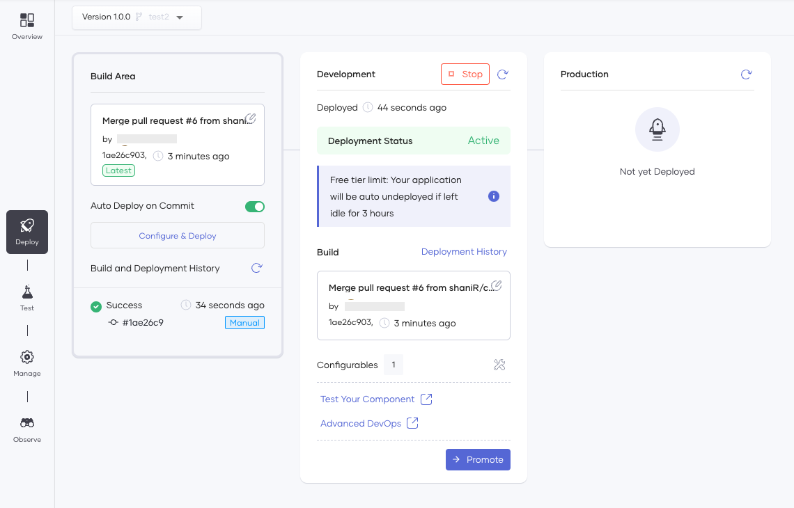
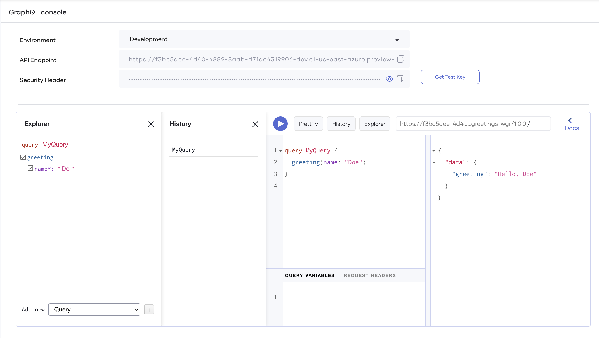

# GraphQL APIs

Explore how you can easily design, develop, and manage GraphQL APIs in Choreo to implement your business API strategy.

!!! tip
    GraphQL API is currently available in Choreo as a preview feature. For instructions to enable it, see [Preview Features](references/preview-features.md).

## What is a GraphQL API?

[GraphQL](https://graphql.org) is a query language for APIs and a runtime for fulfilling those queries with your existing data. A GraphQL API is a category of APIs that supports this query language.

A GraphQL API is an alternative for a REST API to address the following limitations experienced by REST API users:

- A REST API may need to send multiple requests to several endpoints to retrieve all the required data. A GraphQL API can achieve this via a single query.

    For example, a banking application needs to fetch the phone number and the current account balance of an account holder. To achieve this, a REST API may need to send three requests to call three endpoints (e.g., `/customers/<id>` to fetch the initial data, `/customers/<id>/contactInfo` to fetch the phone number, and `/customers/<id>/balances` to fetch the current account balance).

    A GraphQL API can retrieve all these details via one query similar to the sample given below:

    ```
    query {
        customer (id: "SIL182882762") {
            contactInfo {
                phoneNo
            }
            balances(current)
        }
    }
    ```
    In this scenario, a single request by a REST API under-fetches data compared to a single request by a GraphQL API.

- In certain scenarios, a REST API can over-fetch data. In the same example given above, a request sent by REST API to the `/customers/<id>/contactInfo` may result in fetching all the contact information in the array such as the phone number, work phone number, address, email, etc., whereas the application only needs the phone number.

    A GraphQL allows you to avoid this by writing queries with specific data requirements.

By minimizing the number of requests it sends for a given purpose and avoiding over-fetching GraphQL API consumes a smaller amount of resources (such as the internet bandwidth, system memory, etc.) and is, therefore, more economical. Therefore it is useful to develop low-cost applications such as applications for mobile devices.


## Develop

To create a GraphQL you need to add a GraphQL component.

Choreo comes with the Web Editor which is an IDE designed based on Visual Studio Code for developers to implement API functionality. At present, developers can design GraphQL APIs in the Web Editor by writing code, and test the functionality via cURL commands before committing the design to a private/Choreo-managed GitHub repository. Once you commit the design, the GraphQL API is available in the Choreo Console where you can deploy, test, and observe it. 

## Lifecycle

Once you implement a GraphQL API, it needs to be built, tested, and eventually put into production. Choreo executes a CI/CD pipeline to manage the API lifecycle. Choreo stores the source code of APIs in a GitHub repository for the user account. This GitHub repository can be a Choreo-managed repository or a GitHub repository that you own.  It also provides the capability for developers to connect their own GitHub repositories containing the source code of their APIs. The CI/CD pipeline in Choreo takes an API through the complete process, starting from code checkout to compile, build, test, and finally deploy.

## Deploy

The following diagram illustrates the procedure to deploy an API in Choreo to the default development environment.

{.cInlineImage-full}

Choreo runs a professional, enterprise-grade CI/CD process to deploy APIs to their runtime(data plane) clusters. The data plane of Choreo runs on a Kubernetes stack under the hood. Therefore, you can benefit from its features such as auto-scaling, auto-healing, secret-management, liveness and readiness checks, etc.

Once you deploy a GraphQL API to the development environment, it gets exposed through an API Gateway with API security enabled. At this time, Choreo provides a test URL for the API, which you can use to verify the functionality of the API.

## Choreo Environments

Choreo provides a development environment by default and a production environment in two separate Kubernetes clusters. Once you deploy an API to the development environment and verify its functionality, you can promote the API to the production environment.

{.cInlineImage-full}

Once you promote an API to production, Choreo provides a second URL that you can use in a production application to invoke the API.

## Test

Once you deploy your GraphQL API, you can test it using the GraphQL Console. The GraphQL Console is an interactive UI that guides you to write queries and mutations to test the GraphQL API.

Choreo by default uses OAuth2.0 authentication to secure GraphQL APIs. Therefore, the GraphQl Console allows you to generate test keys to test the APIs.

{.cInlineImage-full}

## Observe

Choreo allows you to visualize and monitor the performance of GraphQL APIs deployed on Choreo. Choreo has in-built support for viewing the overall status, latencies, throughput data, diagnostic data, and logs. Developers can efficiently detect and troubleshoot anomalies in GraphQL APIs using  Choreo Observability.

For more information about the observability capabilities of Choreo, see [Observability](observability/observability-overview.md).
