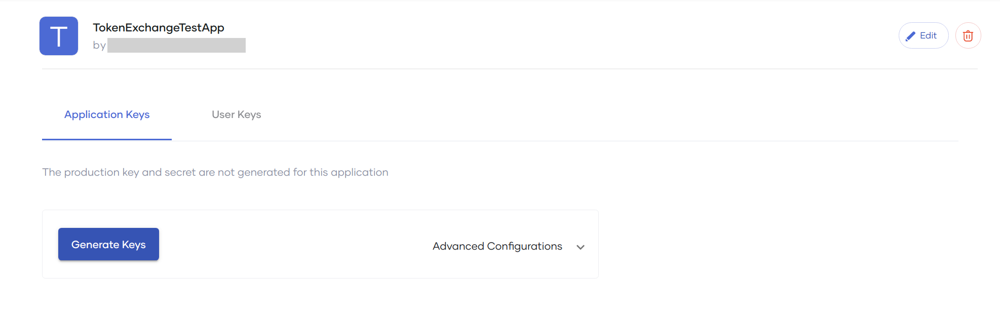

# Exchange an Access Token from an External Identity Provider (IdP)

After you [Register an External Identity Provider]({{base_path}}/identity-providers/register-an-external-identity-provider) you can exchange access tokens from that IdP for Choreo access tokens and use those to invoke APIs. 

Follow this procedure to exchange an access token from an external IdP for a Choreo token within your organization.

1. Sign in to the Choreo Developer Portal at [https://devportal.choreo.dev/](https://devportal.choreo.dev/).

2. Click **Applications** tab.

3. Create a new application or use an existing application.

4. Select **OAuth2 Tokens** under the **Production Keys** on the left bar of the application.

5. If the Consumer Key and the Consumer Secret have not been generated before, the following page will be displayed. Click on **Generate Keys** to generate the Consumer Key and the Consumer Secret.

    {.cInlineImage-full}

    !!! tip
        The **User Keys** tab will be disabled if you did not generate the keys or if you have generated the keys without enabling the **Token Exchange** grant type. Hence, you need to make sure the **Token Exchange** grant type is enabled when generating the keys. You can click on **Advanced Configurations** to check whether the **Token Exchange** grant type is enabled (By default this will be enabled). 
        
        {.cInlineImage-full}

6. Click on the **User Keys**.

    {.cInlineImage-full}

7. Select an IdP from the dropdown under the field **Identity Provider**.

    {.cInlineImage-full}

    Now the following screen will be displayed which includes two (2) steps.

    {.cInlineImage-full}

8. As mentioned in **Step 1**, first you need to obtain an access token from the external IdP that you selected.
     Refer to the **documentation** pointed from the same step to get an access token from your choice of IdP.
     
9. To obtain a Choreo access token as mentioned in the **Step 2**, you need to paste the token obtained in the previous step, in the text box in front of the field **<Your_IdP_name> Token** (Example: "Okta Token" field). 

10. You can click on the button **Curl** to get the cURL command to obtain the Choreo access token or you can click on **Generate Test Token** button to get the Choreo access token from the UI.

11. You can use this generated Choreo access token to invoke APIs which you have subscribed using this application.
