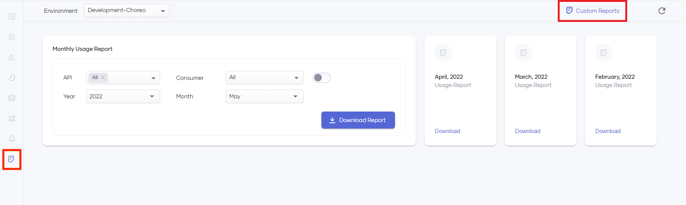
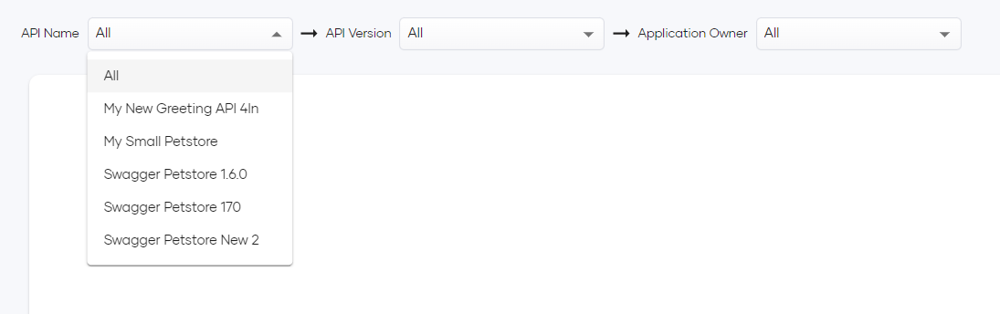
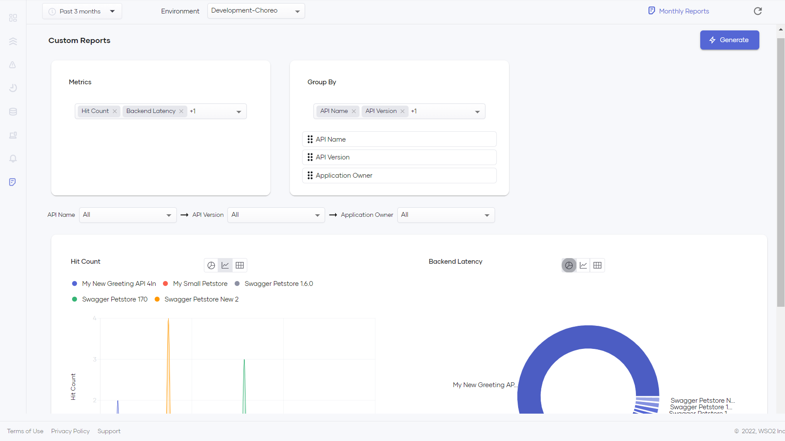

# Generate Custom Reports

Choreo insights allows you to generate custom reports to view the information that is important to you to make timely decisions for the betterment of your business. With custom reports, you can generate reports for a set of metrics of your choice and aggregate results by specific fields. Once generated, the metrics can be filtered out using any selected group-by field(s). Custom reports supports three visualizations: overtime charts, pie charts, and tables.

To generate a custom report, follow the steps below:

1. Click on **Reports** from the left navigation and select **Custom Reports**.

    {.cInlineImage-full}

2. Select metric(s) from the **Metrics** drop-down selector.

    {.cInlineImage-full}

3. Select a minimum of 1 and a maximum of 3 group-by field(s) from the **Group By** drop down selector.

4. Set the order of the group-by filters by drag and drop to determine the grouping order of the selected metric(s).

5. After you generate the custom report, there will be a drop down selector per each selected group-by field in step 2 which lists the available values in the group-by field. You can change the group-by field(s) to change the grouping-criteria of the metric(s).

    {.cInlineImage-full}

6. Click **Generate**.

    {.cInlineImage-full}
