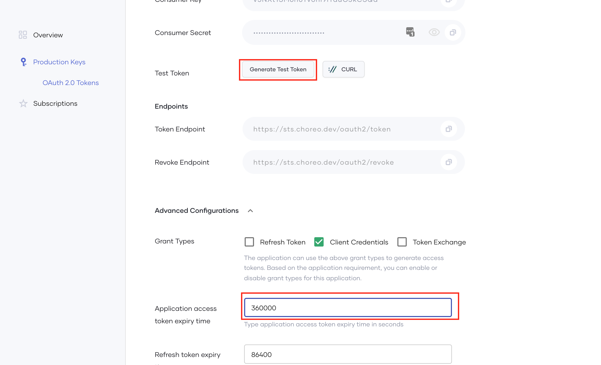

# Programmatic Access to Insights API

The insights page in the Choreo Console fetches data from the Insights API exposed over the Internet. Occasionally, some users might need to fetch these data from external systems for various use cases. One such use case can be to implement their own dashboards based on these data.

Choreo provides a secure and user-friendly method to achieve this requirement. The steps are outlined below.

## Become a Member of the Choreo System Organization

1. Sign in to [https://devportal.choreo.dev](https://devportal.choreo.dev) using your credentials.

2. Visit [https://devportal.choreo.dev/choreosystem](https://devportal.choreo.dev/choreosystem) to access the developer portal of Choreo System organization.

    If you are accessing the Choreo System organization’s developer portal for the first time, you will need request access to the organization by clicking on the **Request Access** button.

    {.cInlineImage-full}

3. Once access has been requested, you will be automatically added as a member of the Choreo System organization.

    Verify this by inspecting the organization drop-down(Choreo System organization should be visible).

    {.cInlineImage-full}

## Create an Application & Generate Keys

1. Navigate to the Applications' menu to create a new application in the Choreo System organization.

    {.cInlineImage-full}

2. Provide a suitable name and create the application.

    {.cInlineImage-half}

3. Subscribe to the **Insights** API using the newly created application.

    {.cInlineImage-half}

4. Generate credentials for the application. This will generate a consumer key and secret for the created application.

    {.cInlineImage-full}

5. Provide a suitable token expiry time and generate a token.

    {.cInlineImage-full}

6. This token can then be used to access the Insights API exposed via [https://choreocontrolplane.choreo.dev/93tu/insights/1.0.0/query-api](https://choreocontrolplane.choreo.dev/93tu/insights/1.0.0/query-api)

    A sample curl command is shown below.

    ```bash
    curl --location --request POST 'https://choreocontrolplane.choreo.dev/93tu/insights/1.0.0/query-api' \
    --header 'Content-Type: application/json' \
    --header 'Authorization: Bearer <TOKEN_HERE>' \
    --data-raw '{"query":"query ($org: OrgFilter!) {listEnvironments(org: $org){id\n name}}","variables":{"org":{"orgId":"<ORG_UUID_HERE>"}}}'
    ```

    In case of token expiry, a new token can be generated programmatically by talking to the token-endpoint using the client credentials grant.

    In case of a token theft, the relevant token can be revoked by talking to the revoke-endpoint.

    {.cInlineImage-full}
