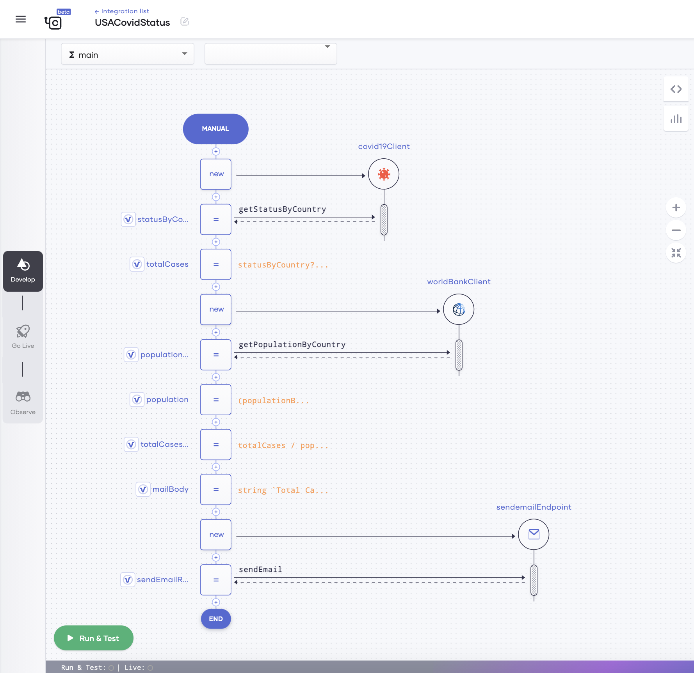
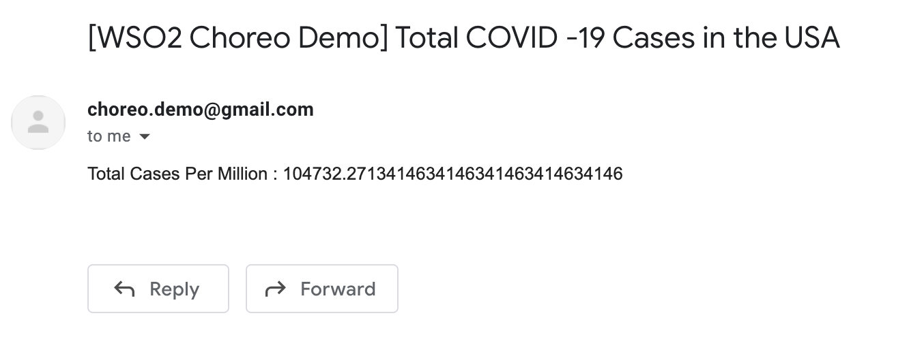

# Build Your First Integration
Choreo allows you to efficiently build integrations by connecting APIs, events, and streams. Choreo also provides a comprehensive set of prebuilt integration templates that you can select from and use depending on your requirement.

This quick start guide walks you through the steps to quickly create an integration to get the current COVID-19 status in the United States. It will,

  - Connect to the COVID-19 data API to get COVID-19 statistics.
  - Connect to the world bank data API to get population data.
  - Send an email with the summary of statistics to a specified email address.

## Step 1: Create the integration
Follow this procedure to create an integration from scratch:

1. Sign in to the Choreo Console at [https://console.choreo.dev/](https://console.choreo.dev/).
2. Go to the **Integrations** card and click **Get Started**. This takes you to the **Integrations** page.
3. Click **Create**. This takes you to the **Create Integration** page.
4. Go to the **Create with Choreo** card, enter `USACovidStatus` as the integration name, and then click **Create**.
5. In the **Select Trigger** window, select **Manual**. This creates an integration that you can manually trigger.
  

## Step 2: Get the COVID-19 data 
Follow this procedure to connect to the COVID-19 API and retrieve data:

1. Click **API Calls** and then select **Covid19 API**.
2. In the **Covid19 API Connection** window, enter `covid19Client` as the **Connection Name** and click **Save**.
3. Click the last **+** icon in the low-code diagram and click **API Calls**.
4. Under **Choose existing connection**, select **covid19Client**.
5. In the **Operation** drop-down list, select **Country Status** and enter details as follows in the other fields:

    | **Field**                  | **Value**         |
    |----------------------------|-------------------|
    | **Country**                | `"USA"`           |
    | **Response Variable Name** | `statusByCountry` |

6. Click **Save**.
7. Now let’s extract the total case count from the response and store it in a variable. Follow this procedure: 

    1. Click the last **+** icon in the low-code diagram.
    2. Under **Statements**, select **Variable** and enter details as follows:

        | **Field**      | **Value**                     |
        |----------------|-------------------------------|
        | **Type**       | `var`                         |
        | **Name**       | `totalCases`                  |
        | **Expression** | `statusByCountry?.cases ?: 0d`|

    3. Click **Save**.

## Step 3: Get the population data
Follow this procedure to connect to the world bank API and retrieve population data:

1. Click the last **+** icon in the low-code diagram.
2. Click **API Calls** and then select **World Bank API**.
3. In the **World Bank API Connection** window, enter `worldBankClient` as the **Connection Name** and click **Save**.
4. Click the last **+** icon in the low-code diagram and click **API Calls**.
5. Under **Choose existing connection**, select **worldBankClient**.
6. In the **Operation** drop-down list, select **Get Country Population** and enter details as follows in the other fields: 

    1. In the **Country Code** field, enter `"USA"`.
    2. In the **Date** field, enter `"2019"`.
    3. Click **Optional**, and  enter `"json"` as the **Format**.
    4. In the **Response Variable Name** field, enter `populationByCountry`.

7. Click **Save**.
8. Now let’s extract the population from the response and store it in a variable. Follow this procedure: 

    1. Click the last **+** icon in the low-code diagram.
    2. Under **Statements**, select **Variable** and enter details as follows:

        | **Field**      | **Value**                     |
        |----------------|-------------------------------|
        | **Type**       | `int`                         |
        | **Name**       | `population`                  |
        | **Expression** | `(populationByCountry is worldbank:CountryPopulationArr ? populationByCountry[0]?.value ?: 0 : 0) / 1000000`       |

    3. Click **Save**.

## Step 4: Calculate the total COVID-19 case count by population 

Now let’s calculate the total COVID-19 case count per million in the population based on the COVID-19 statistics and the population data you have retrieved. Follow this procedure:

1. Click the last **+** icon in the low-code diagram.
2. Under **Statements**, select **Variable** and enter details as follows:

    | **Field**      | **Value**                     |
    |----------------|-------------------------------|
    | **Type**       | `var`                         |
    | **Name**       | `totalCasesPerMillion`        |
    | **Expression** | `totalCases / population`     |

3. Click **Save**.
         
## Step 5: Generate and send an email with summary statistics
Follow this procedure to send an email with the summary of statistics to a specified email address:

1. Click the last **+** icon in the low-code diagram.
2. Under **Statements**, select **Variable** and enter details as follows:

    | **Field**      | **Value**                     |
    |----------------|-------------------------------|
    | **Type**       | `string`                      |
    | **Name**       | `mailBody`                    |
    | **Expression** | `string` `` `Total Cases Per Million : ${totalCasesPerMillion}` ``|

3. Click **Save**.
4. Click the last **+** icon in the low-code diagram.
5. Click **API Calls** and then select **Mail by Choreo**.
6. In the **Mail by Choreo Connection** window, enter details as follows: 

    1. In the **Operation** drop-down list, select `Send Mail`.
    2. In the **Recipient** field, enter the email address to which you want to send the email. For example, `"test@gmail.com"`
    3. In the **Subject** field, enter `"Total COVID-19 Cases in the USA"`
    4. In the **Message Body** drop-down list, select `mailBody`.

7. Click **Save**.

Now you have successfully created and configured the integration. It looks as follows:

- In the low-code view

    {.cInlineImage-full}

- In the code view
    
      ```ballerina
         import wso2/choreo.sendemail;
         import ballerinax/worldbank;
         import ballerinax/covid19;

         public function main() returns error? {

             covid19:Client covid19Client = check new ();
             covid19:CovidCountry statusByCountry = check covid19Client->getStatusByCountry("USA");
             var totalCases = statusByCountry?.cases ?: 0d;
             worldbank:Client worldBankClient = check new ();

             worldbank:CountryPopulationArr? populationByCountry = check worldBankClient->getPopulationByCountry("USA", "2019", 
             format = "json");

             int population = 
             (populationByCountry is worldbank:CountryPopulationArr ? populationByCountry[0]?.value ?: 0 : 0) / 1000000;

             var totalCasesPerMillion = totalCases / population;
 
             string mailBody = string `Total Cases Per Million : ${totalCasesPerMillion}`;

             sendemail:Client sendemailEndpoint = check new ();
             string sendEmailResponse = check sendemailEndpoint->sendEmail(“test@wso2.com", "Total COVID-19 Cases in the USA", 
             mailBody);
        }
      ```

## Step 6: Try out the integration

1. Click **Run & Test**. This starts the integration and sends an email to the recipient you specified when configuring the integration.
2. Go to the inbox of the email recipient and take a look at the COVID-19 statistics summary mail. 

     {.cInlineImage-half}

Congratulations! Now you have successfully created an integration from scratch and tried it out.
