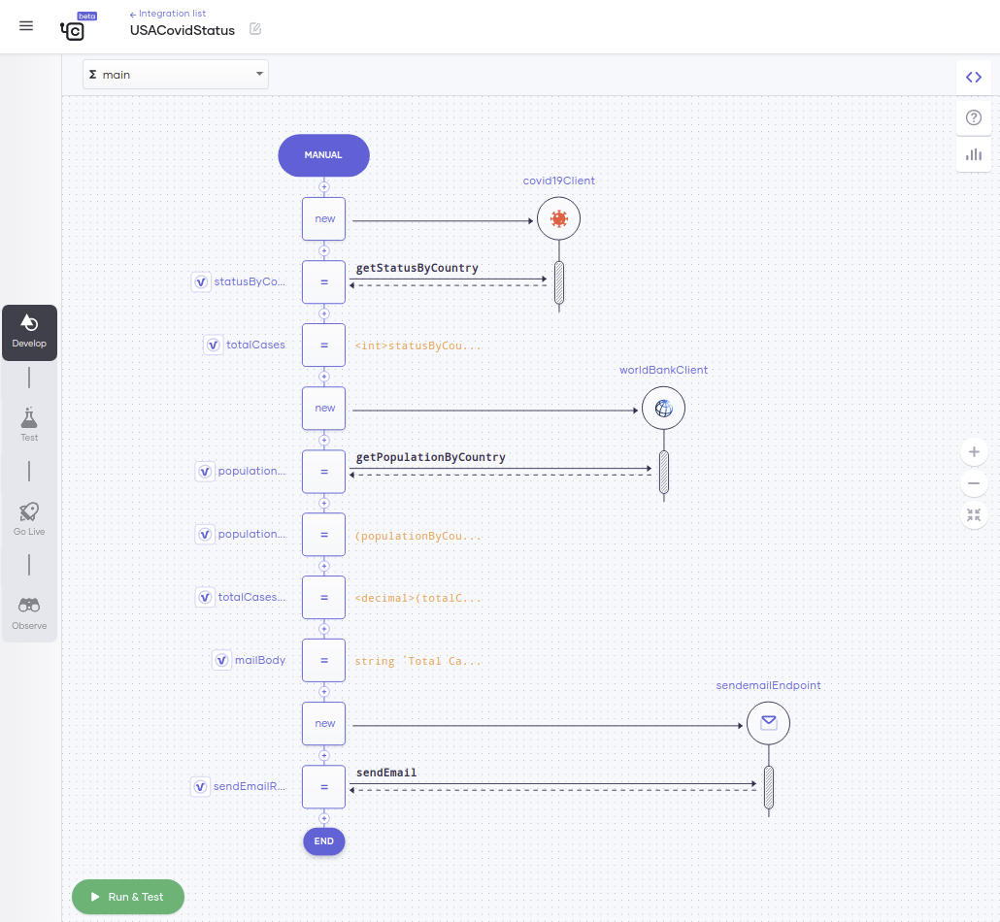
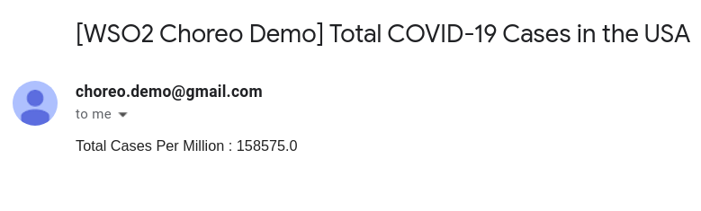

# Build Your First Integration

Choreo allows you to efficiently build integrations by connecting APIs, events, and streams. Choreo also provides a comprehensive set of prebuilt integration templates that you can select from and use depending on your requirement.

This quick start guide walks you through the steps to quickly create an integration to get the current COVID-19 status in the United States. It

  - Connects to the COVID-19 data API to get COVID-19 statistics
  - Connects to the World Bank data API to get population data
  - Sends an email with the summary of statistics to a specified email address

## Step 1: Create the integration

Follow this procedure to create an integration from scratch:

1. Sign in to the Choreo Console at [https://console.choreo.dev/](https://console.choreo.dev/).
2. Go to the **Integrations** card and click **Create**. This takes you to the **Create Integration** page.
3. Go to the **Create with Choreo** card, enter `USACovidStatus` as the integration name, and then click **Create**.
4. In the **Select Trigger** window, select **Manual**. This creates an integration that you can manually trigger.

## Step 2: Get the COVID-19 data 

Follow this procedure to connect to the COVID-19 API and retrieve data:

1. Click **API Calls** and then select **COVID-19 API**.
2. In the **COVID-19 API Connection** window, enter `covid19Client` as the **Endpoint Name** and click **Continue to Invoke API**.
3. In the **Operation** drop-down list, select **getStatusByCountry** and enter details as follows in the other fields:

    | **Field**                  | **Value**         |
    |----------------------------|-------------------|
    | **Country**                | `"USA"`           |
    | **Response Variable Name** | `statusByCountry` |

4. Click **Save**.
5. Now let’s extract the total case count from the response and store it in a variable. Follow this procedure:

    1. Click the last **+** icon in the low-code diagram.
    2. Under **Statements**, select **Variable** and enter these details:

        | **Field**      | **Value**                     |
        |----------------|-------------------------------|
        | **Type**       | `int`                         |
        | **Name**       | `totalCases`                  |
        | **Expression** | `<int>statusByCountry.cases`  |

    3. Click **Save**.

## Step 3: Get the population data

Follow this procedure to connect to the World Bank API and retrieve population data:

1. Click the last **+** icon in the low-code diagram.
2. Click **API Calls** and then select **World Bank API**.
3. In the **World Bank API Connection** window, enter `worldBankClient` as the **Connection Name** and click **Continue to Invoke API**.
4. In the **Operation** drop-down list, select **getPopulationByCountry** and enter these details:

    | **Field**                  | **Value**            |
    |----------------------------|----------------------|
    | **Country Code**           | `"USA"`              |
    | **Response Variable Name** | `populationByCountry`|

5. Click **Save**.
6. Now let’s extract the population value from the response, calculate the population in millions, and store it in a variable. Follow this procedure:

    1. Click the last **+** icon in the low-code diagram.
    2. Under **Statements**, select **Variable** and enter these details:

        | **Field**      | **Value**                     |
        |----------------|-------------------------------|
        | **Type**       | `int`                         |
        | **Name**       | `populationMillions`                  |
        | **Expression** | `(populationByCountry[0].value ?: 0) / 1000000`|

    3. Click **Save**.

## Step 4: Calculate the total COVID-19 case count by population 

Now let’s calculate the total COVID-19 case count per million based on the COVID-19 statistics and the population data you retrieved. Follow this procedure:

1. Click the last **+** icon in the low-code diagram.
2. Under **Statements**, select **Variable** and enter these details:

    | **Field**      | **Value**                                   |
    |----------------|---------------------------------------------|
    | **Type**       | `decimal`                                   |
    | **Name**       | `totalCasesPerMillion`                      | 
    | **Expression** | `<decimal>(totalCases / populationMillions)`|

3. Click **Save**.
         
## Step 5: Generate and send an email with summary statistics

Follow this procedure to send an email with the summary of statistics to a specified email address:

1. Click the last **+** icon in the low-code diagram.
2. Under **Statements**, select **Variable** and enter these details:

    | **Field**      | **Value**                     |
    |----------------|-------------------------------|
    | **Type**       | `string`                      |
    | **Name**       | `mailBody`                    |
    | **Expression** | string `` `Total Cases Per Million : ${totalCasesPerMillion}` ``|

3. Click **Save**.
4. Click the last **+** icon in the low-code diagram.
5. Click **API Calls** and then select **Mail by Choreo**.
6. In the **Mail by Choreo Connection** window, enter these details: 

    1. In the **Recipient** field, enter the email address to which you want to send the email(for example, `"test@gmail.com"`).
    2. In the **Subject** field, enter `"Total COVID-19 Cases in the USA"`.
    3. In the **Message Body** drop-down list, select `mailBody`.

7. Click **Save**.

You have successfully created and configured the integration. It should look something like this:

- In the low-code view:

    {.cInlineImage-full}

- In the code view:    
   ```ballerina
    import wso2/choreo.sendemail;
    import ballerinax/worldbank;
    import ballerinax/covid19;

    public function main() returns error? {

        covid19:Client covid19Client = check new ();
        covid19:CovidCountry statusByCountry = check covid19Client->getStatusByCountry("USA");
        int totalCases = <int>statusByCountry.cases;
        worldbank:Client worldBankClient = check new ();
        worldbank:IndicatorInformation[] populationByCountry = check worldBankClient->getPopulationByCountry("USA");
        int populationMillions = (populationByCountry[0].value ?: 0) / 1000000;
        decimal totalCasesPerMillion = <decimal>(totalCases / populationMillions);
        string mailBody = string `Total Cases Per Million : ${totalCasesPerMillion}`;
        sendemail:Client sendemailEndpoint = check new ();
        string sendEmailResponse = check sendemailEndpoint->sendEmail("test@gmail.com", "Total COVID-19 Cases in the USA", 
        mailBody);
    }
   ```

## Step 6: Try out the integration

To try out your integration, follow this procedure:

1. Click **Run & Test**. This starts the integration and sends an email to the recipient you specified when configuring the integration.
2. Go to the inbox of the email recipient and take a look at the COVID-19 statistics summary mail. 

     {.cInlineImage-half}

Congratulations! Now you have successfully created an integration from scratch and tried it out.
