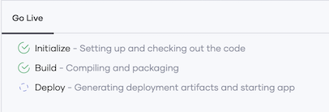

# Build Your First Integration
Choreo allows you to efficiently build integrations by connecting APIs, events, and streams. Choreo also provides a comprehensive set of prebuilt integration templates that you can select from and use depending on your requirement.

This quick start guide walks you through the steps to quickly configure and try out the **GitHub New Issue to Google Sheets Row** integration in Choreo.

## Prerequisites:
- A GitHub account.
- A Google account.
- In the Google account, create a blank spreadsheet named `Sample GitHub Integration` with its default worksheet named `Sheet1`. 

## Step 1: Configure and start the integration
Follow this procedure to configure and start the **GitHub New Issue to Google Sheets Row** integration:

1. Sign in to the Choreo Console at [https://console.choreo.dev/](https://console.choreo.dev/).
2. Go to the **Integrations** card and click **Get Started**. Now you are on the **Integrations** page, where you can start with a prebuilt integration or create your own.
3. Go to the **GitHub New Issue to Google Sheets Row** card and click **Use This**.
4. In the **Configurations** panel, proceed as follows:
    1. Click **Connect to GitHub**.
    2. On the **Authorize** page that opens, click **Authorize wso2** to allow WSO2 to access your GitHub account. 
    3. On the **Confirm Access** page that opens, enter your GitHub password and click **Confirm password**. This redirects you to the Choreo Console to continue the configuration.
    4. Select the **GitHub Repository URL** depending on the repository for which you want to track new issues.
    5. Click **Connect to Google Sheets** and then click **Proceed**.
    6. Select the Google account to use in the integration and click **Allow** to proceed with the selected account.
    7. Select `Sample GitHub Integration` as the **Spreadsheet Name**. 
    8. Enter `Sheet1` as the **Worksheet Name**.
5. Click **Save**.
 
    {.cInlineImage-half}
    
    Now you have configured the integration and you are ready to start it.

6. Click **Start**. 
   The following logs appear to indicate that the integration is starting:
  
    {.cInlineImage-half}
    
    The following message indicates that the integration has started and is running:

    {.cInlineImage-full}

Now the **GitHub New Issue to Google Sheets Row** integration is successfully configured and running.

## Step 2: Try out the integration 
Follow this procedure to try out the integration:

1. Go to the GitHub repository you specified when configuring the integration and create two new issues.
2. Go to the Choreo Console and take a look at the **Execution History** of the configured integration.
 
    {.cInlineImage-full}

     You can see two executions. These are a result of creating new issues in the GitHub repository.

3. Go to the `Sample GitHub Integration` spreadsheet in your Google account and take a look at `Sheet1`.
 
    {.cInlineImage-full}

     You can see two entries with details of the GitHub issues you created.

Congratulations! Now you have successfully configured and tried out the **GitHub New Issue to Google Sheets Row** integration. 
