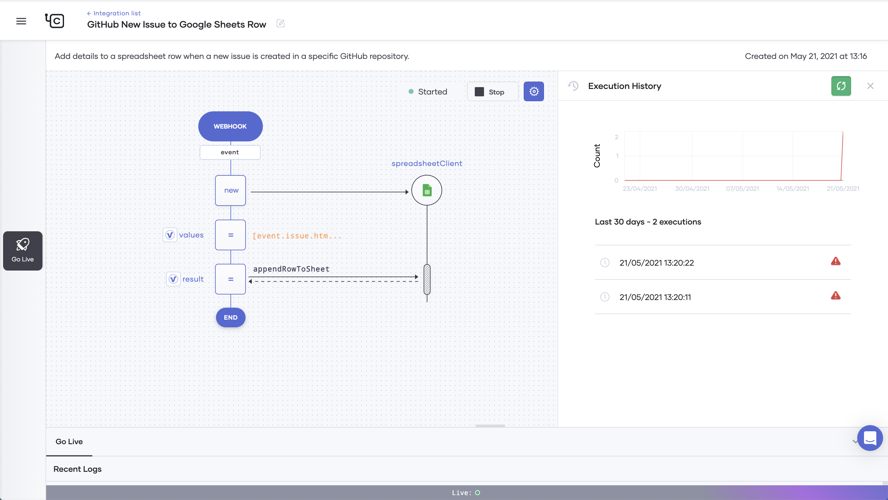

# Build Your First Integration
Choreo allows you to efficiently build integrations by connecting APIs, events, and streams. Choreo also provides a comprehensive set of prebuilt integration templates that you can select and use depending on your requirement.

This quick start guide walks you through the steps to quickly configure and try out the **GitHub New Issue to Google Sheets Row** integration in Choreo.

## Prerequisites:
- A GitHub account.
- A Google account.
- In the Google account, create a blank spreadsheet named `Sample GitHub Integration` with its default worksheet named `Sheet1`. 

## Step 1: Configure and start the integration
Follow the procedure below to configure and start the **GitHub New Issue to Google Sheets Row** integration:

1. Access the Choreo Console via [https://console.choreo.dev/](https://console.choreo.dev/).
2. Sign in using either your GitHub or Google credentials.
3. Go to the **Integrations** card and click **Get Started**. Now you are on the **Integrations** page, where you can start with a prebuilt integration or create your own.
4. Go to the **GitHub New Issue to Google Sheets Row** card and click **Use This**.
5. In the **Configurations** panel, fill in the details as follows to configure the integration:
    1. Click **Connect to GitHub**.
    2. In the authorization request page that opens, click **Authorize wso2** to allow WSO2 to access your GitHub account. 
    3. In the GitHub access confirmation page that opens, enter your GitHub password and click **Confirm password**.
    4. In the **GitHub Repository URL** field, select the repository for which you want to track new issues.
    5. Click **Connect to Google Sheets**, and then click **Proceed**.
    6. Select the Google account you want to use in the integration.
    7. In the access request page that opens, click **Allow** to proceed with the selected Google account.
    8. In the **Spreadsheet Name** field, select `Sample GitHub Integration`.
    9. In the **Worksheet Name** field, enter `Sheet1`.
6. Click **Save**.
 
       
    
    Now you have configured the integration, and you are ready to start it.

7. Click **Start**. 
   The following logs appear to indicate that the integration is starting:
  
       
    
    The following message indicates that the integration has started and is running:

       

Now the **GitHub New Issue to Google Sheets Row** integration is successfully configured and running.

## Step 2: Try out the integration 
Follow the procedure below to try out the integration:

1. Go to the GitHub repository you specified when configuring the integration and create two new issues.
2. Go to the Choreo Console and take a look at the **Execution History** of the configured integration.
 
       {: style="height:75%;width:80%"}

     You can see two executions. These are a result of creating new issues in the GitHub repository.

3. Go to the `Sample GitHub Integration` spreadsheet in your Google account and take a look at `Sheet1`.
 
       

     You can see two entries with details of the GitHub issues you created.

Congratulations! Now you have successfully configured and tried out the **GitHub New Issue to Google Sheets Row** integration. 
