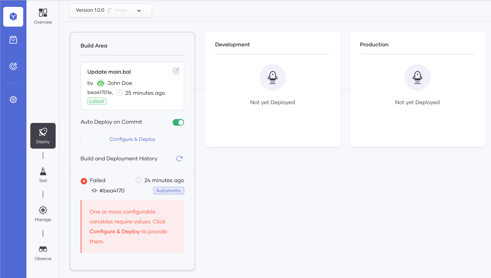

# Create Your First Event-triggered Integration

Choreo allows you to deploy, test, manage, and observe integration components that integrate APIs, microservices, applications, and data in different languages and formats.

To explore this capability, let's consider a scenario where a team of software engineers in an organization wants to be notified via email whenever someone creates a GitHub issue with the `bug` label in a specific GitHub repository.

In this tutorial, you will address this requirement by doing the following:

- Create an Event-triggered Integration component by connecting to your GitHub repository where the webhook implementation that addresses the described requirement resides.
- Deploy the event-triggered integration you created to the development environment.
- Update the implementation of the event-triggered integration, enabling it to listen to selected GitHub events and act in response.
- Test the event-triggered integration.
- Promote the event-triggered Integration to the production environment.

## Prerequisites

For this tutorial, let's create the event-triggered integration from a Ballerina project. To create a Ballerina project and add it to a private GitHub repository, follow the steps given below:

1. Create a Ballerina project by following the instructions on [Ballerina Site - Get Started with Ballerina](https://ballerina.io/learn/get-started-with-ballerina/).
2. Create a new repository in your GitHub account and commit the `Ballerina.toml` file and the `Main.bal` from your Ballerina project to its root directory or sub-directory as you prefer.

## Step 1: Develop

In this step, you will create an event-triggered integration to it, design the event-triggered integration, and then commit it to the connected GitHub repository to make it available in the Choreo Console.

### Step 1.1: Create an event-triggered integration

Let's create a new project and add an event-triggered integration to it by following the steps given below:


2. On the **Home** page of the Choreo Console, click **+ Create Project**. Next, enter a unique name and a description for the project, and click **Create**.

3. On the **Event-triggered** integration card, click **Create**.

4. Enter a name and a description for the event-triggered integration. For example, you can enter `IssueTracking` as the
   name and `GitHub issue tracking integration` as the description.

5. Click **Next**.

6. Provide authorization with your GitHub account by clicking **Authorize with GitHub**.

7. If you have not already authorized Choreo apps, click **Authorize Choreo Apps** when prompted.

8. If you have not already connected your GitHub repository to Choreo, enter your GitHub credentials, and select the private repository you want to use for this tutorial.

9. Select values from the **GitHub Account**, **GitHub Repository**, and **Branch** fields as follows:

    | **Field**             | **Value**                                                                               |
    |-----------------------|-----------------------------------------------------------------------------------------|
    | **GitHub Account**    | Your GitHub account.  |
    | **GitHub Repository** | Select the GitHub repository with the Ballerina project that you created for this tutorial. |
    | **Branch**            | The branch of your GitHub repository that contains the Ballerina project you want to use. |

   
10. Click **Ballerina** to select Ballerina as the build preset.

    !!! info
        The build preset specifies the type of build that Choreo needs to run for the component (for example, Choreo needs to run a micro integrator build for components developed via the [WSO2 Integration Studio](https://wso2.com/integration/integration-studio/), a Ballerina build for a component added via a Ballerina project etc.).

11. In the **Path** field enter the path to the directory in your GitHub repository that contains the `Ballerina.toml` file.

    !!! info
        Choreo identifies a Ballerina project by the `Ballerina.toml` file. Therefore, when you create an event-triggered integration from a Ballerina project, the GitHub repository you connect needs to have the `Ballerina.toml` file in its root directory or sub-directory.

12. Click **Next**.

13. Select **GitHub** as the trigger type, and click **Next**.

14. From the **Trigger Channel** list, select **IssuesService** so that the system can trigger your event-triggered integration based on a change it observes in GitHub issues (i.e., assigning a label in this scenario).

15. Click **Create**.

    The event-triggered integration opens on a separate page where you can see its overview.

### Step 1.2: Design the event-triggered implementation

Designing an event-triggered integration involves adding the required statements and connectors that define how it functions to its implementation.

You can do this by editing its code.

!!! info
    You can implement your Event-Triggered Integration in Ballerina or any other language. If you implement it in a language other than Ballerina, you need to containerize it and then deploy the containerized event-triggered integration. To learn more, see [Deploy a Containerized Choreo Component](../../deploy/containerized-application.md).<br/><br/>When you create an event-triggered integration from a Ballerina project, you can design it using the [Ballerina VS code extension](https://ballerina.io/downloads/).

In this tutorial, you can use the following source code of an event-triggered integration that reads the labels of GitHub issues in a specific GitHub repository and generates an email notification for GitHub issues with the `bug` label.

```
import ballerina/log;
import wso2/choreo.sendemail;
import ballerinax/trigger.github;
import ballerina/http;
configurable string toEmail = ?;
configurable github:ListenerConfig config = ?;
listener http:Listener httpListener = new (8090);
listener github:Listener webhookListener = new (config, httpListener);
service github:IssuesService on webhookListener {
    remote function onOpened(github:IssuesEvent payload) returns error? {
        //Not Implemented
    }
    remote function onClosed(github:IssuesEvent payload) returns error? {
        //Not Implemented
    }
    remote function onReopened(github:IssuesEvent payload) returns error? {
        //Not Implemented
    }
    remote function onAssigned(github:IssuesEvent payload) returns error? {
        //Not Implemented
    }
    remote function onUnassigned(github:IssuesEvent payload) returns error? {
        //Not Implemented
    }
    remote function onLabeled(github:IssuesEvent payload) returns error? {
        //Not Implemented
        github:Label? label = payload.label;
        if label is github:Label && label.name == "bug" {
            sendemail:Client sendemailEp = check new ();
            string sendEmailResponse = check sendemailEp->sendEmail(toEmail, subject = "Bug reported: " + payload.issue.title, body = "A bug has been reported. Please check " + payload.issue.html_url);
            log:printInfo("Email sent " + sendEmailResponse);
        } else {
        }
    }
    remote function onUnlabeled(github:IssuesEvent payload) returns error? {
        //Not Implemented
    }
}
```
To use it, replace the existing contents in the `*.bal` file in the Ballerina project that resides in the GitHub repository you connected for this event-triggered integration.


## Step 2: Deploy

Let's deploy your event-triggered integration to the development environment to make it invokable by following the steps given below:

1. In the Choreo Console, click **Deploy** for your component, and click **Config & Deploy**.

    !!! info
        When you click **Deploy**, you will see the following deployment error displayed.<br/><br/>{.cInlineImage-threeQuarter}<br/><br/>This is because the automatic deployment for the event-triggered integration failed when you committed its updated implementation with new configurable variables.<br/><br/>For more information about automatic deployment, see [Deply Your Component](../../deploy/deploy-your-component.md#deploy-automatically)<br/>

3. In the **Configure & Deploy** pane, enter the following information:

    1. In the **toEmail** field, enter the email address to which you want the integration to send the notification emails.

    2. In the **webhookSecret** field, enter any value.

        !!! note
            You must save this value for later use.

    3. Click **Deploy**.

   Choreo starts deploying the Integration. You can monitor the progress of the deployment in the **Console** pane that opens on the right of the page.

Once Choreo completes the deployment, the **Deploy** page displays the **Active** deployment status for the event-triggered integration.

!!! notes
    The **Configurables** field shows the number of times you have updated the webhook secret. You will see **2 keys configured** text displayed in this field as shown in the image if you specified a different webhook secret when you tested the Event-Triggered Integration in the Web Editor. If you want to edit the webhook secret again, follow these steps:<br/><br/>   1. Click the edit icon within the **Configurables** field.<br/><br/>   2. In the **Configure & Deploy** panel, enter a webhook secret different from the one you specified previously.<br/><br/>   3. Click **Deploy**.<br/><br/>

## Step 3: Update

In this step, you will be updating the implementation of the event-triggered integration enabling it to listen to the assigning of issue labels in a specific GitHub repository. To do this, follow the steps given below:

1. On the **Overview** page, copy the URL under **Deployment Status**.

2. Access your GitHub account and open the repository for which you want to generate notification emails.

3. In the top menu, click **Settings**.

4. In the left navigation menu, click **Webhooks**.

5. Click **Add Webhook** and enter the following information:

   | **Field**        | **Value**                                                          |
   |------------------|--------------------------------------------------------------------|
   | **Payload URL**  | The invoke URL you copied in Step 3, sub-step 1.                   |
   | **Content Type** | Select `application/json`.                                         |
   | **Secret**       | The last webhook secret you configured in [Step 2](#step-2-deploy).|

6. Under **Which events would you like to trigger this webhook?** select **Let me select individual events**.

7. Select the **Issues** checkbox in the list that appears.

   By doing so, you select GitHub issues as events that need to trigger this webhook.

8. In the same list, clear the **Pushes** check box to ensure that GitHub does not trigger your webhook when the team
   pushes changes to the selected GitHub repository.

9. Click **Add Webhook** to save the configuration.

Now you have integrated Choreo with GitHub via the Event-Triggered Integration you created and deployed. Proceed to step 4 to test it.

## Step 4: Test

To test your Event-Triggered Integration, create a GitHub issue with the `Bug` label in the repository to which you connected the webhook.

You will receive a mail similar to the following to the email address you provided in [Step 2](#step-2-deploy).

{.cInlineImage-half}

## Step 5: Promote

To promote the Event-Triggered Integration to the Production environment, follow these sub-steps:

1. On the **Deploy** page, click **Promote**.

2. In the **Configure & Deploy** pane, leave the default selection (i.e., **Use default configuration values**) unchanged.

    If you have configured any default values for the configurable variables, selecting **Use default configuration values** allows you to proceed with those values.

    However, you did not configure any default values for configurable variables in this tutorial. Therefore, you need to enter new values.

3. To enter values for configurable variables, click **Next**.

4. Click **Promote** in the **Configure & Deploy** pane.

    Once the system completes the promoting process, the **Production** card displays the deployment status as **Active**

Congratulations! You have created your first event-driven integration, deployed it, updated its implementation to integrate with GitHub, tested it, and promoted it to production!

    


