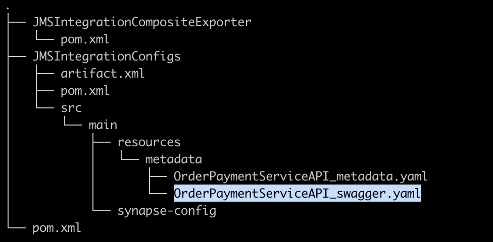
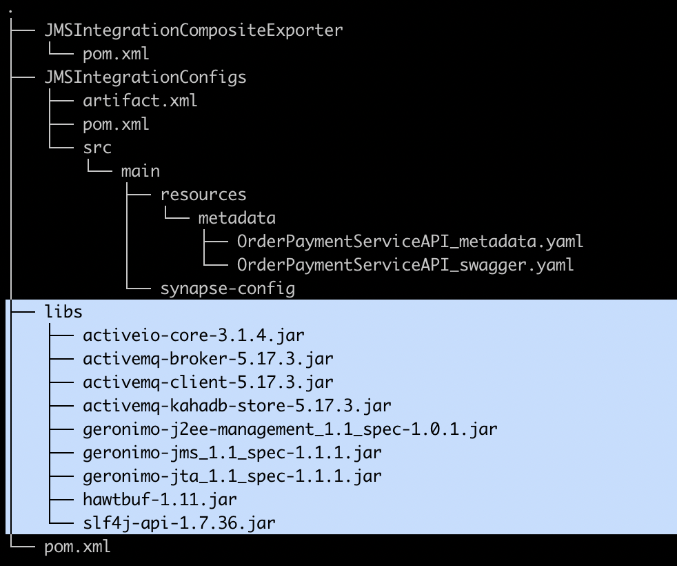
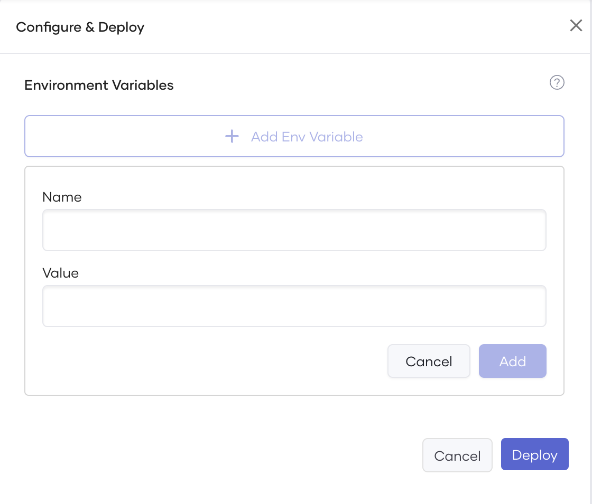

# Develop Integrations with the Integration Studio

Choreo iPaaS offers a platform for developing and deploying integrations with ease. With the Integration Studio, developers can create integrations using WSO2 Synapse and deploy them in a Micro Integrator (MI) runtime. Choreo iPaaS provides a centralized management system for integrations, making deployment and maintenance simple.

## Integration types

Choreo supports the following types of MI (Micro Integrator) integrations:

!!! info
    MI integration refers to an integration you develop using WSO2 Synapse.

- **Integration as an API**: These integrations are exposed as APIs using HTTP.
- **Event-triggered Integration**: Integrations that are triggered by external events.
- **Scheduled Integration**: Integrations that are triggered automatically at scheduled time intervals
- **Manually-triggered Integration**: Integrations that you need to trigger manually.

## Develop with Integration Studio

[Integration Studio](https://wso2.com/integration/integration-studio/) is a graphical development environment for building and deploying integration artifacts in WSO2 Micro Integrator. It is an Eclipse-based IDE that provides a comprehensive set of tools for designing and testing integration flows and building integration artifacts. With WSO2 Integration Studio, developers can create integration projects and develop integration artifacts in a visual, drag-and-drop manner, reducing the time and effort required to build and deploy integration flows. Additionally, the Integration Studio provides features such as debugging, testing, and version control to help ensure the quality and reliability of integration flows.

Creating an Integration project and Composite Exporter project in WSO2 Integration Studio allows developers to export their integration projects as a single deployment artifact, called a composite application. This composite application contains all the components and configurations required to deploy the integration project to WSO2 Micro Integrator. The Composite Exporter project helps to simplify the deployment process by allowing developers to package their integration projects as a single, self-contained artifact that can be easily deployed and managed. This can help improve the consistency and reliability of integration projects and simplify the overall deployment process.

To get started with Integration Studio, see [WSO2 API Manager Documentation - Developing Integration Solutions](https://apim.docs.wso2.com/en/latest/integrate/develop/intro-integration-development/).

## Integration project directory structure

Integration Project is a multi-module maven project. It can contain multiple modules with WSO2 Synpase configurations and a composite application module to export all the configurations as a single deployable artifact.

In addition to the above, you can optionally add the OpenAPI definition file and libraries. You can add the OpenAPI definition to any location in the project, and you need to define its path when creating a component. You can add Java libraries to the `libs` directory in the project root.

## OpenAPI support

You can develop an [OpenAPI definition](https://spec.openapis.org/oas/v3.1.0#openapi-specification) to define your REST API allowing customers and developers to understand its functionality.  When you develop a REST API on the [Integration Studio](https://wso2.com/integration/integration-studio/) and deploy it as a Micro Integrator REST API on Choreo, you can attach the OpenAPI specification to it.

When you develop a REST API in the [WSO2 Integration Studio](https://wso2.com/integration/integration-studio/), you can add an OpenAPI definition to the project. When you create the component, you can provide a path to the OpenAPI Specification (OAS) file.

{.cInlineImage-half}

## Third-party libraries

Adding third-party JARs to the Micro Integrator can provide the following benefits:

- Providing additional functionality that is not available in the core Micro Integrator distribution to allow greater flexibility and customization of integration solutions.
- Allowing the Micro Integrator to integrate with existing systems such as databases or other APIs, improving the overall integration capabilities.
- Providing optimized implementations of common functions, improving the performance of Micro Integrator.
- Developers can avoid having to re-implement commonly used functions, reducing development time and increasing efficiency.

To add third-party libraries to the Micro Integrator, you can add a new directory named `libs` to the root of the Micro Integrator project. When you deploy the component, all the JARs in the `libs` directory in the project path will be included in the Micro Integrator runtime.

{.cInlineImage-half}

## Scan third-party libraries to identify security vulnerabilities

Conducting security vulnerability scans is crucial for identifying potential weaknesses in an application that could be exploited by attackers. This proactive approach enables organizations to detect and mitigate security risks before they are exploited, thereby preventing data breaches, system compromises, and other security incidents.

During deployment, Choreo performs a Trivy scan to detect critical vulnerabilities in third-party libraries added to the integration component. If the scan detects any critical vulnerabilities, it halts the deployment process. The deployment pane shows the Trivy scan status and any security failures in the Library (Trivy) vulnerable scan step, which you can access by clicking on it. After fixing the vulnerability, you can redeploy the component.

## Environment variables

We recommend using environmental variables to improve configuration management, security, portability, and manageability when you develop integration artifacts with WSO2 integration studio. By using environment variables, organizations can simplify the management and maintenance of their integrations and ensure that they can be quickly and easily updated when required.

The component deploy page offers a user-friendly interface for managing environment variables across different environments. For more advanced use cases, the Choreo DevOps portal is available.

{.cInlineImage-half}

The Choreo DevOps Portal allows for greater flexibility in defining configurations and secrets for deployed integrations, as well as other component types, to meet more complex configuration requirements. Refer to the section on [Configurations and secrets](../../devops/devops-portal.md#configurations-and-secrets) for further details.

For a comprehensive list of parameters that can be configured as environment variables, please refer to the [WSO2 API Manager Documentation - Injecting Parameters - Supported parameters](https://apim.docs.wso2.com/en/latest/integrate/develop/injecting-parameters/#supported-parameters).

## Connectors

WSO2 Micro Integrator (MI) Connectors are pre-built connectors that facilitate integration between WSO2 MI and various other systems. They allow you to easily connect to databases, message brokers, REST APIs, etc., to perform actions such as sending messages, executing queries, or retrieving data. These connectors are simple to use. Therefore you can easily integrate them into your WSO2 MI integration flows. You can use Micro Integrator connectors in a wide range of integration scenarios, such as data integration, service-oriented architecture (SOA) integration, and event-driven architecture (EDA) integration.

WSO2 Integration Studio is a development environment that allows you to develop integration flows using WSO2 Micro Integrator Connectors. With Integration Studio, you can design and implement integration flows that connect various systems and perform various actions, such as sending messages, executing queries, or retrieving data. You can build integration flows using the pre-built connectors provided by WSO2 MI, or custom connectors that you develop using the Connector Development Toolkit. The Integration Studio provides a graphical user interface that makes it easy to build and test integration flows. It also provides a set of tools to manage and deploy the integration flows in a WSO2 MI runtime environment.

For more information, see the following topics in WSO2 API Manager Documentation.

- [Connectors Overview](https://apim.docs.wso2.com/en/latest/reference/connectors/connectors-overview/)
- [Adding Connectors](https://apim.docs.wso2.com/en/latest/integrate/develop/creating-artifacts/adding-connectors/)

