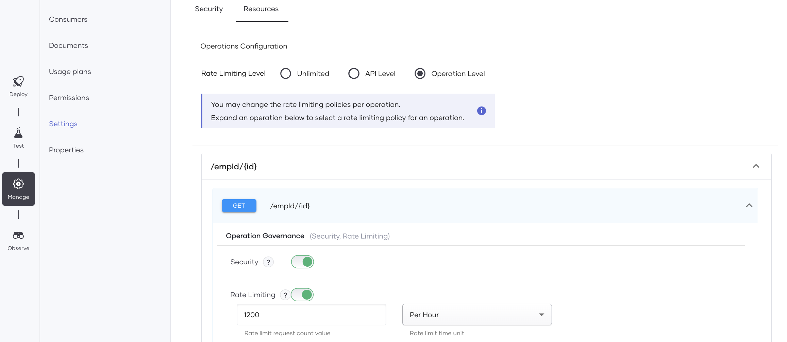

# API Rate Limiting

API rate limiting is a technique that allows you to control the rate of requests made to an API. Rate limiting helps 
prevent system overload and enhances API performance. When you limit the number of requests that can be made in a 
specific time frame, you can ensure that your API is available and responsive to all users while protecting it from 
malicious attacks.

This page walks you through the steps to enable rate limiting for your APIs via Choreo and also provides information on 
the rate limiting options supported by Choreo.

  - [API level rate limiting](#api-level-rate-limiting)
  - [Operation level rate limiting](#operation-level-rate-limiting)
  - [Response headers related to the rate limiting](#response-headers-related-to-the-rate-limiting)

To enable rate limiting for a given API, follow the steps mentioned below.

1. Select the relevant API component and navigate to the **Manage** section.
2. Navigate to the **Resources** tab located under the **Settings**.
3. You can select the relevant time window and the required request count for the rate limiting. The available time windows 
for the Choreo rate limiting are `Per Minute` , `Per Hour`and `Per Day`. HTTP response code `429` will be there after exceeding the allocated request count.

## API level rate limiting

API level rate limiting applies to all operations in the API. All API operations share the allocated request count for 
the specified time unit.

{.cInlineImage-full}

## Operation level rate limiting

In the operation level rate limiting, you can configure different rate limiting values for each operation. In this method,
you can define different rate limiting values for each operation. This will allow you to protect the critical operations.

{.cInlineImage-full}

## Response headers related to the rate limiting

Below table lists the response headers that are available with rate-limit enabled APIs. Considering the values that are
available in the response headers, you can have specific implementations to handle the desired rate limiting scenarios.

| **Header Name**  | **Description** |
|------------------|-----------------|
| `x-ratelimit-limit`     | Denotes the request count allocated for the specified time unit       |
| `x-ratelimit-reset`     | Provides the time remaining to start the next rate limiting time unit |
| `x-ratelimit-remaining` | Denotes the remaining request count for the specified time unit       |
| `x-ratelimit-enforced`  | Visible after exceeding the allocated request count                   |
