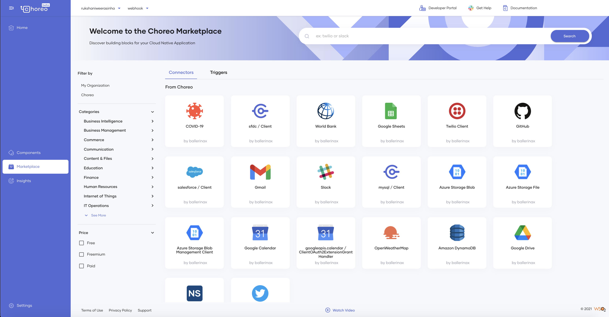
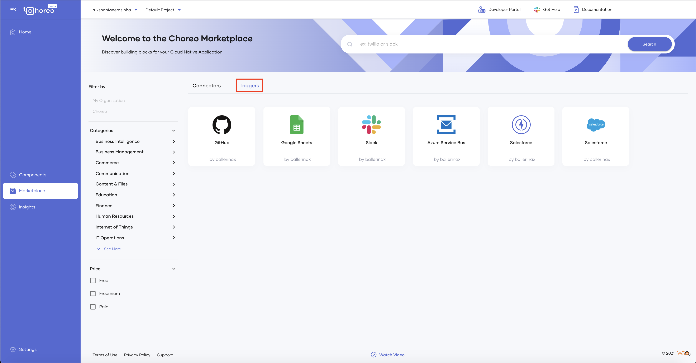
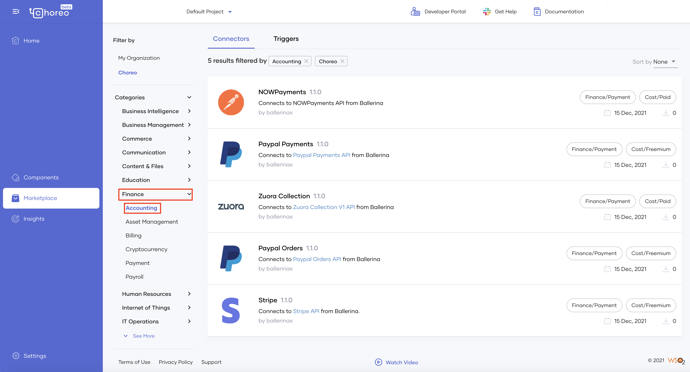
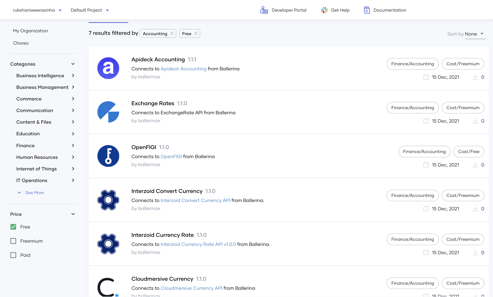
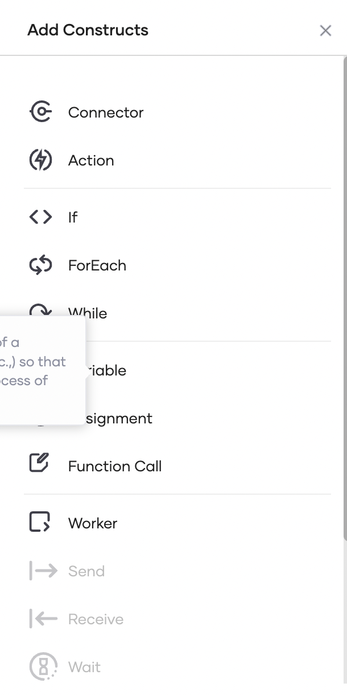
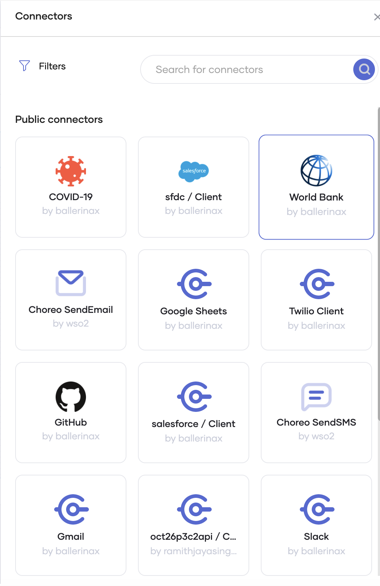

# Marketplace

The Marketplace is an interface provided by Choreo that allows the reuse of APIs by publishing them as connectors. It offers a range of default connectors and triggers that you can use to design your Cloud-native applications. You can purchase them, acquire them via a Freemium account, or find them free of charge. Similarly, you can publish an API or a trigger you developed to be purchased, acquired via Freemium or used free of charge by other Choreo users.

By enabling the reuse of APIs, Choreo addresses the need of modern businesses to focus more on developing applications with unique functionality, and save resources by acquiring the components they need from another party who has already developed them instead of creating them from scratch.

Let's explore the Marketplace.

## Access the Marketplace

To access the Marketplace, open the Choreo Console and click **Marketplace** in the left navigator.

The Marketplace opens displaying the pre-built connectors designed and published by Choreo. 

{.cInlineImage-full}

If you want to view the triggers published by Choreo, click on the **Triggers** tab.

{.cInlineImage-full}

If you want to filter the connectors and triggers published by your organization, click **My Organization** under **Filter By**.

In addition to the connectors and triggers by Choreo displayed above, you can find a range of connectors and triggers designed and published by other vendors. Let's proceed to the next sections to find the connectors and triggers that meet the requirements of the applications you build.

## Filter by category

If you want to filter connectors and triggers by a specific domain, click on the required category (e.g., Finance), and then click on the required subcategory (e.g., Accounting).

The results appear filtered by this selection as shown below.

{.cInlineImage-full}

## Filter by price

To filter connectors and triggers based on whether they are free, acquirable via Freemium, or paid, select the required checkbox under

{.cInlineImage-full}

## Search for connectors/triggers

You can search for the required connector via the **Search field at the top of the page.

## View connector/trigger details

Once you populate the Marketplace page by filtering or searching for connectors and triggers, you can view the following for each connector/trigger in the list:

- A brief description of the functionality
- A label indicating the category
- A label indicating whether the connector/trigger is free, acquirable via Freemium, or paid
- The vendor
- The date on which it was published
- The number of instances the connector/trigger is used

You can also sort the list by the newest or the most used connectors/triggers.

If you want to view more information about a specific connector on the list, click on it. This directs you to an overview page with information about versions and compatibility, and links for reporting issues, accessing API documentation, contacting the vendor, etc.

## Use a connector in your component design

When you design your components in the low-code view, you can search and add the connectors displayed in the Marketplace as follows:

1. Open the component you are designing in the VS Code Editor and add a connector.

   {.cInlineImage-half}

2. Search for the connector you need to add (e.g., World Bank), and click on it to add it.

   {.cInlineImage-half}

If the connector is not available by default, you need to visit the vendor portal, make a payment/provide your Freemium account details if required, and access the required authorization tokens beforehand.

e.g., If you need to use the Azure SQL DB connector, you need to create an Azure account and obtain an authorization token.

## Update a connector 

If you want to introduce a change to your component and update the connector you published for it, you need to explicitly republish the connector. To learn more on how to update a connector, see [Use a Connector in Your Component](/develop/advanced-topics/manage-connectors.md).