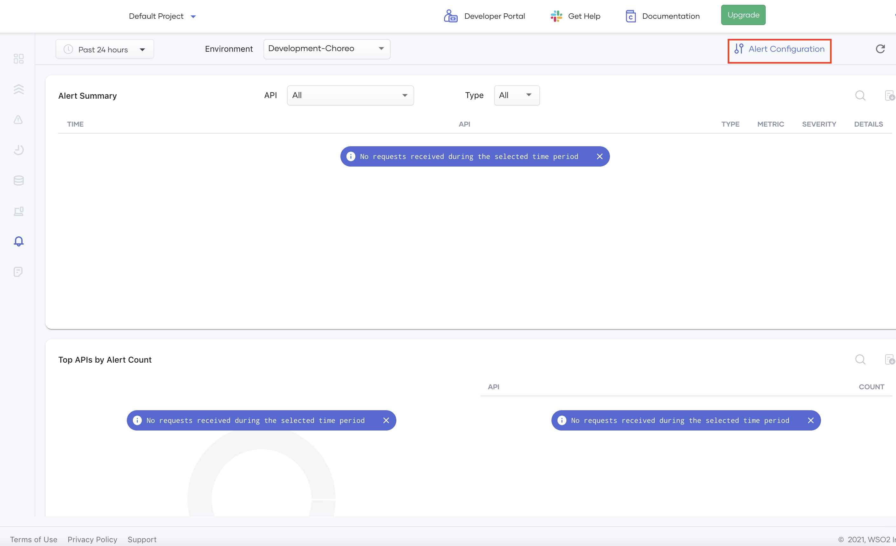

# Configure Alerts

This section explains how you can configure alerts for your API manager deployments. Setting up alerts allows you to proactively monitor your API ecosystem and take corrective measures when necessary.

You can configure alerts for each environment within your organization. You can add, modify, or delete alerts per API. Optionally, you can specify a list of emails for each alert configuration.

Alerts are subject to a suppression policy to prevent duplicate notifications within a specific time frame. By default, a 10-minute suppression window is applied, and this is not configurable. The suppression policy is specific to each alert configuration.

!!! info
    - You can configure a maximum of 20 alerts per organization, environment, and tenant combination.
    - Adding email addresses to an alert configuration is optional. If necessary, you can add a maximum of 5 email addresses per alert.
    
Alerts can be categorized as either [latency alerts](#latency-alerts) or [traffic alerts](#traffic-alerts).

## Latency alerts

Latency alerts notify you if the response latency of an API exceeds a predefined threshold. This is useful for APIs that need to meet specific SLAs and for proactively identifying slow APIs.

To configure a new latency alert, follow the steps given below:

1. Sign in to the [Choreo Console](https://console.choreo.dev/).
2. Ensure you are in the correct organization where you have a project with the API to configure a latency alert.
3. In the Choreo Console left navigation menu, click **Usage Insights**. 
4. In the left navigation menu on the **Usage Insights** page, click **Alerts**.
5. Click the **Environment** list and select the required environment. 
6. Click **Alert Configuration**.

	{.cInlineImage-full}

    This opens the **Alert Configuration** pane with the **Latency** tab open by default.

7. In the **API Name** field, select the API for which you want to configure the alert.

    !!! Info
        Only the APIs that you have invoked at least once are listed here. For other APIs, you need to give the API name in the required format as instructed in the UI.
        
8. In the **Metric** field, select the required metric against which you want to evaluate the alert configuration.

    !!! tip
        The list includes all available options. If there are multiple metrics, you can select the required metric. If there is only one metric to choose, that metric is selected by default, and the field is disabled. 

9.  In the **Latency** field, specify the threshold in milliseconds.

    !!! info
        When the 95th percentile of the selected metric exceeds the threshold provided here, alerts are triggered.
        
10. In the **Emails** field, specify the list of emails that should be notified when the alert is added.
        
11. Click **+ Add**.

Once an alert is successfully added, the alert configuration is listed in the **Alert Configuration** pane. Each configuration can be edited and removed via this pane.

## Traffic alerts

Traffic alerts notify you when the request count of an API exceeds a predefined threshold. This is useful for managing APIs with backend traffic limits or monetized backends that require proactive scaling based on incoming traffic.

To configure a new traffic alert, follow the steps below:

1. Sign in to the [Choreo Console](https://console.choreo.dev/).
2. Ensure you are in the correct organization where you have a project with the API to configure a latency alert.
3. In the Choreo Console left navigation menu, click **Usage Insights**. 
4. In the left navigation menu on the **Usage Insights** page, click **Alerts**.
5. Click the **Environment** list and select the required environment. 
6. Click **Alert Configuration**. This opens the **Alert Configuration** pane.
7. Click the **Traffic** tab.
8. In the **API Name** field, select the API for which you want to configure the alert.

    !!! Info
        Only the APIs that you have invoked at least once are listed here. For other APIs, you need to give the API name in the required format as instructed in the UI.
        
9.  In the **Metric** field, select the required metric against which you want to evaluate the alert configuration.

    !!! tip
        The list includes all available options. If there are multiple metrics, you can select the required metric. If there is only one metric to choose, that metric is selected by default, and the field is disabled.
        
10. In the **Threshold** field, specify the threshold number of requests per minute.

11. If required, specify the list of emails that should be notified when the alert is generated in the **Emails** field.

12. Click **Add**.

Once an alert is successfully added, the alert configuration is listed in the **Alert Configuration** pane. Each configuration can be edited and removed via this pane.
